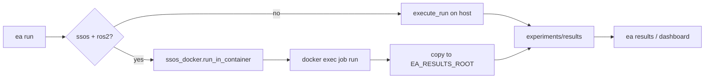

# CLI v3 Lean — SSOS を流して結果を見る

## 北極星（これ以外は v3 ではやらない）

1. **ホストから 1 コマンドで SSOS ros2 シミュレーションを完走**
2. **結果がホストの `experiments/results/<run_id>/` に揃い、`ea results` とダッシュボードですぐ分析**

並列 1000 ケース・`ea bench`・`ea batch`・`ea ssos` サブコマンドツリー・RunSpec 拡張・operational 単位 timing は **すべてスコープ外**（既存 `RunSpec` + `ea job run` がそのまま将来のワーカー契約になる）。

---

## 自己レビューで削ったもの

| v3 案 | 判定 | 理由 |
|-------|------|------|
| `ea ssos status/ensure/sync/run` 5 コマンド | **削る** | ユーザーは `ea run` だけ知ればよい。ensure/sync は内部関数 |
| `ea bench` | **削る** | `duration_wall_s` + 手動 N 回 `ea run` で足りる |
| `timing.sim_loop_s` 等の分解 | **削る** | 第一版は `duration_wall_s` のみ |
| events への per-operation `duration_s` | **削る** | 分析は summary + events.jsonl 既存で十分 |
| `RunSpec.execution_target` | **削る** | ルーティングは `ea run` がシナリオ名+backend で決める |
| `ea batch` Phase 3 実装 | **削る** | ドキュメント1段落のみ。並列は `ea job run` ループで後日 |
| 新規 `tools/cli/ssos/` パッケージ樹 | **削る** | **1 ファイル** `ssos_docker.py` に集約 |

---

## ユーザーが触るコマンド（4 + 1）

```text
ea run [SCENARIO]     … シミュレーション実行（SSOS ros2 は自動でコンテナ）
ea results [RUN_ID] … 一覧 / summary 表示（分析の入口）
ea scenarios          … シナリオ一覧
ea doctor             … 環境（Docker・コンテナ・headless・Ollama）
ea job run SPEC.json  … コンテナ内ワーカー / 将来バッチ（上級者・非宣伝）
```

**分析フロー（ゴール）:**

```bash
ea run ssos_eclss_loop --agents-mode labeled_rule_base --steps 50
ea results                    # 直近 run 一覧（duration 付き）
ea results ssos_eclss_loop_labeled_rule_base
python3 -m streamlit run src/tools/dashboard/app.py
```

---

## 内部アーキテクチャ（シンプル）



### [`src/tools/cli/ssos_docker.py`](src/tools/cli/ssos_docker.py)（新規・単一モジュール）

```python
def run_ssos_in_container(spec: RunSpec) -> RunResult:
    _require_docker()
    _ensure_container_running()      # 未起動なら明確なエラー + ssos-run.sh 案内
    _ensure_headless()               # 空グラフなら exec -d headless + poll
    _sync_src()                      # 現行 run_ssos_eclss_loop.sh と同等
    run_dir = _docker_exec_job(spec) # 一時 job.json → ea job run
    _fetch_results(run_dir, spec)    # ホスト results_root へ
    return run_result
```

- Mac ホストで **ros2 を直接実行しない**
- コンテナ内は既存 [`execute_run`](src/scenario/jobs/executor.py) + [`ea job run`](src/tools/cli/commands/job.py)

### [`ea run`](src/tools/cli/commands/run.py) 振り分け

| 条件 | 経路 |
|------|------|
| `ssos_eclss_loop` + backend `ros2`（デフォルト） | `ssos_docker.run_in_container` |
| `ssos_eclss_loop` + `--backend mock` | ホスト `execute_run` |
| `scrubber_degradation` 等 | ホスト `execute_run` |
| ホストで `--backend ros2` かつコンテナ外 | **exit 2** + 「`ea run ssos_eclss_loop` を使え」 |

**SSOS のデフォルト backend を ros2 に**（`scenario.yaml` は mock のままでも CLI が ssos 指定時は ros2 を上書き）— 実機シミュレーションが主役だから。

---

## 計測（最小）

[`executor.py`](src/scenario/jobs/executor.py) 成功時に summary へ **1 フィールドだけ**追加:

```json
"duration_wall_s": 15.273
```

- 既存 `operational_command_count` はそのまま（ros2 負荷の代理指標）
- Outcome カードに `duration_wall_s` と run パスを表示
- [`ea results`](src/tools/cli/commands/results.py) 一覧テーブルに `duration_wall_s` 列を追加

**実測の意味**（ドキュメントに短く記載）: ros2 時間 ≈ operational 回数 × ~5s。50 step でも 15s になり得る。

---

## 信頼性（バッチの前提）

[`executor.py`](src/scenario/jobs/executor.py) の `finally` で [`reset_rclpy_telemetry_reader()`](src/environment/ssos/ros2_eclss_telemetry.py) — **Aborted 解消**（bench-050 で確認済み問題）。

---

## コンテナ内 `ea-loop`

[`ssos_container_run.sh`](scripts/ssos_container_run.sh):

```bash
# ROS setup は維持
exec python3 -m tools.cli job run "$JOB_JSON"   # または argv → RunSpec → execute_run
```

[`run_ssos_eclss_loop.sh`](scripts/run_ssos_eclss_loop.sh) は:

```bash
exec ea run ssos_eclss_loop "$@"    # mock は --backend mock
```

ユーザー向けドキュメントから **ea-loop 手動手順を削除**し `ea run` に統一。

---

## 将来（実装しない・RunSpec が足場）

- 並列: ホストが N コンテナに `ea job run spec.json` を投げるだけ
- 1000 ケース概算: `ea results` で `duration_wall_s` の中央値 × 1000 / P
- GPU / `ea batch`: 別イテレーション

---

## 変更ファイル（最小）

| ファイル | 変更 |
|----------|------|
| `src/tools/cli/ssos_docker.py` | 新規 |
| `src/tools/cli/commands/run.py` | コンテナ振り分け |
| `src/tools/cli/commands/results.py` | duration 列・見やすい summary |
| `src/tools/cli/output.py` | Outcome に duration |
| `src/scenario/jobs/executor.py` | duration_wall_s 書き込み + rclpy finally |
| `scripts/ssos_container_run.sh` | job run 委譲 |
| `scripts/run_ssos_eclss_loop.sh` | ea run 委譲 |
| `en/docs/cli.md`, `ja/docs/cli.md` | SSOS + 分析フローのみ |
| `tests/tools/test_ssos_docker.py` | docker モックで orchestrator 単体テスト |

**やらないファイル:** `bench.py`, `batch.py`, `ssos/` パッケージ樹, `spec.py` 拡張, `ros2_eclss_bridge.py` timing ログ

---

## 検証

```bash
ea doctor
ea run ssos_eclss_loop --agents-mode labeled_rule_base --steps 50
ea results
# summary に duration_wall_s、ホスト experiments/results に成果物
# 終了時 Aborted なし
pytest tests/tools/test_ssos_docker.py tests/tools/test_cli.py
```

**Done の定義:** Mac ホストで上記 3 コマンドだけで SSOS 実機 sim → 結果確認 → ダッシュボード用パスが分かる。
