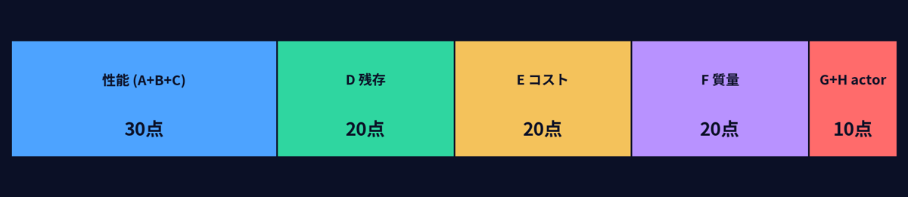

# Engineering Agents — evaluating AI-driven ECLSS design for spacecraft

[日本語 README](README.ja.md) · [Docs](docs/en/index.md) · [Experiment record](docs/en/results.md) · [Measured data](docs/data) · [Agent design](docs/en/agent-design.md)

Engineering Agents is a simulation environment for testing whether AI agents can improve the design of a spacecraft Environmental Control and Life Support System (ECLSS).

This simulation has four main characteristics.

- **It is checked against SSOS-based physics simulation.** Air, oxygen and water inventories, subsystem capacity, mass and cost are treated as physical state, not just as abstract scores. The model used here is a partially simplified simulation model based on SSOS.
- **It uses spacecraft ECLSS as a complex system.** CO2 removal, O2 generation and water recovery interact with each other, so improving one subsystem alone does not necessarily produce a viable design.
- **It searches under survival, cost and mass trade-offs.** Keeping all 50 occupants alive is the first requirement, but oversized hardware is penalized through mass and cost. This is not a performance-only problem; it is a search for a feasible design under constraints.
- **It closes the design loop.** The agent proposes a design, the system re-simulates it, and the result is fed into the next iteration.

---

## What Is Simulated

The main scenario starts with 50 occupants in a space habitat whose ECLSS capacity is too small. After each run, a design agent reads the result and proposes the ECLSS sizing to use in the next run.

The current design space focuses on three variables.

| Variable | Meaning |
| --- | --- |
| ARS | CO2 removal capacity |
| OGS | O2 generation capacity |
| WRS | Water recovery capacity |

Each run is first judged by **how many of the 50 occupants survive**. The design is then evaluated with a 100-point scorecard. The score includes not only survival count, but also TCL (time to first crew loss), environmental safety, resource recovery, cost, mass and operation/physics response.



In other words, a design is not good just because everyone survives. If it keeps the crew alive by installing excessive hardware, it loses points on cost and mass. The simulation looks for both survival and a lighter, cheaper feasible design.

---

## Analysis Conditions

The current analysis runs multiple 50-iteration design→verify chains against the same world, the same 50-person crew and the same initial condition.

| Item | Condition |
| --- | --- |
| Scenario | `ssos_eclss_loop` |
| Crew size | 50 occupants |
| Iterations | 50 per chain |
| Crew metabolism | NASA BVAD-based: per person per day, CO2 1.04 kg, O2 0.84 kg, water 2.28 kg |
| Physics model | CO2 / O2 / H2O mass balance, water consumption for O2 generation, CO2 consumption by Sabatier |
| Backend | `plant_sim` |
| Actor mode | `none` / `labeled_rule_base` / `llm` |
| Evaluation | Physics gate, crew survival, TCL, environment, resource recovery, cost, mass, operation/physics response |
| Raw logs | [experiments/runs/](experiments/runs) |
| Analysed data | [docs/data/](docs/data) |
| Re-analysis procedure | [experiments/README.md](experiments/README.md) |

Runs that violate physical consistency are not scored lower; they are excluded from scoring. The checks include mass conservation, non-negative inventories, subsystem capacity limits and impossible processing during failures.

---

## Results Summary

The repository currently includes analysed results from four 50-iteration chains. Scores from phase 3 onward should not be compared directly with phases 1 and 2 because the scoring function changed. Survivors, catastrophic resets, complete proposals and unique designs are comparable.

| | Phase 1 initial | Phase 2 chain memory | Phase 3 scorecard change | Phase 4 audit panel |
| --- | ---: | ---: | ---: | ---: |
| Final survivors | 34/50 | 50/50 | 50/50 | 50/50 |
| Rounds at 0/50 | 12 | 1 | 1 | 1 |
| Complete 3-variable proposals | 38/50 | 50/50 | 50/50 | 50/50 |
| Unique designs | 39 | 11 | 17 | 9 |
| Best / mean score | 66.18 / 61.71 | 66.36 / 65.94 | 84.23 / 83.34 | 84.03 / 82.59 |


Main takeaways:

1. Phase 1 was not simply a search failure. It found a full-survival design, but later partial proposals caused ARS/OGS to fall back toward the baseline.
2. A 4 KB chain memory reduced catastrophic resets. The trade-off was a narrower search.
3. The old scorecard gave full cost/mass marks to the initial baseline, even though that baseline killed everyone. Survivable designs were therefore marked too harshly on cost and mass.
4. The scorecard change improved the score, but that does not mean total mass and cost improved by the same amount.
5. The audit panel blocked risky designs, but it also made the search easier to freeze.

See the [experiment record](docs/en/results.md) for details.

---

## Data

The README keeps only the headline results. Details are kept in the experiment record and data files.

| Link | Contents |
| --- | --- |
| [docs/en/results.md](docs/en/results.md) | Experiment results |
| [docs/data/](docs/data) | Per-iteration CSV / JSON files |
| [docs/data/README.md](docs/data/README.md) | Data column descriptions |
| [docs/images/results/](docs/images/results) | Figures |
| [experiments/runs/](experiments/runs) | Raw logs for the four chains |
| [experiments/analysis/](experiments/analysis) | Analysis scripts |
| [experiments/README.md](experiments/README.md) | Re-analysis procedure |

The final re-analysis step is a `diff`.

```bash
cd experiments
for f in runs/*.tar.gz; do tar -xzf "$f" -C runs/; done
python3 analysis/analyze_ssos_iter.py --root runs/phase3-rescored --prefix phase3
diff outputs/phase3_iteration_metrics.csv ../docs/data/phase3_iteration_metrics.csv
```

---

## Quick Start

You need Python 3.11+, Git, and VPN access to the GPU environment provided for the hackathon. The design agent sends requests over the VPN to the vLLM endpoint running on that GPU.

> Note: the GPU/VPN steps apply only during the hackathon GPU access period. Outside that period, provide another LLM endpoint and update `agents.yaml` or pass an override with `--set`.

First, clone the repository and set up the Python environment.

```bash
git clone https://github.com/hirototamura/engineering_agents.git
cd engineering_agents
python3 -m venv .venv
source .venv/bin/activate
pip install -U pip
pip install -e ".[dev]"
ea doctor
```

Windows PowerShell:

```powershell
git clone https://github.com/hirototamura/engineering_agents.git
cd engineering_agents
python -m venv .venv
.\.venv\Scripts\Activate.ps1
python -m pip install -U pip
python -m pip install -e ".[dev]"
python -m tools.cli doctor
```

Next, connect to the GPU environment using the VPN profile provided for the hackathon. After connecting, check that the vLLM endpoint is reachable.

```bash
curl http://10.10.0.108:8001/v1/models
```

Windows PowerShell:

```powershell
Invoke-RestMethod http://10.10.0.108:8001/v1/models
```

Run the design loop. With the default `agents.yaml`, the design agent uses the vLLM endpoint on the GPU.

```bash
ea run ssos_eclss_loop --backend plant_sim --actor-mode labeled_rule_base --design-mode llm --iterate 10 --llm-provider vllm
```

For a single trial run:

```bash
ea run ssos_eclss_loop --backend plant_sim --actor-mode labeled_rule_base --design-mode llm --steps 72 --llm-provider vllm
ea results
```

If the assigned GPU endpoint is different, pass it explicitly.

```bash
ea run ssos_eclss_loop --backend plant_sim --actor-mode labeled_rule_base --design-mode llm --iterate 10 --llm-provider vllm --set agents.design.llm.base_url=http://<GPU_VPN_IP>:8001/v1
```

Open the dashboard:

```bash
python3 -m streamlit run src/tools/dashboard/app.py
```

---

## Result Artifacts

A single run is saved under `src/experiments/results/<run_id>/`.

```text
telemetry.jsonl              plant state at each step
messages.jsonl               agent messages and reasoning
design_decision_state.json   what the design agent saw and returned
design_proposals.json        design values handed to the next iteration
evaluation.json              evaluation result
summary.json                 run summary
```

Chain runs add per-iteration directories, plus `compact_chain_memory.json` and `chain_summary.json`.

---

## Architecture

```text
tools/cli        ea run / scenarios / results / doctor
scenario/        per-scenario step loop, design tools, evaluation, chain memory
core/            agents, personas, memory, LLM client, JSON parsing
environment/     ECLSS backend: mock / plant_sim
```

See [architecture](docs/en/architecture.md) and [API contracts](docs/en/api-contracts.md) for details.

---

## Documentation

| Topic | English |
| --- | --- |
| Overview | [docs/en/overview.md](docs/en/overview.md) |
| Experiment record | [docs/en/results.md](docs/en/results.md) |
| Agent design | [docs/en/agent-design.md](docs/en/agent-design.md) |
| Extending | [docs/en/extending.md](docs/en/extending.md) |
| Roadmap | [docs/en/roadmap.md](docs/en/roadmap.md) |
| Implementation specs | [docs/en/specs/index.md](docs/en/specs/index.md) |

---

## Current Limitations

- Since phase 2, the search has mostly focused on WRS. Nearby ARS/OGS exploration is still limited.
- Scorecard changes and physical design improvements need to be reported separately.
- The phase 4 audit panel blocked risky candidates, but it also narrowed the search.
- Current results use one model, one seed and four chains. More runs are needed before making statistical claims.

The next question is whether the search expands beyond WRS after introducing the measured-floor approach in `floor_probe.py`.

---

## License

[Apache License 2.0](LICENSE.txt) — Copyright 2026 One Piece Engineering
