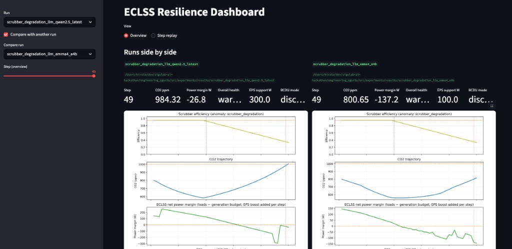
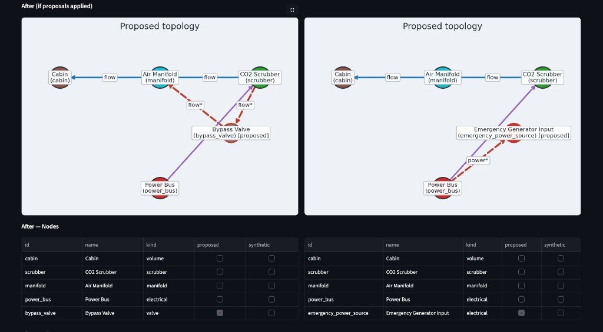
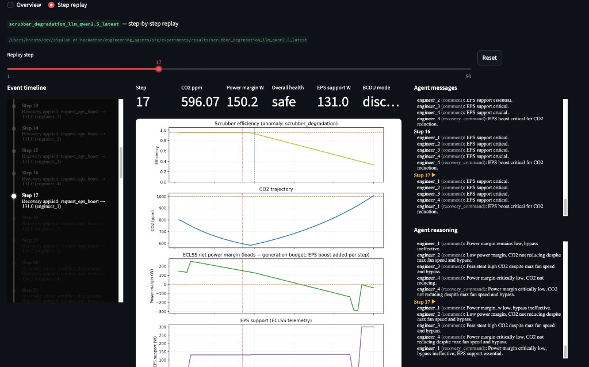

> Japanese: [../ja/README.md](../ja/README.md)

# Engineering Agents — ECLSS Resilience Loop

This is a research repository that simulates how an **agent team detects and responds to anomalies in ECLSS** (Environmental Control and Life Support System) and **proposes design changes afterward**. ECLSS is not a physical experiment apparatus; it refers to **life-support equipment** required for crew survival.

The `engineering_agents` project in this repository runs on a **mock simulator** of future space-station operations software (**Space Station OS / SSOS**). It reproduces the life-support plant (ECLSS) and power system (**EPS** / Electrical Power System) in Python and connects to agents via a ROS2-style topic contract API. **There is no connection to real SSOS hardware or on-orbit systems.**

As a step toward autonomous hardware design, the goal is to validate the loop: **in-flight anomaly → team judgment → permanent design proposal**.

---

## Dashboard at a glance

Simulation results are recorded in JSONL and can be reviewed from three perspectives in the [Streamlit dashboard](#dashboard):

### 1. Overview — side-by-side comparison of two runs

For the same `scrubber_degradation` anomaly, compare step-by-step how **different LLM agents** (e.g. `qwen2.5` vs `gemma4:e4b`) produce different trajectories. CO2 ppm, power margin, EPS support, and scrubber efficiency plots appear side by side, making trade-offs between models (CO2 suppression vs power consumption, etc.) easy to see at a glance.

<p align="center">
  
</p>

### 2. Design proposals — topology Before / After

After a run ends, the lead engineer agent proposes **permanent design changes**. The left panel shows adding a bypass valve (`bypass_valve`); the right shows adding an emergency power source (`emergency_power_source`). Red dashed lines mark proposed edges; the `proposed` column in the node table indicates new components.

<p align="center">
  
</p>

### 3. Step replay — step-by-step detailed playback

Follow one run step by step with synchronized **timeline** (recovery commands applied), **agent messages**, **reasoning** (rationale for situational judgment), and **telemetry plots** (vertical marker at the current step). The figure below shows step 17, when `request_eps_boost` was applied.

<p align="center">
  
</p>

---

## Why this simulation

On a space station, cascading degradation of CO2 removal (scrubber) and power margin directly affects crew safety. In reality:

1. Anomalies are detected from telemetry  
2. The operations team shares situational awareness and applies temporary recovery actions  
3. Permanent hardware / plumbing / power design changes are considered as lasting countermeasures  

This **resilience loop** is what this project aims to run in a reproducible experimental environment.

In the reference scenario [`scrubber_degradation`](scenario-scrubber-degradation.md), scrubber efficiency drops from step 20 onward, and CO2 and power margin worsen. Agents issue recovery commands during the run and, **after the run ends**, leave topology change proposals (bypass valve addition, emergency power source addition, etc.) in `design_proposals.json`.

---

## Why LLM (vs rule-based)

| | `labeled_rule_base` | `llm` |
| --- | --- | --- |
| Source of decisions | `policy` thresholds in `agents.yaml` (e.g. recovery start CO2 1000 ppm) | Persona + telemetry + team messages (**does not read policy**) |
| Discussion | Fixed messages chosen by rules | N homogeneous engineers deliberate for one round |
| Actions | Lead `engineer_{(step-1)%N}` issues commands per thresholds | Lead executes `commands` from LLM output |
| Reproducibility | High (suited for regression tests) | Depends on model and temperature (suited for comparison experiments) |
| Research value | Baseline and ground-truth comparison | Situational judgment beyond fixed thresholds, diversity of speech, differences in design proposals |

Rule-based mode is the **scaffolding for correct behavior**. LLM mode is an experimental mode for observing **situational understanding, team consensus, and differences in recovery timing** that fixed thresholds cannot express. Key points in the LLM design (details in [homogeneous agent team plan](memo/homogeneous_agent_team_plan.md)):

- **Separation of Persona and scenario** — thresholds and numeric values appear only in prompt `### Telemetry` / `### World state`  
- **N homogeneous agents + lead action** — avoid rigid roles; rotate speaker and executor each step  
- **No topology changes during runtime** — separate simulation from design proposals; align with One Piece provenance  
- **Isolate policy from LLM** — do not mix rule answers into prompts; enable comparison experiments  

---

## Simulation world (terminology)

| Abbrev. | English name | Description |
| --- | --- | --- |
| **ECLSS** | Environmental Control and Life Support System | **Life-support equipment**. CO2 scrubber, air distribution, habitable volume represented as a graph |
| **EPS** | Electrical Power System | Generation, storage, distribution. Supports ECLSS via SARJ/BCDU mocks |
| **SARJ** | Solar Alpha Rotary Joint | Solar array generation (`MockSarj`) |
| **BCDU** | Battery Charge/Discharge Unit | Battery charge/discharge. `request_eps_boost` support when power is critical |
| **MBSU** | Main Bus Switching Unit | Main bus in real EPS (not individually implemented in this MVP mock) |
| **DDCU** | Direct Current-to-Direct Current Converter Unit | DC-DC conversion in real EPS (not individually implemented in this MVP mock) |
| **Node** | — | Plant component (`cabin`, `manifold`, `scrubber`, `power_bus`, etc.) |
| **Edge** | — | `flow` (air) or `power` (electricity) between nodes |
| **Telemetry** | — | Per-step CO2 ppm, scrubber efficiency, power margin, EPS support watts, etc. |
| **Recovery command** | — | Temporary operation (fan boost, load shed, EPS boost, bypass enable) |
| **Design proposal** | — | Permanent change after run end (node/edge addition, parameter change) |

**Health thresholds** (`health_metrics.jsonl`): CO2 safe < 800 / warning < 1200 / critical ≥ 1200 ppm; power margin safe > 0 / warning > −150 / critical ≤ −150 W. See [architecture.md](architecture.md) for details.

### Default topology

```
  [cabin] --flow--> [manifold] --flow--> [scrubber] --flow--> [cabin]
                                              ^
                                              | power
                                         [power_bus]
```

The `scrubber_degradation` anomaly progressively reduces scrubber efficiency; CO2 production multiplier and power margin shrink simultaneously. See [scenario-scrubber-degradation.md](scenario-scrubber-degradation.md) for specification and phase table.

### Agent team (N homogeneous engineers)

- Default 4 agents: `engineer_1` … `engineer_4` (change via `team.count` in `agents.yaml`)  
- Each step: all agents discuss the situation (llm) or rules emit fixed diagnostics (labeled_rule_base)  
- **Lead** `engineer_{(step-1) % N}` issues recovery commands for that step  
- **Post-run design** is output by the lead at the final step to `design_proposals.json` (see [design proposals screenshot](#2-design-proposals--topology-before--after))

---

## This repository vs SSOS / One Piece

```text
[ This repository MVP ]
  MockEclssSimulator + EpsStack (Python)
       ↑ SimulatorProtocol
  ScrubberDegradationTeam (agents)
       ↓ JSONL logs
  Streamlit dashboard / pytest

[ In development ]
  SSOS adapter     … bridge to real SSOS topics (contract tests only; stub)
  One Piece prod UI … provenance JSON only; Web UI out of scope
```

| Area | Status | Reference |
| --- | --- | --- |
| SSOS mock simulation | **Available** | [architecture.md](architecture.md) |
| One Piece provenance export | **Available** | [one-piece-integration.md](one-piece-integration.md) |
| Real SSOS adapter | Planned / stub | [development-plan.md](development-plan.md) |
| One Piece Web / SSOT UI | Not connected | [one-piece-integration.md](one-piece-integration.md) |

In-progress tasks, roadmap, and research memos are collected in [docs/development-plan.md](development-plan.md).

---

## Documentation

| Document | Audience | Content |
| --- | --- | --- |
| [docs/architecture.md](architecture.md) | Contributors | Layer structure, execution flow, agent modes, dashboard |
| [docs/scenario-scrubber-degradation.md](scenario-scrubber-degradation.md) | Demo / analysis | Scenario background, configuration, how to read outputs, tests |
| [docs/api-contracts.md](api-contracts.md) | Integrators | `SimulatorProtocol`, JSONL, `design_proposals.json` |
| [docs/one-piece-integration.md](one-piece-integration.md) | Design tracking | Provenance, current and planned One Piece integration |
| [docs/development-plan.md](development-plan.md) | Developers | Incomplete features, roadmap, `docs/en/memo/` index |

---

## Requirements

- **Python 3.9+**
- **Git**
- **Ollama** (only when using `agents.mode: llm`)

---

## Installation (from scratch)

### 1. Clone the repository

```bash
git clone <repository-url>
cd engineering_agents
```

### 2. Python virtual environment and packages

```bash
python3 -m venv .venv
source .venv/bin/activate   # Windows: .venv\Scripts\activate
pip install -U pip
pip install -e ".[dev]"
```

`pip install -e ".[dev]"` makes packages under `src/` (`scenario`, `environment`, `core`, etc.) importable.

### 3. Smoke test

```bash
pytest
# or
python src/scripts/run_tests.py
```

### 4. Ollama (for LLM mode)

Install Ollama from [https://ollama.com](https://ollama.com) and start the daemon.

```bash
# Example: pull the model specified in agents.yaml
ollama pull gemma4:e4b

# To try another model, change llm.model in agents.yaml,
# or change run_id after execution for comparison
ollama list
```

Default LLM settings are in [`src/scenario/scrubber_degradation/agents.yaml`](../src/scenario/scrubber_degradation/agents.yaml) (`base_url: http://localhost:11434`). LLM mode fails if Ollama is not running.

---

## How to run

### No agents (baseline)

```bash
python src/scripts/run_mock_eclss.py
```

Or:

```bash
python -c "from scenario.runner import run_scenario; print(run_scenario('scrubber_degradation', overrides={'agents': {'mode': 'none'}}))"
```

### Rule-based team (`labeled_rule_base`)

```bash
python -c "from scenario.runner import run_scenario; print(run_scenario('scrubber_degradation', overrides={'agents': {'mode': 'labeled_rule_base'}}))"
```

Output: `src/experiments/results/scrubber_degradation_labeled_rule_base/`

### LLM team (`llm` · Ollama required)

```bash
python -c "from scenario.runner import run_scenario; print(run_scenario('scrubber_degradation', overrides={'agents': {'mode': 'llm'}}))"
```

Output: `src/experiments/results/scrubber_degradation_llm/` (`run_id_llm` in `scenario.yaml`)

To use a different model under a different run name, change `llm.model` in `agents.yaml` before execution, or override `output.run_id_llm`.

### Main output files

| File | Description |
| --- | --- |
| `telemetry.jsonl` | CO2, efficiency, power margin, EPS support, etc. |
| `messages.jsonl` | Agent messages and reasoning |
| `events.jsonl` | Anomaly injection, recovery commands, design-change events |
| `design_state.jsonl` | Topology at the start of each step (before agent actions) |
| `design_proposals.json` | Permanent design proposals after run end |
| `summary.json` | Run summary (`agents_mode`, final CO2, etc.) |

Schema details: [docs/api-contracts.md](api-contracts.md)

---

## Dashboard

```bash
source .venv/bin/activate
python -m streamlit run src/tools/dashboard/app.py
```

Open `http://localhost:8501` in a browser. See [Dashboard at a glance](#dashboard-at-a-glance) at the top for examples.

- **Overview** — single run or two-run comparison (telemetry, topology, step details)  
- **Step replay** — replay timeline, messages, and reasoning step by step  
- Select runs in the sidebar; use `Compare with another run` to compare LLM runs, etc.  

Results are stored under `src/experiments/results/<run_id>/`

---

## Repository structure

| Path | Purpose |
| --- | --- |
| `src/core/agents/` | Persona, Team, memory, LLM client |
| `src/environment/` | `SimulatorProtocol`, ECLSS/EPS mocks, SSOS adapter stub |
| `src/scenario/` | Scenario YAML, runner, `scrubber_degradation` team |
| `src/experiments/results/` | Run results (gitignore recommended) |
| `src/tools/dashboard/` | Streamlit UI |
| `src/integrations/one_piece/` | Provenance record generation |
| `docs/ja/` | Design, API, and scenario documentation (including development plan) |
| `docs/ja/memo/` | Implementation process records and backlog (referenced from [development-plan.md](development-plan.md)) |
| `docs/en/` | English documentation |
| `docs/en/memo/` | English research memos |

Dependency direction: `tools → scenario → environment → core`

---

## License

[Apache License 2.0](LICENSE.txt) — Copyright 2026 Hiroto Tamura
