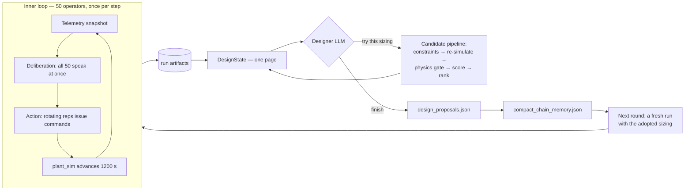

# Agent design — what the world enforces, what the model decides

This page is the boundary line. On one side is the world: physics, thresholds, budgets, what a machine can be built in. All of it is in code and configuration, all of it is deterministic, none of it is negotiable by an agent. On the other side is judgement: what to say, whether to act, which subsystem, how large to build the next one. None of that is scripted.

Everything below is that line, drawn twice — once for the fifty operators inside a run, once for the engineer that sizes the next build.

---

## 1. The two loops



The inner loop is *operations*: a crew reacting to what the habitat is doing to them. The outer loop is *design*: what should have been built instead. The outer loop closes — its proposal becomes the next run's hardware — which is why a mistake in it is visible fifty rounds later as a body count.

---

## 2. What an operator is given

Fifty agents (`agents.yaml` `actor.team.count: 50`) each receive one prompt per turn, assembled by `PersonaPromptBuilder.build` (`src/core/agents/persona.py:259`). It has seven parts and no eighth:

| Part | Source | Contains |
| --- | --- | --- |
| Charter | `persona.py:15` `TEAM_CHARTER` | "Ground claims in Telemetry and World state. Normative safety judgment is yours as an ECLSS engineer — do not assume hidden facility thresholds." |
| Persona | `agents.yaml` `actor.team.persona` + an archetype lens (`persona.py:30`) | A *way of thinking* — first principles, systems, risk — never a role script |
| Situation | `ssos_eclss_loop_team.py:1001` `build_llm_situation` | Nine raw numbers and three failure flags |
| Team discourse | `DiscourseBuffer`, 22 messages | What teammates said recently |
| Own memory | `AgentMemory`, 30 entries | What this agent recalls |
| This step so far | in-step messages | Deliberation before the action phase |
| Output contract | `persona.py:193` | The JSON shape, and the legal command kinds |

The situation block is literally this:

```
step=17, co2_storage_kg=2.41, o2_storage_kg=5.88,
product_water_reserve_l=61.2, grey_water_collected_l=3.4,
urine_buffer_l=6.1, captured_co2_kg=0.88,
ars_failure_enabled=False, ogs_failure_enabled=False, wrs_failure_enabled=False
```

followed by four status words (`overall`, `co2_status`, `o2_status`, `water_status`) tagged, in the prompt text itself, **"Descriptive assessment from the facility monitoring layer — not a command."**

### What is deliberately absent

- **No threshold values.** `co2_storage_high_kg: 2.0` exists in `scenario.yaml` and drives the health words and the rule-base actor. The LLM actor is never shown the number. It sees `2.41` and the word `warning`, and has to decide for itself whether that is worth an action.
- **No instruction to act.** The contract's closing line is *"Empty commands when you and teammates agree to hold this step."* Holding is a first-class outcome.
- **No recommended command.** The Operational levers block (`ssos_eclss_loop_team.py:984`) lists what each command *is* and what its payload fields *mean* — `initial_co2_mass (kg)`, `urine_volume (L)` — and stops there. Nothing says which to send or how big.
- **No dosage.** An agent choosing `air_revitalisation` must pick `initial_co2_mass` itself. That number scales the ARS operation (`plant_sim.ars.reference_goal_co2_kg`), so a wrong guess under-treats the cabin or wastes an 80-minute machine cycle.
- **No hidden coordination.** All fifty deliberate *simultaneously* against the previous step's discourse (`_run_step_llm`, `ssos_eclss_loop_team.py:279`). Nobody sees what anybody else said this step until the action phase. Agreement has to be reached across steps, or not at all.

### What the world enforces regardless

| Rule | Where | Consequence |
| --- | --- | --- |
| One command per subsystem per step | `_COMMAND_GROUPS`, `ssos_eclss_loop_team.py:49` | A second `air_revitalisation` in the same step is rejected, and the rejection is logged with its reason |
| A busy subsystem refuses work | `plant_sim/model.py` | ARS runs 4800 s; commands during that window bounce |
| Mass balance | `plant_sim/stoichiometry.py`, `model.py` | O₂ produced consumes water at 1.126 kg/kg; Sabatier consumes captured CO₂; nothing is created |
| Crew metabolism | `scenario.yaml` `plant_sim.crew`, BVAD rates | 50 people generate 1.04 kg CO₂/day each whatever anyone says |
| Occupants die | `survival.py` | Not a score penalty — a state change that removes agents |
| Actions cost time | `plant_sim.time.*_operation_seconds` | You cannot fix a shortfall by issuing more commands |

An agent can talk its way into any belief it likes. It cannot talk the cabin out of 52 kg of CO₂ a day.

### Where the pressure comes from

The shipped baseline (ARS 4.5 kg/day, OGS 9.25 kg/day) is **not survivable for fifty people**. Demand is 52 kg CO₂/day and 42 kg O₂/day. The crew loses everyone. This is deliberate: the operators are handed a habitat that cannot be operated out of trouble, so the run produces an honest record of *which* resource failed *when* — and the design loop then has a real problem to solve rather than a tuning exercise.

---

## 3. What the designer is given

The design agent is one engineer, not a committee (`agents.yaml` `design.team.count: 1`). The question the repository is asking is whether a *single* agent can gather its own evidence and reach a defensible design.

Its autonomy is drawn in a different place from the operators', and the reason is an observed failure. In the first build the model also chose which tool to call next. One run spent twenty-one turns re-checking the same constraint and produced one candidate in fifteen minutes, because nothing in the loop obliged it to move on. So:

```
LLM     = design judgement only
Python  = investigation, verification, simulation, evaluation, comparison, workflow
```

Each turn the model is handed one freshly assembled page (`design_state.py` `build_design_state`) and returns one of exactly two things:

```json
{"decision": "propose_candidate",
 "rationale": "why this sizing, from the state above",
 "fields": {"plant_sim.ars.capacity_kg_day": 20.8}}

{"decision": "finish",
 "rationale": "why this one",
 "selected_candidate_id": "<a candidate that was simulated>"}
```

The contract (`ssos_tool_use_design.py:118` `DECISION_CONTRACT`) closes by telling the model exactly how little it controls: *"You do not choose what happens next. Every candidate you propose is checked, simulated, audited and compared automatically before you are asked again, and the winner is decided by the ranking, not by your pick."*

It never chooses a tool. It never judges pass/fail — `agents.yaml` says so in the persona: *"Every candidate you name is checked, re-simulated, audited and compared for you before you are asked again. Do not judge pass/fail."*

What it *does* decide is the whole design: three continuous capacity variables, anywhere inside their engineering bounds, with no gradient, no optimiser, and no suggested direction. `propose_capacity_candidate` exists as a deterministic sizing helper the model may ignore — and in observed runs it routinely proposes numbers that helper would not have.

### The nine tools

Every tool is plain Python. **Not one of them calls an LLM** (`design_tools.py`). All arithmetic that decides a design happens here, deterministically, so a small model cannot hallucinate it.

| Tool | Returns |
| --- | --- |
| `load_run_artifacts` | summary, configs, head/tail of the JSONL streams, and `chain_memory_compact` |
| `summarize_timeseries` | per-column min/max/final/first-warning/first-critical/dwell/trend |
| `compute_eclss_features` | command and rejection counts by reason, crew-loss causes, failure windows, shortfall ledgers |
| `compute_theoretical_capacity` | crew demand vs installed nameplate, including cadence and busy guard |
| `plot_eclss_timeseries` | a PNG **and the same facts as text** — image understanding is never required |
| `propose_capacity_candidate` | a sizing suggestion from demand × margin; sizes down as well as up |
| `evaluate_design_constraints` | mass / cost / bounds labels. Does not simulate |
| `run_design_candidate` | a full re-simulation of the scenario at that sizing |
| `compare_design_runs` | the ranking, and which criterion decided it |

Tools never raise. Failures come back as `{"error": ...}` so the loop can show the model what went wrong.

### What the designer is *not* shown

Deliberately pruned, and the reason matters. An earlier build showed the CO₂ peak as a headline number. It was **6.731 in all thirty-eight candidates, identical to three decimals**, because the peak occurs at the instant a scheduled failure clears — a moment that depends only on the failure schedule and the crew size, never on the equipment. The model read a flat number as "still not enough" and raised capacity for five rounds until the design was thirteen times over its mass budget.

So peak, warning-band dwell, critical-band dwell, mass, volume and cost are no longer shown on their own. The designer sees the **scorecard broken down per axis with `points_lost` sorted worst-first**, plus buildability, which is not a matter of degree. If a number cannot move, it is not shown as if it could.

---

## 4. Memory

Three tiers, each with a different reason to exist.

### Tier 1 — private recall, per agent, within a run

`AgentMemory` (`src/core/agents/memory.py:12`), 30 entries, newest-first eviction. Written by `TeamMemoryStore.commit_step` (`memory.py:60`) with, per step:

- the model's own optional `"memory"` field — **the agent decides what is worth remembering**, capped at 40 words
- a summary line `step N [phase]: <message> (<reasoning>)`
- its own issued commands, with payloads

The `"memory"` key being *optional and self-authored* is the point: this is not a log dump handed back to the model. Thirty entries covers roughly the last ten to fifteen steps, sized against the vLLM prompt budget.

### Tier 2 — shared discourse, within a run

`DiscourseBuffer` (`memory.py:32`), a sliding window of 22 `AgentMessage` objects. One LLM step from fifty agents emits about 52 messages, so 22 is *less than one full step*. That is intentional: an agent can cite recent teammates but cannot read the whole room, so information genuinely has to propagate.

### Tier 3 — chain memory, between runs

`compact_chain_memory.json` (`chain_memory.py`), one file per chain, **hard-capped at 4096 bytes** (`chain_memory.py:44`).

Its reason for existing is a specific failure. In a fifty-round run:

```
round 24: ARS=20.8, OGS=42.0, WRS=1.8  → 50/50 alive, score 66.18
round 25: a WRS-only proposal → next run installs ARS=4.5, OGS=9.25 → 0/50
```

The design that worked was not rejected. It was forgotten. Each round assembles its state fresh from its own run, which is what makes a round auditable — and it meant the chain had no memory at all.

The note holds four things and nothing else:

| Field | Why |
| --- | --- |
| `best_full_survival` | the smallest design that kept everyone alive |
| `last_effective_design` | what was *actually installed* last round, not what was proposed |
| `theoretical_floor` | the physical floor under each subsystem, computed from the trace |
| `known_bad_patterns` | at most 5, e.g. "a partial proposal reset ARS/OGS to baseline and lost the crew" |

When it exceeds 4 KB, `_fit` (`chain_memory.py:550`) drops the least useful entry rather than truncating text — a note that ends mid-sentence is worse than a shorter one. It never grows with the round count. It is a note, not a history.

It also carries an **exploration directive**: when four consecutive rounds *in the same survival tier* fail to improve by 0.25 points (`_detect_stagnation`, `chain_memory.py:458`), the next round is told, in words, that it is going round in circles. Comparing only within a survival tier matters — a round that saved four more people moved, even if it scored lower.

**An honest limitation, stated in the code's own docstring:** chain memory *shows*, it does not *apply*. A partial proposal still drops the fields it omits. Making the note visible was enough to stop the collapse in practice — one baseline reset in fifty rounds instead of twelve — but the underlying merge is still unfixed, and the docstring says so.

---

## 5. LLM integration

**Providers.** Ollama (local) and vLLM (lab GPU), behind one `LLMClient` ABC (`src/core/llm/base.py`) chosen by `factory.py`. Provider, base URL, model, temperature and token budget are per-side config in `agents.yaml` — the operators and the designer are independent, and in the shipped config are different models on different ports (a 9B for fifty operators, a 27B for the one designer).

**Structured output without function calling.** Self-hosted vLLM and Ollama cannot be relied on for native tool calling, so the protocol is a plain JSON contract. Parsing lives in `src/core/llm/parsing.py`, which exists because of a specific 90-minute wasted run:

> C10 (qwen3:14b) burned a 90-minute run because every action produced empty `reasoning` / `memory` — classified as "behavior change" until manual inspection revealed *all 360 agent steps were parser fallbacks*.

So parsing is observable rather than silent. `parse_json_response` (`parsing.py:212`) returns a status, and downstream code treats the four differently:

| Status | Meaning |
| --- | --- |
| `ok` | JSON parsed, all required fields present. Behavioural signal is trustworthy |
| `partial` | parsed, a required field missing; default substituted |
| `fallback` | could not parse. **Do NOT treat the action as an agent decision** |
| `empty_response` | model returned whitespace |

`extract_json_block` (`parsing.py:122`) takes the *last* balanced object, because models that think and then answer put the answer at the end. `strip_thinking_tags` handles `<think>`, `<thinking>`, `<thought>`, and unclosed blocks from truncation at `max_tokens`.

**Thinking is kept, not discarded.** `invoke_llm` merges provider reasoning (vLLM `reasoning_content`, Ollama `thinking`) with think-tag bodies and persists it. A design nobody can retrace is not reviewable.

**Failure handling, in order:** unreadable reply → one repair attempt, charged against the same budget → deterministic fallback that keeps every candidate already verified. Budget exhaustion is a *normal* ending, not an error: the verified design is adopted and handed to the next round. The deterministic fallback is only for a round that produced nothing at all.

**Concurrency.** Fifty agents deliberate in one batch through a 128-worker thread pool (`base.py`), with a loop-agnostic `threading.BoundedSemaphore` rather than an `asyncio.Semaphore` — the latter breaks on the next step's `asyncio.run` with "bound to a different event loop".

---

## 6. Why a design cannot lie

The design loop closes: its output becomes the next run's hardware. That makes three specific dishonesties worth money, so each has a gate.

| Gate | Question it asks | File |
| --- | --- | --- |
| **Evidence Gate** | Was this candidate actually re-simulated, and do the adopted fields come from *that run's record*? | `ssos_tool_use_design.py` |
| **Physics Gate** | Reading the telemetry alone: are inventories non-negative, totals monotonic, and do the carbon / oxygen / water ledgers balance? Nine checks, opening inventory taken from the run's first row | `physics_gate.py` |
| **Integrity Guard** | Did this run move its own scoring bar, operating point, or fault schedule relative to the baseline? | `integrity_guard.py` |

The Physics Gate reads only `telemetry.jsonl`. It does not trust the simulator that produced it, and it does not read the config that configured it. A run that fails it is not scored at all — `integrity_guard.py` refuses a score the run is not entitled to rather than scoring it lower.

Final answers are constrained further: a chain's answer must have full survival, be buildable, and pass the physics audit. Over budget comes back as `provisional_final` for a human to accept. Nothing eligible comes back as *"no design met the bar"* — which is a real, and correct, outcome at fifty occupants.

---

## See also

- [Design agent](memo/ssos_eclss_loop/tool_use_design_agent.md) — the decision loop in full detail
- [Experiment record](results.md) — 150 rounds of what actually happened
- [Implementation specs](specs/index.md) — the specs each rebuild was written against
- [Extending](extending.md) — where to add a backend, scenario, agent mode, or design variable
