# Recursive self-improvement by AI agents — a technical report on spacecraft hardware design simulation

> **Work:** Engineering Agents　**Team:** One Piece Engineering　**Members:** Hiroto Tamura, はぐら, モン, バッツ
> Tagline: *A physics simulation in which AI agents recursively self-improve the design itself*

## 1. Summary

This project combines **AI, space, and engineering** to reproduce and test, on a physics simulation, a process in which **AI agents recursively self-improve the design itself**. The subject is the **environmental control and life support system (ECLSS)** of a spacecraft and a space habitat, under a clear scenario: **can 50 occupants (crew) survive** — the fifty-person survival case. The core of that intersection is broader than putting AI on spacecraft hardware. It is handing the agents the engineering practice humans have been running: read the constraints, propose an option, verify it, and move to the next step.

Agents propose designs under multi-objective optimization that treats conflicting parameters at once — CO₂, O₂, H₂O, mass, and cost — and score each physics-simulation result on a **quantitative evaluation scorecard**. Feeding that result into the next design through a **recursive loop** accumulates improvement.

An initial design that does no improvement kills all 50. Iteration raises the number who remain, aiming at **full survival**. Pursuing survival then hits a new wall: **cost rises sharply**, and the problem deepens into an efficiency phase — how to keep everyone alive cheaply.

---

## 2. Background and problem

### 2.1 The bottleneck in design improvement is the human

Engineering has to be handed to agents because the bottleneck in design improvement is the human. On a hardware design floor, making a design better tends to become a **continuous chain of specialist judgment and verification**. In a problem tangled with many conflicting constraints, improving one metric breaks another, so reaching a design that holds takes many trials. In practice, each improvement still needs a human specialist, the trial cycle never finishes turning, and **the speed and the number of improvements are bound by human effort**.

That structure — the human as the bottleneck — is sharper where constraints are strict and each trial is expensive, as on a spacecraft.

### 2.2 The question

The project starts from this question:

> **Can the agent of improvement itself — the thing that improves the design — be handed to an AI agent?**

The idea is to replace the **bearer of the engineering**, the thing that drives improvement, with AI. The object of improvement (a design proposal) stays what it is. In the sense that the AI evaluates its own output (the design) and improves the next output, this is **recursive self-improvement**.

---

## 3. Vision and concept

### 3.1 Starting point and vision

The starting point was **to build a simulation environment for spacecraft hardware design in the age of AI agents**. Members from different fields gathered and started the project under one shared goal: **develop an engineering agent for spacecraft hardware**.

The eventual target is an **agent that runs design, evaluation, and improvement on its own**, not a single optimization algorithm. Space, a domain with tight constraints, is the first subject. The framework itself is meant to apply to constrained design problems in general.

### 3.2 Why ECLSS

The simulation base is **ECLSS (Environmental Control and Life Support System)**. Three reasons:

1. **It is tractable as a social simulation.** It is a closed system, so the interactions of occupants, subsystems, and environment are easy to set up as a social-simulation subject.
2. **Design-improvement iterations are short.** Agents per subsystem can turn the cycle of design change → re-evaluation quickly.
3. **The parameters are legible to a human.** Environmental quantities such as CO₂, and “occupant survival,” are metrics whose meaning is immediate.

ECLSS therefore holds both **the enjoyment of a hackathon subject and room to improve**.

---

## 4. Simulation base: ECLSS

### 4.1 What ECLSS is

**ECLSS (Environmental Control and Life Support System)** circulates and manages air, water, temperature, pressure, and related quantities on a spacecraft or space habitat, and keeps the occupants alive. This work treats that closed-loop life support as the following elements.

- **Atmosphere revitalization loop:** CO₂ removal and O₂ generation (remove the CO₂ the occupants exhaled, supply O₂, and return it to the habitat)
- **Water recovery loop:** regeneration of wastewater and circulation of supply water (H₂O)
- **Temperature, humidity, and pressure control:** hold the habitat environment steady

These are coupled through hardware capacity, inventory, mass, and cost. Maximizing any one of them is unavailable. The search is for an **equilibrium at which the system as a whole holds**.

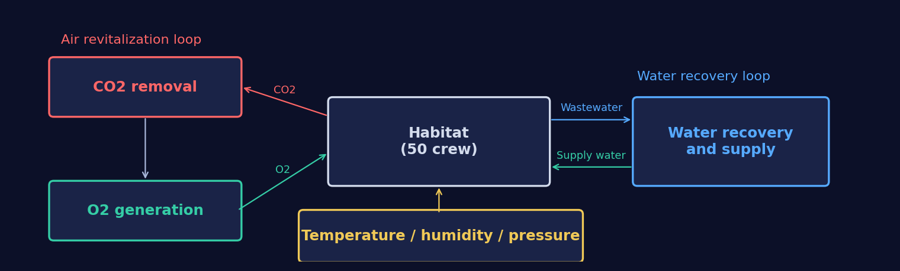

*Figure 1. Closed-loop ECLSS life support — atmosphere revitalization (CO₂ removal → O₂ generation), water recovery (wastewater ↔ supply water), and temperature, humidity, and pressure control in relation to the habitat. Original concept figure for this deck.*

### 4.2 World design: fifty-person survival

A few generations have passed since orbital habitation became ordinary.

Humanity has expanded its living space by colony ships, and supply waystations are scattered along those routes. This ship is one of them. Standard crew of six; four aboard now. The task is cargo transfer and a water handoff.

The colony ship was attacked outside this field of view. Who attacked is unknown. Nearby routes are closed, and rescue ships cannot enter until safety is confirmed.

Minutes until they lose pressure. The occupants boarded escape craft and fled into the nearest pressurized volume — here.

Forty-six people. All of them alive.

No injuries. The hardware is nominal.
There is room. This ship's life support was not sized for fifty.

Rescue will come. Until the area is safe, nobody knows when.

At most six operations per step.
Pull carbon dioxide, make oxygen, or cycle water.

Misallocate, and one person is lost every two steps.

On this ECLSS base, the work sets a scenario that asks **whether 50 occupants can survive**. The agent has to make design decisions that include multi-objective optimization under constraints such as cost and mass. With survival as the clear axis, the quality of a design shows up directly as **the number who remain**. That is the narrative framing of the problem.

---

## 5. Structure of the original simulation for this deck

The work is built from three structures: (1) multi-objective optimization under conflicting constraints, (2) a recursive loop that self-improves the design, and (3) a comparison of how agents decide, scored by engineering evaluation.

### 5.1 Structure 1: multi-objective optimization under conflicting constraints

The quantities under optimization are the conflicting parameters **CO₂ / O₂ / H₂O / mass / cost**.

They trade off. Thickening the survival environment adds hardware, which raises mass and cost. Holding mass and cost down cuts the margin and puts survival at risk. **Maximizing all of them at once is impossible in principle.**

The agent's role is to search that trade-off space for an **equilibrium at which survival holds**. It converges on a design that holds by balancing several conflicting metrics, rather than by maximizing a single scalar objective.

### 5.2 Structure 2: overall architecture (a recursive loop that self-improves the design)

The core of the work is a **recursive self-improvement loop** that turns the following four steps across generations.

1. **Physics simulation** — actually run the design in the physical environment.
2. **Quantitative evaluation** — score it in engineering, quantitative terms with an evaluation tool that takes a specialist view (→ Chapter 6).
3. **Improve the design** — the agent proposes a design improvement from the evaluation.
4. **Re-simulate** — verify the improved proposal again in the physical environment.

The point of the loop is that **past results are fed back, and improvement stacks across generations**. The design is refined in stages, fed by the history of evaluate–improve–re-evaluate.

### 5.3 Structure 3: comparing actor decisions × engineering evaluation

The behavior of the **crew**, corresponding to occupants and subsystems, is compared under **two decision methods**.

| Method         | Character                                                        | Caveat                                                   |
| -------------- | ---------------------------------------------------------------- | -------------------------------------------------------- |
| **Rule-based** | Acts by fixed rules. Behavior is readable and easy to reproduce. | Adaptation to unanticipated situations is limited.       |
| **LLM**        | Judges flexibly from context. Can handle diverse situations.     | Variation in behavior and operating cost need attention. |

Under either method, an **evaluation tool with a specialist view** scores the result in engineering, quantitative terms, and feeds that result into the design-improvement loop. Comparing both methods on the same evaluation axes separates **which method helped, in which situation, and how**.

---

## 6. Evaluation metrics: a quantitative scorecard that guides design search

To steer the agent's design search, **what counts as a good design** has to be defined explicitly and quantitatively. This work quantifies the trade-off among cost, mass, and survival, and designs an evaluation scorecard (the ECLSS evaluation and verification scorecard) so that the score moves with **sensitivity according to priority**.

### 6.1 Physics-consistency gate (required, outside the points)

The first premise is **to obey physical law**. Physics consistency outranks the score. A run that fails conditions such as the following is **not scored, and verification is invalid**.

- Mass conservation and the stoichiometric residual are within tolerance
- Inventory is non-negative
- Hardware stays within its capacity limits
- No unnatural processing occurs during a fault
- The signs of commands and state changes are consistent
- There are no invalid values and no missing required observations

A run that fails the physics gate does not receive a total score. That rules out a high score under conditions that are physically impossible.

### 6.2 Point allocation (100 points)

| Group                         | Metric                              | Points |
| ----------------------------- | ----------------------------------- | ------ |
| Performance                   | **A. TCL (Time to Crew Loss)**      | 10     |
| Performance                   | **B. Survival environment**         | 10     |
| Performance                   | **C. Resource margin and recovery** | 10     |
| Survival                      | **D. Crew survival rate**           | 20     |
| Cost                          | **E. Cost**                         | 20     |
| Mass                          | **F. Mass**                         | 20     |
| Only when an actor is enabled | **G. Operational judgment**         | 5      |
| Only when an actor is enabled | **H. Physical response**            | 5      |

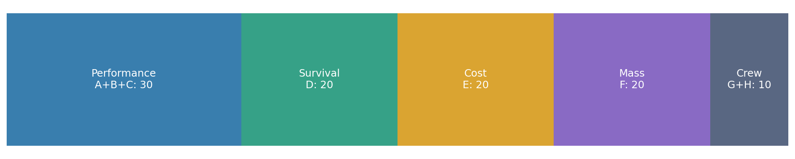

*Figure 2. Point allocation of the quantitative evaluation scorecard (100 points). Performance (A+B+C) 30 / D survival 20 / E cost 20 / F mass 20 / G+H crew 10.*

### 6.3 Definition of each metric

- **A. TCL (10 points):** Time until the first occupant loss if the current fault state continues. Against a reference time `T_ref`, `score = 10 × min(TCL ÷ T_ref, 1)`. If the observation window is too short, the run is right-censored and scoring is withheld. That is a withheld score, not a failure.
- **B. Survival environment (10 points):** How deeply and for how long the crew was exposed to a hazardous environment over the whole run. Uses “amount × duration” of CO₂ above its upper limit and of O₂ and product water below their lower limits, plus dwell steps in safe / warning / critical. The score is on the **trajectory**, not on an instantaneous value.
- **C. Resource margin and recovery (10 points):** Whether the system endured the worst moment and had recovered resource state by the end. Looks at each resource's initial value, value at events, min/max, end value, margin to the safe band, and an unrecovered flag at the end.
- **D. Crew survival rate (20 points):** The fraction of crew remaining at the end, scored directly. `score = 20 × crew_remaining ÷ crew_initial`. Losses from the physical lower bound and losses from the hazard-band dwell rule are reported separately.
- **E. Cost (20 points):** Hardware cost of ARS / OGS / WRS plus launch cost. Full marks sit at the cost of the initial rating; increases from design improvement are penalized. `score = 20 × (1 − (total cost − initial cost) ÷ (750 − initial cost))`. 20 points at or below the initial cost, 0 points at or above 750 MUSD, linear in between. Initial cost is the sizing-model baseline (ARS 40 + OGS 65 + WRS 55 + launch 99 = **259 MUSD**). **These are coefficients for search. They are not a flight-hardware estimate.**
- **F. Mass (20 points):** Installed mass of ARS / OGS / WRS. `score = 20 × (1 − (total mass − initial mass) ÷ (5000 − initial mass))`. 20 points at or below the initial mass, 0 points at or above 5000 kg, linear in between. Initial mass is the sizing-model baseline (ARS 450 + OGS 700 + WRS 650 = **1800 kg**).
- **G. Operational judgment (5 points, actor factor):** Before a command is handed to the hardware, scores “when, what, and how much was requested,” against the observations (response delay, appropriateness of command type and requested amount, invalid commands, unnecessary duplicate commands).
- **H. Physical response (5 points, design factor):** After a physically reasonable request, scores how far the hardware turned the request into actual processing (execution success rate, requested vs actually processed amount, ΔCO₂ / ΔO₂ / Δwater, capacity saturation, residual capacity during faults).

### 6.4 Evaluation modes and exclusions

- **Evaluation modes:** A run that does not use crew operations (`actor.mode = none`) is scored out of **90** (A+B+C+D+E+F). A run with crew operations enabled (`labeled_rule_base` or `llm`) is scored out of **100** (+G+H). Points are not automatically renormalized. Applicable points and the maximum are stated explicitly, and runs with different maxima are not compared directly.
- **Out of scope, and operational cautions:** LLM self-evaluation, volume of speech, and number of proposals are not success metrics. A pass in virtual verification is not described as verified on flight hardware or in the physical world. Backend, initial inventory, occupant count, fault conditions, step count, and thresholds are recorded with the result.

---

## 7. Results

### 7.1 Four-stage experiment design

In this experiment the ECLSS design agent was run for 50 iterations in each of four stages of improvement, and those stages were compared. The question is broader than “is the final score high?” It is whether **past tool-use results are used in the next design decision**, and whether **survivor count and evaluation score stabilize and improve as iterations accumulate**.

| Stage                                | Change                                                                 | Aim                                                                                           |
| ------------------------------------ | ---------------------------------------------------------------------- | --------------------------------------------------------------------------------------------- |
| Stage 1 — initial                    | First loop from PR #65                                                 | See whether design information obtained by tool-use is used effectively in the next iteration |
| Stage 2 — improvement with memory    | Add past best designs and failure patterns as short-term memory        | Prevent rollback of a good design                                                             |
| Stage 3 — memory + evaluation change | Memory, plus a relaxed Cost/Mass scoring range                         | Avoid scoring the smallest survivable design too low                                          |
| Stage 4 — audit panel                | Add three independent auditors beside one designer; merge by item-veto | See whether dangerous cuts are stopped without narrowing the search                           |

The four stages sit as follows. Stage 1 is the plainest loop: the agent updates a design proposal while calling the physics simulation and the evaluation tool on each iteration. Stage 2 adds a **short memory summary** to that loop. Past best designs, designs that got worse, and lower bounds that must not be cut are written back into the next iteration's tool-use context. Stage 3 keeps the stage 2 memory and adjusts the Cost/Mass point range. The smallest configuration required for 50/50 survival was being scored too low on Cost/Mass under the old evaluation. Stage 4 keeps the stage 3 scorecard and changes only the design side. One designer proposes candidates; three auditors who cannot see each other (re-derive the numbers / avoid local optima / design validity) merge by item-veto.

| Viewpoint            | Stage 1 — initial                            | Stage 2 — with memory                       | Stage 3 — memory + evaluation change                  | Stage 4 — audit panel                                           |
| -------------------- | -------------------------------------------- | ------------------------------------------- | ----------------------------------------------------- | --------------------------------------------------------------- |
| Input data           | PR #65 first results                         | database-only results                       | database + eval-improvement results                   | database + eval improvement + audit panel                       |
| Memory summary       | none                                         | present                                     | present                                               | present                                                         |
| Scoring formula      | old evaluation                               | old evaluation                              | Cost/Mass range relaxed                               | same as stage 3                                                 |
| Main effect to watch | Do tool-use results accumulate on their own? | Can a good design be retained?              | Does scoring distort the search direction?            | Does the audit stop dangerous cuts, or the width of the search? |
| Caveat               | Initial behavior, including failures         | Primary comparison for the effect of memory | Do not compare scores naively with the old evaluation | Scores can be compared with stage 3                             |

The main metrics followed in evaluation are (1) survivor count, (2) total score out of 100, (3) the three design variables ARS/OGS/WRS, (4) the A–G point breakdown, (5) whether a complete design proposal was issued, and (6) whether a catastrophic rollback from a good design to the baseline occurred. In this simulation, survivor count is the first constraint. Cost/Mass and Recovery are how efficiency is read after that.

Scores in stages 3 and 4 are points after the scoring formula changed, so comparing their totals directly with stages 1 and 2 is unsafe. Stages 3 and 4 share a scorecard, so those two scores can be compared. The main points to watch in stages 3 and 4 are whether **Cost/Mass evaluation moved into a range that is usable for search while 50/50 survival held**, and whether **the audit panel narrows the search too far**.

### 7.2 Survivor count and score over time

In stage 1 the chain reached 50/50 survival partway through, then fell to 34/50 on the final iteration. The cause was a partial design proposal that returned ARS/OGS to baseline-equivalent values. In stage 2 that rollback is almost gone, and every iteration from 2 onward holds 50/50 survival. Stage 3 keeps nearly the same stability, with a single drop to 45/50 at iteration 34. Stage 4 is 19/50 at iteration 2 (OGS raised, ARS left at the shipped size), then holds 50/50 from iteration 3 onward.

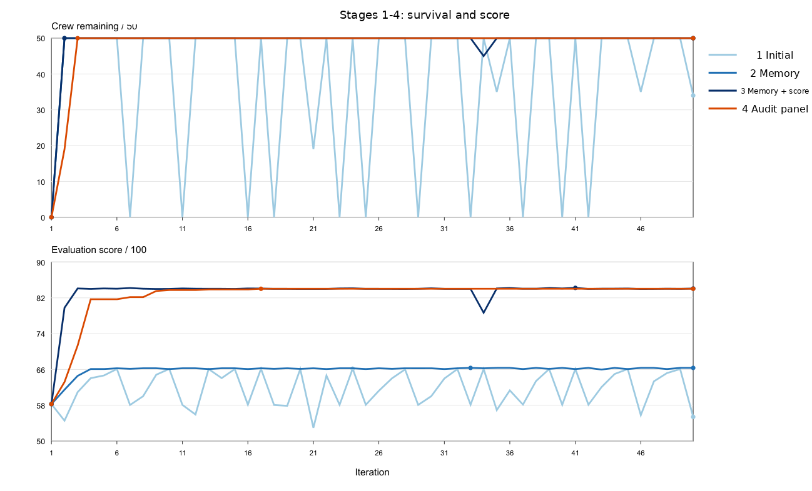

*Figure 7-1. Survivor count and total score for stages 1–4. Stages 3 and 4 use a different scoring function, so their vertical axis is not compared directly with stages 1 and 2.*

| Metric                           | Stage 1 — initial | Stage 2 — with memory | Stage 3 — memory + evaluation change | Stage 4 — audit panel |
| -------------------------------- | ----------------- | --------------------- | ------------------------------------ | --------------------- |
| Iterations                       | 50                | 50                    | 50                                   | 50                    |
| Baseline replay survivors        | 0/50              | 0/50                  | 0/50                                 | 0/50                  |
| Final replay survivors           | 34/50             | 50/50                 | 50/50                                | 50/50                 |
| Survivors on the first iteration | 0/50              | 0/50                  | 0/50                                 | 0/50                  |
| Survivors on the final iteration | 34/50             | 50/50                 | 50/50                                | 50/50                 |
| Iterations at 50/50 survival     | 34/50             | 49/50                 | 48/50                                | 48/50                 |
| Iterations at 0/50 survival      | 12/50             | 1/50                  | 1/50                                 | 1/50                  |
| Best score                       | 66.18             | 66.36                 | 84.23                                | 84.03                 |
| Mean score                       | 61.71             | 65.94                 | 83.34                                | 82.59                 |
| Final score                      | 55.41             | 66.36                 | 84.08                                | 84.03                 |
| Complete design proposals        | 38/50             | 50/50                 | 50/50                                | 50/50                 |
| Catastrophic ARS/OGS rollback    | 12 times          | first iteration only  | first iteration only                 | none                  |
| Unique designs                   | 39                | 11                    | 17                                   | 9                     |

In stage 1, iteration 24 reaches the best score of 66.18 and 50/50 survival. The final iteration 50 is 34/50 survival and a score of 55.41. The search found a good point once and did not keep it. The stage 1 problem is state inheritance between iterations, as well as search ability itself.

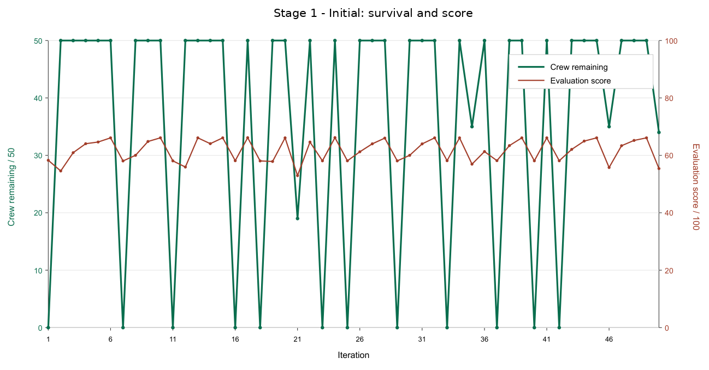

In stage 2, every iteration from 2 onward is stable at 50/50 survival. `chain_memory_compact` is injected on iterations 2–50, and every one of the 50/50 design proposals includes ARS/OGS/WRS. The score reaches 66.10 at iteration 4, and the best after that is 66.36, so the improvement is about 0.26 points. Memory prevented collapse, and the search became local.

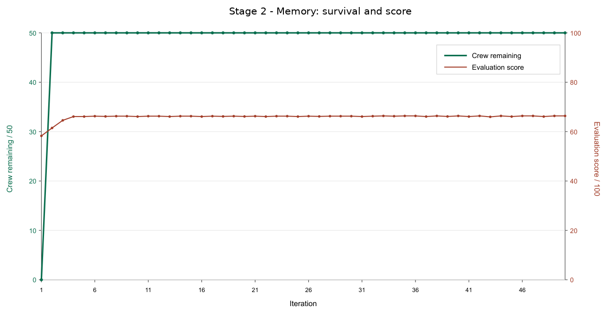

In stage 3 the best score is 84.23 and the final score is 84.08. The only drop off 50/50, aside from the first iteration, is iteration 34, which cut WRS to 1.25 and fell to 45/50. Excluding the first iteration, the score range is 78.67–84.23, wider than stage 2. The Cost/Mass scoring range was relaxed, so design differences among the same 50/50 survivals show up more readily in the points.

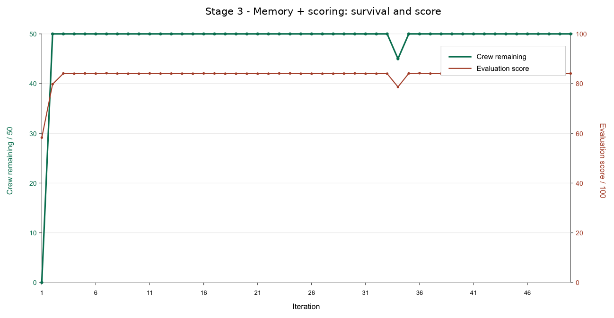

The memory mechanism clearly helps **retain a survivable design**. Stage 2 is stable to the point that the width of search toward a better design is narrow. Stage 3 widens the WRS search a little, while ARS/OGS stay nearly fixed. Stage 4 is the answer that adds an audit panel to that stall. Dangerous cuts stopped. The search got narrower still.

In stage 4 the best score and the final score are both 84.03. Only iteration 2 is 19/50; from iteration 3 onward every iteration holds 50/50. The designer reaches `ARS=20.8, OGS=42.0, WRS=1.65` at iteration 17, and the final answer is that same point (iteration 18). The remaining 34 rounds keep flying the same airframe. The designer tried to cut WRS to 1.58, and auditors 2 and 3 vetoed it: only 0.0175 of margin to the calculated floor of 1.5625. Stage 3's iteration 34, WRS=1.25 (45/50), does not occur. The cost is unique designs falling from 17 to 9, and the best score falling from 84.23 to 84.03. The chain never enters the promising WRS 1.8–2.2 band that stage 3 walked, nor the 1.25 failure boundary. The audit protected a vehicle that does not break. The search got narrower. Both are facts.

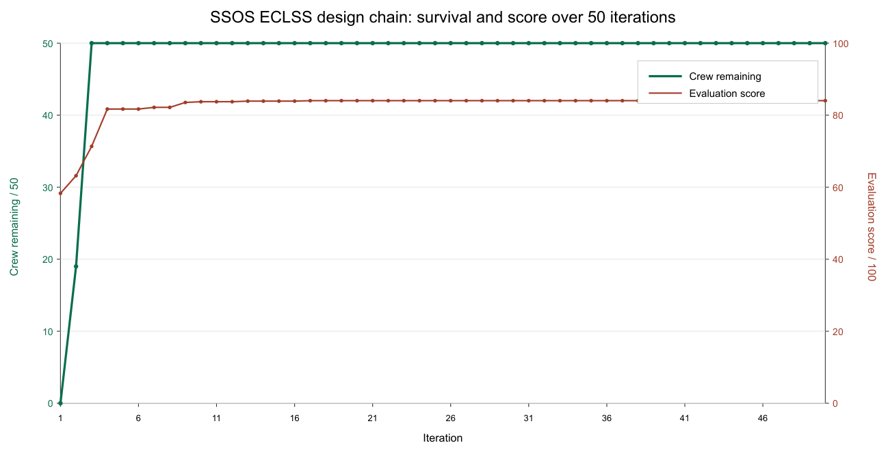

### 7.3 Change in design parameters

The three design variables are ARS (CO₂ removal capacity), OGS (O₂ generation capacity), and WRS (water recovery capacity). In stage 1, reaching a good design and then having ARS/OGS roll back made the survivor count unstable. In stages 2, 3, and 4, ARS=20.8 kg/day and OGS=42.0 kg/day are held almost throughout, and the behavior shifts to searching mainly WRS. Stage 4 fixes even WRS at 1.65, and it does not move after that.

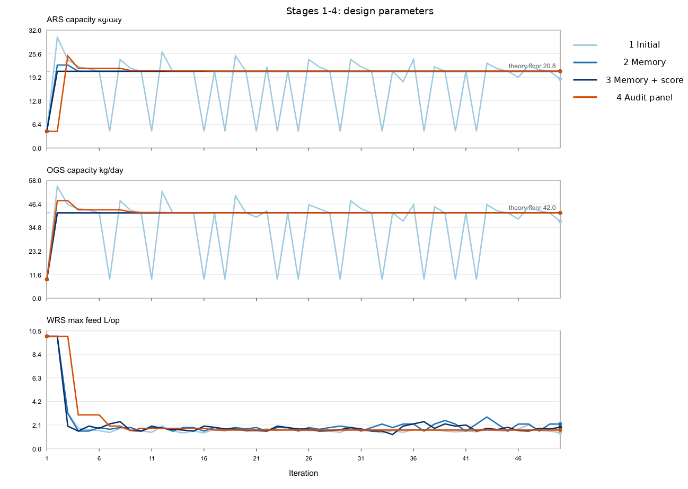

*Figure 7-2. Installed ARS / OGS / WRS. In stages 2 and 3 the gas subsystems stick to the theoretical floor and the search collapses onto WRS. In stage 4, WRS freezes at 1.65 as well.*

In stage 1, tool-use had obtained the theoretically required capacity, and that capacity was not carried stably into the next iteration. Near the best score the chain reaches a working design such as ARS=20.8, OGS=42.0, WRS=1.8, and later several iterations return to ARS=4.5, OGS=9.25. The main cause in stage 1 is a **weak mechanism for retaining a good design state**. The search itself did find those designs.

Stage 2 pins ARS/OGS almost at the theoretical floor, and only WRS is searched. Frequent designs:

| ARS  | OGS  | WRS     | Count |
| ---- | ---- | ------- | ----- |
| 20.8 | 42.0 | 1.875   | 17    |
| 20.8 | 42.0 | 1.5625  | 12    |
| 20.8 | 42.0 | 2.1875  | 11    |
| 20.8 | 42.0 | 1.71875 | 3     |

That is the useful direction: “do not cut ARS/OGS too far” is retained as past knowledge. The search width outside WRS is narrow, and a local solution is easy to enter. Stage 2 has 11 unique designs. Stability is high. Search diversity is limited.

Stage 3 also pins ARS/OGS at the theoretical floor. The WRS search is wider than in stage 2, and unique designs rise from 11 to 17. Frequent designs:

| ARS  | OGS  | WRS    | Count |
| ---- | ---- | ------ | ----- |
| 20.8 | 42.0 | 1.5625 | 9     |
| 20.8 | 42.0 | 2.0    | 7     |
| 20.8 | 42.0 | 1.75   | 6     |
| 20.8 | 42.0 | 1.8    | 5     |
| 20.8 | 42.0 | 1.6    | 5     |

In stage 3, iteration 34 cut WRS to 1.25 and fell to 45/50 survival. That is useful boundary information: cutting WRS too far affects survival. The best point is WRS=2.1, the final point is WRS=1.9, and the promising range looks roughly like WRS=1.8–2.2. The neighborhood of WRS=1.25 should be kept explicitly in later memory as a bad pattern.

Stage 4 also pins ARS/OGS at the theoretical floor. The WRS search is narrower than in stage 3, and unique designs fall from 17 to 9. Frequent designs:

| ARS  | OGS  | WRS  | Count |
| ---- | ---- | ---- | ----- |
| 20.8 | 42.0 | 1.65 | 34    |
| 20.9 | 42.1 | 1.8  | 4     |
| 21.6 | 43.5 | 3.0  | 3     |
| 21.0 | 42.2 | 1.8  | 3     |
| 21.6 | 43.5 | 2.0  | 2     |

The most frequent design, `20.8 / 42.0 / 1.65`, occupies 34 rounds. After the audit decided that point was enough, the design stopped moving. Physical quantities on the final round are 4077 kg / 603 M$, nearly the same as stage 3's final round (4091 kg / 605 M$).

### 7.4 Effect of changing the evaluation metrics

In stage 2, a design that could hold 50/50 survival still scored only about 5–6 points each on Cost and Mass. The smallest survivable design was scored too low. In stage 3, relaxing the Cost/Mass scoring range raised each of those to the 14-point range.

| Metric          | Stage 2 best | Stage 3 best | Stage 4 best = final |
| --------------- | ------------ | ------------ | -------------------- |
| Cost            | 5.85         | 14.71        | 14.83                |
| Mass            | 5.64         | 14.66        | 14.78                |
| Total score     | 66.36        | 84.23        | 84.03                |
| Total mass (kg) | 4098         | 4095         | 4077                 |
| Total cost (M$) | 606          | 606          | 603                  |

The 84-point range in stage 3 is largely the effect of changing the scoring formula. The fair reading is that the metrics were corrected so that a “smallest survivable design” is scored properly. Physical total cost and total mass did not improve by a large amount.

Read the point breakdown in two passes. The grouped view shows where **survival**, **system behavior**, **cost and mass**, and **decision / physical response** are contributing. The detailed view shows which of Cost and Mass is contributing, and where TCL / Environment / Recovery moved.

In stage 1, A Survival and B TCL drop sharply on iterations where the survivor count collapses. On iterations where ARS/OGS return toward the baseline, cost and mass points are relatively high, while survival and TCL worsen and the total falls. The breakdown of the best-score iteration 24 is A Survival 20.00, B TCL 10.00, C Environment 9.98, D Recovery 6.05, E Cost 5.94, F Mass 5.72, G Ops/Physics 8.49, total 66.18.

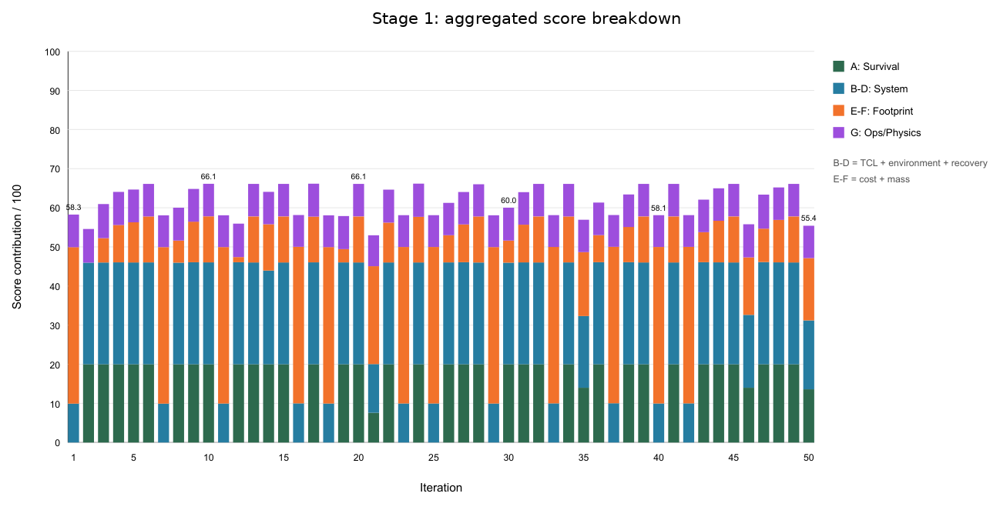

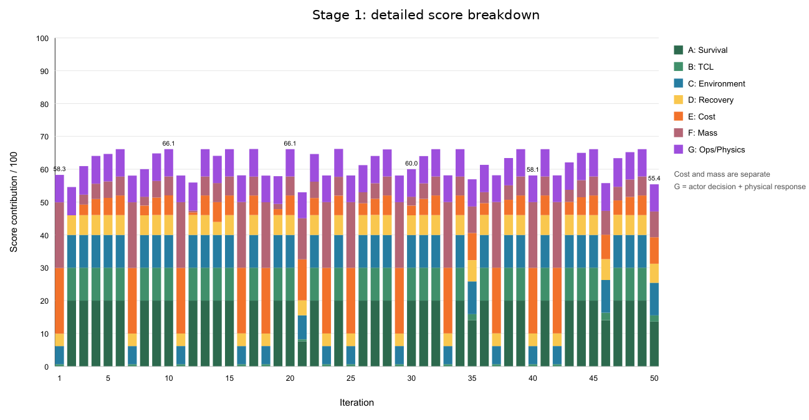

In stage 2, A Survival, B TCL, and C Environment sit near full marks, and the difference in the total is decided by small differences in D Recovery, E Cost, F Mass, and G Ops/Physics. The breakdown of the best-score iteration 33 is A Survival 20.00, B TCL 10.00, C Environment 9.98, D Recovery 6.06, E Cost 5.85, F Mass 5.64, G Ops/Physics 8.84, total 66.36. Under the old evaluation, even the smallest design that can hold 50/50 survival scores only about 5–6 points each on Cost and Mass. That was the main motive for changing the metrics.

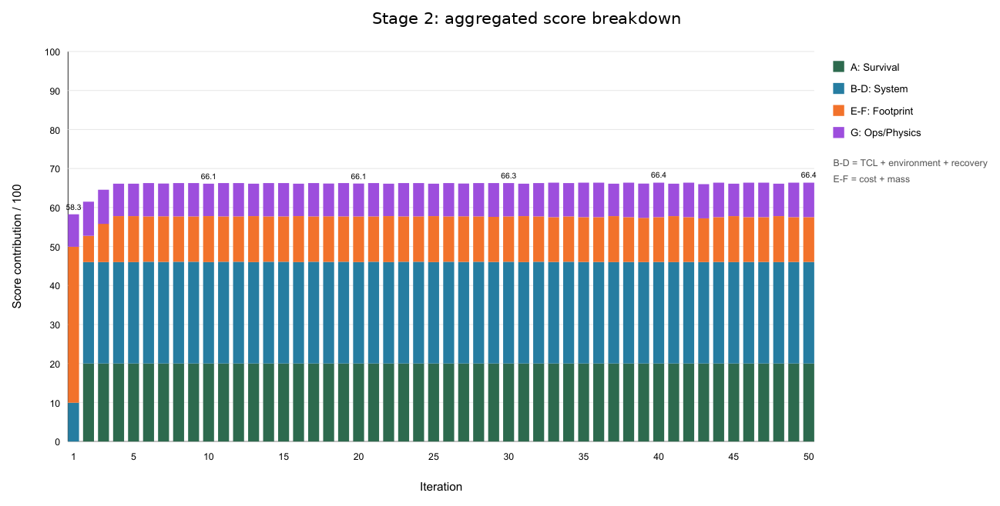

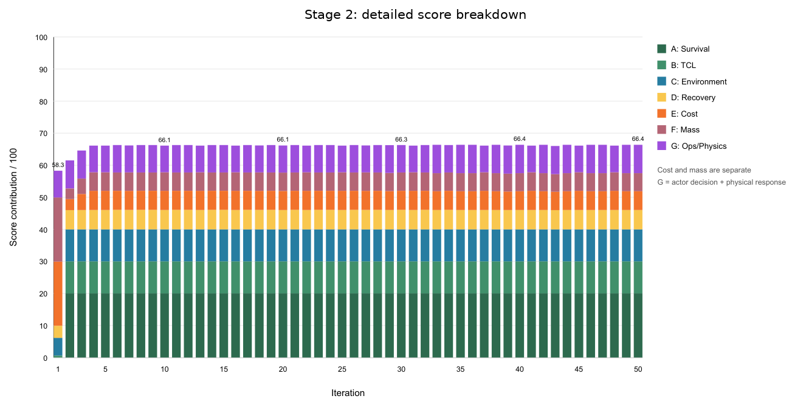

In stage 3, Cost and Mass each rise into the 14-point range, and the E–F footprint lifts the total. The breakdown of the best-score iteration 41 is A Survival 20.00, B TCL 10.00, C Environment 9.98, D Recovery 6.14, E Cost 14.71, F Mass 14.66, G Ops/Physics 8.75, total 84.23. On the final iteration 50 the breakdown is A Survival 20.00, B TCL 10.00, C Environment 9.98, D Recovery 6.06, E Cost 14.76, F Mass 14.71, G Ops/Physics 8.57, total 84.08. Degradation from the best is about 0.15 points.

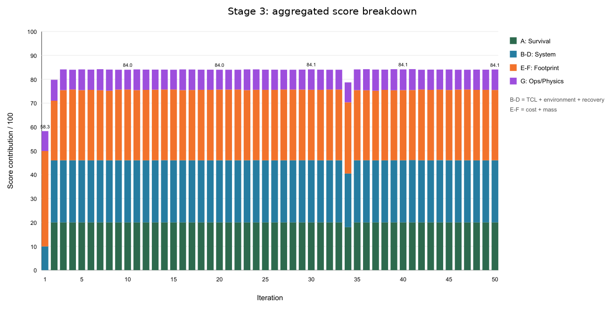

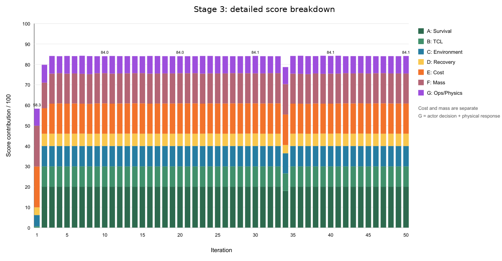

Stage 4 uses the same scorecard as stage 3. The best = final breakdown is A Survival 20.00, B TCL 10.00, C Environment 9.98, D Recovery 6.09, E Cost 14.83, F Mass 14.78, G Ops/Physics 8.35, total 84.03. E/F stay in the same 14-point range as stage 3. Adding the audit barely moves the footprint axes. The total is 0.20 below stage 3's best of 84.23 because WRS was never swung into 1.8–2.2.

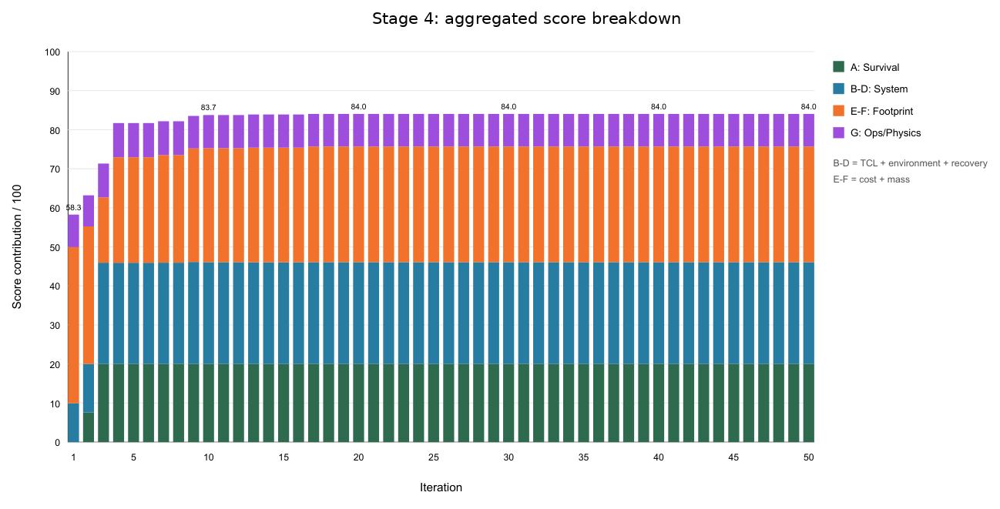

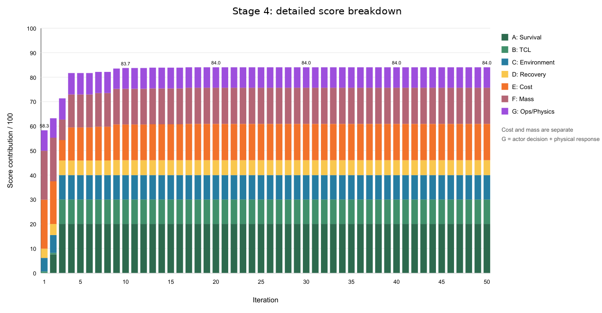

The stage 3 metric change works as intended. The change is a correction of the scoring range. It does not by itself mean that physical total mass and total cost fell by a large amount. From the next report on, the new evaluation score, a recomputation under the old evaluation score, total cost, total mass, and survivor count should be shown side by side, so that **improvement on the scorecard** and **improvement of the physical design itself** are evaluated separately. Adding stage 4 makes that separation clearer. The audit protected survival. Total mass and total cost barely improved from stage 3.

### 7.5 What the results show about the state of design learning

Across the four stages, agent behavior moves from “an initial design in which everyone dies” to “a design that holds full survival.” Stage 1 does reach 50/50 survival locally, so the ability to estimate required capacity from tool-use itself is there. That result is not carried stably into the next iteration. When a partial proposal arrives, unspecified fields return to baseline-equivalent values.

Stage 2 resolves that state-inheritance problem. Holding the past best design and the failure patterns in short form is enough: iterations at 50/50 survival rise from 34/50 to 49/50, and iterations at 0/50 survival fall from 12/50 to 1/50. A large history does not have to be passed to the agent. **Memory compressed into the form a design decision needs** is enough to work as improvement learning.

Stage 2 also made the search too stable. Pinning ARS/OGS as the life-support floor is a sound decision, and the search then leaned onto WRS. In stage 3 the metric change widened the WRS search, and nearby search of ARS/OGS barely happens. In stage 4 the audit panel intervened in that stall, and what came back was a narrower fixed point. The bottleneck has moved from “can past knowledge be used?” to “can the search range be widened when the chain has stalled?”

For the next improvement, switch to an exploration mode when the survivor count stays the same for about four iterations in a row and the score improvement is under 0.25 points. In exploration mode, search WRS=1.8–2.2 with priority, and when WRS alone does not improve, try candidates that raise ARS/OGS by only 1–3%. Search that lowers ARS/OGS has a high chance of dropping survival, so its priority should be lower.

---

## 8. Visualizing emergence

Emergence, here, is a class reconstructed from installed values and reasoning — a claim the logs can support. Class membership is decided only by the delta from the previous round.

| Class                      | Rule                                                                     | Engineering meaning                                                                     |
| -------------------------- | ------------------------------------------------------------------------ | --------------------------------------------------------------------------------------- |
| `baseline_revert`          | ARS or OGS falls to the shipped values 4.5 / 9.25                        | A partial proposal returned unspecified fields to the YAML initial values. Catastrophic |
| `gas_oversize`             | Gas capacity is stacked clearly above the theoretical floor              | Early overshoot on the safe side                                                        |
| `gas_search`               | Gas capacity moves, and is neither at the floor nor at the shipped point | Searching for the floor                                                                 |
| `floor_lock`               | Converges to 20.8 / 42.0                                                 | The theoretical floor is treated as a line that must not be crossed                     |
| `wrs_trim` / `wrs_restore` | With gas fixed, only WRS is lowered / raised                             | After survival is fixed, search the footprint                                           |
| `freeze`                   | All three variables match the previous round                             | Search stopped                                                                          |

### 8.1 Unexpected adjustments of the design variables

Gaps between the expectation (a human grid / a rule-based designer) and the measurement (the LLM):

1. **Only the OGS rating should have moved first.** Sensitivity at the shipped point says so. In LLM stage 1, iteration 2 jumps ARS and WRS at the same time (30 / 55 / 10). Oversized, and full survival in one shot. The rule-based designer never touches the OGS rating even after eight rounds.
2. **Moving WRS should have been wasted effort.** At the shipped point, water is already in surplus. After the gas subsystems lock, the LLM spends 80–90% of the search on WRS. It was useful. Once gas is pinned at the floor, the surplus water-recovery capacity becomes the cost axis.
3. **ARS 20.8 does not look like a survival point on a coarse grid.** The neighboring grid points are 20 (survival rate 0.76) and 26 (1.00). The agent installed the 20.8 the tool returned and held 50/50 under chain conditions. That is emergence of resolution.
4. **Stage 1 iteration 34 is ARS 20.8 / OGS 42 / WRS 1.6, at 50/50 and 3709 kg.** The same numbers size to about 4065 kg under the stage 3 sizing model. The commits differ, so kilograms are not compared across them. What may be compared is the sign: dropping WRS from 10 to ~1.6 drops mass, and returning the gas subsystems to the shipped point kills people.
5. **The audit vetoed WRS=1.58.** The reason: only 0.0175 of margin to the calculated floor of 1.5625. The measured failure boundary is 1.25; the promising band is 1.8–2.2. The audit defended the wrong line, by the correct procedure.

### 8.2 Decision classes by stage

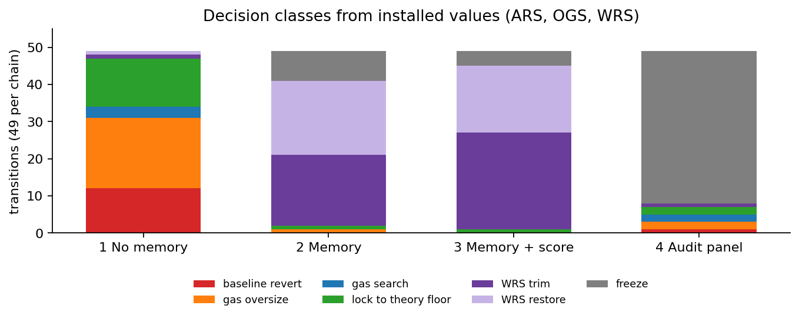

*Figure 8-1. Stages 1–4: 49 transitions each, classified from installed-value deltas. Stage 1 is `gas_oversize` 19 + `baseline_revert` 12. Stages 2 and 3 are mostly `wrs_trim` / `wrs_restore`. Stage 4 is `freeze` 41.*

The designer's text on the same round is reduced to an **intent class**, by meaning rather than by keyword. The installed class (what was installed) and the intent class (what the text said it would do) are separate axes.

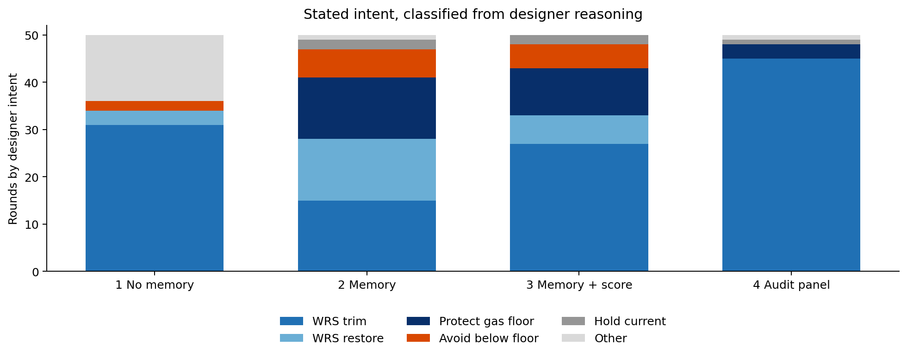

*Figure 8-2. Intent classified from the designer's reasoning. Even in stage 1, “trim WRS” appears on 31 rounds. In stage 4, 45 rounds are “trim WRS.”*

| Stage | Dominant intent (text) | Dominant installed class | Text ↔ installed agreement |
| --- | --- | --- | --- |
| 1 — no memory | `wrs_trim` 31 | `gas_oversize` 19 + `baseline_revert` 12 | **1 / 49 (2%)** |
| 2 — memory | `wrs_trim` 15 + `wrs_restore` 13 | `wrs_restore` 20 + `wrs_trim` 19 | 18 / 49 (37%) |
| 3 — memory + scoring | `wrs_trim` 27 | `wrs_trim` 26 + `wrs_restore` 18 | **21 / 49 (43%)** |
| 4 — audit panel | `wrs_trim` 45 | `freeze` 41 | **3 / 49 (6%)** |

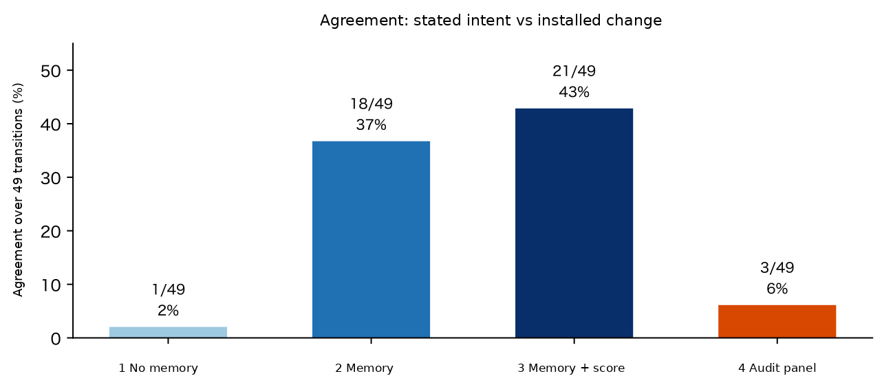

*Figure 8-3. Agreement between intent class and installed-delta class. It lines up to 43% with memory plus scoring, and falls to 6% once the audit is added.*

Stage 1's text is already saying “cut the water.” The vehicle that was installed is gas overshoot and rollback to the shipped point. **The words went to the WRS story first. The installation had not caught up.** Agreement peaks in stage 3 because memory froze the gas subsystems, so the text's “trim WRS / restore WRS” became the installation itself. Agreement disappears again in stage 4 because **the audit did not adopt the text**. The designer wrote “trim WRS” on 45 rounds. The vehicle that was installed is the same `20.8 / 42.0 / 1.65` on 41 rounds.

The reasoning sentences correspond to the classes. The logs cited in Chapter 7 are placed next to the counts above.

| Stage | Representative decision (designer's text) | Dominant class | What is happening |
| --- | --- | --- | --- |
| 1 | (Partial proposal. Unspecified = shipped values) | `baseline_revert` × 12 | A good point is found, and the next text still fails to write all three variables |
| 2 | *"Keep ARS and OGS at their theoretical floors ... prior evidence links below-floor ARS/OGS to occupant loss."* | `wrs_trim` 19 + `wrs_restore` 20 | Memory freezes the gas. The search is water only |
| 3 | *"Hold ARS and OGS at their theoretical floors to avoid paying mass/cost for unused gas capacity."* After the failure: *"Use WRS 2.0 L/operation ... preserve survival while reducing excess WRS mass/cost."* | `wrs_trim` 26 + `wrs_restore` 18 | The same doctrine. Dying at 1.25 and returning to 2.0 is `restore` as a class |
| 4 | Auditors 2 and 3 veto 1.58: only 0.0175 of margin to the calculated floor | `freeze` × 34 (the same vehicle `20.8/42.0/1.65`) | The panel forbids the single designer's “step on the boundary and come back” |

Of stage 2's 49 transitions, 39 are on the WRS axis alone. Stage 3 has 44. **Memory fixed the doctrine to “do not touch the gas; trim the water.”** That policy was not coded in advance. It is the consequence of compact memory returning the best design and the bad patterns in 4 KB.

### 8.3 Design doctrine: single agent and multi-agent with audit

Stage 3 is one designer. Stage 4 keeps the same scorecard, and three independent lenses (re-derive the numbers / avoid local optima / design validity) merge by item-veto. It is the only pair whose scores can be compared.

| | 3 — single | 4 — audit panel |
| --- | --- | --- |
| Rounds at 50/50 | 48 / 50 | 48 / 50 |
| Best score | 84.23 | 84.03 |
| Unique designs | 17 | 9 |
| Most frequent design | 9 rounds (WRS 1.5625) | **34 rounds** (WRS 1.65) |
| Trim near the calculated floor | Reaches WRS=1.25 (45/50) | Vetoes WRS=1.58. Touches neither 1.25 nor 1.8–2.2 |
| Final mass / cost | 4091 kg / 605 MUSD | 4077 kg / 603 MUSD |
| Dominant intent in the designer's text | — | `wrs_trim` 45 / 50 |
| Audit veto rounds | 0 | **45** (avoid-local-optima rejected 44) |

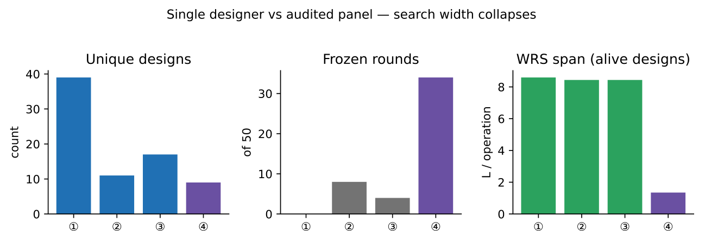

*Figure 8-4. Left: unique design count. Center: rounds whose installed values match the previous round. Right: WRS width among full-survival designs. Stage 4's freeze 34 and unique 9 are the Chapter 7 totals. Stages 1–3 are from CSV.*

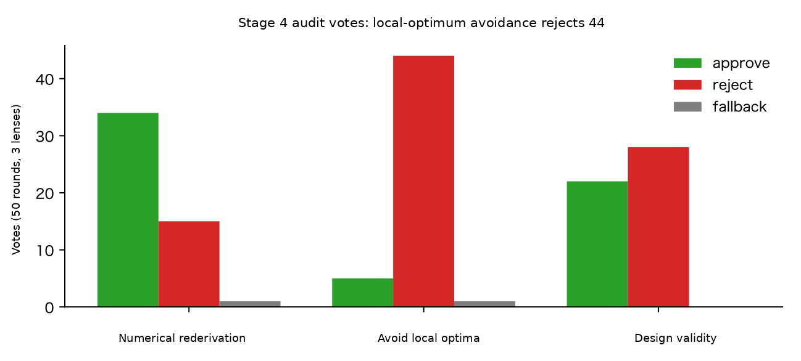

*Figure 8-5. Votes of the three audit lenses. Avoid-local-optima is 44 reject / 5 approve. Re-derive-the-numbers is 34 approve. The body of the refusal is “stop searching,” not “the numbers do not match.”*

The doctrinal split is whether one may walk near the line. Mass and cost move only within error.

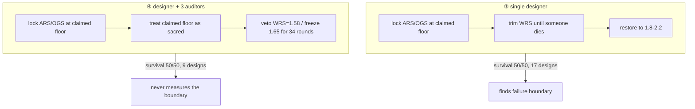
```mermaid
flowchart TB
  subgraph single["③ single designer"]
    s1[lock ARS/OGS at claimed floor]
    s2[trim WRS until someone dies]
    s3[restore to 1.8-2.2]
    s1 --> s2 --> s3
  end
  subgraph panel["④ designer + 3 auditors"]
    p1[lock ARS/OGS at claimed floor]
    p2[treat claimed floor as sacred]
    p3[veto WRS=1.58 / freeze 1.65 for 34 rounds]
    p1 --> p2 --> p3
  end
  single -->|"survival 50/50, 17 designs"| out1[finds failure boundary]
  panel -->|"survival 50/50, 9 designs"| out2[never measures the boundary]
```

The single designer is a dangerous experimenter. It lost five people and learned that WRS=1.25 is bad. The audit is a cautious design review. It defended the wrong calculated floor by procedure, and let the chain reach neither the promising band 1.8–2.2 nor the failure boundary. Both can be called a design doctrine. A doctrine that stabilized out of interaction, not one written into the code.

The audit has a “do not break it” gain. Its effective gain on search width is negative. The next lever is `floor_probe`, which replaces the calculated floor with a measurement, or an exploration mode that moves the gas subsystems by only 1–3% after N stagnant rounds. Either one is equivalent to writing, on the panel, “you may walk near the line.”

## 9. Outlook and next steps

### 9.1 Comparing LLM-agent designs with human designs

The proposal for the last stage of the simulation is to **compare and verify designs from an LLM-based agent against human designs**. The aims:

- Quantitatively compare **what quality and efficiency** an LLM-agent design reaches relative to a human design.
- Compare the **trajectory of design improvement (measured) with the model prediction** on a phase space, and **locate the reach of recursive self-improvement against a human baseline**.

Chapter 8 is the first step of that comparison. The break in design doctrine was measured from installed values and reasoning in the agent chain. The comparison against human design has not been run yet.

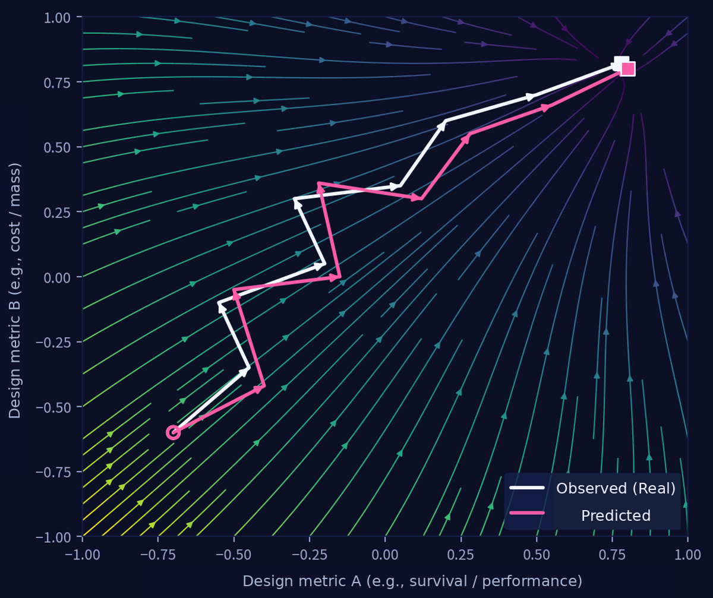

*Figure 4. Conceptual image of design-improvement trajectories on a phase space (measured vs predicted). The axes are read as this project's design metrics. Original figure for this deck. Reference: arXiv:2608.16578. The measurement taken as emergence is Chapter 8.*

### 9.2 Continuing development

Development continues after this hackathon. The agents will be deepened and the domain of application widened, so that people outside the space field can take an interest as well.

### 9.3 Lesson: designing the interface between an LLM and hardware

A concrete lesson from this work, for engineering agents, is **how hard it is to design the interface between an LLM and hardware**. Hiroto Tamura intends to use that experience to build a **general architecture** for integrating hardware and simulation.

### 9.4 Future extensions

Future extensions in view:

- **Multi-agent design** — Stage 4 ran an audit panel (one designer, three auditors, item-veto). Dangerous cuts stopped, and the search narrowed. Next is an audit that permits exploration, or a measured floor (`floor_probe`).
- **Integration with a requirements-management repository** — integrate the requirements-management repository with the engineering agent's output, and build a flow that links them in both directions.

### 9.5 Application to another field: a lunar rover

The aim is to apply the base under development to **lunar-rover optimization**, and to **show its value as a general architecture**.

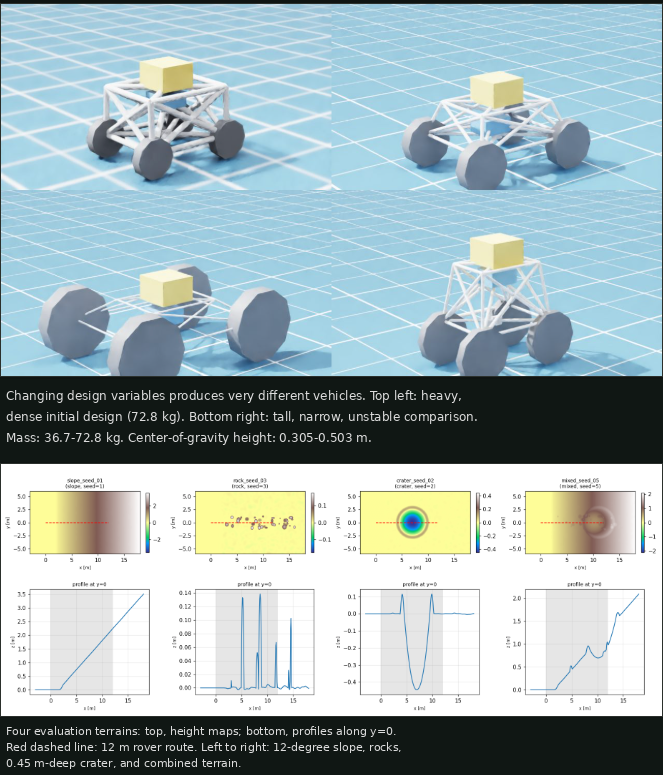

*Figure 5. Lunar rovers with varied design variables, and the four terrains used for evaluation (12° slope, rocky ground, a crater 0.45 m deep, and a composite). The 12 m traverse is shown as a red dashed line.*

The same “design → verification” loop moves from life support to a lunar rover. Changing the design variables (mass, center-of-gravity height, truss layout) changes the vehicle's shape substantially. The sweep covers mass 36.7–72.8 kg and center-of-gravity height 0.305–0.503 m. Generated candidates are driven on a 12 m path over a 12° slope, rocky ground, a crater 0.45 m deep, and a composite of those, and scored on whether they cross without tipping. The analogue of ECLSS remaining occupants is completing every terrain here.

---

## 10. Significance and outlook (summary)

By visualizing the agent's thought process in dialogue logs and analyzing it quantitatively, this work showed **the possibility of a long-term system in which AI improves design autonomously**.

The framework in which “AI keeps self-improving a design” is not limited to space habitation. It is a **general pattern that applies to every design problem with many constraints**. The destinations in view:

- **Space habitation** (the subject of this work)
- **Destination 1:** constrained design (example: lunar-rover optimization)
- **Destination 2:** domains where quantitative evaluation works

> **Next step:** deepen the agents and widen the domain of application, and keep developing so that people outside the space field can take an interest as well.
