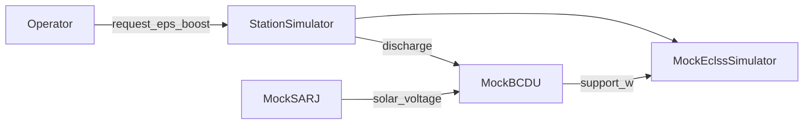

> Japanese: [../../ja/memo/scrubber_degradation/eps_implementation_plan.md](../../ja/memo/scrubber_degradation/eps_implementation_plan.md)

# EPS-First, Day-by-Day Implementation Plan (Week-2 Entry)

> **Established 2026-06-02** — Breaks [mvp_plan.md](mvp_plan.md) Next-1–4 into day-sized chunks.  
> **Updated 2026-06-02**: **EPS-1–4 complete**. Next phase is Day 8 CLI.  
> Reference SSOS: [space_station_eps](https://github.com/space-station-os/space_station_os/tree/main/space_station_eps)  
> Development branch: `feature/eps-mock-foundation`

## Current state (EPS phase complete)


| Item | Status |
| --------------------------- | ------------------------------------------------------------------------ |
| Day 1–6 + Day5B provenance | ✅ per [mvp_plan.md](mvp_plan.md) |
| ECLSS PR (labeled / guarded) | [PR #1](https://github.com/hirototamura/engineering_agents/pull/1) |
| **EPS-1–4** | ✅ commit `578fb0a` (EPS-1), `c013600` (EPS-2) + EPS-3/4 on this branch |
| Simulator | `StationSimulator` (ECLSS + `EpsStack`), `summary.simulator: mock_station` |
| Logs | `eps_telemetry.jsonl` + recovery `provenance` + dashboard SARJ/BCDU |
| Packaging | `src/integrations/one_piece/` — `pip install -e ".[dev]"` required |





---

## Day-by-day roadmap


| Day | Name | Completion criteria (summary) | Status |
| ---------- | ----------------------- | --------------------------------------------------------------------------- | ---- |
| **EPS-1** | Foundation landing | Commit uncommitted WIP with tests green; keep `test_scrubber_baseline` | ✅ Done |
| **EPS-2** | SARJ + BCDU thin mock | `MockSarj` + `MockBcdu` + `/eps/`* topics; unit pytest | ✅ Done |
| **EPS-3** | ECLSS coupling | `request_eps_boost` via BCDU discharge; move inline `eps_support_`* to facade | ✅ Done |
| **EPS-4** | Observability | `eps_telemetry.jsonl`, summary power metrics, dashboard SARJ/BCDU, provenance EPS trace | ✅ Done |
| **Day 8** | CLI (mvp Next-2) | `python -m tools.cli run --scenario ... --agents-mode ...` | Not started |
| **Day 9** | One Piece extension (Next-3) | Cross-run provenance index + handoff spec | Not started |
| **Day 10** | SSOS adapter prep (Next-4) | Topic map contract tests, `SsosAdapter` stub extension | Not started |


Week-1 out-of-scope items unchanged from [mvp_plan.md](mvp_plan.md): Real ROS2, One Piece Web UI, LLM required.

---

## EPS-1: Foundation landing (half day–1 day)

**Goal**: Fix WIP as a “minimal working recovery path” and use it as a safety net for later refactors.

**Work**

1. `pytest tests/scenario/test_scrubber_baseline.py tests/scenario/test_scrubber_with_agents.py tests/environment/test_mock_eclss.py -q` green
2. One commit for uncommitted diff (e.g. *Add EPS boost recovery path for power-critical scrubber runs*)
3. Record EPS-1 complete in [mvp_plan.md](mvp_plan.md) (inline implementation facaded in EPS-3)

**Main changed files**

- `src/environment/protocol.py`
- `src/environment/ssos/mock_eclss.py`
- `src/scenario/agents/scrubber_degradation_team.py`
- `docs/api-contracts.md`

**Done when**: `labeled` run has `request_eps_boost` in `events.jsonl`, CO2 returns below 1000 ppm (`tests/scenario/test_scrubber_with_agents.py`).

**Completion note (2026-06-02)**: Power recovery via `CommandKind.REQUEST_EPS_BOOST` and MockECLSS `eps_support_`* . Inline implementation to move to SARJ/BCDU facade in **EPS-3**.

---

## EPS-2: SARJ + BCDU thin mock (1 day)

**References**

- [space_station_eps README](https://github.com/space-station-os/space_station_os/blob/main/space_station_eps/README.md) — SARJ → `/solar/voltage` → BCDU
- [BCDUStatus.msg](https://github.com/space-station-os/space_station_os/blob/main/space_station_eps/msg/BCDUStatus.msg) — Python dataclass + dict serialize (no ROS2 runtime)

**New layout (draft)**

```text
src/environment/ssos/
  mock_sarj.py      # beta_angle or step → solar_voltage_v
  mock_bcdu.py      # solar_voltage + discharge request → bus watts, mode, fault
  eps_topics.py     # /solar/voltage, /bcdu/status, /bcdu/operation, /eps/diagnostics
  eps_types.py      # BcduStatus (mode: idle|charging|discharging|fault|safe)
```

**SARJ minimal model**: `step` or `beta_angle_deg` → `solar_voltage_v` (below threshold in eclipse → BCDU prioritizes discharge).

**BCDU minimal model**: `request_discharge(...)` → `support_w`; outside voltage band → `fault` + reject.

**Tests**: `tests/environment/test_mock_eps.py`  
**Docs**: Add EPS topic table to [docs/api-contracts.md](../docs/api-contracts.md).

**Completion note (2026-06-02)**: Added `eps_types.py`, `eps_topics.py`, `mock_sarj.py`, `mock_bcdu.py`, `eps_stack.py`. ECLSS coupling in EPS-3.

---

## EPS-3: ECLSS coupling · facade (1 day)

**Goal**: Route `request_eps_boost` to the EPS subsystem, not internal ECLSS addition.

**Recommended**: `StationSimulator` (used from `src/scenario/runner.py`)

```python
# Concept only
class StationSimulator:
    def step(self) -> TelemetrySnapshot:
        solar = self.eps.sarj.step()
        self.eps.bcdu.update_solar(solar)
        snap = self.eclss.step()
        support = self.eps.bcdu.consume_scheduled_support()
        # apply support to effective power_margin before health
        ...

    def apply_command(self, cmd: RecoveryCommand) -> CommandResult:
        if cmd.kind == REQUEST_EPS_BOOST:
            return self.eps.bcdu.arm_discharge(...)
        return self.eclss.apply_command(cmd)
```

**Migration**

- Remove `eps_support_`* from `mock_eclss.py` (or short-term deprecated wrapper)
- `build_simulator` → `build_station_simulator`
- Update `summary.json` `simulator` to `mock_station`, etc.

**Done when**: After power critical, BCDU `discharging` for several steps; `test_scrubber_baseline.py` (`agents.mode: none`) stays green.

**Completion note (2026-06-02)**: `station_simulator.py` implemented. Runner uses `build_station_simulator` / `summary.simulator: mock_station`. Standalone `MockEclssSimulator` `request_eps_boost` rejected.

---

## EPS-4: Observability (1 day)

- New `eps_telemetry.jsonl` (`solar_voltage_v`, `bcdu_mode`, `support_w`, `fault`)
- `summary.json`: `eps_boost_applied_step`, `min_power_margin_w`, etc. (optional)
- `integrations/one_piece/client.py` — recovery trace (`request_eps_boost`)
- `src/tools/dashboard/app.py` — SARJ/BCDU charts, labeled vs `labeled_llm_guarded` power recovery diff

**Completion note (2026-06-02)**: `eps_telemetry.jsonl`, `min_power_margin_w` / `eps_boost_applied_step` in summary, recovery provenance (`record_type: recovery`), dashboard SARJ/BCDU + run-comparison power recovery table.

---

## EPS phase completion summary (2026-06-02)

- **Commits**: EPS-1 `578fb0a`, EPS-2 `c013600`, EPS-3/4 + packaging in this push batch
- **Tests**: `pytest` 24 passed (`test_mock_eps`, `test_station_simulator`, scenario regression)
- **Run**: After `pip install -e ".[dev]"`, `python -c "from scenario.runner import run_scenario; ..."` or `python src/scripts/run_mock_eclss.py`
- **Remaining**: Day 8–10 (CLI / provenance index / SSOS adapter contract)

---

## Day 8: CLI (1 day)

- `src/tools/cli/` — `run`, `list-scenarios`
- [pyproject.toml](../pyproject.toml) entry point
- `scrubber_demo.yaml` (for E2E)

**Done when**: One command runs all 4 agent modes + shows output paths.

---

## Days 9–10: Extensions

**Day 9 — One Piece**: Provenance summary index, EPS recovery handoff example in [one-piece-integration.md](../docs/one-piece-integration.md).

**Day 10 — SSOS adapter**: `adapter.py` contract tests, `tests/environment/test_ssos_topic_contract.py`.

---

## Sub-agents (`~/.cursor/agents/`)


| File | Role | Delegate when |
| ------------------------------ | --------------------------------- | -------------------------- |
| `eps-mock-engineer.md` | SARJ/BCDU/topics/unit tests/docs | EPS-2, EPS-3 environment layer |
| `eclss-scenario-integrator.md` | runner facade, agents, regression tests | EPS-3, EPS-4 scenario layer |
| `integration-ops.md` | dashboard, provenance, CLI, mvp_plan | EPS-4, Day 8–10 |


---

## Risks and rollback


| Risk | Mitigation |
| ------------------------------- | ------------------------------------------------------ |
| Facade changes baseline physics | Fix `agents.mode: none` first; add SARJ constant-voltage mode |
| LLM does not emit `request_eps_boost` | Explicit EPS in `labeled_llm_guarded` operator prompt (EPS-4) |
| Scope creep | MBSU multi-channel · 24 BMS as parameter stubs only |


---

## Implementation checklist

- [x] EPS-1: Foundation landing (commit + regression green)
- [x] Three sub-agents (`~/.cursor/agents/`)
- [x] EPS-2: SARJ + BCDU thin mock
- [x] EPS-3: StationSimulator + ECLSS coupling
- [x] EPS-4: Observability (logs / provenance / dashboard)
- [ ] Day 8: CLI + E2E
- [ ] Day 9: One Piece extension
- [ ] Day 10: SSOS adapter contract tests

---

## Recommended implementation order

1. ~~EPS-1–4~~ ✅
2. (Optional) Three sub-agents in `~/.cursor/agents/`
3. **Day 8** CLI → **Day 9** One Piece index → **Day 10** SSOS adapter contract tests
