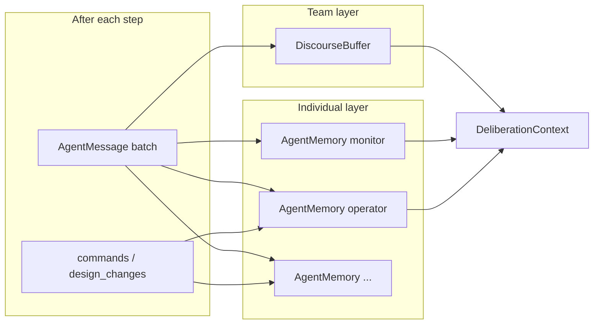
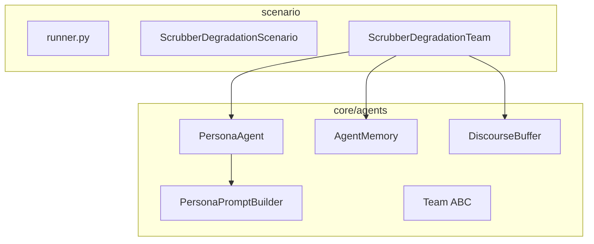

> Japanese: [../../ja/memo/agents/persona_llm_core_oop_plan.md](../../ja/memo/agents/persona_llm_core_oop_plan.md)

# Persona LLM Redesign + Core OOP Skeleton Extraction

**Status**: Day 1–8 complete (production Ollama run optional)  
**Related**: [persona_workshop_draft.md](persona_workshop_draft.md), [backlog.md](backlog.md) BL-001

## Goals (two pillars)

1. **Persona deliberation**: Move `labeled_llm_guarded` from Role scripts to Persona/MainRole + 2-round intellectual debate + **individual memory** (keep JSON contract, guards, rule fallback)
2. **Core replacement**: Remove 2D bar-specific code from `src/core/agent.py` / `src/core/simulation.py`; replace with thin ECLSS-oriented **Agent / Team / Scenario** skeleton

**Constraints**: No plugins, DI, generic deliberation engine, or async in this pass. Minimal abstraction for scrubber_degradation end-to-end only.

---

## Progress checklist


| Day | Content | Status |
| ----- | ---------------------------------------------- | --- |
| Day 1 | Core skeleton (types, Team/Scenario ABC, remove old 2D bar) | ✅ |
| Day 2 | AgentMemory + DiscourseBuffer | ✅ |
| Day 3 | PersonaPromptBuilder + PersonaAgent | ✅ |
| Day 4 | ScrubberDegradationTeam migration + 2-round deliberation | ✅ |
| Day 5 | ScrubberDegradationScenario + thinner runner | ✅ |
| Day 6 | Stub persona + regression tests | ✅ |
| Day 7 | **Persona design workshop** (discussion with user) | ✅ |
| Day 8 | Finalize agents.yaml · update docs | ✅ |


---

## Memory design (vs DiscourseBuffer alone)

**Conclusion: DiscourseBuffer alone is insufficient. Two-layer memory required.**


| Layer | Class | Scope | Contents | Role in prompt |
| --------- | ----------------- | ------------- | ---------------------- | ---------------- |
| **Team shared** | `DiscourseBuffer` | All agents | Recent N `AgentMessage` | OpenForum “minutes” |
| **Individual private** | `AgentMemory` | Per `agent_id` | Own past utterances, actions, self-notes | “What I said and did before” |





### AgentMemory update rules

After each step, `TeamMemoryStore.commit_step()`:

1. **Own utterance**: Compress Round 1/2 `message` + `reasoning` into one entry
2. **Own action**: Record operator `commands`, design_engineer design change
3. **LLM self-note** (optional): JSON `"memory"` key → append via metadata `llm_memory`

Config: `memory_limit` / `discourse_window` in `agents.yaml` (default 8 / 12)

### Prompt sections

- `## Team discourse` ← DiscourseBuffer
- `## Your memory` ← AgentMemory (this agent only)
- `## This step so far` ← accumulation within same step

### JSON contract (deliberation phase)

```json
{
  "message": "...",
  "reasoning": "...",
  "memory": "Fan boost at step 33 did not hold — watch bypass timing."
}
```

`memory` is optional. Also optional in action phase.

---

## main_role vs persona


| Attribute | Role | Granularity |
| ------------- | ----------------------- | --- |
| **main_role** | Professional identity / viewpoint label in debate | One line |
| **persona** | Concrete thinking style and conditional behavior | Few lines |


- **main_role** = “Who I speak as” (name tag)
- **persona** = Expert thinking and debate style (**no scenario · thresholds · events** — those go in `## Situation`)

### Persona vs scenario separation (Day 7 revision)

Forbidden in persona: scenario name, ppm/step thresholds, anomaly events, commands/design catalog.  
Inject via: `_situation_context()` (mission+telemetry), Output contract, agents.yaml `roles:`

```yaml
personas:
  monitor:
    main_role: "Environmental sentinel"
    persona: |
      Prioritize crew safety over band-comfort.
      Speak when CO2 rise exceeds ~30 ppm/step OR crosses 900 ppm.
      In Round 2, explicitly agree or challenge — cite numbers.
  operator:
    main_role: "Recovery tactician"
    persona: |
      Translate debate into the smallest effective intervention.
      Empty commands is valid when waiting for better diagnosis.
```

---

## Target architecture




### core/ layout (implemented)

```text
core/
  agents/
    types.py       # AgentMessage, StepAgentOutcome, DeliberationPhase
    base.py        # Team ABC, Persona dataclass
    memory.py      # AgentMemory, DiscourseBuffer, TeamMemoryStore
    persona.py     # TeamCharter, PersonaPromptBuilder, PersonaAgent
  scenario.py      # Scenario ABC
  llm/             # existing retained
  event_log.py     # existing retained
```

Removed: `core/agent.py`, `core/simulation.py`

---

## 2-round deliberation (8 LLM calls / step)


| Round | Calls | Contract |
| ----- | ------------------------------------------- | ----------------------------------------- |
| 1 | monitor → diagnostician → operator → design | `message`, `reasoning`, optional `memory` |
| 2 | monitor, diagnostician | Same (react · dissent) |
| 2 | operator, design_engineer | action contract + optional `memory` |


Note: design_engineer Round 1 skipped below `_design_llm_eligible` (legacy behavior).

---

## Day-by-day roadmap


| Day | Theme | Done when |
| --------- | --------------- | ---------------------------------------- |
| **Day 1** | Core skeleton | Old 2D bar removed, `test_imports` green |
| **Day 2** | Memory layer | append/trim unit tests green |
| **Day 3** | PersonaAgent | Prompt sections verified, `test_persona_prompt` green |
| **Day 4** | Scrubber team | labeled + llm_guarded working |
| **Day 5** | Scenario integration | `run_scenario` API unchanged |
| **Day 6** | Tests (stub) | All scenario regression green; persona not final OK |
| **Day 7** | Persona workshop | Agreed main_role/persona for 4 agents ✅ |
| **Day 8** | Finalize | yaml reflected, docs updated ✅ |


```text
Day1 → Day2 → Day3 → Day4 → Day5 → Day6 → Day7(workshop) → Day8
```

---

## Persona design workshop (Day 7)

**Core of agent design.** Do not finalize production `agents.yaml` persona bodies before workshop agreement.


| Item | Content |
| --- | ------------------------------------------------------------------------------------ |
| Input | `DEFAULT_PERSONAS` stub, [persona_workshop_draft.md](persona_workshop_draft.md), scenario narrative |
| Output | Final `main_role` + `persona` for 4 agents (paste-ready for yaml) |


### Discussion agenda

Per agent (monitor / diagnostician / operator / design_engineer):

1. **main_role** — one-line professional identity
2. **persona** — when to speak/silence, priorities, Round 1/2 behavior, interaction with others, action heuristics, how to leave `memory`
3. **Team balance** — personality overlap, idle debate prevention, safety net tradeoffs
4. **Smoke check** (optional) — one-step prompt preview

### Day 8

- Reflect agreed text in `src/scenario/scrubber_degradation/agents.yaml`
- Production run with `labeled_llm_guarded`
- Update `docs/architecture.md`, etc.

---

## Backward compatibility


| Item | Policy |
| ------------------------------ | ----------- |
| `run_scenario(...)` API | Unchanged |
| `labeled` rule mode | Logic unchanged |
| `from_role` / action JSON required keys | Unchanged |
| `memory` JSON key | New optional |


---

## Risks and mitigation


| Risk | Mitigation |
| ------------------------ | --------------------------------------- |
| Memory vs Discourse overlap | Explicit role separation in prompt |
| Token overflow | `memory_limit=8`, `discourse_window=12` |
| main_role / persona ambiguity | Fixed rule: heuristics go in persona |


---

## Relation to BL-001

Intermediate stage of emergence while keeping four labeled IDs. Full unlabeled `mode: base` is future experiment in [backlog.md](backlog.md) BL-001.

---

## Day 1–6 implementation retrospective (2026-06-06)

### Day 1 — Core skeleton ✅

Added `core/agents/types.py`, `base.py`, `core/scenario.py`. Removed old 2D bar. No Agent ABC — only `Persona` + `Team` ABC (YAGNI).

### Day 2 — Memory layer ✅

`TeamMemoryStore.commit_step()` updates two-layer memory in one pass. LLM `memory` via metadata `llm_memory`.

### Day 3 — PersonaAgent ✅

`agent_id:` / `phase:` markers in prompt for testability.

### Day 4 — Scrubber team ✅

2-round flow. design R1 skipped by threshold gate. monitor/diagnostician only rule fallback.

### Day 5 — Scenario integration ✅

`ScrubberDegradationScenario` + registry delegation. Runner build helpers kept as external API.

### Day 6 — Tests · stub ✅

FakeClient 8-call support. Persona remains STUB. 12 tests green.

### Day 7 — Persona workshop ✅

Agreed: cautious culture, explicit agree/disagree, full persona/scenario separation. diagnostician active on causal inference and problem identification.

### Day 8 — Finalize ✅

Final persona in `agents.yaml` and `DEFAULT_PERSONAS`. Updated `docs/architecture.md` / `docs/scenario-scrubber-degradation.md`. 12 tests green.
