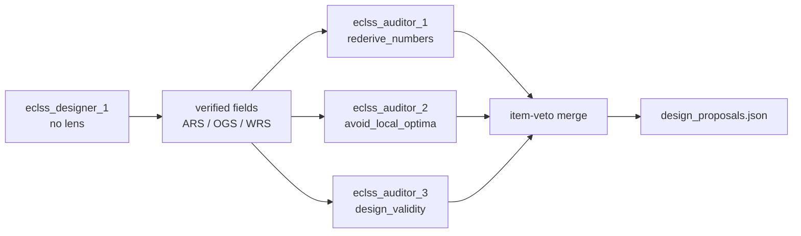

# Design team, audit panel, and storage

> **Scope**: `ssos_eclss_loop` **tool-use designer** only. Classic LLM debate and `labeled_rule_base` stay as they are.  
> **Origin**: independent lenses + adoption gate + ADK Storage slice (2026-08-30). Implemented.  
> Decision loop: [tool_use_design_agent.md](tool_use_design_agent.md). Actor / designer split: [post_run_design_agent.md](post_run_design_agent.md).

## Status

| ID | Work | State |
| --- | --- | --- |
| designer-one | One unlensed designer proposes | **done** |
| audit-panel | Three independent-lens auditors veto items at the adoption gate | **done** |
| item-veto | Drop only rejected fields; keep the rest. Never emit an empty proposal | **done** |
| local-optima | Second lens is `avoid_local_optima` | **done** |
| storage | Session / Artifact / Claims in `core/storage` (no ADK Runner port) | **done** |
| isolation | Auditors do not see each other. The designer does not see them | **done** |
| tests-docs | Isolation, item veto, empty-proposal guard, count=1 regression | **done** |

## Why

The tool-use default was a single designer for a long time. Putting the three thinking lenses on the designer side let a run fall into a basin — the same move again and again, often a WRS micro-tweak. Ranking-only adoption would have carried that basin into the next simulation.

The split is now:

```text
one designer (no lens)     = what to size
three auditors (lenses)    = which proposed items to drop
Python                     = evidence, re-sim, physics gate, item merge, record
```

Auditors do not invent a machine. An empty `changes` list leaves the iterate chain on the previous YAML, so a total veto still keeps the designer's fields.

## Multi-agent

This is the **tool-use path**. `design.team.count` defaults to **1**. Archetypes are empty. The persona is shared text only; no thinking lens is attached.

```text
eclss_designer_1 ── decision loop ── verified candidate
```

Even if `count > 1`, tool-use uses the first designer only. Extra ids remain on the classic LLM roster.

Config: [`src/scenario/ssos_eclss_loop/agents.yaml`](../../../src/scenario/ssos_eclss_loop/agents.yaml).

| Key | Value |
| --- | --- |
| `design.team.count` | `1` |
| `design.team.id_prefix` | `eclss_designer` |
| `design.team.archetypes` | `[]` |
| `design.team.bias_direction` | empty ⇒ derived from the objective (survive, then less CRITICAL, then smaller) |

Implementation: `_tool_use_propose` in [`src/scenario/agents/ssos_post_run_design.py`](../../../src/scenario/agents/ssos_post_run_design.py). A config with no `audit` block still ends after the one designer and writes `tool_trace.jsonl` at the run root.

## Audit agents

Auditors are outside `team.count`. `design.audit` owns the roster.

| Key | Value |
| --- | --- |
| `design.audit.enabled` | `true` (off when the block is absent) |
| `design.audit.count` | `3` |
| `design.audit.id_prefix` | `eclss_auditor` |
| `design.audit.archetypes` | `rederive_numbers` / `avoid_local_optima` / `design_validity` |



All three see the same proposal. None sees another auditor's conclusion. They run sequentially (no vLLM queue pile-up).

### Lenses

Defined in `ARCHETYPE_LENSES` in [`src/core/agents/persona.py`](../../../src/core/agents/persona.py).

| Lens | Job |
| --- | --- |
| `rederive_numbers` | Rebuild every quantity. Do not accept a figure you have not reconstructed |
| `avoid_local_optima` | Treat a repeated local tweak (WRS-only, and the like) as a basin and refuse it |
| `design_validity` | Ask whether the sized machine is buildable and operable |

`break_conclusion` remains so old YAML does not raise. The default second lens is `avoid_local_optima`.

### Contract

One JSON object each. No invented machine, field, or value.

```json
{"decision": "approve", "message": "...", "reasoning": "..."}
{"decision": "reject",
 "rejected_fields": ["plant_sim.wrs.max_feed_l_per_operation"],
 "message": "...", "reasoning": "..."}
```

`rejected_fields` must already be in the proposal and in `CAPACITY_KEYS`. Unknown ids are ignored. `adopt` or a missing decision is an abstain.

### Item merge

`integrate_audit_panel` in [`src/scenario/ssos_eclss_loop/design_ensemble.py`](../../../src/scenario/ssos_eclss_loop/design_ensemble.py):

1. Start from the designer's verified fields  
2. Drop the union of named `rejected_fields`  
3. If anything remains, adopt that  
4. If nothing would remain, keep the designer's fields so the next run has a proposal  
5. Dropping items, or keeping fields after a total veto, is `provisional_final` (the leftover machine was not re-simulated)  
6. All approve, or only abstains, keeps the designer's physics status  

| `decision_source` | Meaning |
| --- | --- |
| `tool_use_audit_panel` | no item dropped |
| `tool_use_audit_panel:item_veto` | some fields dropped |
| `tool_use_audit_panel:kept_to_proceed` | a total veto was blocked so the chain can continue |

The body is the designer message / reasoning, then the three write-ups. There is no fourth synthesizer LLM.

## Storage

The ADK Runner / LlmAgent / tool-use loop is not ported. Only the Storage / Service slice is. `core/` does not import `scenario/`.

Implementation: [`src/core/storage/`](../../../src/core/storage/).

```text
<run_dir>/
  design_storage/
    sessions/
      eclss_designer_1.jsonl
      eclss_auditor_1.jsonl
      eclss_auditor_2.jsonl
      eclss_auditor_3.jsonl
    claims.json
  design_review_report.json      # ArtifactStore writes at run_dir root
  candidate_rankings.json
```

| Object | ADK analogue | Job |
| --- | --- | --- |
| `SessionStore` | SessionService | append-only JSONL per `agent_id`. Peers do not read each other |
| `ArtifactStore` | ArtifactService | thin JSON / EventLog wrapper on the run directory |
| `ClaimsRegistry` | none (this repo's gate) | standing adopted fields, retract losers, sweep the body |

Claim phrases are namespaced ids and `key=value` / `key: value`. The local tail `candidate_001` is not used (it is a substring of every namespaced id). Skip tokens are `not adopted` / `withdrawn` / `[retracted]` / `this claim is retracted`. Standing phrases are not hits.

The sweep runs on the designer body first; audit findings are appended after. A finding that mentions a retracted phrase does not erase the integrated write-up.

## Implementation locations

| File | Role |
| --- | --- |
| `src/core/agents/persona.py` | lens text, including `avoid_local_optima` |
| `src/core/storage/` | Session / Artifact / Claims |
| `src/scenario/ssos_eclss_loop/agents.yaml` | designer 1 + audit 3 |
| `src/scenario/ssos_eclss_loop/design_ensemble.py` | brief, one-turn audit, item merge |
| `src/scenario/agents/ssos_post_run_design.py` | `_tool_use_propose` orchestration |
| `src/scenario/agents/ssos_tool_use_design.py` | designer decision loop, mostly untouched |
| `src/scenario/ssos_eclss_loop/design_tools.py` | `work_dir`; with audit on, the designer still writes at run_dir |

## Verification

| Test | What it checks |
| --- | --- |
| `tests/scenario/test_ssos_independent_design.py` | roster of three, item veto, empty-proposal guard, invented field ignored, abstain |
| `tests/scenario/test_ssos_tool_use_design.py` | auditor 2 does not see auditor 1's conclusion; designer has no lens text |
| `tests/core/test_design_storage.py` | session isolation, claims sweep |
| `tests/scenario/test_archetypes.py` | `avoid_local_optima` is known |

`python3 -m pytest tests/core/test_design_storage.py tests/scenario/test_ssos_independent_design.py tests/scenario/test_ssos_tool_use_design.py tests/scenario/test_archetypes.py`
