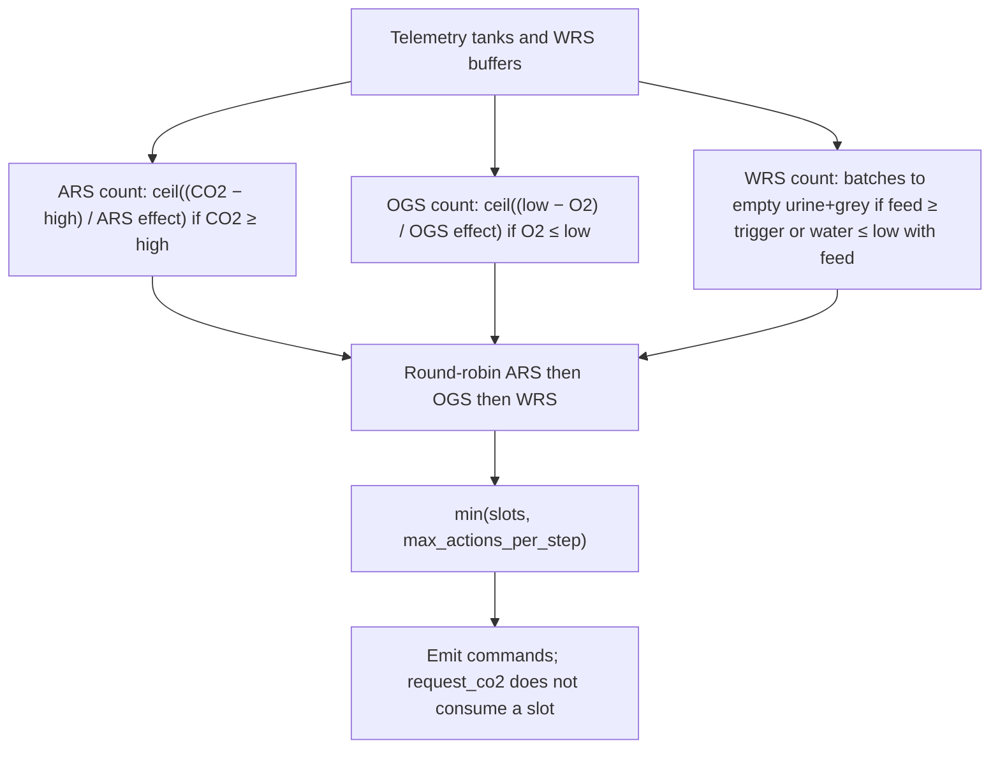

# Labeled rule-base ops (`ssos_eclss_loop`)

This is the design that shipped for **in-sim actors** in `labeled_rule_base`. Designers after the run are a separate team ([post-run design agent](post_run_design_agent.md)). LLM actors use the same `max_actions_per_step` key with a different meaning (cap on **who may command**, not a physics-sized request list).

Code: `src/scenario/agents/ssos_eclss_loop_team.py`. Thresholds: `src/scenario/ssos_eclss_loop/scenario.yaml`. Payloads: `src/scenario/ssos_eclss_loop/agents.yaml` `actor.policy`. Operator scenario page: [ssos_eclss_loop](../../scenario-ssos-eclss-loop.md). Plant physics: [Plant Sim backend](plant_sim_backend.md). Survival bands share the same YAML keys: [occupant survival](occupant_survival.md).

`labeled_rule_base` is scaffolding for a reproducible ops policy. Virtual-world pass/fail still comes from the simulator and verification thresholds, not from the rule text.

## Why earlier shapes failed

Three iterations landed in the same function (`_labeled_recovery`):

| Shape | What it did | Why it was wrong |
| --- | --- | --- |
| One-shot per subsystem | Fire ARS/OGS/WRS at most once per “episode”; ignore `max_actions_per_step` | Raising max did nothing. A tank could stay in WARNING after one action; the latch blocked retries. |
| Always fill max (pad) | Every step emit exactly `max_actions_per_step` actions (needed first, then pad ARS→OGS→WRS) | Forced work when tanks were SAFE. Max was no longer a cap. |
| **Current: sized request, then cap** | Count repeats needed to **leave WARNING/CRITICAL**, round-robin, then `min(needed, max)` | Matches llm’s “max is a ceiling”. Ops count scales with max when the plant actually needs more than one action. |

Dashboard symptom of the one-shot era: two runs with max 3 vs 9 produced the **same** `operational_command_count` (about one ARS + one OGS + one WRS per stressed step).

## Pipeline (each observation step)

```text
telemetry + health bands
  → count ARS / OGS / WRS needed to leave the bad band (or drain this step’s WRS feed)
  → round-robin interleave ARS → OGS → WRS
  → take the first max_actions_per_step slots
  → emit operational commands (optional request_co2 may piggyback on OGS)
  → backend applies commands in order
```

SAFE on all three resources → empty command list (no padding).



## Health bands vs ops triggers

Ops and survival use the **same** `thresholds` keys. Scenario defaults (50 occupants):

| Resource | SAFE | WARNING | CRITICAL |
| --- | --- | --- | --- |
| Cabin CO2 (kg) | < 2.0 | 2.0 to < 8.0 | ≥ 8.0 |
| O2 (kg) | > 6.0 | 1.0 to 6.0 | ≤ 1.0 |
| Product water (L) | > 50 | 25 to 50 | ≤ 25 |

`merge_labeled_policy_from_thresholds()` copies `co2_storage_high_kg`, `co2_storage_critical_kg`, `o2_storage_low_kg`, and `product_water_low_l` into `actor.policy` at run start. LLM prompts do **not** receive this policy.

## How many actions (physics-sized counts)

Counts are `ceil(deficit / effect_per_action)` with a tiny epsilon so equality with the band edge still requests at least one action. While the tank stays in the bad band, the **next step counts again**. `ars_invoked` / `ogs_invoked` still record last dispatch (cleared on SAFE, or if the last action did not improve the tank). They do **not** block a new sized request.

### ARS

Request while `co2_storage_kg ≥ co2_storage_high_kg`.

- Deficit: `(co2 − high) + ε` (must go strictly below HIGH).
- Effect (plant_sim, when `plant_sim` is on the team config): nameplate `capacity_kg_day × ars_operation_seconds / 86400 × (ars_goal.initial_co2_mass / reference_goal_co2_kg)`. Cabin inventory can still clip the real removal.
- Effect (LoopMock): `mock_dynamics.ars_co2_reduction_kg` scaled by goal / `ars_reference_co2_mass_kg`.
- CRITICAL (`co2 ≥ co2_storage_critical_kg`): payload `initial_co2_mass × 1.5` and the effect estimate uses that escalated mass.

### OGS

Request while `o2_storage_kg ≤ o2_storage_low_kg`.

- Deficit: `(low − o2) + ε` (must go strictly above LOW).
- Effect: `min(ogs_goal.input_water_mass / WATER_PER_O2, plant OGS quantum)` when plant_sim config is present; otherwise water / `WATER_PER_O2` only.

Optional `request_co2` before OGS if `request_co2_before_ogs: true` (default **false**) and `co2_requested` is still false. At most one feedstock call until OGS re-arms (O₂ back above LOW). Extra OGS in the same step do not request again. The service call does **not** consume a `max_actions_per_step` slot. On LoopMock, `true` can double-debit CO₂ with OGS Sabatier (no intermediate buffer).

### WRS

Request when urine+grey ≥ `policy.wrs_feed_trigger_l` (default 0.5 L), **or** product water ≤ `product_water_low_l` **and** there is feed this step.

Count is how many `wrs_goal.urine_volume` batches empty the **current** urine and grey buffers (`_wrs_batches_to_empty`, capped at 64). Extra WRS with an empty buffer would not raise the product tank, so the rule does not invent feed.

Product-water WARNING with **zero** urine/grey → zero WRS this step. Recovery waits for metabolism to refill the buffers.

## Cap and interleave

`agents.actor.max_actions_per_step` is a **ceiling**.

1. Build counts `{ars, ogs, wrs}`.
2. Round-robin: ARS, OGS, WRS, ARS, … each subsystem only as many times as its count.
3. Keep the first `max_actions_per_step` slots.

Example: counts ARS=4, OGS=2, WRS=1 and max=5 → `ars, ogs, wrs, ars, ogs`.

### llm vs labeled

| | llm | labeled_rule_base |
| --- | --- | --- |
| What max counts | Actors in the rotating action window | Subsystem actions (ARS/OGS/WRS) |
| Clamp to `actor.team.count` | Yes (cannot have more action reps than people) | No (one surviving operator may issue several commands) |
| Empty when SAFE | Agents may still skip | No operational commands |

`issued_by` rotates with `eclss_actor_{(start + slot) % N}`. If the roster shrinks, slots wrap on remaining ids.

## Config

```yaml
# scenario.yaml
thresholds:
  co2_storage_high_kg: 2.0
  co2_storage_critical_kg: 8.0
  o2_storage_low_kg: 6.0
  product_water_low_l: 50.0
agents:
  actor:
    max_actions_per_step: 2  # labeled: action cap; llm: actor cap (scenario default)
```

```yaml
# agents.yaml — labeled payloads only (llm does not read policy)
actor:
  policy:
    request_co2_before_ogs: false
    wrs_feed_trigger_l: 0.5
    ars_goal:
      initial_co2_mass: 1.8
    ogs_goal:
      input_water_mass: 0.15
    wrs_goal:
      urine_volume: 2.0
```

CLI: `--set agents.actor.max_actions_per_step=8`. llm clamps that value to `actor.team.count`; labeled does not. `scenario_run` copies `plant_sim`, `simulation`, `mock_dynamics`, and `thresholds` onto the actor config so yield estimates can see plant_sim when that YAML block is present.

`ogs_goal.input_water_mass` missing from policy falls back to `0.015` kg in code; the repo `agents.yaml` default is `0.15`.

## Related

- [ssos_eclss_loop scenario](../../scenario-ssos-eclss-loop.md)
- [Occupant survival](occupant_survival.md)
- [Plant Sim backend](plant_sim_backend.md)
- [Post-run design agent](post_run_design_agent.md)
- [architecture.md](../../architecture.md)

## Tests

`tests/scenario/test_ssos_eclss_loop_team.py` — repeats to exit a band, WRS drain batches, cap, `request_co2` not consuming a slot, labeled max not clamped to team size.

`tests/scenario/test_ssos_eclss_loop.py` — mock labeled run still starts ARS when cabin CO2 crosses HIGH (default growth from 1.3 kg).
