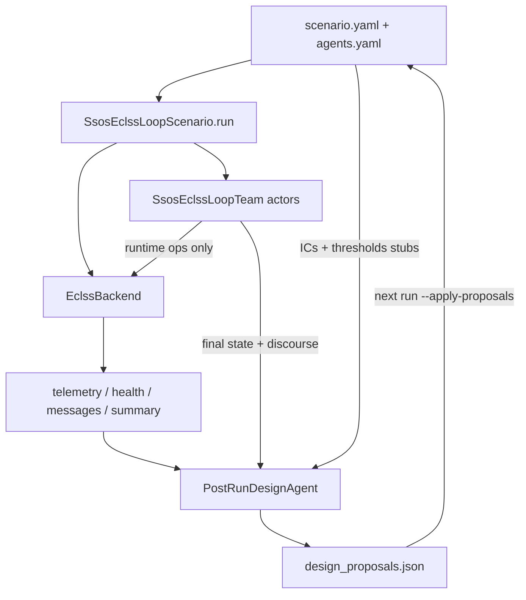

# Post-run design agent — actor / designer split

> **Scope**: `ssos_eclss_loop` only. `scrubber_degradation` stays as-is (same team emits post-run proposals; `--agents-mode`).  
> **Source**: Cursor plan “Post-run design agent” (`.cursor/plans/post-run_design_agent_9cfab49b.plan.md`). **Implemented** (`feat/post-run-design-agent`).  
> Operator steps: [scenario-ssos-eclss-loop.md](../../scenario-ssos-eclss-loop.md), [cli.md](../../cli.md). Occupant attrition: [occupant_survival.md](occupant_survival.md).

Naming: **actor** (in-sim operational agents) and **designer** (post-run design agents).

## Status (plan todos)

| ID | Work | State |
| --- | --- | --- |
| branch | `feat/post-run-design-agent` | **done** |
| config-cli | Nested `agents.actor` / `agents.design` and `--actor-mode` / `--design-mode` | **done** |
| design-agent | `PostRunDesignAgent` (4 designers) + `DesignReviewBundle` | **done** |
| decouple-sim-team | Remove post-run design from `SsosEclssLoopTeam`; call from `scenario_run` | **done** |
| tests | Labeled closed loop, mixed modes, skip empty proposals | **done** |
| docs | AGENTS / architecture / cli / ssos scenario ja/en | **done** |
| unbounded-changes | No count cap on one representative’s `changes` | **done** (added after the plan) |
| survival-bind | Lock `plant_sim.crew.size` to `actor.team.count` | **done** (merged with occupant survival on main) |

## Why

`SsosEclssLoopTeam` owned both runtime operations and post-run design. Making design smarter would have required a large model on every actor. Split the roles:

| Kind | When | Role | id_prefix | Model (current default; may change) |
| --- | --- | --- | --- | --- |
| actor | Each step | Discourse + ARS/OGS/WRS operational commands only | `eclss_actor` → `eclss_actor_1` … `_50` | vLLM `qwen3-8b`; `labeled_rule_base` allowed |
| designer | **After the run only** | Read ICs, telemetry, and actor final state; write `design_proposals.json` | `eclss_designer` → `eclss_designer_1` … `_4` | vLLM `qwen3-8b`; `max_tokens: 2048` |

Pass/fail stays deterministic in `src/scenario/ssos_eclss_loop/health.py`. The design LLM does not judge. LLM / Persona stay out of `environment/`.

On `plant_sim`, occupants and **actors** shrink together. **Designers do not shrink** (they still propose as `eclss_designer_*` after a wipe).



## Config and CLI (as built)

`scenario.yaml`:

```yaml
agents:
  actor:
    mode: none                 # none | labeled_rule_base | llm
    max_actions_per_step: 2    # llm actors only; labeled ignores this
  design: {}
    # omit design.mode to inherit actor.mode; set none to disable post-run design
```

`agents.yaml` notes:

- Actor `team.count: 50` must match `plant_sim.crew.size`
- Actor `policy` is the labeled operational profile (llm does not read it)
- `design.llm` is independent; do not inherit the actor model when omitted

Inheritance: omitted `agents.design.mode` equals `agents.actor.mode`. The 2-run smoke needs only `--actor-mode labeled_rule_base` for labeled design. `actor.mode: none` with labeled/llm design is allowed.

CLI (ssos):

- `--actor-mode` → `agents.actor.mode`
- `--design-mode` → `agents.design.mode`
- `--llm-provider` / `--llm-model` stamp both sides when both are `llm`. Keep distinct URLs/models with `--set agents.actor.llm.base_url=` / `--set agents.design.llm.base_url=` (same for `.model`)
- `--agents-mode` — deprecated alias for `--actor-mode` on ssos. Specifying both is an error. Scrubber still uses `--agents-mode` only

Killer combo: `--actor-mode labeled_rule_base --design-mode llm`.

```bash
python3 -m tools.cli run ssos_eclss_loop --backend mock --actor-mode labeled_rule_base --steps 20 \
  --run-id cloud-smoke-run1
```

## Where it lives

| Path | Role |
| --- | --- |
| `src/scenario/ssos_eclss_loop/agent_config.py` | Normalize nested config and resolve modes. Legacy `agents.mode` lifts onto actor |
| `src/scenario/agents/ssos_post_run_design.py` | `PostRunDesignAgent` + `DesignReviewBundle`. Does not subclass `Team`. No `run_step` |
| `src/scenario/ssos_eclss_loop/scenario_run.py` | After the loop, `design_agent.propose(bundle)`. `bind_plant_sim_crew_and_team` uses `actor.team.count` |
| `src/scenario/agents/ssos_eclss_loop_team.py` | Actors: operations only. `set_crew_alive` tracks occupants |
| `src/scenario/ssos_eclss_loop/design_proposals.py` | Rule path still calls `build_design_proposals_from_run` |

In `llm` mode, all designers deliberate once, then **one representative** emits `changes`. There is no count cap (skip the file when empty). Labeled `proposed_by` is `eclss_designer_1`. **Do not put policy numbers in the prompt.**

`summary` includes `actor_mode`, `design_mode`, `design_proposed_by`. `agents_mode` stays equal to `actor_mode` for dashboard compatibility.

## Out of scope (still not done)

- Splitting scrubber
- Changing proposal schema or `--apply-proposals` meaning
- Adding `graph_rewire` to labeled design
- Pulling requirements from One Piece / expanding provenance
- Pass/fail judgment by the design LLM

## Related

- [scenario-ssos-eclss-loop.md](../../scenario-ssos-eclss-loop.md)
- [architecture.md](../../architecture.md)
- [AGENTS.md](../../AGENTS.md)
- [Homogeneous agent team](../agents/homogeneous_agent_team_plan.md)
- [Occupant survival](occupant_survival.md)
- [SSOS ECLSS connection plan](ssos_eclss_loop_connection_plan.md)
