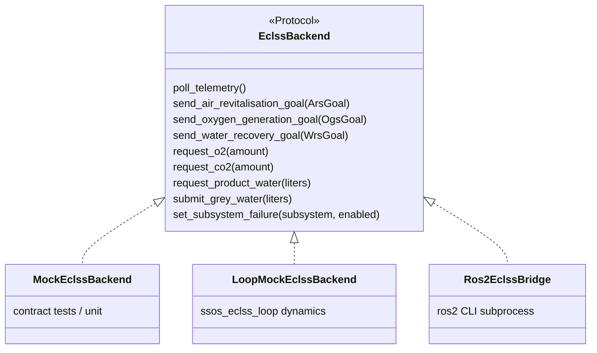
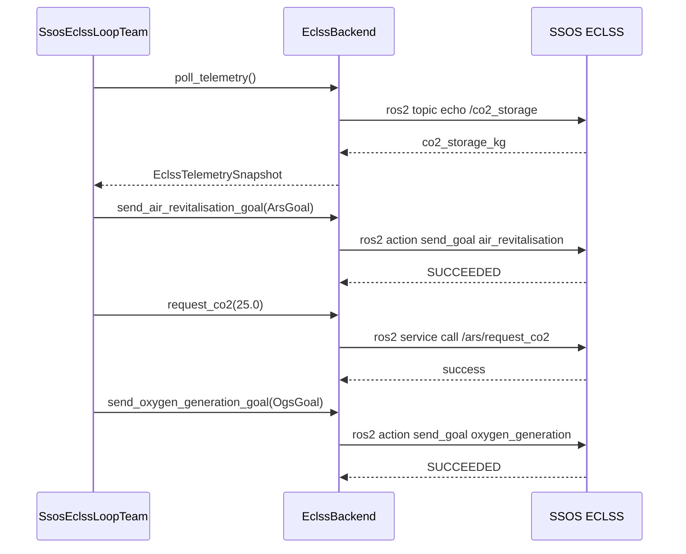

> Japanese: [../ja/ssos/eclss-integration.md](../ja/ssos/eclss-integration.md)

# ECLSS Integration

Operate SSOS **ARS** (air revitalization), **OGS** (oxygen generation), and **WRS** (water recovery) via the `EclssBackend` Protocol. The source of truth for constants is `src/environment/ssos/eclss_topics.py`.

---

## Launch

| Use case | Command | GUI |
| --- | --- | --- |
| **Headless (recommended)** | `ros2 launch space_station eclss.launch.py` | No |
| Container shortcut | `bash /root/ssos-eclss-headless.sh` | No |
| With Crew (reference) | `ros2 launch space_station_eclss eclss.launch.py` | Yes |

Constant: `LAUNCH_HEADLESS_ECLSS = "space_station/eclss.launch.py"`

---

## ROS 2 interface reference

### Actions

| Graph name | Type (current Jazzy) | Python constant |
| --- | --- | --- |
| `air_revitalisation` | `space_station_interfaces/action/AirRevitalisation` | `ACTION_AIR_REVITALISATION` |
| `oxygen_generation` | `space_station_interfaces/action/OxygenGeneration` | `ACTION_OXYGEN_GENERATION` |
| `water_recovery_systems` | `space_station_interfaces/action/WaterRecovery` | `ACTION_WATER_RECOVERY` |

!!! important "Action type prefix"
    Before Phase 1a we assumed `space_station_eclss/action/...`, but on the **current SSOS Jazzy image `space_station_interfaces`** is correct. Type mismatches are the main cause of goals waiting forever ([Troubleshooting](troubleshooting.md)).

### Services

| Service | Type | Method |
| --- | --- | --- |
| `/ogs/request_o2` | `space_station_interfaces/srv/O2Request` | `request_o2(amount)` |
| `/ars/request_co2` | `space_station_interfaces/srv/Co2Request` | `request_co2(amount)` |
| `/wrs/product_water_request` | `space_station_interfaces/srv/RequestProductWater` | `request_product_water(liters)` |
| `/grey_water` | `space_station_interfaces/srv/GreyWater` | `submit_grey_water(liters)` |

### Telemetry Topics

| Topic | Type | Field |
| --- | --- | --- |
| `/co2_storage` | `std_msgs/Float64` | CO₂ storage [kg] |
| `/o2_storage` | `std_msgs/Float64` | O₂ storage [kg] |
| `/wrs/product_water_reserve` | `std_msgs/Float64` | Potable water reserve [L] |
| `/ars/diagnostics` | diagnostic | ARS diagnostics |
| `/ogs/diagnostics` | diagnostic | OGS diagnostics |
| `/wrs/diagnostics` | diagnostic | WRS diagnostics |

### Fault injection (Self Diagnosis)

| Topic | Type | Purpose |
| --- | --- | --- |
| `/ars/self_diagnosis` | `std_msgs/Bool` | ARS fault simulation |
| `/ogs/self_diagnosis` | `std_msgs/Bool` | OGS fault |
| `/wrs/self_diagnosis` | `std_msgs/Bool` | WRS fault |

Published via `set_subsystem_failure("ars"|"ogs"|"wrs", enabled=True)`.

---

## Backend implementations



| Implementation | File | Purpose |
| --- | --- | --- |
| `MockEclssBackend` | `mock_eclss_backend.py` | pytest / Phase 1b contract |
| `LoopMockEclssBackend` | `scenario/ssos_eclss_loop/loop_mock_backend.py` | Scenario simplified dynamics |
| `Ros2EclssBridge` | `ros2_eclss_bridge.py` | SSOS Docker live graph |

### Ros2EclssBridge design

- **CLI-first**: runs `ros2 topic echo`, `ros2 action send_goal`, `ros2 service call` via subprocess. No extra pip deps inside the container.
- **Jazzy output handling**: parses service responses as YAML or Python repr (Phase 1b fix).
- **Timeouts**: `action_timeout_s` (default 120s), `topic_timeout_s` (default 15s).

---

## Goal types (Python dataclass)

### ArsGoal

```python
ArsGoal(
    initial_co2_mass=1800.0,
    initial_moisture_content=25.0,
    initial_contaminants=5.0,
)
```

### OgsGoal

```python
OgsGoal(
    input_water_mass=15.0,
    iodine_concentration=2.0,
)
```

### WrsGoal (Phase 2)

```python
WrsGoal(urine_volume=2.0)
```

---

## Smoke tests

| Phase | Script | Module | Verification |
| --- | --- | --- | --- |
| 1a | `scripts/run_ssos_eclss_smoke.sh` | `scripts.ssos_eclss_ars_smoke` | ARS action + CO₂ topic |
| 1b | `scripts/run_ssos_eclss_1b_smoke.sh` | `scripts.ssos_eclss_1b_smoke` | + OGS + `request_co2` + Sabatier signal |
| 2 | `scripts/run_ssos_eclss_2_smoke.sh` | `scripts.ssos_eclss_2_smoke` | + WRS + product/grey water + water tradeoff |

### Phase 1b pass criteria

- `poll_telemetry()` reads `/co2_storage` and `/o2_storage`
- `oxygen_generation` goal SUCCEEDED
- `request_co2` succeeds
- Report JSON includes `sabatier_signal: true` (O₂/CO₂ Sabatier conflict)

### Phase 2 pass criteria

- `water_recovery_systems` goal SUCCEEDED
- `request_product_water` / `submit_grey_water` succeed
- `product_water_delta` changes after OGS run
- `water_tradeoff_signal: true` (potable water vs electrolysis water)

---

## Example sequence (ARS → CO₂ request → OGS)



---

## Manual checks (inside container)

```bash
source /opt/ros/jazzy/setup.bash
source ~/ssos_ws/install/setup.bash

ros2 action list -t | grep -E 'air_revitalisation|oxygen|water_recovery'
ros2 topic echo /co2_storage std_msgs/msg/Float64 --once
ros2 node info /air_revitalisation | grep -A1 'Action Servers'

# Confirm Action type
ros2 action send_goal /air_revitalisation \
  space_station_interfaces/action/AirRevitalisation \
  "{initial_co2_mass: 1800.0, initial_moisture_content: 25.0, initial_contaminants: 5.0}"
```

---

## Related

- [API reference — EclssBackend](api-reference.md#eclssbackend)
- [ssos_eclss_loop scenario](scenario-eclss-loop.md)
