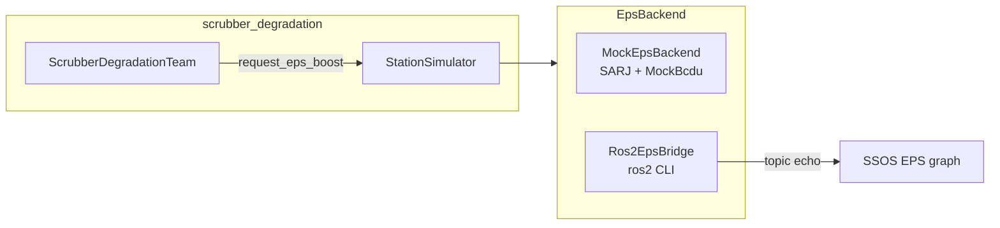

> Japanese: [../ja/ssos/eps-integration.md](../ja/ssos/eps-integration.md)

# EPS Integration

Read SSOS **EPS** (Electrical Power System) — solar arrays (SARJ mock) and BCDU — via the `EpsBackend` Protocol, and map `request_eps_boost` using an interim approach.

In the `scrubber_degradation` scenario, ECLSS stays Mock-only; EPS can switch between `mock` and `ssos_eps`.

---

## Why topic_map is needed

Contract topic names in `engineering_agents` (`eps_topics.py`) do not always match SSOS main **live topic names**. `topic_map.py` treats SSOS live names as authoritative.

| Contract name (eps_topics.py) | SSOS live topic | Type |
| --- | --- | --- |
| `/solar/voltage` | **`/solar_controller/ssu_voltage_v`** | `std_msgs/Float64` |
| — | `/solar_controller/ssu_power_w` | `std_msgs/Float64` |
| — | `/solar_controller/sun_beta_deg` | `std_msgs/Float64` |
| `/bcdu/status` | `/bcdu/status` | `space_station_interfaces/msg/BCDUStatus` |
| `/eps/diagnostics` | `/eps/diagnostics` | `diagnostic_msgs/DiagnosticStatus` |
| `/bcdu/operation` | **Not implemented** | — |

---

## Launch

| Use case | Command |
| --- | --- |
| Full station (solar + EPS + ECLSS) | `ros2 launch space_station space_station.launch.py` |
| EPS only | `ros2 launch space_station eps.launch.py` |

Constants: `LAUNCH_HEADLESS_STATION`, `LAUNCH_EPS_ONLY` (`topic_map.py`)

Nodes started (EPS launch):

1. `battery_manager_node` — 24 BMS
2. `bcdu_node` — auto charge/discharge from SSU voltage thresholds
3. `ddcu_device`, `mbsu_device`

---

## BCDUStatus fields

SSOS message (`space_station_interfaces/msg/BCDUStatus`):

| Field | Description |
| --- | --- |
| `mode` | `idle` / `charging` / `discharging` / `fault` / `safe` |
| `bus_voltage` | Bus voltage [V] |
| `current_draw` | Current [A] (+ = discharge) |
| `fault` | Fault latch |
| `fault_message` | Fault message |

The `BcduStatus` dataclass in `engineering_agents` has mock-only `support_w` and `support_steps_remaining`; the bridge supplements these from SSOS reads plus a local timer.

---

## Backends



| Implementation | Selection | File |
| --- | --- | --- |
| `MockEpsBackend` | `eps.backend: mock` (default) | `mock_eps_backend.py` |
| `Ros2EpsBridge` | `eps.backend: ssos_eps` (aliases `ros2`, `ssos`) | `ros2_eps_bridge.py` |

`build_eps_backend()` lives in `src/scenario/runner.py`.

### scenario.yaml example

```yaml
eps:
  backend: mock          # default
  # backend: ssos_eps    # SSOS Docker ROS2 bridge
  sarj:
    beta_angle_deg: 45.0
```

---

## request_eps_boost mapping (Phase 3a interim)

Because `/bcdu/operation` Action is **not implemented** in SSOS, the bridge uses this interim approach:

```mermaid
sequenceDiagram
  participant Agent as ScrubberDegradationTeam
  participant SS as StationSimulator
  participant Bridge as Ros2EpsBridge
  participant SSOS as SSOS BCDU

  Agent->>SS: apply_command(REQUEST_EPS_BOOST, 120W)
  SS->>Bridge: request_discharge(120, duration=5)
  Bridge->>Bridge: arm 120W × 5 steps (local timer)
  Bridge-->>SS: DischargeResult(success)

  loop each step
    SS->>Bridge: tick_bcdu() / consume_scheduled_support()
    Bridge->>SSOS: ros2 topic echo /bcdu/status
    SSOS-->>Bridge: mode=discharging, current_draw, bus_voltage
    Bridge->>Bridge: support_w = current_draw × bus_voltage
    Bridge-->>SS: support_w (live preferred; armed value when not discharging)
    SS->>SS: ECLSS power_margin_w += support_w
  end
```

| Phase | Approach | Status |
| --- | --- | --- |
| **3a (current)** | While BCDU is `discharging`, add `current_draw × bus_voltage` as `support_w` to ECLSS; bridge-side duration timer | ✅ Implemented |
| 3b | Direct call to `/battery/battery_bms_*/discharge` services | Not started |
| 3c | Add `/bcdu/operation` Action upstream in SSOS | Upstream PR required |

### Trigger conditions (scrubber_degradation)

- `power_status == CRITICAL`
- `eps_support_steps_remaining == 0`
- `agents.yaml`: `request_eps_boost_on_power_critical: true`
- duration: `design_parameters.eps_support_duration_steps` (default 5 steps)
- output: `eps_support_w` reflected in telemetry → `eps_telemetry.jsonl`

---

## Smoke test

```bash
# Terminal 1: start solar + EPS inside SSOS
docker exec -it ssos bash
ros2 launch space_station space_station.launch.py
# or eps.launch.py

# Terminal 2: host repo root
./scripts/run_ssos_eps_smoke.sh
./scripts/run_ssos_eps_smoke.sh --arm-discharge-w 100 --arm-duration-steps 3
./scripts/run_ssos_eps_smoke.sh --json-out /tmp/eps_smoke.json
```

Module: `scripts.ssos_eps_smoke` — reads solar/BCDU topics, arms `request_discharge`, verifies estimated discharge W.

!!! note "ROS_DOMAIN_ID"
    The EPS smoke wrapper exports `ROS_DOMAIN_ID=${ROS_DOMAIN_ID:-23}`. Match the **same domain** on the SSOS launch side.

---

## Manual checks (inside container)

```bash
source /opt/ros/jazzy/setup.bash
source ~/ssos_ws/install/setup.bash
export ROS_DOMAIN_ID=23   # adjust for your environment

ros2 topic list | grep -E 'solar|bcdu|eps|battery'
ros2 topic echo /bcdu/status space_station_interfaces/msg/BCDUStatus --once
ros2 topic echo /solar_controller/ssu_voltage_v std_msgs/msg/Float64 --once
```

---

## Known limitations

| Limitation | Description |
| --- | --- |
| `/bcdu/operation` not implemented | Discharge depends on SSOS auto thresholds + bridge timer |
| `support_w` not native | Bridge estimates watts + duration timer |
| Mac host DDS | Container execution only |
| ECLSS separation | EPS not integrated into `ssos_eclss_loop` at Phase 3 |

---

## Related

- [API reference — EpsBackend](api-reference.md#epsbackend)
- [Troubleshooting](troubleshooting.md)
