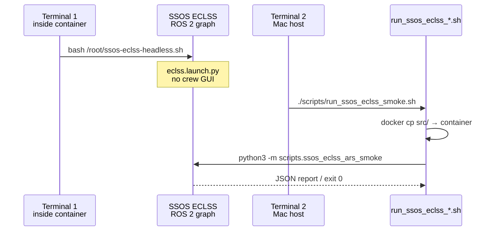

> Japanese: [../../ja/ssos/quickstart.md](../../ja/ssos/quickstart.md)

# Quickstart

Shortest path to SSOS integration smoke tests and the `ssos_eclss_loop` scenario. **The Mac host has no ROS 2**, so SSOS operations run inside the Docker container.

---

## Prerequisites

### 1. SSOS Docker container

| Item | Typical value |
| --- | --- |
| Container name | `ssos` (override with `SSOS_CONTAINER`) |
| Image | `ghcr.io/space-station-os/space_station_os:latest` |
| ROS distro | **Jazzy** (`/opt/ros/jazzy/setup.bash`) |
| Workspace | `~/ssos_ws/install/setup.bash` |

```bash
docker ps --format '{{.Names}}\t{{.Image}}'
# ssos   ghcr.io/space-station-os/space_station_os:latest
```

If the container is missing:

```bash
docker run -it --name ssos ghcr.io/space-station-os/space_station_os:latest
```

### 2. engineering_agents dev environment

```bash
cd /path/to/engineering_agents
pip install -e ".[dev]"
pytest tests/environment/   # regression check (expect ~78 passed)
```

### 3. Environment variables (optional)

| Variable | Default | Purpose |
| --- | --- | --- |
| `SSOS_CONTAINER` | `ssos` | Target container for smoke wrappers |
| `SSOS_CONTAINER_REPO` | `/tmp/engineering_agents` | Sync destination inside container |
| `ROS_DOMAIN_ID` | ECLSS: unset / EPS: `23` | DDS domain (EPS smoke wrapper exports 23) |
| `SSOS_ECLSS_BACKEND` | — | Backend override for `ssos_eclss_loop` (`mock` \| `ros2`) |

!!! warning "Mac Docker and DDS"
    Mac Docker Desktop does not support `--network=host`. Direct DDS from the Mac host to the SSOS ROS graph is **not recommended**. Smoke wrappers use `docker cp` + `docker exec` to run inside the container.

---

## Two-terminal workflow (ECLSS smoke)



### Terminal 1 — headless ECLSS

```bash
docker exec -it ssos bash
bash /root/ssos-eclss-headless.sh
# Stop with Ctrl+C. Keep running while smoke tests execute.
```

Equivalent command:

```bash
ros2 launch space_station eclss.launch.py
```

### Terminal 2 — Phase 1a ARS smoke (host repo root)

```bash
cd /path/to/engineering_agents
chmod +x scripts/run_ssos_eclss_smoke.sh   # first time only
./scripts/run_ssos_eclss_smoke.sh
# Save JSON: ./scripts/run_ssos_eclss_smoke.sh --json-out /tmp/eclss_smoke.json
```

**Pass criteria**: exit code 0, `/co2_storage` and `/ars/diagnostics` exist, `air_revitalisation` goal SUCCEEDED.

### Phase 1b / 2 smoke (same Terminal 1 prerequisite)

```bash
./scripts/run_ssos_eclss_1b_smoke.sh    # ARS + OGS + Sabatier signal
./scripts/run_ssos_eclss_2_smoke.sh     # + WRS + potable water tradeoff
```

---

## EPS smoke (Phase 3)

EPS requires a **full station or EPS launch**. ECLSS headless alone may not expose solar/BCDU topics.

```bash
# Terminal 1 (example: full station — inside container)
ros2 launch space_station space_station.launch.py
# Or EPS only: ros2 launch space_station eps.launch.py

# Terminal 2 (host)
./scripts/run_ssos_eps_smoke.sh
./scripts/run_ssos_eps_smoke.sh --arm-discharge-w 100 --arm-duration-steps 3
```

---

## ssos_eclss_loop scenario (Mock — no ROS)

```bash
cd /path/to/engineering_agents
PYTHONPATH=src python3 -m scenario.ssos_eclss_loop.scenario_run --backend mock
PYTHONPATH=src python3 -m scenario.ssos_eclss_loop.scenario_run \
  --backend mock --agents-mode labeled_rule_base --steps 8
```

Output: `src/experiments/results/ssos_eclss_loop_baseline/` (`telemetry.jsonl`, `health_metrics.jsonl`, `summary.json`)

---

## ssos_eclss_loop (ROS2 — inside container)

After starting ECLSS headless, inside the container:

```bash
source /opt/ros/jazzy/setup.bash
source ~/ssos_ws/install/setup.bash
cd /tmp/engineering_agents   # or docker cp destination
PYTHONPATH=src SSOS_ECLSS_BACKEND=ros2 \
  python3 -m scenario.ssos_eclss_loop.scenario_run --backend ros2
```

---

## Browse docs locally

MkDocs Material local preview:

```bash
pip install -e ".[dev]"
mkdocs serve
# → http://127.0.0.1:8000/en/ssos/  (SSOS integration section)
```

Static build:

```bash
mkdocs build
# Output: site/ — deploy to any static host or GitHub Pages
```

On GitHub you can browse `docs/en/ssos/index.md` directly (Mermaid renders natively).

---

## Next steps

- [ECLSS integration](eclss-integration.md) — Action types and Service details
- [EPS integration](eps-integration.md) — `request_eps_boost` mapping
- [Troubleshooting](troubleshooting.md) — common failure patterns
