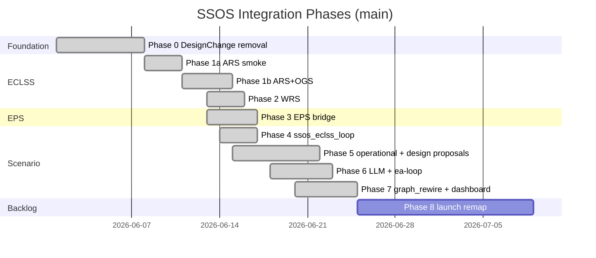

> Japanese: [../../ja/ssos/roadmap.md](../../ja/ssos/roadmap.md)

# Roadmap — Phase 0–8

SSOS integration progress on `main` and backlog items. See also [development-plan.md](../development-plan.md).

---

## Phase Summary

| Phase | Contents | Status | Completion Criteria |
| --- | --- | --- | --- |
| **0** | Remove runtime `DesignChange` | ✅ **Complete** | All `scrubber_degradation` tests pass |
| **1a** | ARS headless smoke | ✅ **Complete** | `run_ssos_eclss_smoke.sh` exit 0 |
| **1b** | ARS + OGS bridge | ✅ **Complete** | Sabatier signal in telemetry / smoke JSON |
| **2** | + WRS | ✅ **Complete** | `run_ssos_eclss_2_smoke.sh`, water tradeoff signal |
| **3** | EPS ROS2 integration | ✅ **Complete** | `EpsBackend`, `run_ssos_eps_smoke.sh`, `eps.backend` switch |
| **4** | `ssos_eclss_loop` + `SsosEclssLoopTeam` | ✅ **Complete** | mock/ros2 scenario runs, telemetry JSONL |
| **5** | `operational_proposals.json` + `design_proposals.json` + `--apply-proposals` | ✅ **Complete** | Post-run proposals and next-run apply |
| **6** | LLM agents + Docker `ea-loop` (ros2 / Ollama defaults) | ✅ **Complete** | Container loop with LLM mode |
| **7** | Client `graph_rewire`, `Team` ABC, SSOS dashboard views | ✅ **Complete** | Remap client + dashboard |
| **8** | ROS launch remap + gateway | 📋 **Backlog** | Apply `graph_rewire` at launch ([BL-003](../memo/backlog.md#bl-003-ros-launch-remap-phase-8--graph_rewire-a)) |



---

## Phase 0 — DesignChange Removal ✅

| Item | Status |
| --- | --- |
| `SimulatorProtocol.apply_design_change` | Removed |
| `scrubber_degradation` | Mock frozen; post-run `design_proposals.json` retained |
| New proposal formats | `operational_proposals.json`, `design_proposals.json` (`ssos_graph`) — Phase 5 |

---

## Phase 1a — ARS Smoke ✅

**Deliverables**

| File | Role |
| --- | --- |
| `src/environment/ssos/eclss_topics.py` | Action/Service/Topic constants |
| `src/environment/ssos/eclss_types.py` | Goal / Report types |
| `src/scripts/ssos_eclss_ars_smoke.py` | In-container smoke |
| `scripts/run_ssos_eclss_smoke.sh` | Host wrapper |

---

## Phase 1b — ARS + OGS ✅

**Deliverables**

| File | Role |
| --- | --- |
| `src/environment/ssos/eclss_backend.py` | Protocol |
| `src/environment/ssos/mock_eclss_backend.py` | Mock |
| `src/environment/ssos/ros2_eclss_bridge.py` | CLI bridge |
| `src/scripts/ssos_eclss_1b_smoke.py` | 1b smoke |
| `scripts/run_ssos_eclss_1b_smoke.sh` | Wrapper |

---

## Phase 2 — WRS ✅

**Deliverables**

| File | Role |
| --- | --- |
| `ros2_eclss_bridge.py` (extended) | WRS action + product/grey water service |
| `src/scripts/ssos_eclss_2_smoke.py` | Phase 2 smoke |
| `scripts/run_ssos_eclss_2_smoke.sh` | Wrapper |

Verification: potable vs electrolysis water tradeoff, `water_tradeoff_signal`

---

## Phase 3 — EPS ✅

**Deliverables**

| File | Role |
| --- | --- |
| `eps_backend.py` | Protocol |
| `mock_eps_backend.py` | Mock wrapper |
| `ros2_eps_bridge.py` | CLI bridge |
| `topic_map.py` | SSOS live topic map |
| `message_adapters.py` | BCDU parsing |
| `station_simulator.py` | Refactored to use `EpsBackend` |
| `src/scripts/ssos_eps_smoke.py` | EPS smoke |
| `scripts/run_ssos_eps_smoke.sh` | Wrapper |

`scenario/runner.py`: `build_eps_backend()` — `mock` \| `ssos_eps`

---

## Phase 4 — ssos_eclss_loop ✅

**Deliverables**

| File | Role |
| --- | --- |
| `src/scenario/ssos_eclss_loop/scenario.yaml` | Requirement stub |
| `src/scenario/ssos_eclss_loop/agents.yaml` | Agent configuration |
| `src/scenario/ssos_eclss_loop/scenario_run.py` | Runner |
| `src/scenario/ssos_eclss_loop/loop_mock_backend.py` | Mock dynamics |
| `src/scenario/ssos_eclss_loop/health.py` | Deterministic health |
| `src/scenario/agents/ssos_eclss_loop_team.py` | Crew replacement team |

---

## Phase 5 — Operational + Design Proposals ✅

| Item | Description |
| --- | --- |
| `operational_proposals.json` | Post-run proposals: `set_parameter` / `action_profile` / `service_config` |
| `design_proposals.json` | `design_domain: ssos_graph` topology proposals |
| `--apply-proposals` | Apply proposals on the next run |

### Action/Service Proposal Applicability

| Proposal type | Application method | C++ rebuild |
| --- | --- | --- |
| `action_profile` | `ActionClient.send_goal()` | Not required |
| `service_config` | `ServiceClient.call()` | Not required |
| `set_parameter` | Launch YAML substitution | Not required (read at startup) |
| New Action/Service/BT | SSOS upstream PR | **Required** |

---

## Phase 6 — LLM + ea-loop ✅

| Item | Description |
| --- | --- |
| LLM agent mode | `agents.mode: llm` with Ollama |
| Docker `ea-loop` | Container entry with ros2 / Ollama defaults |
| `run_ssos_eclss_loop.sh` | Host wrapper for container runs |

---

## Phase 7 — graph_rewire + Dashboard ✅

| Item | Description |
| --- | --- |
| Client `graph_rewire` | Remap SSOS graph edges from design proposals |
| `Team` ABC | Shared team interface for scrubber and ssos scenarios |
| SSOS dashboard views | Storage kg / operational timeline |

---

## Phase 8 — Backlog 📋

| Item | Description |
| --- | --- |
| ROS launch remap | Apply `graph_rewire` at launch time ([BL-003](../memo/backlog.md#bl-003-ros-launch-remap-phase-8--graph_rewire-a)) |
| Gateway integration | ROS graph gateway for remap ([investigation memo](../memo/ssos_eclss_loop/ssos_ros2_graph_design_investigation.md)) |

---

## Remaining Backlog (post Phase 7)

| Item | Description |
| --- | --- |
| `ssos_eclss_loop` + EPS unified scenario | ECLSS ros2 + EPS ros2 in a single run ([BL-004](../memo/backlog.md)) |
| rclpy native clients | Migrate from CLI bridge (performance) |
| `/bcdu/operation` Action | SSOS upstream PR (Phase 3c / [BL-005](../memo/backlog.md)) |
| One Piece requirement pull | Canonical supervision requirements (separate repo) |
| WRS in `SsosEclssLoopTeam` | [BL-004](../memo/backlog.md) |

---

## Long-Term Backlog

- Add CO₂ scrubber node to SSOS ECLSS (upstream)
- Separate Mock scenario aligned with that extension (distinct from `scrubber_degradation`)
- Mac host ↔ container DDS (CycloneDDS Peers) — low priority

---

## Test Status

```bash
pytest
# Expected: 140 passed, 4 skipped (ROS2 live / outside-container tests skip)
```

---

## Related

- [Overview — Tier Model](index.md#tier-model)
- Development memo: [SSOS ECLSS Connection Plan](../memo/ssos_eclss_loop/ssos_eclss_loop_connection_plan.md)
