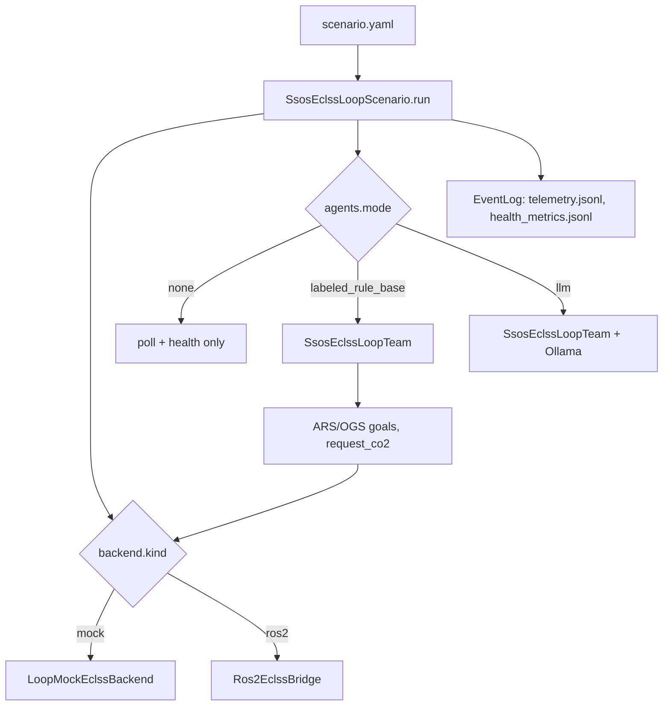
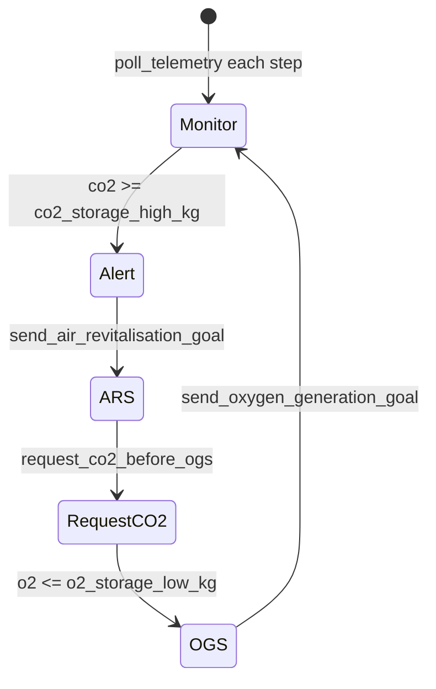

> Japanese: [../ja/ssos/scenario-eclss-loop.md](../ja/ssos/scenario-eclss-loop.md)

# ssos_eclss_loop Scenario

A new scenario that replaces Crew Simulation with an **agent team**. It polls `EclssBackend` directly instead of using `SimulatorProtocol`, and performs ARS / OGS operations and CO₂ requests.

---

## Overview

| Item | Value |
| --- | --- |
| Scenario name | `ssos_eclss_loop` |
| Entry point | `python -m scenario.ssos_eclss_loop.scenario_run` |
| Team | `SsosEclssLoopTeam` |
| Default backend | `mock` |
| Default agents | `none` |
| Step count | 8 (`scenario.yaml`) |



---

## Configuration Files

### scenario.yaml (key fields)

```yaml
name: ssos_eclss_loop

simulation:
  steps: 8
  initial_co2_storage_kg: 1650.0
  initial_o2_storage_kg: 480.0
  initial_product_water_l: 100.0

backend:
  kind: mock  # mock | ros2
  ros2:
    action_timeout_s: 120.0
    topic_timeout_s: 15.0

mock_dynamics:
  co2_growth_kg_per_step: 60.0
  ars_co2_reduction_kg: 350.0
  ogs_o2_gain_kg: 100.0

thresholds:
  co2_storage_high_kg: 1500.0
  co2_storage_critical_kg: 2200.0
  o2_storage_low_kg: 450.0
  product_water_low_l: 50.0

agents:
  mode: none  # none | labeled_rule_base | llm
```

### agents.yaml (when `labeled_rule_base`)

- Team: 3 `eclss_operator_*` agents
- Policy thresholds: `co2_storage_high_kg`, `o2_storage_low_kg`
- `request_co2` before OGS (Sabatier feedstock) — `request_co2_before_ogs: true`
- **Policy is isolated from LLM mode** ([AGENTS.md](../AGENTS.md) discipline)

---

## Backend Selection

Priority (high → low):

1. CLI `--backend mock|ros2`
2. Environment variable `SSOS_ECLSS_BACKEND`
3. `backend.kind` in `scenario.yaml`

```bash
# Mock (CI / local, no ROS required)
PYTHONPATH=src python3 -m scenario.ssos_eclss_loop.scenario_run --backend mock

# With agents
PYTHONPATH=src python3 -m scenario.ssos_eclss_loop.scenario_run \
  --backend mock \
  --agents-mode labeled_rule_base \
  --steps 8

# ROS2 (inside SSOS container, ECLSS already running)
export SSOS_ECLSS_BACKEND=ros2
PYTHONPATH=src python3 -m scenario.ssos_eclss_loop.scenario_run --backend ros2
```

`build_eclss_backend()` is implemented in `scenario_run.py`.

---

## Agent Behavior (`labeled_rule_base`)



| Event | Condition | Command |
| --- | --- | --- |
| Alert | CO₂ ≥ threshold (first time) | Team message |
| ARS start | CO₂ high & not yet run | `air_revitalisation` |
| CO₂ request | Before OGS & not yet requested | `request_co2(25.0)` |
| OGS start | O₂ ≤ threshold & not yet run | `oxygen_generation` |

**No topology changes at runtime** (permanent changes are post-run proposals in `operational_proposals.json` / `design_proposals.json`).

---

## Output Artifacts

After a run, under `src/experiments/results/<run_id>/`:

| File | Contents |
| --- | --- |
| `telemetry.jsonl` | `EclssTelemetrySnapshot` per step |
| `health_metrics.jsonl` | Deterministic health checks against thresholds |
| `messages.jsonl` | Agent utterances (when agents enabled) |
| `events.jsonl` | Applied operational commands |
| `summary.json` | Peak CO₂, ARS/OGS trigger steps, etc. |
| `provenance.jsonl` | One Piece integration (best-effort) |

Example run_ids:

- `ssos_eclss_loop_baseline` (agents: none)
- `ssos_eclss_loop_labeled_rule_base`
- `ssos_eclss_loop_llm`

---

## Mock vs ROS2

| Aspect | Mock | ROS2 |
| --- | --- | --- |
| Prerequisites | `pip install -e ".[dev]"` only | SSOS Docker + ECLSS running |
| Speed | Fast (pytest-friendly) | Slow (waits on Actions) |
| Physical fidelity | Simplified dynamics | SSOS live graph |
| CI | ✅ Recommended | ❌ Docker-dependent |
| Acceptance demo | Agent logic validation | SSOS integration proof |

---

## Runner Integration

`ssos_eclss_loop` is registered in `SCENARIO_REGISTRY`:

```python
from scenario.ssos_eclss_loop.scenario_run import SCENARIO_REGISTRY
# {"ssos_eclss_loop": SsosEclssLoopScenario()}
```

`SsosEclssLoopScenario.build_simulator()` raises `NotImplementedError` — this scenario does not use `SimulatorProtocol`.

---

## Related

- [ECLSS Integration](eclss-integration.md)
- [Quickstart — ssos_eclss_loop](quickstart.md)
- [Roadmap — Phase 4–8](roadmap.md)
