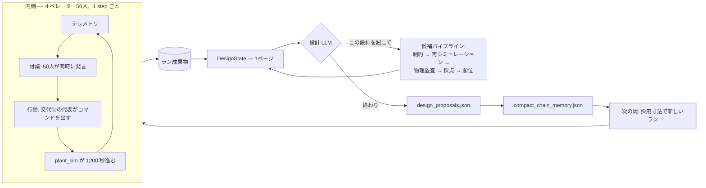

# エージェント設計 — 世界が決めることと、モデルが決めること

このページは境界線そのものである。片側にあるのが世界。物理、閾値、予算、機械として作れる範囲。すべてコードと設定にあり、すべて決定論で、エージェントの交渉対象ではない。もう片側にあるのが判断。何を言うか、動くか動かないか、どのサブシステムか、次にどれだけ大きく作るか。ここは一つも台本になっていない。

以下はその線を2回引いたもの。1回はラン内の50人のオペレーターについて、もう1回は次の機体を設計する1人のエンジニアについて。

---

## 1. 2つのループ



内側は**運用**。居住区が乗員に対してやっていることへの反応。外側は**設計**。本当は何を作っておくべきだったか。外側のループは閉じている——提案が次のランのハードウェアになる——ので、ここでの誤りは50周後に死者数として表に出る。

---

## 2. オペレーターに渡されるもの

50体のエージェント（`agents.yaml` `actor.team.count: 50`）が、1ターンに1つのプロンプトを受け取る。組み立ては `PersonaPromptBuilder.build`（`src/core/agents/persona.py:259`）。7つの部品があり、8つ目は無い。

| 部品 | 出どころ | 中身 |
| --- | --- | --- |
| 憲章 | `persona.py:15` `TEAM_CHARTER` | 「主張は Telemetry と World state に基づけ。**安全上の規範的判断は ECLSS エンジニアであるあなたのもの——隠された施設側の閾値を仮定するな**」 |
| ペルソナ | `agents.yaml` `actor.team.persona` ＋ アーキタイプのレンズ（`persona.py:30`） | **考え方**（第一原理・システム・リスク）であって、役割の台本ではない |
| Situation | `ssos_eclss_loop_team.py:1001` `build_llm_situation` | 生の数値9個と故障フラグ3個 |
| チーム討議 | `DiscourseBuffer`、22件 | 直近の発言 |
| 自分の記憶 | `AgentMemory`、30件 | このエージェントが覚えていること |
| この step のここまで | step 内メッセージ | 行動フェーズ前の討議 |
| 出力契約 | `persona.py:193` | JSON の形と、使えるコマンド種別 |

Situation ブロックは文字通りこれだけ。

```
step=17, co2_storage_kg=2.41, o2_storage_kg=5.88,
product_water_reserve_l=61.2, grey_water_collected_l=3.4,
urine_buffer_l=6.1, captured_co2_kg=0.88,
ars_failure_enabled=False, ogs_failure_enabled=False, wrs_failure_enabled=False
```

そのあとに状態語が4つ（`overall`, `co2_status`, `o2_status`, `water_status`）。プロンプト本文の中で **「施設監視層による記述的な所見であって、命令ではない」** と明記されている。

### 意図的に渡していないもの

- **閾値の数値。** `co2_storage_high_kg: 2.0` は `scenario.yaml` にあり、健康状態の語とルールベース actor を動かしている。LLM の actor にはこの数値を見せない。`2.41` という数と `warning` という語だけを見て、行動に値するかを自分で決める。
- **行動しろという指示。** 契約の最後の一文は「あなたとチームがこの step は待つと合意したなら commands は空にせよ」。**待つことが正規の選択肢**である。
- **推奨コマンド。** Operational levers ブロック（`ssos_eclss_loop_team.py:984`）は各コマンドが**何であるか**と payload フィールドが**何を意味するか**（`initial_co2_mass (kg)`、`urine_volume (L)`）を書いて、そこで終わる。どれを送れとも、どれだけ送れとも書いていない。
- **投入量。** `air_revitalisation` を選んだエージェントは `initial_co2_mass` を自分で決める。この数値が ARS の運転をスケールする（`plant_sim.ars.reference_goal_co2_kg` 基準）ので、外すと処理不足になるか、80分拘束される機械を無駄に使う。
- **裏での調整。** 50体は前 step の討議に対して**同時に**考える（`_run_step_llm`, `ssos_eclss_loop_team.py:279`）。行動フェーズまで、同じ step に誰が何を言ったかは見えない。合意は step をまたいで作るしかない。

### エージェントの意思に関係なく世界が強制すること

| ルール | 場所 | 帰結 |
| --- | --- | --- |
| 1 step につき1サブシステム1コマンド | `_COMMAND_GROUPS`, `ssos_eclss_loop_team.py:49` | 同じ step の2回目の `air_revitalisation` は却下され、理由付きで記録される |
| 稼働中の機械は仕事を受けない | `plant_sim/model.py` | ARS は 4800 秒動く。その間のコマンドは弾かれる |
| 質量収支 | `plant_sim/stoichiometry.py`, `model.py` | O₂ 1 kg の生成は水 1.126 kg を食う。Sabatier は捕集済み CO₂ を食う。何も湧かない |
| 乗員代謝 | `scenario.yaml` `plant_sim.crew`、BVAD 値 | 誰が何を言おうと50人は1人あたり 1.04 kg/day の CO₂ を出す |
| 乗員は死ぬ | `survival.py` | 減点ではない。エージェントが消える状態変化 |
| 行動は時間を食う | `plant_sim.time.*_operation_seconds` | コマンドを増やしても能力不足は埋まらない |

エージェントはどんな思い込みにも到達できる。しかし船内の 52 kg/day の CO₂ を言葉で減らすことはできない。

### 圧力はどこから来るか

出荷時のベースライン（ARS 4.5 kg/day、OGS 9.25 kg/day）は**50人には生存不可能**である。需要は CO₂ 52 kg/day、O₂ 42 kg/day。乗員は全滅する。これは意図的で、オペレーターには「運用では抜けられない居住区」が渡される。だからランは**どの資源がいつ破綻したか**という正直な記録を残し、設計ループには調整作業ではなく本物の問題が渡る。

---

## 3. 設計者に渡されるもの

設計エージェントは委員会ではなく1人である（`agents.yaml` `design.team.count: 1`）。このリポジトリが聞いているのは、**1体のエージェントが自分で証拠を集めて、弁明可能な設計に到達できるか**である。

自由度の線はオペレーターとは別の場所に引いてある。理由は実測された失敗にある。最初の版ではモデルが「次にどのツールを呼ぶか」も選んでいた。あるランは同じ制約チェックに21ターンを費やし、15分で候補を1本しか作らなかった。ループを前に進める力がどこにも無かったからである。よって:

```
LLM     = 設計判断だけ
Python  = 調査・検証・シミュレーション・評価・比較・ワークフロー管理
```

毎ターン、モデルは組み立て直された1ページ（`design_state.py` の `build_design_state`）を渡され、ちょうど2つのうち1つを返す。

```json
{"decision": "propose_candidate",
 "rationale": "上の状態から、なぜこの寸法か",
 "fields": {"plant_sim.ars.capacity_kg_day": 20.8}}

{"decision": "finish",
 "rationale": "なぜこれか",
 "selected_candidate_id": "<シミュレーション済みの候補>"}
```

契約（`ssos_tool_use_design.py:118` の `DECISION_CONTRACT`）は、モデルがどれだけ何も握っていないかを明示して終わる。「**次に何が起きるかはあなたが決めない。**あなたが出した候補はすべて自動で検査・シミュレーション・監査・比較されたうえで次の質問が来るし、勝者はあなたの選択ではなく順位が決める」。

ツールは選ばない。合否も判定しない——ペルソナにそう書いてある。「判定はしないこと」。

**決めるのは設計そのもの**である。連続値の設計変数3つを、工学的な範囲内のどこでも。勾配も、最適化器も、方向の示唆も無い。`propose_capacity_candidate` は決定論の寸法計算ヘルパーとして存在するが、モデルは無視してよく、実走行では実際にヘルパーが出さない数値を提案している。

### 9つのツール

すべて素の Python。**LLM を呼ぶものは1つも無い**（`design_tools.py`）。設計を決める計算はすべてここで決定論的に行われるので、小さいモデルが算術を幻覚することはできない。

| ツール | 返すもの |
| --- | --- |
| `load_run_artifacts` | summary、設定、JSONL の先頭と末尾、そして `chain_memory_compact` |
| `summarize_timeseries` | 列ごとの min/max/最終値/初回 warning/初回 critical/滞在 step/傾向 |
| `compute_eclss_features` | コマンドと却下の理由別回数、乗員喪失原因、故障区間、不足量の台帳 |
| `compute_theoretical_capacity` | 乗員需要と設置ネームプレートの比較（運転間隔と busy guard 込み） |
| `plot_eclss_timeseries` | PNG **と同じ内容のテキスト**。画像理解は一度も必須にしていない |
| `propose_capacity_candidate` | 需要×余裕からの寸法案。**下げる方向にも**出す |
| `evaluate_design_constraints` | 質量・費用・範囲のラベル。シミュレーションはしない |
| `run_design_candidate` | その寸法でシナリオを丸ごと再シミュレーション |
| `compare_design_runs` | 順位と、どの基準が順位を決めたか |

ツールは例外を投げない。失敗は `{"error": ...}` として返り、モデルに何が起きたかを見せられる。

### 設計者に**見せない**もの

意図的に削っており、理由が重要である。以前の版は CO₂ ピークを主要指標として見せていた。それは**38候補すべてで 6.731、小数点まで完全に同一**だった。ピークは予定された故障が明ける瞬間の値であり、故障スケジュールと乗員数だけで決まって装置能力が一切関与しないからである。モデルはこの動かない数を「まだ足りない」と読み、5周にわたって能力を上げ続け、質量予算の13倍まで行った。

そのためピーク、警戒帯滞在、危険帯滞在、質量、体積、費用は**単独では見せていない**。設計者が見るのは**軸ごとに分解した採点表と、失点の大きい順（`points_lost`）**、それと製造可否（これは程度の問題ではないので点数にならない）。**動かない数は、動くかのように見せない。**

---

## 4. 記憶

3層あり、それぞれ存在理由が違う。

### 第1層 — 各エージェントの私的な記憶（ラン内）

`AgentMemory`（`src/core/agents/memory.py:12`）。30件、古いものから落ちる。`TeamMemoryStore.commit_step`（`memory.py:60`）が step ごとに書く。

- モデル自身の任意フィールド `"memory"` — **何を覚える価値があるかをエージェントが決める**。40語上限
- `step N [phase]: <message> (<reasoning>)` の要約行
- 自分が出したコマンドと payload

`"memory"` が**任意で自己記述**であることが要点である。ログの垂れ流しをモデルに返しているのではない。30件は直近およそ10〜15 step にあたり、vLLM のプロンプト予算に対して決めてある。

### 第2層 — 共有討議（ラン内）

`DiscourseBuffer`（`memory.py:32`）。`AgentMessage` 22件のスライディングウィンドウ。50体の1 step は約52メッセージを出すので、22 は**1 step 分にも満たない**。これは意図的で、エージェントは直近の同僚を引用できるが部屋全体は読めない。情報は本当に伝播しなければならない。

### 第3層 — 連鎖の記憶（ラン間）

`compact_chain_memory.json`（`chain_memory.py`）。連鎖ごとに1本、**4096 バイト上限**（`chain_memory.py:44`）。

存在理由は具体的な失敗である。50周のランで:

```
24周: ARS=20.8, OGS=42.0, WRS=1.8  → 50/50 生存, スコア 66.18
25周: WRS だけの部分提案 → 次のランは ARS=4.5, OGS=9.25 を設置 → 0/50
```

うまくいった設計は棄却されたのではない。**忘れられた**。各周は自分のランだけを読んで状態を組み立て直す——それが周を監査可能にしている当のものであり、同時に連鎖に記憶が一切無いということでもあった。

このメモが持つのは4つだけ。

| 項目 | 理由 |
| --- | --- |
| `best_full_survival` | 全員生存した中で最小の設計 |
| `last_effective_design` | 前周に**実際に設置された**寸法。提案された値ではない |
| `measured_limits` | 各サブシステムがどこで乗員を生かせなくなるかを**実測**した区間の両端 |
| `known_bad_patterns` | 最大5件。例「部分提案が ARS/OGS を省き、次周がベースラインに戻して全滅した」 |

4 KB を超えたとき、`_fit`（`chain_memory.py:550`）は文章を切るのではなく**最も価値の低い項目を丸ごと落とす**。文の途中で切れたメモは、短いメモより悪いからである。周回数と共に増えることはない。履歴ではなく、メモである。

**探索指示**も載る。同じ生存段位の中で4周連続してスコアが 0.25 点改善しなければ（`_detect_stagnation`, `chain_memory.py:458`）、次の周は「同じところを回っている」と言葉で伝えられる。同じ生存段位の中でしか比較しないことが重要で、4人多く救った周はスコアが下がっていても**前進している**。

### 計算ではなく実測

`measured_limits` は `0aaec84` まで**計算した下限**だった。この変更はリファクタではなく結果として読む価値がある。

下限は「乗員需要 ÷ 機械が動ける頻度」をサブシステムごとに主張したもので、設計者には「これを下回るな」と伝えていた。間違いが2つあった。**計算が常に正しくはなかった**——毎周期フルバッチで動く前提だが、乗員は水再生を5リットル溜まってからしか始めない。計算値 1.5625 L に対し実際は約 1.98 だった。3つの周が計算値を提案し、そのたびに4名を失って学び直した。**そして「越えてはならない線」は答えになる**——2つのガス系が計算下限に触れた周から、20周どちらも動かなかった。この2つで質量の91%。残る唯一のつまみが水再生で、安全域を端から端まで動かしても0.5点に満たない。

そこで `floor_probe.py` が測る。連鎖につき1回、出荷時の機体を全員が戻るまで大きくし、そこから各サブシステムを1つずつ——他は生存した最小寸法に固定して——乗員が失われるまで下げる。34回のシミュレーション、16秒、モデルは一切関与しない。

```text
CO2除去    20.79 全員生存   20.45 で12名喪失  (co2_warning)
酸素生成   42.04 全員生存   41.35 で 2名喪失  (o2_warning)
水再生      1.98 全員生存    1.95 で 4名喪失  (water_warning)
```

ガス2つは計算どおりの位置に出た——**それが分かるのは確かめたからである**。水は違った。判断ページに届くのは各区間の両端だけで、閾値も下限も指示も無い。

**そしてこのメモはもう応急処置ではない。** `do_not_reduce` の条項を持っていたのは、能力提案が「そのランが飛ばしていた機体」ではなく**シナリオファイル**にマージされていたからで、1つのサブシステムを名指しすると残り2つが黙って出荷時の寸法に戻っていた。`complete_capacity_profile` が、提案が触れなかった項目を**実際に設置されていた値**で埋めるようになった。省略が「これを戻せ」を意味するのをやめ、下回ることを禁じていた4か所は消えた。

---

## 5. LLM の組み込み

**プロバイダ。** Ollama（ローカル）と vLLM（ラボ GPU）。1つの `LLMClient` ABC（`src/core/llm/base.py`）の裏に置き、`factory.py` が選ぶ。プロバイダ・URL・モデル・温度・トークン予算は `agents.yaml` の**側ごとの設定**で、オペレーター側と設計側は独立している。出荷設定では別ポートの別モデル（50体のオペレーターに 9B、1体の設計者に 27B）。

**function calling 無しの構造化出力。** 自ホストの vLLM / Ollama はネイティブの function calling を当てにできないので、プロトコルは素の JSON 契約である。パースは `src/core/llm/parsing.py` にあり、これは具体的な90分の空振りが理由で存在する。

> C10 (qwen3:14b) は90分のランを丸ごと無駄にした。すべての action で `reasoning` / `memory` が空だったのを「挙動変化」と分類していたが、手で確認したところ**360 agent step すべてがパーサのフォールバック**だった。

だからパースは沈黙せず観測される。`parse_json_response`（`parsing.py:212`）は status を返し、下流は4つを区別して扱う。

| status | 意味 |
| --- | --- |
| `ok` | パース成功、必須フィールドあり。挙動として信頼できる |
| `partial` | パース成功、必須が一部欠落。既定値で補填 |
| `fallback` | パース失敗。**この行動をエージェントの判断として扱ってはならない** |
| `empty_response` | 空白のみの応答 |

`extract_json_block`（`parsing.py:122`）は**最後の**均衡した JSON を取る。思考してから答えるモデルは答えを末尾に置くからである。`strip_thinking_tags` は `<think>`, `<thinking>`, `<thought>` と、`max_tokens` 打ち切りによる**閉じていない**思考ブロックを処理する。

**思考は捨てずに残す。** `invoke_llm` はプロバイダ側の reasoning（vLLM の `reasoning_content`、Ollama の `thinking`）と think タグの本文を統合して保存する。誰も辿り直せない設計は、レビューできる設計ではない。

**失敗時の順序:** 読めない応答 → 同じ予算内で修復1回 → 検証済みの候補をすべて保持する決定論フォールバック。**枠切れは正常な終わり方**であって異常ではない。検証済みの設計を採用して次周へ渡す。決定論フォールバックは「1本も作れなかった周」専用である。

**並行実行。** 50体は128ワーカーのスレッドプール（`base.py`）で1バッチとして討議する。セマフォは `asyncio.Semaphore` ではなくループ非依存の `threading.BoundedSemaphore`——前者は次 step の `asyncio.run` で "bound to a different event loop" で壊れる。

---

## 6. 設計が嘘をつけない仕組み

設計ループは閉じている。出力が次のランのハードウェアになる。だから3種類の嘘が実際に金額になるので、それぞれに関門がある。

| 関門 | 問うこと | ファイル |
| --- | --- | --- |
| **Evidence Gate** | この候補は本当に再シミュレーションされたか。採用フィールドは**そのランの記録**から来ているか | `ssos_tool_use_design.py` |
| **Physics Gate** | テレメトリだけを読んで、在庫は非負か、累計は単調か、炭素・酸素・水の台帳は釣り合うか。9項目。期首在庫はランの最初の行から取る | `physics_gate.py` |
| **Integrity Guard** | このランはベースラインに対して、自分の採点基準・運転点・故障スケジュールを動かしたか | `integrity_guard.py` |

Physics Gate は `telemetry.jsonl` **だけ**を読む。それを吐いたシミュレータを信用せず、それを設定した config も読まない。不合格のランは**低く採点されるのではなく、採点されない**——`integrity_guard.py` は、そのランが受け取る資格の無いスコアを拒否する。

最終回答はさらに厳しい。連鎖の答えは全員生存・製造可能・物理監査合格が必須。予算超過は `provisional_final` として人間の承認に回す。該当が無ければ「該当なし」と出す——50人という条件では、これは実在する正しい結果である。

---

## 関連

- [設計エージェント](memo/ssos_eclss_loop/tool_use_design_agent.md) — 判断ループの詳細
- [実験記録](results.md) — 150周で実際に起きたこと
- [実装仕様書](specs/index.md) — 各回の作り直しが何に対して書かれたか
- [拡張ガイド](extending.md) — backend / シナリオ / エージェント / 設計変数の足し方
