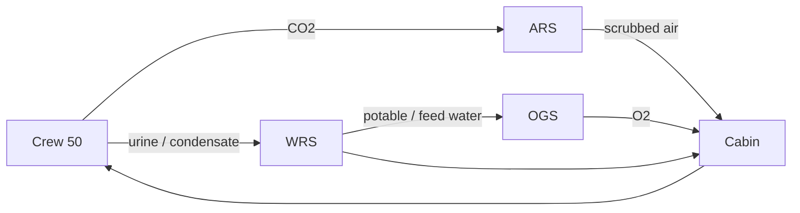
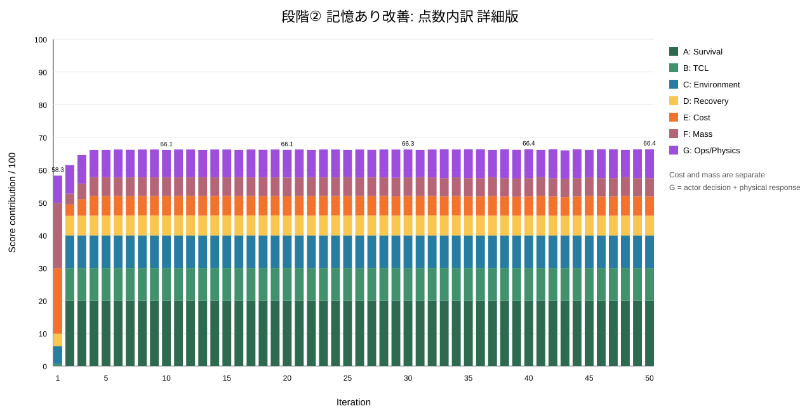
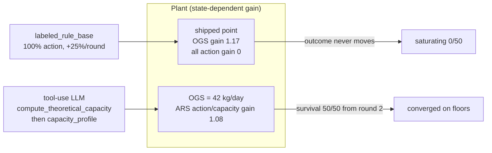
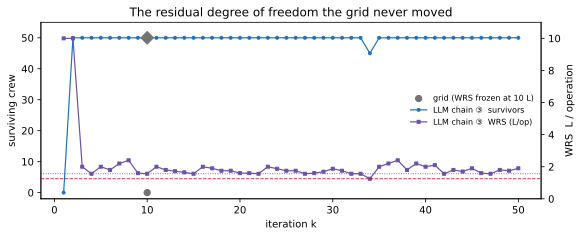
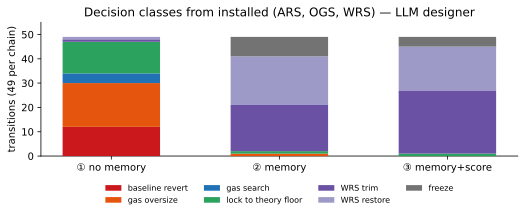
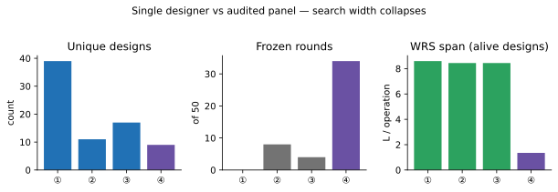
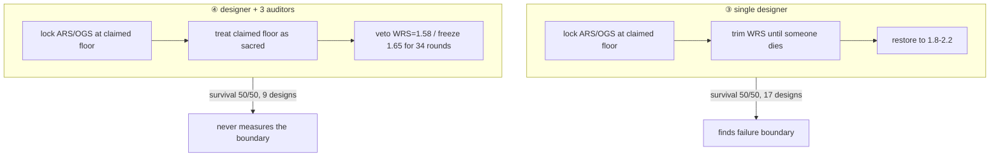

# AIエージェントによる再帰的自己改善 ― 宇宙ハードウェア設計シミュレーション 技術説明（ver.03）

> Singulab AIエージェント社会シミュレーション ハッカソン Vol.2 提出資料の改訂
>
> 【作品名】：Engineering Agents　【チーム名】One Piece Engineering　【チームメンバー】Hiroto Tamura, はぐら, モン, バッツ
> キャッチ：*AIエージェントが「設計そのもの」を再帰的に自己改善する物理シミュレーション*
>
> **ver.03（2026-08-30）** — ver.02 の結果・考察を残し、このブランチで実装した設計空間の定量解析（`tools.analysis`、341 `plant_sim` 実行）と、エージェント連鎖から測った**創発**を追加した。

### ver.02 からの追加

| 章 | 何を足したか |
| --- | --- |
| 11 | 設計空間を力学系として測る。順序変数 ρ、可制御性、軌跡アーキタイプ。ルール設計器は **saturating**、LLM 連鎖は生存到達後に WRS 上で **oscillating** |
| 12 | 設計改善の分析を2本。① なぜ LLM は全員生存でき、ルール設計器は 0 人のまま飽和したか ② グリッドが凍らせた WRS が、実は残差の自由度だった |
| 13 | 創発の可視化。予想外の変数操作、段階ごとの意思決定クラス、シングル設計者 vs 監査パネルの思想の切れ目 |

数値の正本: 段階①–③は [`docs/data/`](../data/README.md) の周回 CSV（再現手順は [`experiments/README.md`](../../experiments/README.md)）。段階④の集計は ver.02 の監査パネル連鎖。プラント側のアンサンブルは [`design-loop-analysis.md`](design-loop-analysis.md) / `src/experiments/analysis/design_loop_analysis.findings.json`。

---

## 1. 概要（サマリー）

本プロジェクトは、**AI × 宇宙 × 工学**を組み合わせ、**AIエージェントが設計そのものを再帰的に自己改善する**過程を物理シミュレーション上で再現・検証する試みである。題材には宇宙機・宇宙居住の**環境制御・生命維持システム（ECLSS）**を採り、「50名の乗員（Crew）が生き延びられるか」という明快なシナリオ（**50人サバイバル**）を設定した。交差の核は、宇宙ハードウェアへAIを載せることにとどまらない。人が回してきた**工学そのもの**——制約を読み、案を出し、検証し、次へ進む——をエージェントに担わせることである。

エージェントは、CO₂・O₂・H₂O・質量・コストといった**相反するパラメータ**を同時に扱う多目的最適化のもとで設計案を提案し、物理シミュレーションでの実行結果を**定量評価スコアカード**で採点する。その結果を次の設計へフィードバックする**再帰ループ**を同時に扱う多目的最適化のもとで設計案を提案し回すことで、改善を積み上げる。

設計改善を行わない初期設計では50名が全滅するが、改善の反復により残存数を引き上げ、**全員生存**を目指す。一方で、生存を追い求めるほど**コストが急増する**という新たな壁が現れ、「いかに安く全員を生存させるか」という効率フェーズへと課題が深化する。

---

## 2. 背景と課題

### 2.1 設計改善のボトルネックは「人」

工学をエージェントに委ねる必要があるのは、設計改善のボトルネックが人だからである。ものづくりの設計現場では、設計を良くする過程が**専門判断と検証の連続**になりやすい。相反する制約が多数からむ問題では、一つの指標を良くすると別の指標が崩れるため、成立する設計にたどり着くまでに多くの試行を要する。しかし現実には、改善のたびに人の専門判断が要るために試行サイクルが回りきらず、**改善の速さと回数が人の手数に縛られる**。

この「人がボトルネックになる」構造は、宇宙機のように制約が厳しく試行コストが高い領域ほど顕著になる。

### 2.2 問い

そこで本プロジェクトは、次の問いを起点にした。

> **設計を改善する主体そのものを、AIエージェントに委ねられないか。**

改善の対象（設計案）ではなく、改善を駆動する**工学の担い手**をAIに置き換える、という発想である。これは、AIが自らの出力（設計）を評価し、次の出力を改善していくという意味で**再帰的自己改善**にあたる。

---

## 3. プロジェクトのビジョンとコンセプト

### 3.1 出発点とビジョン

出発点は、**AIエージェント時代における宇宙ハードウェア設計のシミュレーション環境を構築する**ことであった。多様な分野のメンバーが集結し、「**宇宙機ハードウェアのエンジニアリングエージェント**の開発」という共通目標のもとにプロジェクトを立ち上げた。

最終的なターゲットは、単一の最適化アルゴリズムではなく、**設計・評価・改善を自走させるエージェント**である。宇宙という制約の強い領域を最初の題材とするが、枠組みそのものは制約の多い設計問題一般に適用できることを見据えている。

### 3.2 なぜ ECLSS を題材に選んだか

シミュレーション基盤には **ECLSS（Environmental Control and Life Support System）** を採用した。選定理由は次の三点である。

1. **社会シミュレーションとして扱いやすい。** 閉じた系であり、乗員・サブシステム・環境の相互作用を、社会シミュレーションの題材として構成しやすい。
2. **設計改善の反復（イテレーション）がしやすい。** サブシステム単位のエージェントによって、設計変更→再評価のサイクルを短く回せる。
3. **人間に理解しやすいパラメータがある。** CO₂などの環境要素や「乗員の生存」といった、直感的に意味が分かる指標が存在する。

結果として、ECLSSは**ハッカソンの題材として「楽しさ」と「改善の余地」を両立**できる対象となった。

---

## 4. シミュレーション基盤：ECLSS

### 4.1 ECLSS とは

**ECLSS（Environmental Control and Life Support System／環境制御・生命維持システム）** は、宇宙機や宇宙居住施設において、空気・水・温度・圧力などを循環・管理し、乗員の生命を維持するシステムである。本作品では、この閉ループの生命維持を次の要素として扱う。

- **大気再生ループ：** CO₂の除去と O₂の生成（乗員が排出したCO₂を除去し、O₂を供給して居住区へ戻す）
- **水再生ループ：** 排水の再生と供給水（H₂O）の循環
- **温度・湿度・圧力の制御：** 居住環境を一定に保つ

これらは互いに独立ではなく、装置容量・在庫・質量・コストを通じて連動する。したがって「どれか一つを最大化する」ことはできず、**系全体として成立する均衡点**を探すことになる。

*図1. ECLSS の閉ループ生命維持 ― 大気再生（CO₂除去）・酸素生成・水再生と居住区。*

### 4.2 世界設計：「50人サバイバル」

軌道居住が当たり前になって、何世代かが過ぎた。

人類は移民船で生活圏を広げ、その航路には補給の中継所が点在している。本船もその一つ。標準乗員6名、現在4名。任務は貨物の積み替えと、水の受け渡し。

移民船が攻撃を受けたのは、こちらの視界の外だった。攻撃主体は不明。周辺航路は封鎖され、救助船も安全が確認されるまで進入できない。

与圧を失うまで数分。乗員たちは脱出艇に乗り、最も近い与圧空間——ここへ逃げ込んだ。

46名。全員、生きている。

怪我人はいない。装置も正常。
空間はある。だが、この船の生命維持系は50人を想定していない。

救助は来る。だが、安全が確保されるまで、その時刻は誰にもわからない。

1ステップの操作は6回まで。
二酸化炭素を抜くか、酸素を作るか、水を回すか。

配分を誤れば、2ステップごとに1人が失われる。

この ECLSS を基盤に、本作品は **「50名の乗員が生き延びられるか」を問うシナリオ**を設定した。エージェントは、コストや質量などの制約条件のもとで、多目的最適化を伴う設計判断を求められる。生存という明快な指標を軸に据えることで、設計の良し悪しが**残存数**として直接に表れる、物語性のある課題設定とした。

---

## 5. 本デッキ用にオリジナル作シミュレーションの構造

本作品の構造は、①相反する制約の多目的最適化、②設計を自己改善する再帰ループ、③エージェントの意思決定方式の比較、の三つで構成される。

### 5.1 構造①：相反する制約の多目的最適化

最適化の対象は **CO₂ / O₂ / H₂O / 質量 / コスト** の相反するパラメータである。

これらはトレードオフの関係にある。たとえば生存環境を厚くしようとすれば装置が増えて質量とコストが上がり、質量やコストを抑えれば余裕が削られて生存が危うくなる。**「全部を最大化する」ことは原理的にできない**。

エージェントの役割は、このトレードオフ空間のなかで、**生存を成立させる均衡点**を探索することである。単一のスカラー目的を最大化するのではなく、複数の相反指標のバランスを取りながら、成立する設計へと収束させていく。

### 5.2 構造②：全体アーキテクチャ（設計を自己改善する再帰ループ）

本作品の核は、次の4ステップを世代を越えて回す**再帰的自己改善ループ**である。

1. **物理シミュレーション** ― 設計を物理環境で実際に走らせる。
2. **定量評価** ― 専門家的観点の評価ツールで、工学的・定量的に採点する（→ 第6章）。
3. **設計を改善** ― エージェントが評価結果を踏まえて設計改善を提案する。
4. **再シミュレーション** ― 改善案を再び物理環境で検証する。

このループの要点は、**過去の結果をフィードバックして、改善が世代を越えて積み上がる**ことである。単発の最適化ではなく、評価—改善—再評価の履歴を糧に、設計が段階的に洗練されていく。

### 5.3 構造③：actor の意思決定比較 × 工学的評価

乗員・サブシステムに相当する **crew** の振る舞いを、**2つの意思決定方式**で比較する。

| 方式         | 特徴                         | 留意点                  |
| ---------- | -------------------------- | -------------------- |
| **ルールベース** | 決められた規則で行動。挙動が読みやすく再現しやすい。 | 想定外の状況への適応は限定的。      |
| **LLM**    | 文脈に応じて柔軟に判断。多様な状況に対応しうる。   | 挙動のばらつきや運用コストに留意が必要。 |

いずれの方式でも、**専門家的観点の評価ツール**が結果を工学的・定量的に採点し、その結果を設計改善ループへフィードバックする。両方式を同じ評価軸で比較することで、「どの方式が、どの局面で、どう効いたか」を切り分けられる。

---

## 6. 評価指標：設計探索を導く定量評価スコアカード

エージェントの設計探索を正しい方向へ導くには、**何を良い設計とみなすか**を明示的・定量的に定義する必要がある。本作品では、コスト・質量・生存のトレードオフを定量化し、**優先度に応じた感度**でスコアが動くように評価スコアカード（ECLSS 評価・検証スコアカード）を設計した。

### 6.1 物理整合性ゲート（必須・配点外）

最重要の前提は、**物理法則を守ること**である。得点よりも物理整合性を優先し、次のような条件を満たさないランは**採点せず、検証無効**とする。

- 質量保存・量論残差が許容内であること
- 在庫が非負であること
- 装置能力の上限内であること
- 故障中に不自然な処理が起きていないこと
- 操作と状態変化の符号が整合していること
- 無効な値や必須観測の欠損がないこと

物理ゲートを満足しなかったランは総合点を算出しない。これにより、「物理的にありえない条件」で高得点を取ることを排除する。

### 6.2 配点構成（100点満点）

| 区分         | 指標                            | 配点  |
| ---------- | ----------------------------- | --- |
| 性能指標       | **A. TCL（Time to Crew Loss）** | 10  |
| 性能指標       | **B. 生存環境**                   | 10  |
| 性能指標       | **C. 資源余裕と回復**                | 10  |
| 残存         | **D. Crew残存率**                | 20  |
| コスト        | **E. コスト**                    | 20  |
| 質量         | **F. 質量**                     | 20  |
| actor有効時のみ | **G. 操作判断**                   | 5   |
| actor有効時のみ | **H. 物理応答**                   | 5   |

*図2. 定量評価スコアカードの配点構成（100点満点）。性能(A+B+C) 30／D残存 20／Eコスト 20／F質量 20／G+H crew 10。*

### 6.3 各指標の定義

- **A. TCL（10点）：** 現在の故障状態を継続したときに、最初の乗員喪失までにかかる時間を評価する。基準時間 `T_ref` に対して `得点 = 10 × min(TCL ÷ T_ref, 1)`。観測時間が足りない場合は失敗ではなく採点保留（右打ち切り）として扱う。
- **B. 生存環境（10点）：** ラン全体を通して、crewがどれだけ深く・長く危険環境に曝露されたかを評価する。CO₂上限超過や O₂・製品水の下限不足の「量 × 継続時間」、safe/warning/critical の滞在ステップ数などを用い、瞬間値ではなく**軌道**で評価する。
- **C. 資源余裕と回復（10点）：** 最悪局面に耐え、終了時までに資源状態を回復できたかを評価する。各資源の初期値・イベント時の値・最小/最大値・終了値・安全域までの余裕、終了時の未回復フラグなどを見る。
- **D. Crew残存率（20点）：** 終了時に残存する crewの割合をそのまま得点化する。`得点 = 20 × crew_remaining ÷ crew_initial`。物理下限による喪失と、危険帯滞在ルールによる喪失を分離して表示する。
- **E. コスト（20点）：** ARS / OGS / WRS のハードウェア費と打上費の合計。初期定格のコストを満点とし、設計改善による増加を減点する。`得点 = 20 × (1 − (総コスト − 初期コスト) ÷ (750 − 初期コスト))`。初期コスト以下で20点、750 MUSD以上で0点、その間は線形。初期コストは sizing-model ベースライン（ARS 40 + OGS 65 + WRS 55 + 打上 99 = **259 MUSD**）。**探索用の係数であり、実機見積ではない。**
- **F. 質量（20点）：** ARS / OGS / WRS の設置質量合計。`得点 = 20 × (1 − (総質量 − 初期質量) ÷ (5000 − 初期質量))`。初期質量以下で20点、5000 kg以上で0点、その間は線形。初期質量は sizing-model ベースライン（ARS 450 + OGS 700 + WRS 650 = **1800 kg**）。
- **G. 操作判断（5点・actor要因）：** 装置へ渡す前の「いつ・何を・どれだけ要求したか」を、観測値との対応で評価する（対応遅延、操作種別・要求量の妥当性、無効操作や不要な重複操作など）。
- **H. 物理応答（5点・設計要因）：** 物理的に妥当な要求を受けた後、装置がどれだけ要求を実処理へ変換したかを評価する（実行成功率、要求量/実処理量、ΔCO₂・ΔO₂・Δ水、能力飽和、故障時の残存能力など）。

### 6.4 評価モードと対象外

- **評価モード：** crew操作を使わないラン（`actor.mode = none`）は **90点満点**（A+B+C+D+E+F）。crew操作が有効なラン（`labeled_rule_base` または `llm`）は **100点満点**（+G+H）。配点は自動再配分せず、適用可能点と満点を明示し、満点の異なるラン同士を直接比較しない。
- **評価対象外・運用上の注意：** LLMの自己評価・発言量・提案件数は成功指標にしない。仮想検証の合格を、実機・物理世界での検証済みと表現しない。backend・初期在庫・乗員数・故障条件・ステップ数・閾値は結果に記録する。

---

## 7. 結果

### 7.1 4段階の実験設計

今回の実験では、ECLSS設計エージェントを50 iterationずつ実行し、改善の段階を4つに分けて比較した。比較したい論点は、単に「最終スコアが高いか」ではなく、**過去のtool-use結果が次の設計判断に使われているか**、そして**iterationを重ねるほど生存者数と評価スコアが安定・改善するか**である。

| 段階          | 変更内容                            | 狙い                                     |
| ----------- | ------------------------------- | -------------------------------------- |
| 段階① 初期      | PR #65の初回ループ                    | tool-useで得た設計情報が次iterationへ有効に使われるかを見る |
| 段階② 記憶あり改善  | 過去のbest設計・失敗パターンを短期記憶として追加      | 良い設計の巻き戻りを防ぐ                           |
| 段階③ 記憶+評価変更 | 記憶に加え、Cost/Massの採点レンジを緩和        | 生存可能な最小設計を過度に低く評価しない                   |
| 段階④ 監査パネル   | 設計者1人に独立監査者3人を追加し、item-vetoでマージ | 危険な下げを止めつつ、探索が狭まらないかを見る                |

4段階の位置づけは次の通りである。段階①は、エージェントが各iterationで物理シミュレーションと評価ツールを呼び出しながら設計案を更新する、もっとも素朴なループである。段階②では、そのループに**短い記憶サマリ**を追加した。ここでは過去のbest設計、悪化した設計、下げてはいけない下限値を次iterationのtool-use contextに戻している。段階③では、段階②の記憶機構を維持したまま、Cost/Massの点数レンジを調整した。これは、50/50生存を達成するために必要な最小構成が、旧評価ではCost/Massで過度に低く採点されていたためである。段階④では、採点表は段階③のまま、設計側だけを変えた。設計者1人が候補を出し、互いに見えない監査者3人（数値の再導出 / 局所最適の回避 / 設計の妥当性）が item-veto でマージする。

| 観点      | 段階① 初期               | 段階② 記憶あり改善      | 段階③ 記憶+評価変更         | 段階④ 監査パネル                 |
| ------- | -------------------- | --------------- | ------------------- | ------------------------- |
| 入力データ   | PR #65 初回結果          | database-only結果 | database + eval改善結果 | database + eval改善 + 監査パネル |
| 記憶サマリ   | なし                   | あり              | あり                  | あり                        |
| 評価式     | 旧評価                  | 旧評価             | Cost/Massレンジを緩和     | 段階③と同じ                    |
| 主に見たい効果 | tool-use結果が自然に蓄積されるか | 良い設計を保持できるか     | 採点が探索方向を歪めていないか     | 監査が危険な下げと探索幅のどちらを止めるか     |
| 注意点     | 失敗も含む初期挙動            | 記憶の効果を見る主比較対象   | 点数は旧評価と単純比較しない      | 点数は段階③と比較できる              |

評価で追った主な指標は、(1) 生存者数、(2) 100点満点の総合スコア、(3) ARS/OGS/WRSの3設計変数、(4) A-Gの点数内訳、(5) 完全な設計提案が出ているか、(6) 良い設計からベースラインへ戻る致命的な巻き戻りが発生しているか、である。特に本シミュレーションでは、生存者数が最優先の制約であり、その次にCost/MassやRecoveryで効率を見る。

なお、段階③④のスコアは評価式変更後の点数であるため、段階①/②と総合点をそのまま横比較するのは危険である。段階③と④は同じ採点表なので、この2本のスコアは比較できる。段階③④で見るべき主なポイントは、**50/50生存を維持したまま、Cost/Mass評価が探索に使いやすいレンジへ移動したか**、および**監査パネルが探索を狭めすぎないか**である。

### 7.2 生存者数とスコアの推移

段階①では、途中で50/50生存に到達したものの、最終iterationでは34/50まで落ちた。原因は、部分的な設計提案によってARS/OGSがベースライン相当へ戻ることだった。段階②ではこの巻き戻りがほぼ解消され、iteration 2以降すべて50/50生存を維持した。段階③でもほぼ同じ安定性を維持し、iteration 34の一度だけ45/50に落ちた。段階④は iteration 2 で19/50（OGSだけ上げてARSは出荷寸法のまま）のあと、iteration 3以降は50/50を維持した。

*図 7-1. 段階①–③の生存者数と総合スコア。段階③の点数は採点関数が違うため、①②と縦軸を直接比較しない。*

| 指標                  | 段階① 初期 | 段階② 記憶あり改善 | 段階③ 記憶+評価変更 | 段階④ 監査パネル |
| ------------------- | ------ | ---------- | ----------- | --------- |
| iteration数          | 50     | 50         | 50          | 50        |
| baseline replay生存者数 | 0/50   | 0/50       | 0/50        | 0/50      |
| final replay生存者数    | 34/50  | 50/50      | 50/50       | 50/50     |
| 初回iteration生存者数     | 0/50   | 0/50       | 0/50        | 0/50      |
| 最終iteration生存者数     | 34/50  | 50/50      | 50/50       | 50/50     |
| 50/50生存iteration数   | 34/50  | 49/50      | 48/50       | 48/50     |
| 0/50生存iteration数    | 12/50  | 1/50       | 1/50        | 1/50      |
| 最高スコア               | 66.18  | 66.36      | 84.23       | 84.03     |
| 平均スコア               | 61.71  | 65.94      | 83.34       | 82.59     |
| 最終スコア               | 55.41  | 66.36      | 84.08       | 84.03     |
| 完全な設計提案数            | 38/50  | 50/50      | 50/50       | 50/50     |
| ARS/OGSの致命的巻き戻り     | 12回    | 初回のみ       | 初回のみ        | なし        |
| ユニーク設計数             | 39     | 11         | 17          | 9         |

段階①では、iteration 24で最高スコア66.18、50/50生存に到達している。しかし最終iteration 50では34/50生存、スコア55.41まで落ちた。これは「探索で良い点を一度見つけたが、最終的にそれを保持できなかった」ことを意味する。つまり段階①の問題は、探索能力そのものだけでなく、iteration間の状態継承にあった。

段階②では、iteration 2以降すべて50/50生存で安定している。`chain_memory_compact` がiteration 2-50で投入され、設計提案も50/50回すべてでARS/OGS/WRSを含んでいた。スコアはiteration 4で66.10に到達した後、最高でも66.36であり、改善幅は約0.26点に留まる。これは、記憶によって破綻は防げた一方で、探索が局所的になったことを示している。

段階③では、最高スコア84.23、最終スコア84.08となった。iteration 34でWRS=1.25まで下げたケースのみ45/50生存に落ちたが、それ以外は50/50を維持している。初回を除いたスコア範囲は78.67-84.23であり、段階②よりスコアレンジが広がった。これは、Cost/Massの採点レンジが緩和され、同じ50/50生存の中でも設計差が点数に出やすくなったためである。

以上から、記憶機構は「生存設計の保持」に明確に効いている。一方で、段階②は安定しすぎており、より良い設計への探索幅は狭い。段階③ではWRS探索が少し広がったが、ARS/OGSはほぼ固定されたままである。段階④は、その停滞に対して監査パネルを足した答えである。危険な下げは止まったが、探索幅はさらに狭くなった。

段階④では、最高スコアと最終スコアはともに84.03である。iteration 2だけ19/50で、iteration 3以降はすべて50/50を維持した。設計者は iteration 17 で `ARS=20.8, OGS=42.0, WRS=1.65` に到達し、最終回答もそこ（iteration 18）である。以後34周は同じ機体を飛ばし続けた。設計者はWRSを1.58まで下げようとしたが、監査2と3が veto した——計算下限1.5625に0.0175しか余裕がない、と。段階③ iteration 34のWRS=1.25（45/50）は起きていない。代償はユニーク設計数が17から9へ、最高点が84.23から84.03へ落ちたことである。段階③が踏んだWRS 1.8-2.2の有望レンジにも、1.25の失敗境界にも行っていない。監査は壊れない機体を守った。探索はより狭くなった。どちらも事実である。

### 7.3 設計パラメータの変化

3つの設計変数は、ARS（CO₂除去能力）、OGS（O₂生成能力）、WRS（水再生能力）である。段階①では、良い設計に到達してもARS/OGSが戻るため、生存者数が不安定になった。段階②/③/④では、ARS=20.8 kg/day、OGS=42.0 kg/dayをほぼ維持し、主にWRSを探索する挙動へ変わった。段階④はWRSすら1.65で固定し、以後動かない。

*図 7-2. 設置された ARS / OGS / WRS。段階②③ではガス系が理論下限に張り付き、探索は WRS に潰れる。*

段階①では、tool-useで理論必要容量を得ていても、それを安定的に次iterationへ引き継げていなかった。最高点付近ではARS=20.8、OGS=42.0、WRS=1.8のような有効設計に到達しているが、その後にARS=4.5、OGS=9.25へ戻るiterationが複数回ある。このため、段階①は「探索の失敗」というより、**良い設計状態を保持する仕組みが弱い**ことが主要因だった。

段階②では、ARS/OGSはほぼ理論下限に固定され、WRSだけが探索対象になっている。代表的な頻出設計は次の通りである。

| ARS  | OGS  | WRS     | 出現回数 |
| ---- | ---- | ------- | ---- |
| 20.8 | 42.0 | 1.875   | 17   |
| 20.8 | 42.0 | 1.5625  | 12   |
| 20.8 | 42.0 | 2.1875  | 11   |
| 20.8 | 42.0 | 1.71875 | 3    |

これは良い方向で、過去の知見として「ARS/OGSは削りすぎない」を保持できている。一方で、WRS以外の探索幅は狭くなっており、局所解に入りやすい。段階②のユニーク設計数は11であり、安定性は高いが探索多様性は限定的である。

段階③でも、ARS/OGSは理論下限に固定されている。WRSの探索は段階②より広がり、ユニーク設計数は11から17に増えた。代表的な頻出設計は次の通りである。

| ARS  | OGS  | WRS    | 出現回数 |
| ---- | ---- | ------ | ---- |
| 20.8 | 42.0 | 1.5625 | 9    |
| 20.8 | 42.0 | 2.0    | 7    |
| 20.8 | 42.0 | 1.75   | 6    |
| 20.8 | 42.0 | 1.8    | 5    |
| 20.8 | 42.0 | 1.6    | 5    |

段階③では、WRS=1.25まで下げたiteration 34で45/50生存に落ちた。これは「WRSを削りすぎると生存に影響する」境界情報として有用である。最高点はWRS=2.1、最終はWRS=1.9であり、有望レンジはおおよそWRS=1.8-2.2に見える。WRS=1.25付近は、今後の記憶にbad patternとして明示的に残すべきである。

段階④でもARS/OGSは理論下限に固定されている。ただしWRS探索は段階③より狭く、ユニーク設計数は17から9へ減った。代表的な頻出設計は次の通りである。

| ARS  | OGS  | WRS  | 出現回数 |
| ---- | ---- | ---- | ---- |
| 20.8 | 42.0 | 1.65 | 34   |
| 20.9 | 42.1 | 1.8  | 4    |
| 21.6 | 43.5 | 3.0  | 3    |
| 21.0 | 42.2 | 1.8  | 3    |
| 21.6 | 43.5 | 2.0  | 2    |

最頻出の `20.8 / 42.0 / 1.65` が34周を占める。監査がそこを「十分」と決めたあと、設計は動かなかった。物理量は最終周で4077 kg / 603 M$であり、段階③の最終周（4091 kg / 605 M$）とほぼ同じである。

### 7.4 評価指標変更の効果

段階②では、50/50生存できる設計でもCost/Massがそれぞれ5-6点台に留まり、生存可能な最小設計を過度に低く評価していた。段階③では、Cost/Massの採点レンジを緩和したことで、それぞれ14点台まで上がった。

| 指標       | 段階② 最高点 | 段階③ 最高点 | 段階④ 最高=最終 |
| -------- | ------- | ------- | --------- |
| Cost     | 5.85    | 14.71   | 14.83     |
| Mass     | 5.64    | 14.66   | 14.78     |
| 合計スコア    | 66.36   | 84.23   | 84.03     |
| 総質量 (kg) | 4098    | 4095    | 4077      |
| 総費用 (M$) | 606     | 606     | 603       |

ただし、段階③の84点台は評価式変更の影響が大きい。物理的な総コスト・総重量が大幅に改善したというより、評価指標が「生存可能な最小設計」を正しく評価する方向に補正された、と解釈するのが妥当である。

点数内訳は、まず集約版で「生存」「システム挙動」「コスト・重量」「意思決定/物理応答」のどこが効いているかを見る。次に詳細版で、CostとMassのどちらが効いているか、TCL/Environment/Recoveryのどこが変化しているかを見る。

段階①では、生存者数が崩れるiterationでA SurvivalとB TCLが大きく落ちる。ARS/OGSがベースライン寄りに戻るiterationでは、コスト・重量点は相対的に高くなる一方、生存・TCLが悪化して総合点が下がる。最高スコアiteration 24の内訳は、A Survival 20.00、B TCL 10.00、C Environment 9.98、D Recovery 6.05、E Cost 5.94、F Mass 5.72、G Ops/Physics 8.49、合計66.18である。

段階②では、A Survival、B TCL、C Environmentがほぼ満点近くで固定され、総合点の差は主にD Recovery、E Cost、F Mass、G Ops/Physicsの小さな差で決まっている。最高スコアiteration 33の内訳は、A Survival 20.00、B TCL 10.00、C Environment 9.98、D Recovery 6.06、E Cost 5.85、F Mass 5.64、G Ops/Physics 8.84、合計66.36である。旧評価では、50/50生存できる最小設計でもCostとMassがそれぞれ5-6点程度しか取れていない。これが評価指標変更の主な動機だった。

段階③では、CostとMassがそれぞれ14点台まで上がり、E-F Footprintが総合点を押し上げている。最高スコアiteration 41の内訳は、A Survival 20.00、B TCL 10.00、C Environment 9.98、D Recovery 6.14、E Cost 14.71、F Mass 14.66、G Ops/Physics 8.75、合計84.23である。最終iteration 50では、A Survival 20.00、B TCL 10.00、C Environment 9.98、D Recovery 6.06、E Cost 14.76、F Mass 14.71、G Ops/Physics 8.57、合計84.08であり、bestからの劣化は0.15点程度に収まっている。

段階④は段階③と同じ採点表である。最高=最終の内訳は、A Survival 20.00、B TCL 10.00、C Environment 9.98、D Recovery 6.09、E Cost 14.83、F Mass 14.78、G Ops/Physics 8.35、合計84.03である。E/Fは段階③と同じ14点台であり、監査を足しても足跡軸の点数はほとんど動かない。総合点が段階③の最良84.23より0.20低いのは、WRSを1.8-2.2へ振らなかったためである。

この結果から、段階③の評価指標変更は意図通りに効いている。ただし、この変化は採点レンジの補正であり、物理的な総重量・総コストが大幅に下がったことを直接意味しない。次回以降は、新評価スコア、旧評価スコアでの再計算、総コスト、総重量、生存者数を並べることで、**採点上の改善**と**物理設計そのものの改善**を分離して評価する必要がある。段階④を加えると、その分離はよりはっきりする。監査は生存を守ったが、総質量・総費用は段階③からほとんど改善していない。

### 7.5 結果から見える設計学習の状態

4段階を通して見ると、エージェントの挙動は「全滅する初期設計」から「全員生存を維持する設計」へ移行している。段階①でも局所的には50/50生存に到達しているため、tool-use自体から必要容量を推定する能力はある。しかし、その結果を次iterationへ安定して持ち越せず、部分提案が入ると未提案フィールドがベースライン相当に戻ってしまった。

段階②では、この状態継承の問題が解消された。過去のbest設計と失敗パターンを短く保持するだけで、50/50生存iteration数は34/50から49/50に増え、0/50生存iteration数は12/50から1/50に減った。これは、エージェントに大量の履歴を渡さなくても、**設計判断に必要な形へ圧縮した記憶**を渡せば、改善学習として十分に効くことを示している。

一方で、段階②は探索が安定しすぎた。ARS/OGSを生命維持の下限として固定する判断は妥当だが、その結果、探索対象がWRSへ偏った。段階③では、評価指標変更によりWRS探索の幅は広がったが、ARS/OGSの近傍探索はほぼ起きていない。段階④では監査パネルがその停滞に介入したが、返ってきたのはより狭い固定点だった。ここから、現時点のボトルネックは「過去知見を使えるか」から「停滞時に探索範囲を広げられるか」へ移ったと考えられる。

次の改善では、4回程度連続で生存者数が同じ、かつスコア改善が0.25点未満なら探索モードへ切り替えるのがよい。探索モードでは、WRS=1.8-2.2を重点探索しつつ、WRSだけで改善しない場合にARS/OGSを1-3%だけ増やす候補を試す。ただし、ARS/OGSを下げる探索は生存を落とす可能性が高いため、優先度を下げるべきである。

---

## 8. 考察

### 8.1 何が改善を生んだか

今回の改善は、単にエージェントの出力回数を増やしたことではなく、**過去の結果を短く保持し、次のtool-use contextへ戻したこと**で生まれた。段階①では、エージェントが一度よい設計に到達しても、その知見が安定して保持されず、未提案フィールドがベースラインへ戻ることがあった。段階②では、過去のbest設計と失敗パターンを記憶として渡すことで、ARS/OGSの理論下限を維持できるようになった。

この変化は、実行ログ上の設計判断にも表れている。段階②のエージェントは、次のように判断している。

> "Keep ARS and OGS at their theoretical floors ... prior evidence links below-floor ARS/OGS to occupant loss."

つまり、エージェントは「ARS/OGSを下げると乗員損失につながる」という過去結果を使い、以後の探索でARS/OGSを固定する方針を取った。その結果、段階②では49/50 iterationで全員生存を維持できた。

### 8.2 なぜWRS中心の探索になったか

段階②/③/④では、ARS/OGSは20.8/42.0に固定され、WRSが主な探索対象になった。段階④ではそのWRSも1.65で凍った。これは、エージェントが「ガス系は生命維持の下限を割ると危険、余剰を積むとCost/Massが悪化する」と判断したためである。

段階③のログでは、次のように書かれている。

> "Hold ARS and OGS at their theoretical floors to avoid paying mass/cost for unused gas capacity."

この判断は妥当である。ARS/OGSをむやみに上げると生存者数は変わらない一方で、重量・コストだけが増える。そこでエージェントは、より影響範囲の小さいWRSで「生存維持」と「Footprint削減」のバランスを探した。

ただし、WRSを削りすぎると失敗する。段階③ iteration 34ではWRS=1.25まで下げた結果、45/50生存に落ちた。その直後の提案では、エージェントは次のようにWRSを戻している。

> "Use WRS 2.0 L/operation ... preserve survival while reducing excess WRS mass/cost."

この流れは、エージェントが失敗境界を見つけ、次のiterationで安全側へ戻した例と見なせる。

### 8.3 残る課題

段階③では、評価指標変更によってCost/Massの点数は改善した。しかし、これは採点レンジの補正であり、設計そのものが大きく軽量化・低コスト化したことを意味しない。今後は、旧評価スコア、総コスト、総重量、生存者数を並べて出し、**採点の改善**と**物理設計の改善**を分離して評価する必要がある。

また、探索は依然としてWRS中心であり、段階④ではそれすら止まった。監査はWRS=1.58への下げを veto し、段階③が記録したWRS=1.25の失敗境界も、84.23を取った1.8-2.2帯も踏ませていない。次の改善では、WRS=1.25付近をbad patternとして記憶しつつ、WRS=1.8-2.2を重点探索し、それでも停滞する場合にARS/OGSを1-3%だけ増やす近傍探索を試すのがよい。監査は「壊さない」には効くが、「より良い全員生存設計を探す」には、探索を許す別のレバーが必要である。

---

## 9. 将来の展望とネクストステップ

### 9.1 LLMエージェント vs 人間の設計結果の比較検証

シミュレーションの最終段階では、**LLMベースのエージェントと人間の設計結果を比較・検証する**ことを提案する。狙いは次の通り。

- LLMエージェントによる設計が、人間の設計と比べて**どの程度の質・効率に達するか**を定量的に比較する。
- 設計改善の**軌道（実測）とモデル予測**を、位相空間上で対比して検証し、再帰的自己改善の到達点を**人間基準で位置づける**。

この対比の第一歩が本 ver.03 の第11–13章である。プラント側の応答曲面・可制御性（`tools.analysis`）と、LLM 連鎖の設置軌跡を同じ ρ / log-capacity 座標に載せた。人間設計との突き合わせは、まだ走らせていない。

*図4. 概念としては arXiv:2608.16578 の意見軌道。本作品では軸を ρ と生存率に読み替える。実測は第11章。*

### 9.2 開発の継続性

本ハッカソン後も開発を継続する。エージェントを高度化し、適用領域を広げることで、宇宙外の人からも関心を持ってもらえるように発展させていく。

### 9.3 得られた知見：LLMとハードウェアのインターフェース設計

今回の取り組みを通じて、エンジニアリングエージェントに関する重要な教訓として、**LLMとハードウェアのインターフェース設計の難しさ**が得られた。Hiroto Tamura は、この経験を活かし、ハードウェアとシミュレーションの統合において**汎用的なアーキテクチャ**を構築することを目指す意向を示している。

### 9.4 将来的な拡張

将来的な拡張として、次を想定する。

- **マルチエージェントの設計** ― 段階④で監査パネル（設計者1・監査者3、item-veto）を走らせた。危険な下げは止まったが探索は狭まった。次は探索を許す監査、あるいは下限の実測（`floor_probe`）である。
- **要件管理リポジトリとの統合** ― 要件管理リポジトリとエンジニアリングエージェントの出力を統合し、双方向に連携させるフローを構築する。

### 9.5 他分野への応用：月面ローバー

開発中の基盤を**月面ローバーの最適化**へ応用し、**汎用的なアーキテクチャとしての価値を証明する**ことを目指している。

*図5. 設計変数を変えた月面ローバーと、評価に使う4地形（12°坂、岩場、深さ0.45mのクレーター、複合）。12mの走行経路を赤破線で示す。*

同じ「設計→検証」のループを、生命維持ではなく月面ローバーへ移す。設計変数（質量・重心高さ・トラス配置）を変えるだけで機体の姿は大きく変わり、走査範囲は質量36.7〜72.8kg、重心高さ0.305〜0.503mである。生成した候補を、12mの経路に対する12°坂・岩場・深さ0.45mのクレーター・それらを重ねた複合地形で走らせ、転倒せずに渡り切れるかを点数にする。ECLSSの残存乗員数に相当するのが、ここでの全地形完走である。

---

## 10. 意義と展望（まとめ）

本作品は、エージェントの思考過程を対話ログで可視化し、定量的な分析を行うことで、**AIによる自律的な設計改善という長期的なシステム構築の可能性**を示した。

「AIが設計を自己改善し続ける」枠組みは、宇宙居住に限らない。**制約の多い設計問題すべてに効く汎用の型**である。想定する展開先は次の通り。

- **宇宙居住**（本作品の題材）
- **【展開先①】** 制約の多い設計へ（例：月面ローバーの最適化）
- **【展開先②】** 定量評価が効く領域へ

> **ネクストステップ：** エージェントを高度化し、適用領域を広げることで、宇宙外の人からも関心を持ってもらえるように開発を継続する。

---

---

## 11. 定量解析：設計空間を力学系として測る

ver.02 の結果は「連鎖が何をしたか」の物語である。この章は同じ世界を、このブランチの `tools.analysis` がやったやり方で測る。先にプラント（物理）を特徴づけ、そのうえで設計器（制御器）を判定する。順序を逆にすると、動かないループを「探索が足りない」と読み違える。

対象は二つある。

| 対象 | 設計器 | 実行 | 何が分かるか |
| --- | --- | --- | --- |
| アンサンブル（このブランチ） | `labeled_rule_base` および設計なしグリッド | 341 `plant_sim`、72 step、乗員 50 | 順序変数、臨界、可制御性、ルール設計器の軌跡 |
| 4本の LLM 連鎖（ver.02） | tool-use 設計エージェント ± 記憶 ± 採点変更 ± 監査 | 各 50 iteration | 同じプラント上で、学習する制御器が何をしたか |

ルール側は決定論（6 シードでスコア差 0）。LLM 側は温度 0.45 なので、これは統計研究ではなく**機構の実測**である。

### 11.1 順序変数はカバレッジ比 ρ

ARS / OGS / WRS は単位もベースラインも違う。乗員 1 日あたりの需要で割った無次元量

\[
\rho_{\mathrm{ARS}} = \frac{C_{\mathrm{ARS}}}{N\,\dot m_{\mathrm{CO_2}}},\quad
\rho_{\mathrm{OGS}} = \frac{C_{\mathrm{OGS}}}{N\,\dot m_{\mathrm{O_2}}},\quad
\rho_{\mathrm{WRS}} = \frac{C_{\mathrm{WRS}}}{N\,(\dot m_{\mathrm{urine}}+\dot m_{\mathrm{cond}})}
\]

の単位点 ρ = 1 が「定常で乗員を賄える最小 station」である。出荷時 `ssos_eclss_loop` は乗員 50 に対して **ρ_ARS = 0.087、ρ_OGS = 0.220、ρ_WRS = 6.4**。ガス系は 11 倍と 5 倍のアンダーサイズ、水はすでに余っている。

11×11 の ARS×OGS 応答曲面（WRS は出荷値 10 L で固定、`sync_action_payloads` あり）では、121 点中 **18 点が全員生存、予算（4000 kg / 500 MUSD / 14 m³）内は 0**。最軽量の生存点は ARS 26 / OGS 42、4683 kg、696 MUSD。ホールドアウトで最も当たる予測則は「素の min(ρ)」ではなく **応答の min**（R² = 0.936）。臨界は ρ*_ARS ≈ 0.17、ρ*_OGS ≈ 0.74 で揃わない。

これが ver.02 の「理論下限 ARS 20.8 / OGS 42.0」の物理的な意味である。OGS 42 = 50 × 0.84 kg/day は ρ_OGS = 1。ARS 20.8 / 52 ≈ 0.40 は粗グリッドの 20（生存率 0.76）と 26（1.00）の間にあり、tool-use が `compute_theoretical_capacity` で拾った線は、グリッドの分解能では見えない。

### 11.2 可制御性は状態依存である

設計器が押せる場所は三つある。

| 部分空間 | 例 | 出荷点のゲイン | OGS=42 で酸素飢餓を外したあと |
| --- | --- | ---: | ---: |
| capacity | `ogs.max_o2_kg_day` | **1.17** | 1.17 |
| capacity | `ars.capacity_kg_day` | 0 | 1.08 |
| action | `ogs_goal.input_water_mass` など | **0** | ARS action が 1.08 |
| policy | 閾値 | 0 | O₂ 下限が 1.08 |

出荷点では **OGS 定格以外は全部死んでいる**。プラントは `min(リクエスト, 定格)` を出し、出荷時リクエスト以上では 100% `limited_by: ["ogs_capacity"]` と報告する。action を 20 倍しても乗員は増えない。

ルール設計器（`labeled_rule_base`）はこの事実を知らない。3 本の `--iterate` 連鎖はすべて **saturating**：ステップ幅 0.386（= √3 · ln 1.25、action 3 軸を毎周 +25%）、転回コサイン +1.000、ステップの 100% が action、capacity は 0%、提案の 40% は `set_parameter` としてチェーンに捨てられる。結果は初回から最後まで生存率 0。**動いているのに何も変わらない。**

LLM 設計器は最初の tool-use で `compute_theoretical_capacity` を呼び、capacity 部分空間へ跳ぶ。段階① iteration 2 はすでに ARS 30 / OGS 55 / WRS 10 で 50/50 である。同じプラント、反対の部分空間。12.1 節で突き合わせる。

### 11.3 軌跡アーキタイプ

連鎖を、(ステップノルム, 転回コサイン, 生存率) から相互排他な 5 類に落とす。ルール 3 本は saturating。LLM 3 本（設置された ARS/OGS/WRS の log 比ベクトル）は次の通り。

| 連鎖 | アーキタイプ | 平均ステップ（log 単位） | 平均転回 cos | 方向反転 | ユニーク設計 | 意味 |
| --- | --- | ---: | ---: | ---: | ---: | --- |
| ルール `labeled_rule_base` | **saturating** | 0.386（一定） | +1.000 | 0 | 実質 1 方向 | 効かない軸を直進 |
| 段階① 記憶なし | **oscillating** | 1.225 | −0.27 | 31 / 49 | 39 | 発見とベースライン巻き戻りを繰り返す |
| 段階② 記憶 | **oscillating** | 0.272 | −0.49 | 24 / 49 | 11 | 生存は固定、WRS を往復 |
| 段階③ 記憶+採点 | **oscillating** | 0.211 | −0.28 | 25 / 49 | 17 | 同上。WRS=1.25 で 1 回だけ死ぬ |
| 段階④ 監査パネル | **ほぼ frozen**（34/50 が同一機） | — | — | 少ない | 9 | 監査が探索を止めた |

段階②③が oscillating なのは失敗ではない。生存率がすでに 1 のあと、コスト軸として WRS を上げ下げしているから、設計空間の方向は何度も反転する。結果は変わらない。taxonomy は「結果が改善し続けたか」と「設計が往復したか」を分けて見せるために、そう判定する。

物理ゲートはアンサンブル 341/341、LLM 連鎖も各周 `physics_gate_passed=true`。創発の話をする資格はある。質量保存は破っていない。

---

## 12. エージェントによる設計改善 — 分析を二本

### 12.1 分析 1：同じプラントで、ルールは飽和し、LLM は全員を生かす

問いは単純である。**物理は同じなのに、一方は 50 周しても 0 人、他方は 2 周目で 50 人になる。差は制御器だけか。**

答えは部分空間である。

実測:

- ルール連鎖の effective gain は action 部分空間で **0**（share=1 × gain=0）。
- LLM 段階②は iteration 2 以降 49/50 周が全員生存。提案 50/50 が ARS+OGS+WRS を含む。
- 段階①は同じ tool-use を持ちながら 12 回ベースラインへ戻す。24 周目に 20.8 / 42.0 / 1.8 で 66.18 点・50/50 を取ったあと、部分提案で ARS=4.5 / OGS=9.25 に落ちて 0/50。**探索の失敗ではなく状態継承の失敗**（ver.02 §8.1 と同じ結論を、巻き戻り 12 回・不完全提案 12/50 というカウントで再確認した）。

ここでの創発は「LLM が賢い」ことではない。**ツールが capacity を見えるようにした瞬間、制御器は可制御な部分空間へ移った。** ルール設計器は同じツールを持たず、毎周 action を 25% 増やす。プラントはそれを無視する。ver.02 が「記憶が改善を生んだ」と書いたのは正しい。その前に、そもそも押す軸が違った。

### 12.2 分析 2：グリッドが凍らせた WRS は、残差の自由度だった

アンサンブルの one-at-a-time は **出荷点で WRS ゲイン 0** と報告する。だから応答曲面は WRS を 10 L に固定した。最軽量の全員生存は 4683 kg / 696 MUSD。

LLM はガスを理論下限に固定したあと、残り全部を WRS に使った。段階③では遷移 49 のうち **WRS のみ 44、ガスのみ 1、凍結 4**。全員生存のまま WRS を 10 L から 1.5625 L まで下げ、ρ_WRS は 6.4 から約 1.22 へ落ちる。段階③で最も軽い全員生存は ARS 20.8 / OGS 42.0 / WRS 1.5625、**4065 kg / 601 MUSD**。

グリッドの最軽量生存点より **約 618 kg、約 95 MUSD** 軽い。差の本体は、グリッドが「死んでいる」と判定して動かさなかった軸である。

*図 12-1. 段階③。生存者数（左）と WRS（右）。点線は計算下限 1.5625。破線は失敗境界 1.25（45/50）。グリッドの生存点は WRS=10 に束縛されている。*

これは「予想外」に見えるが、11.1 と整合する。出荷点では OGS が律速なので WRS を振っても生存は動かない。**OGS を ρ=1 まで上げたあと**、余っていた水再生はコスト軸になる。one-at-a-time を出荷点で 1 回だけ測ると、この切り替えは見えない。エージェントは状態が変わったあとも探し続けた。人間が組んだグリッドは、最初の感度で軸を捨てた。

ただし計算下限 1.5625 は実測の水下限（乗員が 5 L 溜めてから回すバッチ、おおよそ 1.98）より低い。段階③ iteration 34 の WRS=1.25 は 5 人を失ってそれを示した。創発の裏側は、**主張された下限を実測するまで、設計器は間違った線を守る**ことである。

---

## 13. 創発の可視化

「創発」を、ログに無い物語ではなく、設置値と reasoning から復元できるクラスとして定義する。クラスは直前周との差分だけで決める。

| クラス | 判定 | 工学的な意味 |
| --- | --- | --- |
| `baseline_revert` | ARS または OGS が出荷値 4.5 / 9.25 へ落ちる | 部分提案が未指定フィールドを YAML 初期値に戻した。致命的 |
| `gas_oversize` | ガスを理論下限より明らかに大きく積む | 初期の安全側オーバーシュート |
| `gas_search` | ガスを動かすが下限でも出荷でもない | 下限を探す |
| `floor_lock` | 20.8 / 42.0 へ収束 | 理論下限を「越えてはならない線」にする |
| `wrs_trim` / `wrs_restore` | ガス固定で WRS だけ下げる / 上げる | 生存固定のあと Footprint を探る |
| `freeze` | 3 変数とも前周と同じ | 探索停止 |

### 13.1 予想外の設計変数調整

予想（人間のグリッド / ルール設計器）と実測（LLM）のずれ:

1. **最初に動くべきは OGS 定格だけ、のはずだった。** 出荷点のゲインはそう言っている。LLM 段階①は iteration 2 で ARS も WRS も同時に跳ね上げる（30 / 55 / 10）。過剰だが、全員生存は一発で取る。ルール設計器は 8 周かけても OGS 定格に触れない。
2. **WRS は動かしても無駄、のはずだった。** ρ=6.4、出荷点ゲイン 0。LLM はガス固定後、探索の 80–90% を WRS に使う。無駄ではなかった。残差のコスト軸だった（§12.2）。
3. **ARS 20.8 は粗グリッドでは生存点に見えない。** グリッドの隣接点は 20（生存率 0.76）と 26（1.00）。エージェントはツールが返した 20.8 を設置し、連鎖条件では 50/50 を維持した。分解能の創発である。
4. **段階① iteration 34 は ARS 20.8 / OGS 42 / WRS 1.6 で 50/50、3709 kg。** 同じ数字でも段階③のサイジング模型では約 4065 kg。コミットが違うので kg を横断比較しない。比較してよいのは「WRS を 10 から ~1.6 へ落とすと質量が落ち、ガスを出荷へ戻すと人が死ぬ」という符号である。
5. **監査は WRS=1.58 を veto した。** 理由は「計算下限 1.5625 に 0.0175 しか余裕がない」。実測の失敗境界は 1.25、有望帯は 1.8–2.2。監査は**間違った線を、正しい手続きで守った。**

### 13.2 段階ごとの意思決定クラス

*図 13-1. 段階①–③、設置値の差分から分類した 49 遷移。段階①は `gas_oversize` 18 + `baseline_revert` 12。段階②③は `wrs_trim`/`wrs_restore` が大半。*

reasoning の文はクラスと対応する。ver.02 が引いたログを、上のカウントの側に置く。

| 段階 | 代表的な判断（設計者本文） | 支配クラス | 何が起きているか |
| --- | --- | --- | --- |
| ① | （部分提案。未指定 = 出荷値） | `baseline_revert` × 12 | 良い点を見つけても、次の文が 3 変数を書き切らない |
| ② | *"Keep ARS and OGS at their theoretical floors ... prior evidence links below-floor ARS/OGS to occupant loss."* | `wrs_trim` 19 + `wrs_restore` 20 | 記憶がガスを凍結。探索は水だけ |
| ③ | *"Hold ARS and OGS at their theoretical floors to avoid paying mass/cost for unused gas capacity."* 失敗後 *"Use WRS 2.0 L/operation ... preserve survival while reducing excess WRS mass/cost."* | `wrs_trim` 26 + `wrs_restore` 18 | 同じ思想。1.25 で死んで 2.0 へ戻すのは、クラスとしては restore |
| ④ | 監査 2・3: 計算下限まで 0.0175 しかない、と 1.58 を veto | `freeze` × 34（同一機 `20.8/42.0/1.65`） | 単一設計者の「境界を踏んで戻る」を、パネルが禁止する |

段階②の 49 遷移のうち WRS 軸のみは 39。段階③は 44。**記憶は思想を「ガスは触るな、水を削れ」に固定した。** これは事前にコードした方針ではない。compact memory が best と bad pattern を 4 KB で返したことの帰結である。

### 13.3 シングルエージェントと監査ありマルチの設計思想

段階③は設計者 1 人。段階④は同じ採点表のまま、独立レンズ 3 人（数値の再導出 / 局所最適の回避 / 設計の妥当性）が item-veto でマージする。点数が比較できる唯一のペアである。

| | ③ シングル | ④ 監査パネル |
| --- | ---: | ---: |
| 50/50 周 | 48 / 50 | 48 / 50 |
| 最高スコア | 84.23 | 84.03 |
| ユニーク設計 | 17 | 9 |
| 最頻出設計の出現 | 9 周（WRS 1.5625） | **34 周**（WRS 1.65） |
| 計算下限近傍の trim | WRS=1.25 まで到達（45/50） | WRS=1.58 を veto。1.25 も 1.8–2.2 も踏まない |
| 最終質量 / 費用 | 4091 kg / 605 MUSD | 4077 kg / 603 MUSD |

*図 13-2. 左: ユニーク設計数。中: 設置値が前周と同一の周。右: 全員生存設計の WRS 幅。④の freeze 34 と unique 9 は ver.02 の集計。①–③は CSV。*

思想の切れ目はスコアではない。質量も費用も誤差の範囲でしか動かない。切れているのは **「線の近くを歩いてよいか」** である。

シングルは危険な実験者である。5 人を失って WRS=1.25 が悪いと知った。監査は慎重な設計審査である。間違った計算下限を手続きどおり守り、有望帯 1.8–2.2 にも失敗境界にも行かせなかった。どちらも「設計思想」と呼べる。コードに書いた思想ではなく、**相互作用から安定した思想**である。

ver.02 §8.3 の含意を、数で言い直す。監査は「壊さない」ゲインを持つ。有効ゲインは探索幅に対して負である。次のレバーは、計算下限を実測に置き換える `floor_probe` か、停滞 N 周でガスを 1–3% だけ動かす探索モードである。どちらも、パネルに「線の近くを歩いてよい」と書くことに等しい。

---

## 14. ver.03 のまとめ

1. **プラントは、出荷点では OGS 定格以外にゲインを持たない。** ルール設計器は action を押し続けて saturating。LLM は capacity に跳んで 2 周目に全員生存する。差は賢さより部分空間である。
2. **記憶は生存を固定し、探索を WRS に潰す。** 遷移の 80–90% が水だけ。グリッドが凍らせた軸が、残差のコスト自由度だった。段階③の最軽量全員生存は 4065 kg で、WRS=10 固定グリッドの 4683 kg より約 600 kg 軽い。
3. **監査は思想を「境界を測る」から「主張された線を守る」へ切り替える。** 生存は同じ、ユニーク設計は 17→9、同一機が 34 周。veto された 1.58 は、実測の失敗点 1.25 より上、有望帯より下にある。
4. **採点の改善と物理の改善は今も混同しやすい。** 段階③の +18 点はレンジ補正である。ver.02 が書いたこの注意は、アンサンブル（予算内生存 0 / 121）と合わせて読むとより強い。ミッションを満たす設計は、宣言された予算の外にある。

再現: 段階①–③の表は `python3 -m tools.analysis` ではなく、`experiments/analysis/analyze_ssos_iter.py` が CSV から再生成する。プラント側の ρ・ゲイン・アーキタイプは `python3 -m tools.analysis report`。本ファイルの図 13-1 / 12-1 / 13-2 は `docs/data/phase*_iteration_metrics.csv` から描いた。

---
