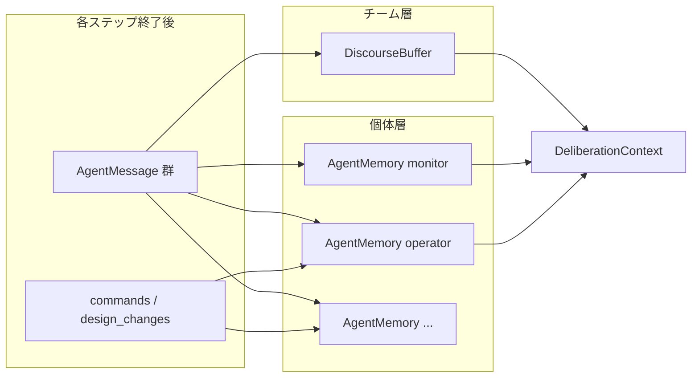
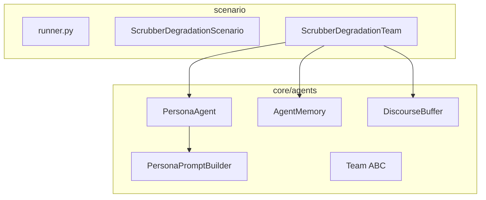

# Persona LLM 再設計 + Core OOP 骨格抽出

**ステータス**: Day 1–8 完了（本番 Ollama run は任意）  
**関連**: [persona_workshop_draft.md](persona_workshop_draft.md), [backlog.md](backlog.md) BL-001

## ゴール（2本柱）

1. **Persona 議論**: `labeled_llm_guarded` を Role 台本から Persona/MainRole + 2ラウンド知的議論 + **個体メモリ**へ（JSON 契約・ガード・rule fallback は維持）
2. **Core 置き換え**: `src/core/agent.py` / `src/core/simulation.py` の 2D bar 専用コードを削除し、ECLSS 向けの薄い **Agent / Team / Scenario** 骨格に差し替える

**制約**: プラグイン・DI・汎用 deliberation エンジン・async 化は **今回やらない**。scrubber_degradation 1 シナリオで end-to-end が通る最小抽象に留める。

---

## 進捗チェックリスト


| Day   | 内容                                             | 状態  |
| ----- | ---------------------------------------------- | --- |
| Day 1 | Core 骨格（types, Team/Scenario ABC, 旧 2D bar 削除） | ✅   |
| Day 2 | AgentMemory + DiscourseBuffer                  | ✅   |
| Day 3 | PersonaPromptBuilder + PersonaAgent            | ✅   |
| Day 4 | ScrubberDegradationTeam 移行 + 2ラウンド議論           | ✅   |
| Day 5 | ScrubberDegradationScenario + runner 薄化        | ✅   |
| Day 6 | スタブ persona + 回帰テスト                            | ✅   |
| Day 7 | **Persona 設計ワークショップ**（ユーザーとの議論）                | ✅   |
| Day 8 | agents.yaml 確定・ドキュメント更新                         | ✅   |


---

## メモリ設計（DiscourseBuffer との違い）

**結論: DiscourseBuffer だけでは不十分。2層メモリが必要。**


| 層         | クラス               | スコープ          | 中身                     | プロンプトでの役割        |
| --------- | ----------------- | ------------- | ---------------------- | ---------------- |
| **チーム共有** | `DiscourseBuffer` | 全エージェント共通     | 直近 N 件の `AgentMessage` | OpenForum の「会議録」 |
| **個体私有**  | `AgentMemory`     | `agent_id` ごと | 自分の過去発言・アクション・自己メモ     | 「私は前に何を言い、何をしたか」 |





### AgentMemory の更新ルール

各ステップ終了後、`TeamMemoryStore.commit_step()` が:

1. **自分の発言**: Round 1/2 の `message` + `reasoning` を 1 エントリに圧縮
2. **自分のアクション**: operator の `commands`、design_engineer の design change を記録
3. **LLM 自己メモ**（任意）: JSON の `"memory"` キー → metadata `llm_memory` 経由で追記

設定: `memory_limit` / `discourse_window` は `agents.yaml`（デフォルト 8 / 12）

### プロンプトセクション

- `## Team discourse` ← DiscourseBuffer
- `## Your memory` ← AgentMemory（このエージェント専用）
- `## This step so far` ← 同ステップ内の累積

### JSON 契約（議論フェーズ）

```json
{
  "message": "...",
  "reasoning": "...",
  "memory": "Fan boost at step 33 did not hold — watch bypass timing."
}
```

`memory` は optional。action フェーズでも optional。

---

## main_role と persona の違い


| 属性            | 役割                      | 粒度  |
| ------------- | ----------------------- | --- |
| **main_role** | 議論における専門アイデンティティ・視点のラベル | 1行  |
| **persona**   | 具体的な思考様式・条件付き行動指針       | 数行  |


- **main_role** = 「私は誰として話すか」（名札）
- **persona** = 専門家としての思考・議論スタイル（**シナリオ・閾値・イベントは書かない** — `## Situation` 層へ）

### Persona とシナリオの分離（Day 7 改訂）

persona に禁止: シナリオ名、ppm/step 閾値、異常イベント、commands/design カタログ。  
注入先: `_situation_context()`（ミッション+テレメトリ）、Output contract、agents.yaml `roles:`

```yaml
personas:
  monitor:
    main_role: "Environmental sentinel"
    persona: |
      Prioritize crew safety over band-comfort.
      Speak when CO2 rise exceeds ~30 ppm/step OR crosses 900 ppm.
      In Round 2, explicitly agree or challenge — cite numbers.
  operator:
    main_role: "Recovery tactician"
    persona: |
      Translate debate into the smallest effective intervention.
      Empty commands is valid when waiting for better diagnosis.
```

---

## 目標アーキテクチャ




### core/ レイアウト（実装済み）

```text
core/
  agents/
    types.py       # AgentMessage, StepAgentOutcome, DeliberationPhase
    base.py        # Team ABC, Persona dataclass
    memory.py      # AgentMemory, DiscourseBuffer, TeamMemoryStore
    persona.py     # TeamCharter, PersonaPromptBuilder, PersonaAgent
  scenario.py      # Scenario ABC
  llm/             # 既存維持
  event_log.py     # 既存維持
```

削除済み: `core/agent.py`, `core/simulation.py`

---

## 2ラウンド議論（8 LLM calls / step）


| Round | 呼び出し                                        | 契約                                        |
| ----- | ------------------------------------------- | ----------------------------------------- |
| 1     | monitor → diagnostician → operator → design | `message`, `reasoning`, optional `memory` |
| 2     | monitor, diagnostician                      | 同上（反応・異論）                                 |
| 2     | operator, design_engineer                   | action 契約 + optional `memory`             |


注: design_engineer の Round 1 は `_design_llm_eligible` 未満ではスキップ（旧挙動）。

---

## Day 別ロードマップ


| Day       | テーマ             | 完了条件                                     |
| --------- | --------------- | ---------------------------------------- |
| **Day 1** | Core 骨格         | 旧 2D bar 削除、`test_imports` green         |
| **Day 2** | メモリ層            | append/trim ユニットテスト green                |
| **Day 3** | PersonaAgent    | プロンプトセクション確認、`test_persona_prompt` green |
| **Day 4** | Scrubber チーム    | labeled + llm_guarded 動作                 |
| **Day 5** | Scenario 統合     | `run_scenario` API 不変                    |
| **Day 6** | テスト（スタブ）        | 全 scenario 回帰 green、persona 未確定で OK      |
| **Day 7** | Persona ワークショップ | 4体の main_role/persona 合意 ✅               |
| **Day 8** | 確定・仕上げ          | yaml 反映、docs 更新 ✅                         |


```text
Day1 → Day2 → Day3 → Day4 → Day5 → Day6 → Day7(ワークショップ) → Day8
```

---

## Persona 設計ワークショップ（Day 7）

**エージェント設計の中核。** ワークショップ合意前に `agents.yaml` の persona 本文を本番確定しない。


| 項目  | 内容                                                                                   |
| --- | ------------------------------------------------------------------------------------ |
| 入力  | `DEFAULT_PERSONAS` スタブ、[persona_workshop_draft.md](persona_workshop_draft.md)、シナリオ叙事 |
| 出力  | 4体分の確定 `main_role` + `persona`（yaml にそのまま貼れる形）                                       |


### 議論アジェンダ

各エージェント（monitor / diagnostician / operator / design_engineer）について:

1. **main_role** — 1行の専門アイデンティティ
2. **persona** — いつ話す/黙る、優先順位、Round 1/2 の振る舞い、他メンバーへの関わり方、アクション heuristics、`memory` の残し方
3. **チーム全体のバランス** — 個性の被り、空転防止、安全網との兼ね合い
4. **スモーク確認**（任意）— 1 step 分のプロンプトプレビュー

### Day 8

- 合意文案を `src/scenario/scrubber_degradation/agents.yaml` に反映
- `labeled_llm_guarded` で本番 run
- `docs/architecture.md` 等を更新

---

## 後方互換性


| 項目                             | 方針          |
| ------------------------------ | ----------- |
| `run_scenario(...)` API        | 不変          |
| `labeled` rule モード             | ロジック不変      |
| `from_role` / action JSON 必須キー | 不変          |
| `memory` JSON キー               | 新規 optional |


---

## リスクと緩和


| リスク                      | 緩和                                      |
| ------------------------ | --------------------------------------- |
| メモリと Discourse の重複       | プロンプトで役割を明示分離                           |
| トークン超過                   | `memory_limit=8`, `discourse_window=12` |
| main_role / persona の曖昧さ | persona に heuristic を書くルールを固定           |


---

## BL-001 との関係

ラベル付き 4 ID を維持した創発の中間段階。完全な unlabeled `mode: base` は [backlog.md](backlog.md) BL-001 で将来実験。

---

## Day 1–6 実装振り返り（2026-06-06）

### Day 1 — Core 骨格 ✅

`core/agents/types.py`, `base.py`, `core/scenario.py` 追加。旧 2D bar コード削除。Agent ABC は作らず `Persona` + `Team` ABC のみ（YAGNI）。

### Day 2 — メモリ層 ✅

`TeamMemoryStore.commit_step()` で 2層メモリを一括更新。LLM `memory` は metadata `llm_memory` 経由。

### Day 3 — PersonaAgent ✅

プロンプトに `agent_id:` / `phase:` マーカーでテスト容易化。

### Day 4 — Scrubber チーム ✅

2ラウンドフロー実装。design R1 は閾値ゲートでスキップ。monitor/diagnostician のみ rule fallback。

### Day 5 — Scenario 統合 ✅

`ScrubberDegradationScenario` + レジストリ委譲。runner の build ヘルパーは外部 API として残す。

### Day 6 — テスト・スタブ ✅

FakeClient 8-call 対応。persona は STUB のまま。12 tests green。

### Day 7 — Persona ワークショップ ✅

慎重派・明示的賛否・persona/シナリオ完全分離を合意。diagnostician は因果推測・問題特定に積極的。

### Day 8 — 確定・仕上げ ✅

`agents.yaml` と `DEFAULT_PERSONAS` に確定 persona を反映。`docs/architecture.md` / `docs/scenario-scrubber-degradation.md` 更新。12 tests green。