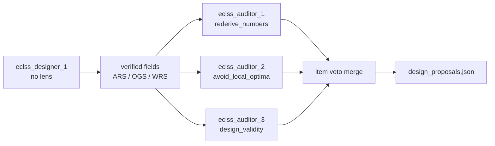

# 設計チーム・監査パネル・Storage

> **範囲**: `ssos_eclss_loop` の **tool-use designer** だけ。古典 LLM 議論と `labeled_rule_base` は変えない。  
> **由来**: 独立レンズ + 採用ゲート + ADK Storage スライス（2026-08-30）。実装済み。  
> 設計判断ループ本体: [tool_use_design_agent.md](tool_use_design_agent.md)。actor / designer 分離: [post_run_design_agent.md](post_run_design_agent.md)。

## ステータス

| ID | 内容 | 状態 |
| --- | --- | --- |
| designer-one | レンズなし designer 1 人が提案する | **done** |
| audit-panel | 採用ゲートで独立レンズ 3 人が項目を veto する | **done** |
| item-veto | reject された field だけ落とし、残りを採用する。空提案は残さない | **done** |
| local-optima | 2 本目のレンズを `avoid_local_optima` にする | **done** |
| storage | Session / Artifact / Claims を `core/storage` に置く（ADK Runner は移植しない） | **done** |
| isolation | 監査同士は結論を見ない。designer は監査を見ない | **done** |
| parallel-audit | designer のあと監査 3 人を並列に走らせる | **done** |
| slim-brief | スコアカードと短い本文。生の `evaluation_compact`（約 114k）は送らない | **done** |
| pin-veto | veto したキーは搭載中の値に固定する | **done** |
| iterate-complete | `iterate_apply_document` が省略キーを今回飛んだ機械で埋める | **done** |
| tests-docs | 独立性・項目 veto・空提案回避・count=1 回帰 | **done** |

## なぜ

tool-use の既定は長いあいだ designer 1 人だった。3 本の思考レンズを designer 側に置くと、同じ手（WRS だけ微調整）を繰り返す局所解に落ちることがあった。採用をスコアカード順だけにすると、その局所解がそのまま次ランに載る。

いまの分担はこうなっている。

```text
designer 1 人（レンズなし） = 何をサイズするか
監査 3 人（独立レンズ）     = 提案された項目のうち何を落とすか
Python                      = 証拠・再シミュ・物理ゲート・項目マージ・記録
```

監査は機械を発明しない。iterate は列挙したキーだけを新しい YAML に書くので、キーを落とすとその項目は初期値に戻る。veto したキーは搭載中の値に固定し、3 項目そろった profile を出す。全部 veto されたときは搭載中の機械を残す。

## マルチエージェント

対象は **tool-use 経路**。`design.team.count` の既定は **1**。archetypes は空。persona は共有文だけで、思考レンズは付けない。

```text
eclss_designer_1 ── 決定ループ ── 検証済み candidate
```

`count > 1` でも tool-use は先頭の 1 人だけを使う。追加の designer は古典 LLM 議論用の名簿に残る。

設定は [`src/scenario/ssos_eclss_loop/agents.yaml`](../../../src/scenario/ssos_eclss_loop/agents.yaml)。

| 項目 | 値 |
| --- | --- |
| `design.team.count` | `1` |
| `design.team.id_prefix` | `eclss_designer` |
| `design.team.archetypes` | `[]` |
| `design.team.bias_direction` | 空なら objective から生成（生存 → CRITICAL 減 → 小型） |

実装: [`src/scenario/agents/ssos_post_run_design.py`](../../../src/scenario/agents/ssos_post_run_design.py) の `_tool_use_propose`。`audit.enabled` が無い設定は従来どおり designer 1 人で終わり、root に `tool_trace.jsonl` を書く。

## 監査エージェント

監査は `team.count` の外。`design.audit` が名簿を持つ。

| 項目 | 値 |
| --- | --- |
| `design.audit.enabled` | `true`（ブロックが無ければオフ） |
| `design.audit.count` | `3` |
| `design.audit.id_prefix` | `eclss_auditor` |
| `design.audit.archetypes` | `rederive_numbers` / `avoid_local_optima` / `design_validity` |
| `design.audit.llm.max_tokens` | `2048`（`think` は `design.llm` のまま） |



3 人は同じ短い brief（スコアカード、短い本文、搭載中 vs 提案、チェーンメモ）を見る。互いの結論は見ない。designer のあと並列に走る。能力値と履歴は Python が載せる。監査は tool を選ばない。

### レンズ

定義は [`src/core/agents/persona.py`](../../../src/core/agents/persona.py) の `ARCHETYPE_LENSES`。

| レンズ | 見るもの |
| --- | --- |
| `rederive_numbers` | 数値を自分で再導出する。再構成していない数字を受け取るな |
| `avoid_local_optima` | 同じ手の繰り返し（WRS だけ微調整など）を局所解と見て拒否する |
| `design_validity` | サイズした機械が作れて回るかを見る |

`break_conclusion` は残してある（古い YAML が `ValueError` にならないように）。既定の 2 本目は `avoid_local_optima`。

### 契約

1 人 1 JSON。機械も field も値も発明できない。

```json
{"decision": "approve", "message": "...", "reasoning": "..."}
{"decision": "reject",
 "rejected_fields": ["plant_sim.wrs.max_feed_l_per_operation"],
 "message": "...", "reasoning": "..."}
```

`rejected_fields` は提案にある `CAPACITY_KEYS` だけ有効。知らない id は無視する。`adopt` や空の decision は棄権。

### 項目マージ

実装は [`src/scenario/ssos_eclss_loop/design_ensemble.py`](../../../src/scenario/ssos_eclss_loop/design_ensemble.py) の `integrate_audit_panel`。

1. designer の検証済み field を起点にする  
2. 3 人の `rejected_fields` の和集合を取る  
3. veto したキーは搭載中の値に固定し、残りは提案を採用する  
4. 3 キーそろった profile を出す（後の apply が 1 項目を黙って戻さないように）  
5. 提案した変更が全部 veto されたら搭載中の機械を残す（`kept_to_proceed`）  
6. ピン留め、または全部 veto は `provisional_final`（その組み合わせは未検証）  
7. 3 人が approve、または棄権だけなら designer の物理ステータスを残す  

| `decision_source` | 意味 |
| --- | --- |
| `tool_use_audit_panel` | 項目は落ちていない |
| `tool_use_audit_panel:item_veto` | 一部の field を搭載中の値に戻した |
| `tool_use_audit_panel:kept_to_proceed` | 変更が全部 veto され、搭載中の機械のまま |

本文は designer の message / reasoning のあとに、3 人の所見を足す。4 人目の合成 LLM は置かない。

## Storage

ADK の Runner / LlmAgent / tool-use ループは移植しない。残すのは Storage / Service スライスだけ。`core/` は `scenario/` を import しない。

実装は [`src/core/storage/`](../../../src/core/storage/)。

```text
<run_dir>/
  design_storage/
    sessions/
      eclss_designer_1.jsonl
      eclss_auditor_1.jsonl
      eclss_auditor_2.jsonl
      eclss_auditor_3.jsonl
    claims.json
  design_review_report.json      # designer の報告。監査は追記し、置き換えない
  candidate_rankings.json
```

| オブジェクト | ADK 相当 | 役割 |
| --- | --- | --- |
| `SessionStore` | SessionService | `agent_id` ごとの append-only JSONL。peer は読まない |
| `ArtifactStore` | ArtifactService | run_dir の JSON / EventLog の薄いラッパ |
| `ClaimsRegistry` | なし（このリポジトリのゲート） | 採用した field を standing、落とした主張を retract、本文を掃く |

Claims の検索語は namespaced id と `key=value` / `key: value`。裸の `candidate_001` は部分一致するので使わない。スキップトークンは `not adopted` / `withdrawn` / `[retracted]` / `this claim is retracted`。standing の語句はヒットしない。

掃きは designer 本文に対して先に走り、そのあと監査所見を足す。所見が retracted 語句を含んでも、統合文を丸ごと消さない。

## 実装箇所

| ファイル | 役割 |
| --- | --- |
| `src/core/agents/persona.py` | レンズ文。`avoid_local_optima` を含む |
| `src/core/storage/` | Session / Artifact / Claims |
| `src/scenario/ssos_eclss_loop/agents.yaml` | designer 1 + audit 3 |
| `src/scenario/ssos_eclss_loop/design_ensemble.py` | brief、1 ターン監査、項目マージ |
| `src/scenario/agents/ssos_post_run_design.py` | `_tool_use_propose` のオーケストレーション |
| `src/scenario/agents/ssos_tool_use_design.py` | designer の決定ループ。ほぼそのまま |
| `src/scenario/ssos_eclss_loop/design_tools.py` | `work_dir`。監査オンでも designer は run_dir に書く |

## 検証

| テスト | 見ていること |
| --- | --- |
| `tests/scenario/test_ssos_independent_design.py` | 3 人名簿、項目 veto、空提案回避、発明 field の無視、棄権 |
| `tests/scenario/test_ssos_tool_use_design.py` | 監査 2 が監査 1 の結論を見ない。designer にレンズ文が無い |
| `tests/core/test_design_storage.py` | session 隔離、claims sweep |
| `tests/scenario/test_archetypes.py` | `avoid_local_optima` が既知 |

`python3 -m pytest tests/core/test_design_storage.py tests/scenario/test_ssos_independent_design.py tests/scenario/test_ssos_tool_use_design.py tests/scenario/test_archetypes.py`
