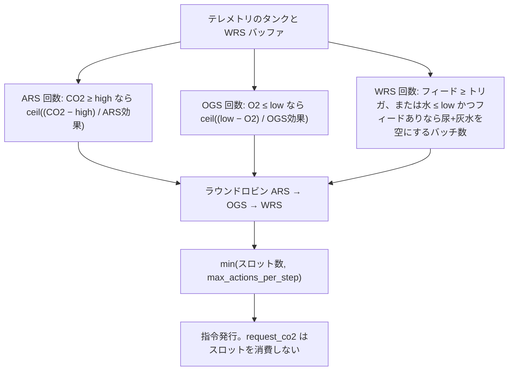

# ラベル付きルールベース運用（`ssos_eclss_loop`）

本メモは **シミュレーション中のアクター**（`labeled_rule_base`）の実装設計です。ラン後の設計チームは別系統です（[ラン後 design エージェント](post_run_design_agent.md)）。LLM アクターも同じ YAML キー `max_actions_per_step` を使いますが、意味が違います（**誰が指令を出せるか**の上限であり、物理量から積んだ要求リストではありません）。

実装: `src/scenario/agents/ssos_eclss_loop_team.py`。しきい値: `src/scenario/ssos_eclss_loop/scenario.yaml`。ペイロード: `src/scenario/ssos_eclss_loop/agents.yaml` の `actor.policy`。運用シナリオ: [ssos_eclss_loop](../../scenario-ssos-eclss-loop.md)。プラント物理: [Plant Sim バックエンド](plant_sim_backend.md)。生存判定と同じ YAML キー: [乗員サバイバル](occupant_survival.md)。

`labeled_rule_base` は再現可能な運用ポリシーの足場です。仮想世界の合否はシミュレータと検証しきい値が決めます。ルール文が合否そのものではありません。

## 以前の形が失敗した理由

同じ関数（`_labeled_recovery`）で三度形を変えました。

| 形 | やったこと | なぜ誤りか |
| --- | --- | --- |
| サブシステム一発 | ARS/OGS/WRS を「エピソード」あたり高々1回。`max_actions_per_step` を無視 | max を上げても Ops が変わらない。1回では WARNING を抜けられず、ラッチが再試行を止める |
| 常に max 埋め | 毎ステップちょうど `max_actions_per_step` 件（必要分のあと ARS→OGS→WRS で埋め） | SAFE でも無駄な指令。max が上限ではなくノルマになる |
| **現行: 必要量を積んでから上限** | WARNING/CRITICAL を**抜ける**のに必要な回数を数え、ラウンドロビンし、`min(必要, max)` | llm と同じ「max は天井」。プラントが本当に複数回要るときだけ Ops が max に追従する |

一発時代のダッシュボード症状: max 3 と max 9 で `operational_command_count` が同じ（負荷ステップあたり ARS・OGS・WRS がほぼ1ずつ）。

## パイプライン（観測ステップごと）

```text
テレメトリ + ヘルス帯
  → 悪い帯を抜ける（または今ステップの WRS フィードを空にする）のに必要な ARS / OGS / WRS 回数
  → ラウンドロビン ARS → OGS → WRS
  → 先頭から max_actions_per_step スロット
  → 運用指令を発行（任意の request_co2 は OGS に付随）
  → バックエンドが順に適用
```

三資源とも SAFE → 指令リストは空（パディングなし）。



## ヘルス帯と運用トリガ

運用も生存も同じ `thresholds` キーです。シナリオ既定（乗員 50）:

| 資源 | SAFE | WARNING | CRITICAL |
| --- | --- | --- | --- |
| キャビン CO2 (kg) | < 2.0 | 2.0 以上 8.0 未満 | ≥ 8.0 |
| O2 (kg) | > 6.0 | 1.0 超〜6.0 | ≤ 1.0 |
| プロダクト水 (L) | > 50 | 25 超〜50 | ≤ 25 |

`merge_labeled_policy_from_thresholds()` がラン開始時に `co2_storage_high_kg`、`co2_storage_critical_kg`、`o2_storage_low_kg`、`product_water_low_l` を `actor.policy` にコピーします。LLM プロンプトにこの policy は入りません。

## 何回出すか（物理量から積む回数）

回数は `ceil(不足 / 1回あたり効果)` です。帯の縁ちょうどでも少なくとも1回出すため微小な ε を足します。タンクが悪い帯にいる限り、**次のステップでも数え直します**。`ars_invoked` / `ogs_invoked` は前回指令の記録です（SAFE に戻るか、前回が効いていなければクリア）。新しい必要量の要求は**止めません**。

### ARS

`co2_storage_kg ≥ co2_storage_high_kg` のあいだ要求します。

- 不足: `(co2 − high) + ε`（HIGH を**下回る**必要がある）。
- 効果（plant_sim、チーム設定に `plant_sim` があるとき）: 銘板 `capacity_kg_day × ars_operation_seconds / 86400 × (ars_goal.initial_co2_mass / reference_goal_co2_kg)`。実除去はキャビン在庫でクリップされ得ます。
- 効果（LoopMock）: `mock_dynamics.ars_co2_reduction_kg` を goal / `ars_reference_co2_mass_kg` でスケール。
- CRITICAL（`co2 ≥ co2_storage_critical_kg`）: ペイロード `initial_co2_mass × 1.5`。効果見積もりもこの増量後の質量を使います。

### OGS

`o2_storage_kg ≤ o2_storage_low_kg` のあいだ要求します。

- 不足: `(low − o2) + ε`（LOW を**上回る**必要がある）。
- 効果: plant_sim 設定があるとき `min(ogs_goal.input_water_mass / WATER_PER_O2, プラント OGS 量子)`。なければ水 / `WATER_PER_O2` のみ。

`request_co2_before_ogs: true`（既定 **false**）かつ `co2_requested` がまだ false なら、OGS の前に `request_co2`。OGS が再アームする（O₂ が LOW を上回る）まで原料要求は高々1回。同じステップの追加 OGS では再要求しません。このサービス呼び出しは `max_actions_per_step` を消費しません。LoopMock で `true` だと OGS Sabatier と二重に CO₂ を引くことがあります（中間バッファなし）。

### WRS

尿+灰水 ≥ `policy.wrs_feed_trigger_l`（既定 0.5 L）、**または** プロダクト水 ≤ `product_water_low_l` **かつ** 今ステップにフィードがあるとき要求します。

回数は現在の尿・灰水バッファを空にする `wrs_goal.urine_volume` バッチ数です（`_wrs_batches_to_empty`、上限 64）。バッファ空の追加 WRS ではプロダクトタンクは上がらないので、ルールはフィードを捏造しません。

プロダクト水 WARNING でも **尿・灰水ゼロ** → そのステップの WRS は 0。代謝がバッファを満たすのを待ちます。

## 上限とインターリーブ

`agents.actor.max_actions_per_step` は **天井** です。

1. `{ars, ogs, wrs}` の回数を積む。
2. ラウンドロビン: ARS、OGS、WRS、ARS、… 各サブシステムは自分の回数まで。
3. 先頭から `max_actions_per_step` スロットを残す。

例: ARS=4, OGS=2, WRS=1 で max=5 → `ars, ogs, wrs, ars, ogs`。

### llm と labeled の違い

| | llm | labeled_rule_base |
| --- | --- | --- |
| max が数えるもの | 回転するアクション窓のアクター数 | サブシステムアクション（ARS/OGS/WRS） |
| `actor.team.count` でクランプ | する（人数より多いアクション代表は作れない） | しない（生存オペレータ1人でも複数指令可） |
| SAFE のとき | エージェントがスキップし得る | 運用指令なし |

`issued_by` は `eclss_actor_{(start + slot) % N}` で回します。名簿が減ると残り id にラップします。

## 設定

```yaml
# scenario.yaml
thresholds:
  co2_storage_high_kg: 2.0
  co2_storage_critical_kg: 8.0
  o2_storage_low_kg: 6.0
  product_water_low_l: 50.0
agents:
  actor:
    max_actions_per_step: 2  # labeled: アクション上限 / llm: アクター上限（シナリオ既定）
```

```yaml
# agents.yaml — labeled のペイロードのみ（llm は policy を読まない）
actor:
  policy:
    request_co2_before_ogs: false
    wrs_feed_trigger_l: 0.5
    ars_goal:
      initial_co2_mass: 1.8
    ogs_goal:
      input_water_mass: 0.15
    wrs_goal:
      urine_volume: 2.0
```

CLI: `--set agents.actor.max_actions_per_step=8`。llm はその値を `actor.team.count` でクランプし、labeled はしません。`scenario_run` は `plant_sim`、`simulation`、`mock_dynamics`、`thresholds` をアクター設定にコピーするので、その YAML ブロックがあるとき効果見積もりが plant_sim を見られます。

`ogs_goal.input_water_mass` が policy に無いときのコード側フォールバックは `0.015` kg。リポジトリの `agents.yaml` 既定は `0.15` です。

## 関連

- [ssos_eclss_loop シナリオ](../../scenario-ssos-eclss-loop.md)
- [乗員サバイバル](occupant_survival.md)
- [Plant Sim backend 解説](plant_sim_backend.md)
- [事後設計エージェント](post_run_design_agent.md)
- [architecture.md](../../architecture.md)

## テスト

`tests/scenario/test_ssos_eclss_loop_team.py` — 帯を抜ける繰り返し、WRS 排水バッチ、上限、`request_co2` がスロットを消費しないこと、labeled の max がチーム人数でクランプされないこと。

`tests/scenario/test_ssos_eclss_loop.py` — mock の labeled ランでキャビン CO2 が HIGH を超えたら ARS が始まること（既定は 1.3 kg からの増加）。
