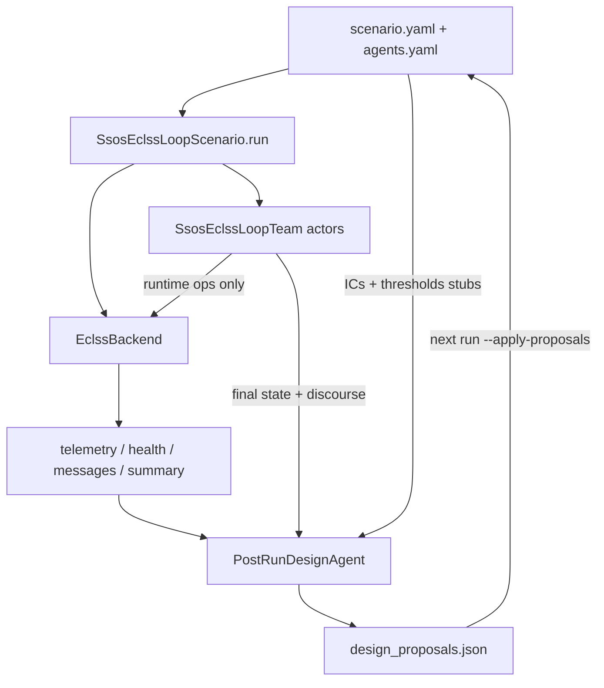

# 事後設計エージェント — actor / designer 分離

> **範囲**: `ssos_eclss_loop` のみ。`scrubber_degradation` は現行のまま（同じチームが事後提案、`--agents-mode`）。  
> **由来**: Cursor plan「Post-run design agent」（`.cursor/plans/post-run_design_agent_9cfab49b.plan.md`）。**実装済み**（`feat/post-run-design-agent`）。  
> 運用手順: [scenario-ssos-eclss-loop.md](../../scenario-ssos-eclss-loop.md)、[cli.md](../../cli.md)。乗員減員は [occupant_survival.md](occupant_survival.md)。

用語は **actor**（シミュレーション内の運用エージェント）と **designer**（ラン終了後の設計エージェント）。

> **新しい経路**: `design.mode: llm` かつ `design.tool_use.enabled: true`（現行の既定）では、ここで説明する designer は Tool Use 処理能力 designer に置き換わる → [tool_use_design_agent.md](tool_use_design_agent.md)。以下は `labeled_rule_base` と `tool_use.enabled: false` に引き続き適用される。

## ステータス（プラン todos）

| ID | 内容 | 状態 |
| --- | --- | --- |
| branch | `feat/post-run-design-agent` | **done** |
| config-cli | `agents.actor` / `agents.design` と `--actor-mode` / `--design-mode` | **done** |
| design-agent | `PostRunDesignAgent`（designer 4 人）+ `DesignReviewBundle` | **done** |
| decouple-sim-team | `SsosEclssLoopTeam` から事後設計を外し、`scenario_run` から呼ぶ | **done** |
| tests | labeled 閉ループ、混合モード、空提案 skip | **done** |
| docs | AGENTS / architecture / cli / ssos シナリオの ja/en | **done** |
| unbounded-changes | 代表 1 体の `changes` 件数に上限なし | **done**（プラン後の追加） |
| survival-bind | `plant_sim.crew.size` と `actor.team.count` をロックステップ | **done**（main の乗員サバイバルとマージ） |

## なぜ

`SsosEclssLoopTeam` がランタイム運用と事後設計を兼任していた。設計を賢くするには actor 全員に大きなモデルが必要になる。役割を分ける:

| 種類 | いつ動く | 役割 | id_prefix | モデル（いまの既定。後で変える） |
| --- | --- | --- | --- | --- |
| actor | 各ステップ | 会話 + ARS/OGS/WRS 運用コマンドのみ | `eclss_actor` → `eclss_actor_1` … `_50` | vLLM `qwen3-8b`。`labeled_rule_base` 可 |
| designer | **ラン終了後だけ** | 初期値・テレメトリ・actor 最終状態を見て `design_proposals.json` | `eclss_designer` → `eclss_designer_1` … `_4` | vLLM `qwen3-8b`。`max_tokens: 2048` |

検証の合否は `src/scenario/ssos_eclss_loop/health.py` の決定論チェック。設計 LLM に pass/fail はさせない。LLM / Persona は `environment/` に入れない。

`plant_sim` では乗員と **actor** が同じ人数で減る。**designer は減らない**（乗員全滅後も `eclss_designer_*` が提案する）。



## 設定と CLI（実装）

`scenario.yaml`:

```yaml
agents:
  actor:
    mode: none                 # none | labeled_rule_base | llm
    max_actions_per_step: 2    # llm / labeled の step あたりコマンド上限
  design: {}
    # design.mode 省略時は actor.mode を継承。明示 none で設計オフ
```

`agents.yaml` の要点:

- actor `team.count: 50` は `plant_sim.crew.size` と一致させる
- actor `policy` は labeled 運用プロファイル（llm は読まない）
- `design.llm` は actor と独立。省略しても actor モデルを流用しない

継承: `agents.design.mode` 省略時は `agents.actor.mode`。2-run smoke は `--actor-mode labeled_rule_base` だけで設計も labeled。`actor.mode: none` かつ設計だけ labeled/llm も可。

CLI（ssos）:

- `--actor-mode` → `agents.actor.mode`
- `--design-mode` → `agents.design.mode`
- `--llm-provider` / `--llm-model` — 両方 `llm` だと両側を同じ値で潰す。URL / モデルを分けるなら `--set agents.actor.llm.base_url=` / `--set agents.design.llm.base_url=`（`.model` も同様）
- `--agents-mode` — ssos では `--actor-mode` の非推奨エイリアス。両方指定はエラー。scrubber は `--agents-mode` のみ

キラー組み合わせ: `--actor-mode labeled_rule_base --design-mode llm`。

```bash
python3 -m tools.cli run ssos_eclss_loop --backend mock --actor-mode labeled_rule_base --steps 20 \
  --run-id cloud-smoke-run1 --set iteration.enabled=false
```

## 実装の置き場所

| パス | 役割 |
| --- | --- |
| `src/scenario/ssos_eclss_loop/agent_config.py` | 入れ子の正規化と mode 解決。レガシー `agents.mode` は actor へ持ち上げ |
| `src/scenario/agents/ssos_post_run_design.py` | `PostRunDesignAgent` + `DesignReviewBundle`。`Team` 非継承、`run_step` なし |
| `src/scenario/ssos_eclss_loop/scenario_run.py` | ループ後に `design_agent.propose(bundle)`。`bind_plant_sim_crew_and_team` は `actor.team.count` |
| `src/scenario/agents/ssos_eclss_loop_team.py` | actor は運用のみ。`set_crew_alive` で乗員同期 |
| `src/scenario/ssos_eclss_loop/design_proposals.py` | ルール経路は `build_design_proposals_from_run` |

llm 時は designer 全員が 1 ラウンド話し合ったあと、**代表 1 人**が `changes` を出す。件数に上限はない（空ならファイルを書かない）。labeled の `proposed_by` は `eclss_designer_1`。**policy 数値はプロンプトに入れない**。

`summary` に `actor_mode`, `design_mode`, `design_proposed_by`。`agents_mode` は `actor_mode` と同じ（ダッシュボード互換）。

## 連鎖（`scenario.yaml` の `iteration:` / `ea run --iterate`）

連鎖ジョブの正本は `src/scenario/ssos_eclss_loop/scenario.yaml` の `iteration:`（別ファイルにしない）。既定は `enabled: true` なので `ea run ssos_eclss_loop` だけで連鎖し、`--iterate` と同じイテレーション／ステップ進捗をターミナルに出す。回数だけ変えるなら `--iterate N`。CLI が YAML より優先。

```bash
python3 -m tools.cli run ssos_eclss_loop --iterate 10 --backend plant_sim \
  --actor-mode labeled_rule_base --design-mode llm --inject-failures --steps 50 \
  --run-id design-iter-10
```

- 設計提案の**生成**は unified の事後 designer（既定は tool-use）。連鎖は生成ロジックを差し替えない
- ラン k のシミュはラン k-1 で採用した `applied_proposals.json` を unified の `apply_design_proposals` で適用する（`capacity_profile` 含む）
- `set_parameter`（`thresholds.*`）は連鎖では自動適用しない。`ea run` の既定は `--approve-provisional` オン（INFO を出して LLM 提案を自動承認し、人間の介在なしにループを閉じる）。監督ゲートを戻すには `--no-approve-provisional`
- 空・不採用の提案でも連鎖は止めず、直前の適用ファイル（まだ無ければ初期 YAML）のまま続ける
- 最後のランは検証専用。そこで出た提案は未検証
- 連鎖後に `design.mode=none` の baseline / final replay を回し、その `crew_remaining` で `IMPROVED` / `NOT_IMPROVED` / `INCONCLUSIVE` を決める
- ターミナルとダッシュボードでイテレーション進捗・子 run（`01/` など）を可視化する

## やらないこと（プランどおり未着手）

- scrubber の分離
- 提案スキーマや `--apply-proposals` の意味変更
- labeled 設計への `graph_rewire` 追加
- One Piece への要求 pull / provenance 拡張
- 設計 LLM による合否判定

## 関連

- [scenario-ssos-eclss-loop.md](../../scenario-ssos-eclss-loop.md)
- [architecture.md](../../architecture.md)
- [AGENTS.md](../../AGENTS.md)
- [同種エージェントチーム](../agents/homogeneous_agent_team_plan.md)
- [乗員サバイバル](occupant_survival.md)
- [ラベル付きルールベース](labeled_rule_base.md)
- [SSOS ECLSS 接合プラン](ssos_eclss_loop_connection_plan.md)
