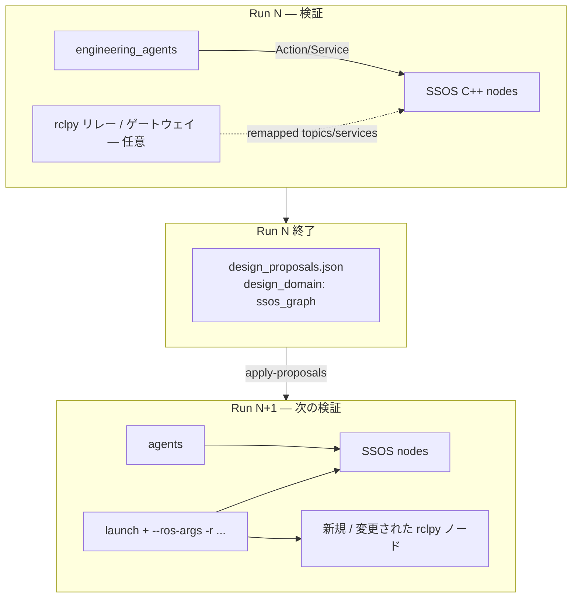

# SSOS DDS グラフへの外部ノード追加・接続変更 — 調査レポート

> **調査日**: 2026-06-14  
> **問い**: `engineering_agents` から SSOS の DDS 接続にノードを追加し、電力・物質フローにエンジニアとして手を加えられるか。C++ 全再ビルドを避けられるか。  
> **前提**: ランタイム恒久トポロジ変更は行わず、**1 Run 後の提案を次 Run に反映**する設計思想（`design_proposals.json`）に準拠。

---

## 1. エグゼクティブサマリ

| 結論 | 内容 |
|------|------|
| **部分的に可能** | 既存の **Topic / Service / Action 名**の間に、**rclpy ノード + launch remapping** で「配管・ルータ」を差し込める余地がある |
| **完全な scrubber 型 `add_edge` の直接移植は不可** | SSOS 実機側の物質・電力結合は **C++ ノード内のハードコードされた client/server** が主で、Mock の `TopologyGraph` のような可変グラフ API はない |
| **再ビルド回避の現実的レンジ** | **運用パラメータ・goal プロファイル**（Phase 5 済）→ **launch 時 remapping + 外部中継ノード** → **新 Service/Action サーバ（rclpy）** まで。既存サブシステムの **内部 Behavior Tree を変えない限り**「ARS 内部に新ベッドを追加」は upstream 変更が必要 |
| **推奨次ステップ** | (1) グラフ可視化スモーク (2) `grey_water` / `/ddcu/load_request` の **サービスゲートウェイ PoC** (3) 事後提案スキーマに `graph_rewire` 種別を追加するか判断 |

---

## 2. SSOS の接続モデル（実測 + ソース）

### 2.1 ランタイムグラフ（headless 起動時）

Docker コンテナ `ssos` + `ssos-eclss-headless.sh` より:

**ノード例**

```
/air_revitalisation
/oxygen_generation_system
/water_recovery_system
/bcdu_node, /ddcu_node, /mbsu_node, /battery_manager, /solar_power_node
```

**物質フローに関わるインターフェース**

| 種別 | 名前 | 提供者 | 主な呼び出し元 |
|------|------|--------|----------------|
| Topic pub | `/co2_storage` | ARS | OGS（subscribe） |
| Topic pub | `/o2_storage` | OGS | Crew / エージェント（subscribe） |
| Topic pub | `/wrs/product_water_reserve` | WRS | Crew / OGS（client） |
| Service | `/ars/request_co2` | ARS | OGS（client） |
| Service | `/grey_water` | WRS | OGS（client） |
| Service | `/wrs/product_water_request` | WRS | OGS / Crew |
| Service | `/ogs/request_o2` | OGS | Crew |
| Action | `air_revitalisation` | ARS | Crew / `engineering_agents` |
| Action | `oxygen_generation` | OGS | Crew / `engineering_agents` |
| Action | `water_recovery_systems` | WRS | Crew / `engineering_agents` |

**電力フロー**

| 種別 | 名前 | 備考 |
|------|------|------|
| Topic | `/solar_controller/ssu_voltage_v` | 太陽電池模擬 |
| Topic | `/ddcu/input_voltage`, `/ddcu/output_voltage` | MBSU → DDCU |
| Service | `/ddcu/load_request` | **ARS が client**（起動時通電） |
| Topic | `/bcdu/status` | BCDU 状態 |
| Service | `/bcdu/operation` 等 | 放電制御（Phase 3 未完全接合） |

### 2.2 結合は「グラフ」ではなく「ノード内クライアント」

`space_station_eclss` ソース（コンテナ内 `~/ssos_ws`）より、**系間接続は C++ で固定**:

```cpp
// ogs_systems.cpp（抜粋）
water_client_ = create_client<RequestProductWater>("/wrs/product_water_request");
co2_client_   = create_client<Co2Request>("/ars/request_co2");
gray_water_client_ = create_client<GreyWater>("/grey_water");

// ars_systems.cpp（抜粋）
load_client_ = create_client<Load>("/ddcu/load_request");
// + /ars/request_co2 サービスサーバ
```

つまり SSOS の「配管図」は **launch で並ぶプロセス群 + DDS 上の名前付きエンドポイント** であり、`engineering_agents` Mock の `add_edge(manifold → scrubber)` のような **ランタイム可変グラフオブジェクトは SSOS 側に存在しない**。

---

## 3. ROS 2 / DDS で「接続を変える」とは何か

### 3.1 Topic（出版購読）

```text
[ARS] --publish--> /co2_storage --subscribe--> [OGS]
```

**外部ノードでできること**

| 手法 | 再ビルド | 説明 |
|------|----------|------|
| **購読のみ（監視）** | 不要 | `engineering_agents` の rclpy 常駐テレメトリ（Phase 5 後続）と同型 |
| **リレー（T 字 / バイパス）** | 不要 | 新ノードが `/co2_storage` を subscribe し `/co2_storage_tapped` を publish。下流を remapping で付け替え |
| **合成・フィルタ** | 不要 | 複数 topic を読み、別 topic に書く（仮想タンク等） |

**制約**: 元の Subscriber が **古い topic 名のまま**なら、リレーだけでは流量は変わらない。**下流クライアントの remapping** か **呼び出し側の差し替え**が必要。

### 3.2 Service（RPC）

```text
[OGS client] --call--> /grey_water <--server-- [WRS]
```

**外部ノードでできること**

| 手法 | 再ビルド | 説明 |
|------|----------|------|
| **ゲートウェイ** | 不要 | WRS を `/grey_water/wrs` に remap し、rclpy が `/grey_water` で受けて転送（バイパス・流量制限・ログ） |
| **新サービス追加** | 不要（サーバは rclpy） | 新ノード `co2_buffer` が `/co2_buffer/withdraw` を提供 — **OGS は呼ばない**（呼び出し側変更が必要） |
| **同名サービスの二重提供** | **不可** | DDS 上、同一サービス名にサーバは実質 1 つ |

**scrubber の `add_edge` に最も近いのはゲートウェイ + remapping**。

### 3.3 Action（長時間タスク）

既存 Action サーバ（`air_revitalisation` 等）への goal 送信は **Phase 1–4 で実装済み**。  
新 Action タイプを SSOS が知らない場合、**エージェントがオーケストレータ**として複数 Service/Action を組み合わせる形になる（Crew Simulation 代替と同じ）。

### 3.4 パラメータ（`set_parameter`）

起動時 YAML / 動的 `ros2 param set` で効率・閾値を変える。**内部配線は変わらない**が、**次 Run 入力**として `design_proposals` の `set_parameter` に載せやすい（Phase 5 済）。

---

## 4. `engineering_agents` 現状との対応

| レイヤ | scrubber_degradation | ssos_eclss_loop（現状） | SSOS 実グラフへの拡張余地 |
|--------|---------------------|-------------------------|---------------------------|
| ランタイム操作 | RecoveryCommand | ARS/OGS Action, CO₂ Service | 同左 + 外部リレーノード |
| 事後提案 | `design_proposals`（scrubber: add_edge, add_node） | `design_proposals`（ssos_graph: action_profile 等） | **`graph_rewire`**（実装済み apply プラグイン） |
| 次 Run 反映 | ダッシュボード仮適用 | `--apply-proposals` | remapping manifest + 外部ノード launch |
| トポロジモデル | `DesignStateManager` | なし | `RosGraphModel`（要実装） |

**重要**: ユーザーの意図（ランタイム設計変更なし・次 Run 反映）は、`design_proposals.json`（`design_domain: ssos_graph`）と **整合している**。

---

## 5. シナリオ別フィージビリティ

### 5.1 物質フロー

| エンジニアリング意図 | ビルドなしで可能か | 実現パターン | 難易度 |
|---------------------|-------------------|--------------|--------|
| OGS 前に CO₂ バッファを挟む | **条件付き可** | `/ars/request_co2` ゲートウェイ + ARS/OGS の remapping | 高 |
| グレイ水のバイパス経路 | **条件付き可** | `/grey_water` ゲートウェイ（§3.2） | 中 |
| 新タンク topic の追加 | **可** | rclpy が `/virtual/co2_buffer` を pub — **エージェントだけ**が参照 | 低 |
| ARS 内部に新デシカントベッド | **不可**（upstream） | C++ BT / パラメータ追加 | — |
| Crew 代謝の挿入 | **可** | `engineering_agents` が Crew の代わりに Action/Service を駆動（済） | 低 |

### 5.2 電力フロー

| エンジニアリング意図 | ビルドなしで可能か | 実現パターン | 難易度 |
|---------------------|-------------------|--------------|--------|
| DDCU 出力の監視 | **可** | subscribe `/ddcu/output_voltage`（EPS Phase 3 一部済） | 低 |
| ARS 通電前に電力フィルタ | **条件付き可** | `/ddcu/load_request` ゲートウェイ + ARS の client remapping | 高 |
| MBSU チャネル再ルーティング | **条件付き可** | topic リレー + MBSU/DDCU remapping | 高 |
| 新バッテリノード追加 | **部分可** | rclpy で仮想電源 topic を publish — **既存ノードは見ない** | 中 |

### 5.3 「ノード追加」の意味の切り分け

| 意味 | 可能か |
|------|--------|
| **DDS グラフに新プロセスを参加させる** | **はい** — 同一 `ROS_DOMAIN_ID` で rclpy ノードを起動 |
| **既存 SSOS ノードがその新ノードを自動的に使う** | **いいえ** — client/server の名前がコードに固定されているため |
| **エージェントが新ノード経由でフローを組み立てる** | **はい** — Crew 代替として orchestration を拡張 |
| **次 Run で配線が変わったように見せる** | **はい** — remapping + 外部ノード launch を提案 JSON に含める |

---

## 6. 再ビルドが不要な「設計変更」の技術スタック（提案）



### Tier 0 — 済（Phase 5）

- `action_profile`, `service_config`, `set_parameter`
- 閾値・goal フィールド・タイムアウト

### Tier 1 — 監視・デジタルツイン（低工数）

- `ros2 topic echo` / rclpy 常駐で **実グラフのスナップショット**を `telemetry.jsonl` に併記
- `ros2 node info` / `ros2 service list` から **接続表**を自動生成

### Tier 2 — ゲートウェイ PoC（中工数）

1. **`grey_water` ルータ**（rclpy）  
   - WRS: `--ros-args -r /grey_water:=/grey_water/wrs`  
   - Router: server `/grey_water` → client `/grey_water/wrs`  
   - 提案: `{"change_kind":"graph_rewire","payload":{"kind":"service_gateway","public":"/grey_water","backend":"/grey_water/wrs"}}`

2. **`/co2_storage` タップ**（topic relay）  
   - ログ・遅延・飽和モデルを外部ノードで注入

### Tier 3 — 事後提案スキーマ拡張（中〜高工数）

`design_proposals.json`（`change_kind: graph_rewire`）例:

```json
{
  "change_kind": "graph_rewire",
  "payload": {
    "component": "rclpy_gateway",
    "entrypoint": "environment.ssos.gateways.grey_water_router:main",
    "remaps": [
      {"from": "/grey_water", "to": "/grey_water/wrs", "node": "water_recovery_system"}
    ],
    "launch_after": "ssos-eclss-headless.sh"
  }
}
```

次 Run では `--apply-proposals` が:

1. `scenario.yaml` / launch manifest を更新  
2. ゲートウェイノードを `docker exec` または launch に追加  

### Tier 4 — upstream / fork（高工数・避けたい領域）

- ARS Behavior Tree に新ステップ追加  
- 新 `.srv` / `.action` を SSOS にマージ  
- `ComposableNode` 化してプロセス内プラグイン  

---

## 7. リスクと制約

| リスク | 影響 |
|--------|------|
| **サービス名の競合** | ゲートウェイ導入時に launch 順序と remapping ミスで ECLSS 起動失敗 |
| **型の不一致** | `space_station_interfaces` を rclpy で import するには SSOS workspace の source が必要（コンテナ内なら可） |
| **電力通電シーケンス** | ARS は起動時に `/ddcu/load_request` を同期呼び出し — ゲートウェイが遅延すると headless 起動が不安定化 |
| **Crew 不在** | headless では代謝入力なし — 物質フローは Action/Service 駆動のみ（現状理解済み） |
| **「設計」と「運用」の境界** | 配線変更をランタイムで適用すると設計・検証分離が崩れる — **次 Run 適用**を厳守 |

---

## 8. scrubber `design_proposals` との対応表

| design_proposals（Mock） | SSOS 実機での等价物 |
|--------------------------|---------------------|
| `add_edge` (flow) | service_gateway / topic_relay + remapping |
| `add_edge` (power) | `/ddcu/load_request` ゲートウェイ、MBSU 電圧リレー |
| `add_node` (valve) | rclpy ゲートウェイノード（流量制限ロジック） |
| `set_parameter` | YAML / ROS param（Phase 5 済） |
| `baseline_topology` | `ros2 node list` + `ros2 service list` スナップショット |

---

## 9. 推奨ロードマップ（engineering_agents）

| 優先 | 項目 | 成果物 |
|------|------|--------|
| P0 | Phase 6 LLM + post-run 提案の**内容**を Run 結果から生成 | 現 `build_design_proposals_from_run` の強化 |
| P1 | **グラフ観測** | `scripts/ssos_graph_snapshot.sh` → `graph_snapshot.json` |
| P2 | **grey_water ゲートウェイ PoC** | `src/environment/ssos/gateways/grey_water_router.py` + smoke |
| P3 | **`graph_rewire` の launch 適用** | apply が launch/remap まで担当 |
| P4 | EPS `/ddcu/load_request` ゲートウェイ | 電力フロー設計の実証 |
| P5 | upstream 提案（新サブシステムが ARS に組込まれる場合のみ） | SSOS PR |

---

## 10. 結論（質問への直接回答）

> **ssos_eclss_loop でノードを追加・接続を変えられるか？**

- **DDS ネットワークに新ノードを追加すること自体は可能**（rclpy、同一コンテナ・同一 `ROS_DOMAIN_ID`）。
- **既存 SSOS C++ ノードの「内部配線」をビルドなしで書き換えることはできない**。
- **接続を変える**ことは、**(1) launch remapping、(2) 外部ゲートウェイノード、(3) エージェントによる呼び出し先の変更**の組み合わせで **近似可能**。
- これは scrubber の `add_edge` を **ROS グラフ操作**として再解釈したものであり、**`design_proposals` の `graph_rewire` として次 Run に反映する**のが、リポジトリの設計思想に最も合う。

> **SSOS 全ビルドを避けられるか？**

- **Tier 0–3（パラメータ・ゲートウェイ・remapping）では回避可能**。
- **新しい物理現象を SSOS 本体に組み込む**場合のみビルド / upstream PR が必要。

---

## 関連

- [ssos_eclss_loop_connection_plan.md](ssos_eclss_loop_connection_plan.md)
- [ssos_eclss_physical_phenomena_overview.md](ssos_eclss_physical_phenomena_overview.md)
- [ssos_eps_ros2_connection_plan.md](ssos_eps_ros2_connection_plan.md)
- [docs/api-contracts.md](../../api-contracts.md)
