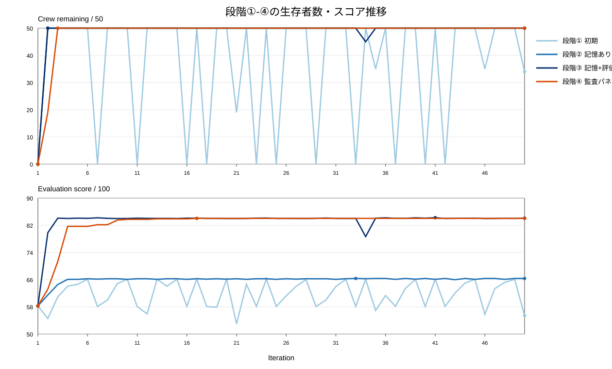
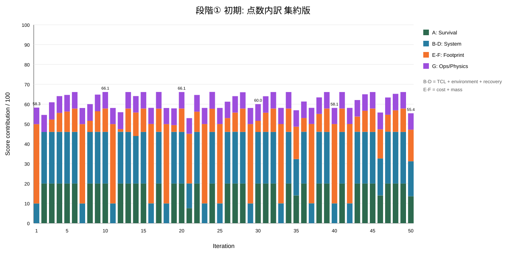
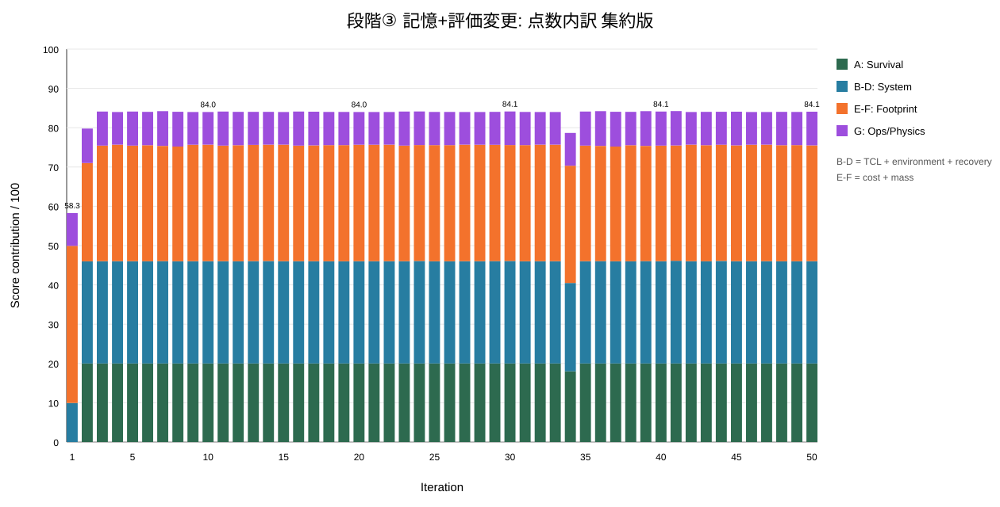
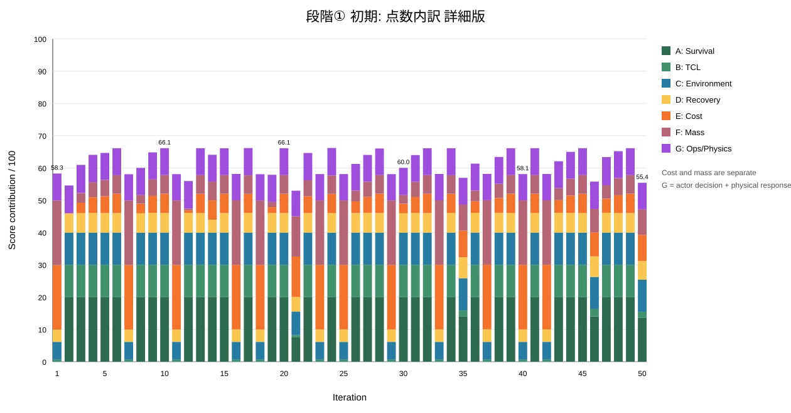
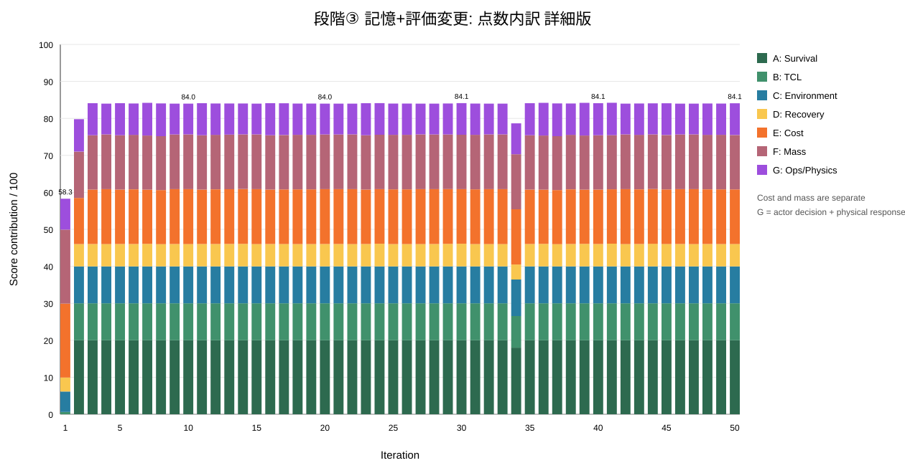
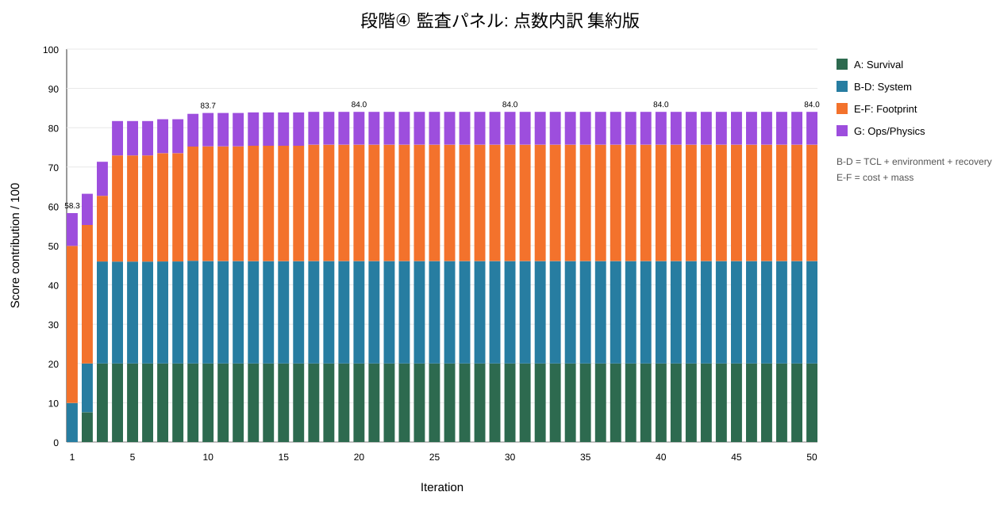
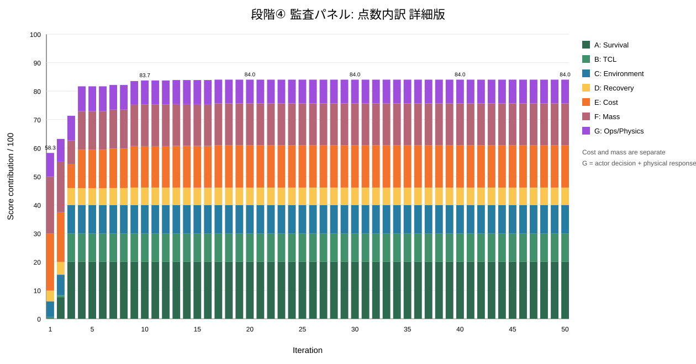
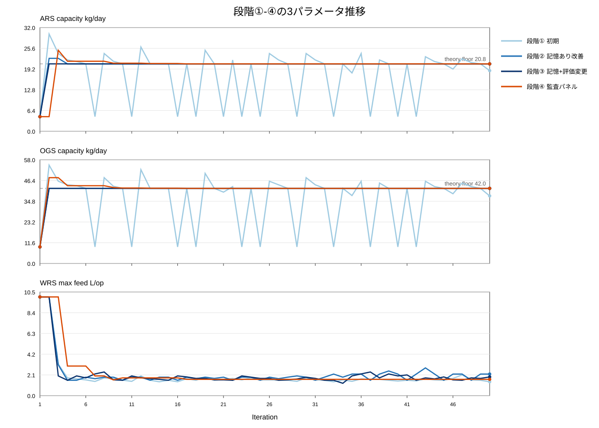

# 実験記録 — 50周の連鎖を4本

同じ世界、同じ50人の乗員、同じ「生存不可能なベースライン」に対して、50周の design→verify 連鎖を4本走らせた。変えたのは3つだけ。まず連鎖に記憶を与え、次に採点表の費用・質量軸の基準点を移し、最後に設計者の横に監査者3人を置いた。それ以外は同一（同じシミュレータ、同じ actor）。

このページは実測値である。以下の数値はすべて [`docs/data/`](https://github.com/hirototamura/engineering_agents/tree/main/docs/data) に置いた周回ごとの指標（1本あたり 50行 × 54列）から読んでいる。

| | 段階① 初期 | 段階② ＋連鎖の記憶 | 段階③ ＋採点表の基準変更 | 段階④ ＋監査パネル |
| --- | ---: | ---: | ---: | ---: |
| 周回数 | 50 | 50 | 50 | 50 |
| baseline replay 生存者 | 0/50 | 0/50 | 0/50 | 0/50 |
| **final replay 生存者** | **34/50** | **50/50** | **50/50** | **50/50** |
| 50/50 生存の周 | 34 | 49 | 48 | 48 |
| 0/50 の周 | 12 | 1 | 1 | 1 |
| 3項目そろった提案 | 38/50 | 50/50 | 50/50 | 50/50 |
| ARS/OGS の致命的巻き戻り | 12回 | 初回のみ | 初回のみ | なし |
| ユニーク設計数 | 39 | 11 | 17 | 9 |
| 最高スコア | 66.18 | 66.36 | 84.23 | 84.03 |
| 平均スコア | 61.71 | 65.94 | 83.34 | 82.59 |
| 最終スコア | 55.41 | 66.36 | 84.08 | 84.03 |

!!! warning "段階③④のスコアは①②と比較できない"
    段階③は採点関数そのものを変えている。84点台は費用・質量軸の支払われ方が変わった結果であって、**設計が18点ぶん良くなったのではない**。段階④は③と同じ採点表なので、この2本のスコアは比較できる。4本を通して比較できるのは挙動のほう——生存者数、巻き戻り回数、提案の完全性、ユニーク設計数。



---

## 段階① — 仕組みは正しく働き、それでも連鎖は乗員を失った

機構は健全だった。各周は自分で証拠を集め、候補をシミュレーションし、物理を監査し、順位づけして次に渡した。24周目は `ARS=20.8, OGS=42.0, WRS=1.8` を見つけ、50人全員を生かして 66.18 点を取っている。

25周目は WRS 中心の変更を提案した。次のランは **0/50** で返ってきた。

```
24周: ARS=20.8  OGS=42.0  WRS=1.8    → 50/50 生存, 66.18
25周: 部分提案（WRS のみ）
      → 次のランは ARS=4.5, OGS=9.25（ベースライン）を設置  → 0/50
```

うまくいった設計は棄却されたのではない。**忘れられた**。各周は**自分のランだけ**を読む。それが周を監査可能にしている当のものであり、同時に連鎖に記憶が無い理由でもあった。これが50周で12回起き、提案50本のうち12本が不完全だった。

最終周は 34/50・55.41 で終わっている。**24周目より悪い。**答えが見つかってから26周あとに。

診断は正確に述べる価値がある。明白なほうの答えではないからである。**これは探索の失敗ではなく、状態継承の失敗だった。**段階①は39のユニーク設計を探索しており、これは後の2段階より多い。良い設計に何度も到達している。ただ、掴んでいられなかった。

---

## 段階② — 4 KB のメモ1枚

変えたのは1つだけ。`compact_chain_memory.json`（4096 バイト上限）。全員生存した最良設計、前周に実際に設置された寸法、各サブシステムの**計算した**下限、この連鎖が既に踏んだ失敗を最大5件。次の周に**見せる**だけで、何も適用しない。（この2点は `0aaec84` で変わった——この3本より後である。下限は実測になり、引き渡しは補完されるようになった。以下はこの3本が実際に走った条件である。）

| | 段階① | 段階② |
| --- | ---: | ---: |
| final replay 生存者 | 34/50 | **50/50** |
| 0/50 の周 | 12 | **1**（初回のみ） |
| 3サブシステムすべてを含む提案 | 38/50 | **50/50** |

2周目以降すべてが 50/50 を保った。提案は50本すべてが3サブシステムを含んでいた。

代償も同じ表に出ている。ユニーク設計数が 39 から 11 に落ちた。連鎖は ARS と OGS を理論下限に固定し、WRS だけを 1.5625 / 1.875 / 2.1875 あたりで往復した。最高スコアは連鎖全体で 0.26 点しか動いていない。

記憶は破綻を止め、探索を狭めた。どちらも事実である。

---

## 段階③ — 採点表が測っていたものが間違っていた

段階②で軸ごとの内訳が読めるようになり、本当の問題が見えた。50人を生かした設計が、費用と質量で **40点満点中 11.57 点**しか取れていない。

原因は基準点だった。満点ラインが**出荷時ベースライン**（1800 kg / 259 M$）に置かれていた。それは50人全員が死ぬ設計である。生存できる設計は必然的に「誰も生かせない設計」より大きいので、生存可能な設計はすべて「高価」と印を付けられ、まったく違う2つの生存可能設計が 11.6 点と 4.1 点になった。採点表がそれらを区別できなくなっていた。

段階③は満点ラインを「全員生存が観測された最小設計の近く」（約 605 M$ / 4091 kg）へ動かし、ゼロを 900 M$ / 6000 kg に置いた。

```yaml
evaluation:
  footprint:
    cost_full_score_musd: 500.0
    cost_zero_score_musd: 900.0
    mass_full_score_kg: 3400.0
    mass_zero_score_kg: 6000.0
```

生存設計の費用・質量がそれぞれ 5〜6 点台から 14 点台へ。ユニーク設計数が 11 から 17 へ。

段階①（生存可能設計が狭い帯に押し込まれている）と段階③（同じ設計を基準変更後に採点）の内訳。





この集約版は費用と質量を1ブロックにまとめている。しかしここでの論点はまさにその費用と質量なので、同じ点数を7軸すべてに分解した詳細版も出す——A生存・B収束時間・C環境・D回復・**E費用・F質量**・G運用/物理。





E と F がほぼ同じ量だけ一緒に動いている。これが要点である。設計が特別に安くなったのでも軽くなったのでもない。**基準点が動いて、両軸が払われるようになっただけ**である。3段階すべての周ごとの値は `docs/data/phaseN_score_components_split.csv` にある。

最高周（41）と最終周（50）:

| 軸 | 41周 | 50周 |
| --- | ---: | ---: |
| A 生存 | 20.00 | 20.00 |
| B 収束時間 | 10.00 | 10.00 |
| C 環境 | 9.98 | 9.98 |
| D 回復 | 6.14 | 6.06 |
| E 費用 | 14.71 | 14.76 |
| F 質量 | 14.66 | 14.71 |
| G 運用・物理 | 8.75 | 8.57 |
| **合計** | **84.23** | **84.08** |

34周目は WRS を 1.25 まで下げて5人を失った（45/50）。初回を除けば唯一の非 50/50 である。これは有用な境界情報であり、chain memory が残すべき種類の事実である。

---

## 段階④ — 監査は危険を止め、探索も止めた

変えたのは設計側だけ。設計者1人が候補を出し、互いに見えない監査者3人（`rederive_numbers` / `avoid_local_optima` / `design_validity`）が item-veto でマージする。採点表は段階③と同じなので、スコアは③と比較できる。

2周目は OGS だけを 48.0 に上げ、ARS は出荷寸法 4.5 のまま——19/50。3周目で 25.0 / 48.0 / 10.0 に届いて 50/50。そこから単調に縮め、17周目で `ARS=20.8, OGS=42.0, WRS=1.65` に到達する。最終回答もそこ（18周目）。あとの34周は同じ機体を飛ばし続けた。

設計者は WRS を 1.58 まで下げようとした。監査2と3が veto した——計算下限 1.5625 に 0.0175 しか余裕がない、と。段階③の34周目（WRS=1.25, 45/50）は起きなかった。

代償は同じ表に出ている。ユニーク設計数が 17 から 9 へ。最高点は 84.23 から 84.03 へ。段階③が踏んだ WRS 1.8–2.2 の有望レンジにも、1.25 の失敗境界にも行っていない。監査は壊れない機体を守った。探索はより狭くなった。どちらも事実である。





最良=最終（17周 / 50周）: A 20.00 · B 10.00 · C 9.98 · D 6.09 · E 14.83 · F 14.78 · G 8.35 · **合計 84.03**。総質量 4077 kg、総費用 603 M$——段階③の最終周と物理量はほぼ同じ。

---

## 設計変数が実際にどう動いたか



段階②と③では ARS が 20.8 kg/day、OGS が 42.0 kg/day に落ち着いて動かない。これは恣意的な値ではなく、`compute_theoretical_capacity` がこの乗員に必要と報告するネームプレートそのものである（指標 CSV の全行で `theory_ars_required_nameplate=20.8`, `theory_ogs_required_nameplate=42.0`。OGS 42.0 は 50 × 0.84 kg/day）。連鎖は物理的な下限を見つけ、その下へ行くことを拒否した。

この「拒否」はその後に再検討され、**それがこの3本から出た最も興味深い結果である**。下限は**計算して主張した**ものだった。そして「越えてはならない線」は答えになる。2つのガス系が各自の下限に触れた周から、20周のあいだどちらも動かなかった。この2つで質量の91%を占める。探索が水再生だけに潰れた理由がこれである。しかも3つのうち1つは値そのものが間違っていた。計算上の水の下限 1.5625 L は実際には約 1.98 である。乗員は5リットル溜まってからしか再生装置を回さないからで、3つの周が4名ずつ失ってそれを学び直した。`floor_probe.py`（`0aaec84`）は主張する代わりに**区間を実測**し、設計者には両端だけを見せて閾値を出さない。**それを入れた連鎖はまだ走らせていない。** 4本目（段階④）は監査パネルであり、下限の実測ではない。

探索は WRS に集中した。段階③の頻出設計:

| ARS | OGS | WRS | 周回数 |
| ---: | ---: | ---: | ---: |
| 20.8 | 42.0 | 1.5625 | 9 |
| 20.8 | 42.0 | 2.0 | 7 |
| 20.8 | 42.0 | 1.75 | 6 |
| 20.8 | 42.0 | 1.8 | 5 |
| 20.8 | 42.0 | 1.6 | 5 |

有望レンジ WRS 1.8–2.2。失敗境界 WRS ≒ 1.25。段階④の頻出は `20.8 / 42.0 / 1.65` が34周——監査がそこを「十分」と決めたあと、動かなかった。

---

## 正直に、まだ駄目なところ

勝ちだけ並べた結果ページは結果ページではないので、はっきり書く。

1. **総質量・総費用は段階②から③でほとんど改善していない。** 点数が上がったのは採点が変わったからである。正しい読み方は「生存可能な設計が不当に低く採点されなくなった」であって「設計が軽くなった」ではない。今後のレポートは、新スコア・旧スコアの再計算・総 M$・総 kg・生存者数を並べて出す。二度と取り違えられないように。
2. **探索がいまだ WRS のみであり、段階④ではそれすら止まった。** ARS/OGS は下限に達して以降動かない。段階③は少なくとも WRS を振った。段階④の監査は 1.58 への下げを veto し、17周目以降は同一設計を34周繰り返した。
3. **~~chain memory は見せるだけで適用しない。~~ `0aaec84` で修正済み（この3本より後）。** 能力提案が「そのランが飛ばしていた機体」ではなく**シナリオファイル**にマージされていたため、1つのサブシステムを名指しすると残り2つが黙って出荷時の寸法へ戻っていた。上で数えた巻き戻りはすべてこの機序である。`complete_capacity_profile` が、提案が触れなかった項目を実際に設置されていた値で埋めるようになった。メモは応急処置ではなくなった。**このページの数値は修正より前のものである。**
4. **探索中の安全下限が無い。** 34周目の WRS=1.25 は5人の命を使った。何も止めなかったし、止める必要も無かった——探索は意図的に無制限で、**最終回答だけ**が全員生存を要求される。これが正しい取引かどうかは、決着済みではなく未決の問いである。
5. **その結果、実測下限そのものが未検証になった。** `0aaec84` は主張されていた下限も外している。段階②③の大半で ARS と OGS を固定していたのはそれである。「下回ることを誰も禁じなくなったとき、探索は本当に広がるのか」が次に走らせるべきランであり、まだ走らせていない。
6. **モデル1つ、シード1つ、連鎖4本。** これは4回のランであって統計的な研究ではない。機構が働くこと・働かないことを示すには十分だが、スコアに誤差棒を付けるには足りない。`floor_probe.py` を入れた連鎖は、まだ走っていない。

---

## 数値の出どころ

| 成果物 | 中身 |
| --- | --- |
| `<chain>/NN/summary.json` | その周の結果 |
| `<chain>/NN/evaluation.json` | その周の採点表（軸ごと、`points_lost` 付き） |
| `<chain>/NN/design_decision_state.json` | モデルに見せたページと、モデルの答え |
| `<chain>/NN/design_proposals.json` | 次に渡した寸法 |
| `<chain>/compact_chain_memory.json` | 次の周が読んだメモ |
| `<chain>/chain_summary.json` | 連鎖の唯一の答えと、その選び方 |

4本とも生ログを丸ごと保存してある（[`experiments/runs/`](https://github.com/hirototamura/engineering_agents/tree/main/experiments/runs)、圧縮して各11 MB）。
このページの表を作った解析スクリプトも同梱してあり、走らせ直せば図もCSVもバイト単位で再現する。
手順の最後の工程がそれを証明する `diff` になっている: [`experiments/README.md`](https://github.com/hirototamura/engineering_agents/blob/main/experiments/README.md)。

新しい連鎖を走らせる:

```bash
./scripts/run_design_chain.sh --rounds 50
```

シミュレータは決定論なので、同じ LLM 応答なら連鎖は完全に再現する。LLM 応答のほうは決定論ではない（温度 0.45）。だから周ごとの `design_decision_state` を要約せず丸ごと書いている。

---

## 関連

- [実装仕様書](specs/index.md) — この変更がそれぞれ何に対して書かれたか
- [エージェント設計](agent-design.md) — 各時点でモデルに何を見せていたか
- [設計エージェント](memo/ssos_eclss_loop/tool_use_design_agent.md) — ループの詳細
