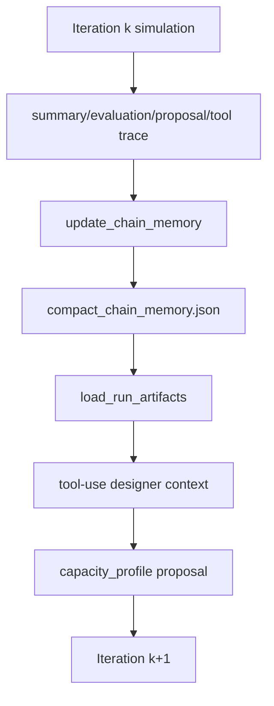

# SSOS ECLSS Chain Memory Minimal Implementation Spec

## 目的

PR #65の `ssos_eclss_loop` design→verify chainに、過去iterationの知見を小さく圧縮して次iterationのtool-use designerへ渡す仕組みを追加する。

大幅なアーキテクチャ変更は行わない。既存のtool-use loopは維持し、既存toolの1つである `load_run_artifacts` の返却値に `chain_memory_compact` を追加する。

## 背景

50 iteration解析では、単一iteration内のtool-use evidenceは欠落なく集まっていた。一方で、iteration間では過去に成功した設計が保持されず、partial proposalによってARS/OGSが初期値へ戻り、生存者数が `50/50` から `0/50` へ落ちるケースが複数回発生した。

代表例:

- iteration 24: `ARS=20.8`, `OGS=42.0`, `WRS=1.8`, `crew=50`, `score=66.18`
- iteration 25: 直前proposalがWRS中心の差分になり、次runで `ARS=4.5`, `OGS=9.25` に戻り `crew=0`

この問題に対し、まずはLLMに渡す過去知見を最小限追加し、同じ失敗を避けられるかを検証する。

## 非目的

- vector DBや長期記憶基盤は導入しない
- raw telemetryや全tool traceをLLM contextへ入れない
- agent loop全体の再設計はしない
- 最初の実装では最適化アルゴリズムを新設しない
- PR #65のchain適用バグ修正とは分けて実装可能にする

## 全体アーキテクチャ



## 変更対象

想定する主な変更対象:

- `src/scenario/jobs/iterate.py`
  - 各iteration完了後にcompact memoryを更新する
  - 次iterationのrun directoryから参照可能な場所へmemory pathを渡す、またはchain root直下に保存する

- `src/scenario/ssos_eclss_loop/design_tools.py`
  - `load_run_artifacts` がchain memoryを読み、返却JSONに `chain_memory_compact` を追加する

- `src/scenario/agents/ssos_tool_use_design.py`
  - designer promptにchain memoryの扱いを短く追加する
  - 「過去bestを悪化させる提案は理由を明示」「partial proposalではなくcomplete capacity profileを優先」を伝える

- `tests/scenario/test_iterate.py` または新規test
  - memory file更新のテスト

- `tests/scenario/test_ssos_tool_use_design.py`
  - `load_run_artifacts` がmemoryを返すテスト

## 保存場所

chain root直下に保存する。

```text
<chain_run_dir>/compact_chain_memory.json
```

例:

```text
src/experiments/results/ssos_eclss_loop_design_iter/compact_chain_memory.json
```

各iteration dir配下にはコピーしない。chain rootの1ファイルを更新していく。

## スキーマ

初期スキーマは以下に固定する。

```json
{
  "schema_version": "1.0",
  "updated_after_iteration": 24,
  "objective": {
    "primary": "maximize_crew_remaining",
    "secondary": "maximize_evaluation_score",
    "notes": "Treat survival as lexicographically prior to score."
  },
  "theoretical_floor": {
    "plant_sim.ars.capacity_kg_day": 20.8,
    "plant_sim.ogs.max_o2_kg_day": 42.0,
    "plant_sim.wrs.max_feed_l_per_operation": 1.5625
  },
  "best_full_survival": {
    "iteration": 24,
    "crew_remaining": 50,
    "crew_initial": 50,
    "score": 66.175528,
    "fields": {
      "plant_sim.ars.capacity_kg_day": 20.8,
      "plant_sim.ogs.max_o2_kg_day": 42.0,
      "plant_sim.wrs.max_feed_l_per_operation": 1.8
    },
    "constraint_status": "over_budget",
    "physics_gate_passed": true
  },
  "last_effective_design": {
    "iteration": 24,
    "crew_remaining": 50,
    "score": 66.175528,
    "fields": {
      "plant_sim.ars.capacity_kg_day": 20.8,
      "plant_sim.ogs.max_o2_kg_day": 42.0,
      "plant_sim.wrs.max_feed_l_per_operation": 1.8
    }
  },
  "known_bad_patterns": [
    {
      "id": "dropped_ars_ogs_to_baseline",
      "description": "When partial proposals omit ARS/OGS, the next run can reset them to baseline and lose the crew.",
      "observed_count": 12,
      "avoid_if_possible": true
    },
    {
      "id": "below_theoretical_floor",
      "description": "ARS or OGS below the theoretical floor correlated with crew loss.",
      "thresholds": {
        "plant_sim.ars.capacity_kg_day": 20.8,
        "plant_sim.ogs.max_o2_kg_day": 42.0
      },
      "avoid_if_possible": true
    }
  ],
  "proposal_guidance": {
    "prefer_complete_capacity_profile": true,
    "include_all_design_variables": [
      "plant_sim.ars.capacity_kg_day",
      "plant_sim.ogs.max_o2_kg_day",
      "plant_sim.wrs.max_feed_l_per_operation"
    ],
    "do_not_reduce_below_best_without_reason": true
  }
}
```

## サイズ制限

`compact_chain_memory.json` はLLM contextへ入る前提なので、以下を上限にする。

- 目標: 1-2 KB
- 上限: 4 KB
- `known_bad_patterns`: 最大5件
- `best_full_survival`: 1件のみ
- `last_effective_design`: 1件のみ
- iteration全履歴は保存しない

## 更新タイミング

各iterationのsimulationとdesign proposal生成が終わった直後に更新する。

```text
run iteration k
  -> summary.json generated
  -> evaluation.json generated
  -> design_proposals.json generated
  -> applied_proposals.json generated if adopted
  -> update compact_chain_memory.json
run iteration k+1
  -> load_run_artifacts includes compact memory
```

## 更新ロジック

### 入力

各iteration完了時に以下を読む。

- `<iteration_dir>/summary.json`
- `<iteration_dir>/evaluation.json`
- `<iteration_dir>/design_proposals.json`
- `<iteration_dir>/scenario_config.yaml`

### last_effective_design

`scenario_config.yaml` に実際に入っていた設計値を保存する。

対象:

- `plant_sim.ars.capacity_kg_day`
- `plant_sim.ogs.max_o2_kg_day`
- `plant_sim.wrs.max_feed_l_per_operation`

### best_full_survival

以下を満たすiterationだけ候補にする。

- `crew_remaining == crew_initial`
- `physics_gate_passed == true`
- `evaluation_status == "scored"`

候補の中で `evaluation_score` が最大のものを保持する。

同点の場合は、制約違反が軽いものを優先する。初期実装では以下の順でよい。

1. `constraint_status == "ok"`
2. `constraint_status == "over_budget"`
3. その他

### theoretical_floor

初期実装では、`tool_trace.jsonl` の `compute_theoretical_capacity` 結果から取得する。

取得できない場合はmemory更新を失敗させず、既存値を維持する。

### known_bad_patterns

初期実装ではルールベースで十分。

検出ルール:

- `dropped_ars_ogs_to_baseline`
  - 前iterationのproposalがARS/OGSを含まず、次iterationのscenario_configでARS/OGSがbaseline値へ戻った場合にcountを増やす

- `below_theoretical_floor`
  - scenario_config上のARSまたはOGSがtheoretical_floor未満で、`crew_remaining < crew_initial` の場合にcountを増やす

## load_run_artifactsの返却追加

既存返却に以下を追加する。

```json
{
  "chain_memory_compact": {
    "...": "compact memory fields"
  }
}
```

memory fileが存在しない場合:

```json
{
  "chain_memory_compact": null
}
```

読み込み失敗時:

```json
{
  "chain_memory_compact": {
    "error": "failed_to_load_chain_memory",
    "path": "...",
    "message": "..."
  }
}
```

toolは例外を投げず、既存のdesign loopを継続する。

## Prompt追加案

`ssos_tool_use_design.py` のsystem/developer instruction相当へ短く追加する。

```text
If load_run_artifacts returns chain_memory_compact, use it as bounded prior evidence from earlier iterations.
Do not treat it as a replacement for current-run evidence.
Prefer proposals that preserve or improve the best_full_survival design unless current evidence gives a clear reason to explore otherwise.
For capacity_profile proposals, include all three design variables whenever possible so later iterations do not accidentally drop earlier changes.
If proposing ARS or OGS below theoretical_floor, explain why the reduced capacity should still preserve crew survival.
```

## 期待する挙動

今回の50 iterationで見えた失敗に対して、次の改善を期待する。

- WRSだけのpartial proposalが減る
- ARS/OGSが理論床未満へ下がる提案が減る
- `50/50 -> 0/50` の退行が減る
- 最終iterationがbest iterationから大きく劣化しにくくなる

## 受け入れ条件

### Unit tests

1. memory fileがない場合、`load_run_artifacts` は `chain_memory_compact: null` を返す
2. memory fileがある場合、`load_run_artifacts` は内容を返す
3. corrupt JSONでもtoolは例外を投げず、error objectを返す
4. full survivalかつ高scoreのiterationが `best_full_survival` になる
5. full survivalでないiterationは `best_full_survival` を上書きしない
6. `last_effective_design` はproposal値ではなくscenario_config値を保存する
7. memory JSONが4 KBを超えない

### Regression scenario

小さなfixture chainを作る。

```text
iteration 1: ARS=20.8, OGS=42.0, WRS=1.6, crew=50
iteration 2 proposal: WRS only
iteration 3 load_run_artifacts: chain_memory_compact includes best_full_survival and prefer_complete_capacity_profile
```

期待:

- designer contextに過去bestが入る
- proposal guidanceが返る
- ARS/OGSを落とす場合は理由が必要になる

## 実装ステップ

1. `CompactChainMemory` 用の小さなdataclassまたはdict builderを追加する
2. `iterate.py` のiteration完了処理後に `update_compact_chain_memory(...)` を呼ぶ
3. `load_run_artifacts` にchain root探索とmemory読み込みを追加する
4. designer promptに短いmemory利用ルールを追加する
5. unit testを追加する
6. 既存ZIP相当の50 iterationを再実行し、退行回数と最終生存者数を比較する

## 注意点

この変更はLLMに「過去知見を見せる」だけなので、chain適用バグそのものを完全には直さない。確実に直すには、別途 `applied_proposals.json` を累積設計状態としてmergeする修正、またはcapacity_profileを完全snapshot化する修正が必要。

ただし、今回のミニマム変更でも、LLMがpartial proposalや理論床未満の提案を避けるようになれば、退行頻度は下がるはずである。
