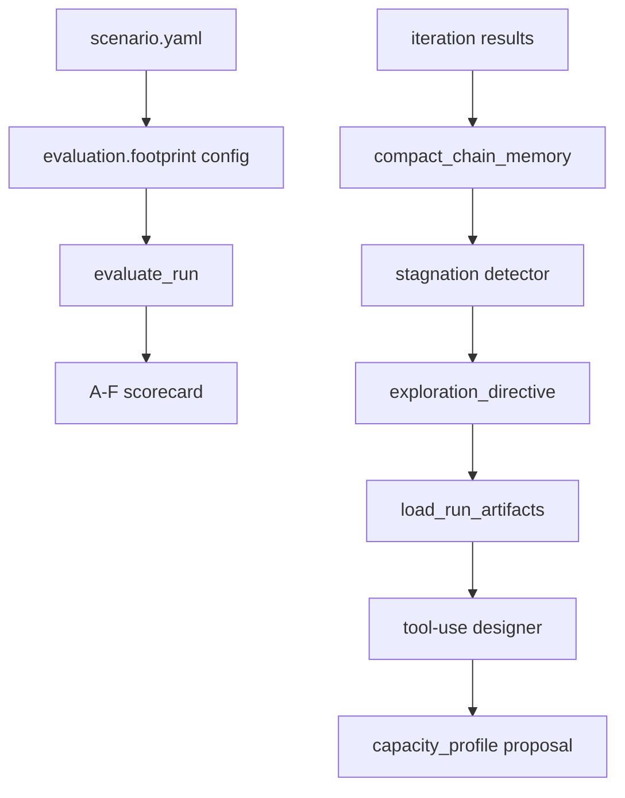
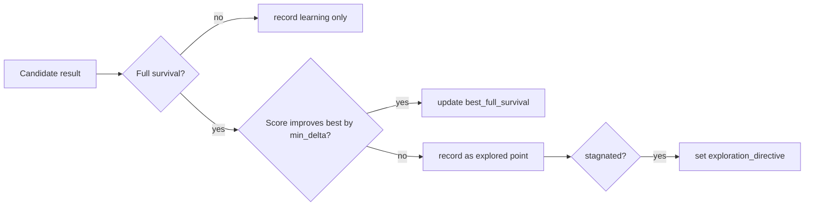

# SSOS ECLSS Scoring and Stagnation Exploration Implementation Spec

## 目的

`ssos_eclss_loop` のdesign→verify chainで、以下を最小変更で実装する。

1. cost/mass評価の満点ラインを、非生存baselineではなく「生存可能な最小設計」寄りに変更する
2. designer-facing contextから、使っていないvolumeや重複するover-budget情報を減らす
3. スコアが停滞した場合に、同じ近傍を繰り返さず探索モードへ切り替える

既存のtool-use loop、simulation、evaluation、proposal schemaはできるだけ維持する。

## 背景

PR66 chainでは、`chain_memory_compact` によりPR65で頻発したARS/OGSの初期値リセットは抑えられた。final replayも `50/50` 生存まで到達した。

一方で、スコアの内訳を見ると、現在のE軸 `Footprint = cost + mass` は非生存baselineを満点ラインにしているため、生存可能な設計が過度に低く評価されている。

代表値:

| Iteration | 設計 | Crew | Score | E current |
| ---: | --- | ---: | ---: | ---: |
| 9 | `ARS=20.8 / OGS=42.0 / WRS=2.0` | 50/50 | 65.45 | 11.57/40 |
| 10 | `ARS=23.92 / OGS=48.3 / WRS=5.0` | 50/50 | 58.02 | 4.08/40 |

iteration 9は「生存できる最小設計」に近いが、Eが11.57/40しかない。探索余地を残すため、iteration 9が満点ではなく約30/40になる程度へスコアの基準をずらす。

## 推奨設定

初期値として以下を採用する。

```yaml
evaluation:
  footprint:
    cost_full_score_musd: 500.0
    cost_zero_score_musd: 900.0
    mass_full_score_kg: 3400.0
    mass_zero_score_kg: 6000.0
```

この設定の狙い:

- `iter9` 相当の最小生存設計はEが約29-31/40になる
- `iter10` 相当の過大設計はEが約20/40まで下がる
- 生存可能設計を過度に罰しない
- ただし、さらに小さくできる余地をスコア上に残す

## 現状の問題整理

### 1. full-score lineがbaseline固定

現在の `_footprint_axis` は、`DesignConstraints.baseline_footprint()` を満点ラインとして使っている。

現状:

```text
cost full score = baseline cost = 259 MUSD
mass full score = baseline mass = 1800 kg
cost zero score = 750 MUSD
mass zero score = 5000 kg
```

baselineは生存できないため、この満点ラインは今回の設計目的に合っていない。

### 2. volumeはスコアに入っていない

volumeは現在、以下で使われている。

- `design_constraints.budgets.max_total_volume_m3`
- `design_constraints.penalty_weights.volume`
- `evaluate_design_constraints` の返却
- `design_penalty`

一方、100点スコアには入っていない。LLM contextに出すと、判断材料が増える割に評価に直結しない。

### 3. over_budgetがスコアと重複している

cost/massはすでにE軸として100点スコアに入っている。さらに `over_budget` をdesigner-facing contextに出すと、同じ概念を二重に渡すことになる。

初期実装では、候補を弾く制約として残すのは `subsystem_bounds` を中心にし、cost/massはEスコアで表現する。

## 全体アーキテクチャ



## 変更対象

主な変更対象:

- `src/scenario/ssos_eclss_loop/evaluation.py`
  - cost/massの満点ラインをconfig化する

- `src/scenario/ssos_eclss_loop/scenario.yaml`
  - `evaluation.footprint` に `*_full_score_*` を追加する
  - zero score lineを推奨値へ変更する

- `src/scenario/ssos_eclss_loop/design_constraints.py`
  - volume budgetをdesigner-facing情報から外す
  - 必要ならvolume budgetのdefaultを無効化する

- `src/scenario/ssos_eclss_loop/design_tools.py`
  - `evaluate_design_constraints` の返却からvolume/over-budgetノイズを減らす
  - tool descriptionから `volume` を削る

- `src/scenario/ssos_eclss_loop/chain_memory.py`
  - stagnation detectorを追加する
  - `exploration_directive` をcompact memoryへ追加する

- `src/scenario/agents/ssos_tool_use_design.py`
  - promptにexploration directiveの扱いを追加する

- tests
  - evaluation threshold
  - volume除去
  - stagnation trigger

## Footprint評価仕様

### 新しいconfig

```yaml
evaluation:
  footprint:
    cost_full_score_musd: 500.0
    cost_zero_score_musd: 900.0
    mass_full_score_kg: 3400.0
    mass_zero_score_kg: 6000.0
```

### 採点式

cost/massそれぞれ20点満点。

```text
if value <= full_score_value:
    score = max_score
elif value >= zero_score_value:
    score = 0
else:
    score = max_score * (zero_score_value - value) / (zero_score_value - full_score_value)
```

### 互換性

既存configに `*_full_score_*` がない場合は、従来通りbaseline footprintを満点ラインにする。

```text
full_score_value = config value if present else baseline_value
```

### evaluation.json metrics

`cost` / `mass` 軸のmetricsに以下を出す。

```json
{
  "value": 605.298258,
  "full_score_value": 500.0,
  "zero_score_value": 900.0,
  "over_full_score_value": 105.298258,
  "fraction_of_headroom_used": 0.263246
}
```

旧 `baseline_value` は残してよいが、designer-facing summaryでは優先表示しない。

## Volume / Budget情報の整理

### 方針

初期実装では、volumeを削る対象は「designer-facing context」に限定する。内部計算から即座に完全削除しない。

理由:

- 既存testやdashboardが `total_volume_m3` を参照している可能性がある
- 完全削除は影響範囲が広い
- 今回の目的は、LLM contextを小さくし、評価に効かない情報を見せないこと

### designer-facingから削るもの

`evaluate_design_constraints` tool返却では、以下を削る。

- `total_volume_m3`
- `added_volume_m3`
- `delta_installed_volume_m3`
- `baseline_total_volume_m3`
- `installed_total_volume_m3`
- `budget_violations` 内のvolume違反
- `design_penalty` 内のvolume寄与
- `budgets.max_total_volume_m3`

tool descriptionも変更する。

現状:

```text
Mass / volume / cost / bounds / budget labels
```

変更後:

```text
Mass / cost / bounds labels for a capacity field set. Cost and mass are scored in evaluation; subsystem bounds remain buildability limits.
```

### over_budgetの扱い

LLMに渡す情報としては、`over_budget` を主判断材料にしない。

推奨:

- `constraint_status` は `feasible`, `out_of_bounds`, `invalid` を中心にする
- cost/mass超過は `evaluation.score.axes.cost/mass` に任せる
- 互換性のため内部status `over_budget` は残してよい
- `design_review_report` やdashboardには残してよい
- `tool-use designer context` では `over_budget` の詳細violationsを省略する

## Stagnation Exploration仕様

### 目的

同じ近傍の設計を繰り返し、scoreがほとんど改善しない状態を検出したら、探索モードへ切り替える。

今回のPR66では、iteration 6, 8, 9が `20.8 / 42.0 / WRS 2.0-2.5` 周辺に集中し、改善幅が小さい。こうした状態で、WRSだけ微調整するのではなく、別のmarginや別の容量組み合わせも試す。

### 推奨パラメータ

初期値:

```yaml
iteration:
  exploration:
    stagnation_window: 4
    min_score_delta: 0.25
    require_same_survival_tier: true
    cooldown_iterations: 2
```

`stagnation_window` は3ではなく4を推奨する。

理由:

- 3だと通常の微調整中にも早く発火しやすい
- 4なら、短いchainでも停滞検出でき、50 iteration想定でも遅すぎない
- deterministic runではノイズが小さいため、`min_score_delta=0.25` で十分

### survival tier

停滞判定は、生存者数が同じtierにいる場合だけ行う。

```text
full_survival: crew_remaining == crew_initial
partial_survival: 0 < crew_remaining < crew_initial
zero_survival: crew_remaining == 0
```

例:

- `50 -> 50 -> 50 -> 50` でscore改善が小さい: stagnated
- `0 -> 50 -> 46 -> 50`: stagnatedではない
- `50 -> 46`: regressとして扱う

### 判定式

直近 `stagnation_window` 件について、以下を満たしたら停滞。

```text
same survival tier
AND best_score_in_window - best_score_before_window < min_score_delta
AND no active cooldown
```

`best_score` は同じsurvival tier内で比較する。primary objectiveは生存者数なので、50/50未満と50/50を同列に比較しない。

### Memory schema追加

`compact_chain_memory.json` に以下を追加する。

```json
{
  "stagnation": {
    "status": "stagnated",
    "window": 4,
    "min_score_delta": 0.25,
    "iterations": [6, 7, 8, 9],
    "best_score_before_window": 65.39,
    "best_score_in_window": 65.45,
    "score_delta": 0.06,
    "survival_tier": "full_survival"
  },
  "exploration_directive": {
    "mode": "diversify",
    "reason": "score has not improved by at least 0.25 points over 4 comparable iterations",
    "avoid_repeating_recent_fields": true,
    "preferred_strategies": [
      "try lower footprint while preserving theoretical ARS/OGS floor",
      "try WRS above observed water-loss floor but below recent high values",
      "try one modest ARS/OGS margin and one exact-floor candidate when candidate budget allows"
    ],
    "recent_field_sets": [
      {
        "plant_sim.ars.capacity_kg_day": 20.8,
        "plant_sim.ogs.max_o2_kg_day": 42.0,
        "plant_sim.wrs.max_feed_l_per_operation": 2.0
      }
    ]
  }
}
```

### Exploration modeの挙動

初期実装では、candidate budgetを増やさず、LLMのproposal guidanceとして使う。

designer prompt追加:

```text
If chain_memory.exploration_directive.mode is "diversify", do not simply repeat the best or most recent capacity set. Propose a complete three-variable capacity_profile that tests a materially different point while preserving full survival evidence where possible. Prefer reducing footprint after full survival has already been achieved.
```

### 追加探索の具体例

full survival到達後の探索は、以下の順序を推奨する。

1. ARS/OGSは理論床を維持し、WRSだけを水warningが出ない最小値へ寄せる
2. WRSが安定したら、ARS/OGSを小さく下げず、むしろexact-floorとsmall-marginを比較する
3. 過大設計は、過去bestよりEが大きく落ちる場合は採択しない

今回のデータなら探索候補は以下。

```text
known good: 20.8 / 42.0 / 2.0
try:        20.8 / 42.0 / 1.8
try:        20.8 / 42.0 / 2.2
avoid:      23.92 / 48.3 / 5.0 unless current evidence shows instability
avoid:      20.8 / 42.0 / 1.5625 because water_warning loss observed
```

## Best-So-Farとの関係

stagnation explorationは「探索用」であり、best-so-far採択とは分ける。



探索で悪い点を試してもよい。ただし、chain finalやnext effective designに採択するかはbest-so-far guardで別途制御する。

## 受け入れ条件

### Scoring

1. `evaluation.footprint.cost_full_score_musd` が設定されている場合、cost軸はその値以下で20点になる
2. `evaluation.footprint.mass_full_score_kg` が設定されている場合、mass軸はその値以下で20点になる
3. 設定がない場合は従来通りbaseline footprintを満点ラインにする
4. `cost_zero_score_musd <= cost_full_score_musd` または `mass_zero_score_kg <= mass_full_score_kg` の場合は評価を `incomplete` にするかconfig validationで落とす
5. PR66 iteration 9相当の `605MUSD / 4091kg` はEが約29-31/40になる
6. PR66 iteration 10相当の `697MUSD / 4690kg` はiteration 9より明確に低いEになる

### Context pruning

1. `evaluate_design_constraints` tool返却にvolume詳細が含まれない
2. designer-facing contextにvolume budget violationが含まれない
3. cost/massはEスコアの軸として確認できる
4. subsystem bounds違反は引き続き確認できる
5. dashboardやraw report用の内部footprint情報は必要なら残る

### Stagnation

1. 直近4回でbest score改善が0.25未満なら `stagnation.status = "stagnated"`
2. survival tierが変わった場合は停滞扱いしない
3. 停滞発火後、`cooldown_iterations=2` の間は再発火しない
4. `exploration_directive.mode = "diversify"` が `load_run_artifacts` 経由でdesigner stateへ入る
5. stagnation中のproposalは3設計変数すべてを含む
6. recent field setと完全一致するproposalを避けるようpromptされる

## 実装ステップ

1. `evaluation.py` の `_footprint_axis` に `full_at` 引数を追加する
2. `evaluate_run` で `cost_full_score_musd` / `mass_full_score_kg` を読む
3. `scenario.yaml` の `evaluation.footprint` に推奨値を追加する
4. `design_tools.py` の `evaluate_design_constraints` 返却からdesigner-facing volume情報を削る
5. `chain_memory.py` にstagnation判定と `exploration_directive` 生成を追加する
6. `ssos_tool_use_design.py` のpromptにexploration directiveの扱いを追加する
7. unit testを追加する
8. PR66 chainを再実行し、A-F積み上げグラフでEの識別性と探索の広がりを確認する

## 推奨する次回評価観点

次回runでは以下を見る。

- iteration 9相当の設計がE=30/40前後になるか
- `20.8 / 42.0 / 2.0` 近傍から、WRS 1.8や2.2などへ探索が広がるか
- `23.92 / 48.3 / 5.0` のような過大設計が採択されにくくなるか
- `chain_memory_compact` が4KB以内に収まるか
- 50/50生存を維持したままscoreが改善するか

## 注意点

この変更は評価と探索誘導を改善するもの。chain finalを確実にbestにするには、別途best-so-far guardを採択側へ入れる必要がある。

ただし、今回の変更だけでも、LLMが「生存可能だが重すぎる設計」と「小さくて生存できる設計」を区別しやすくなり、局所解からの探索も促せる。
