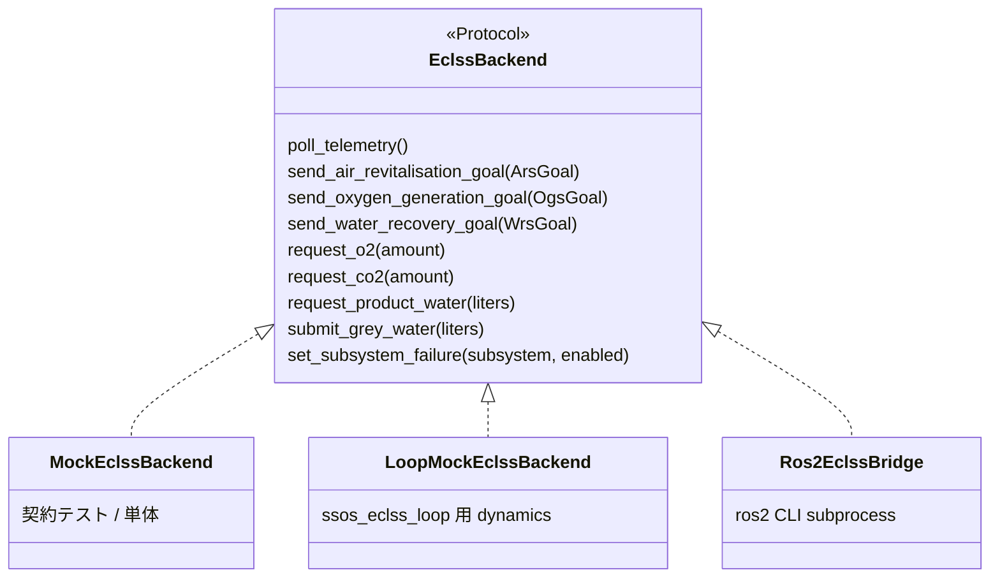
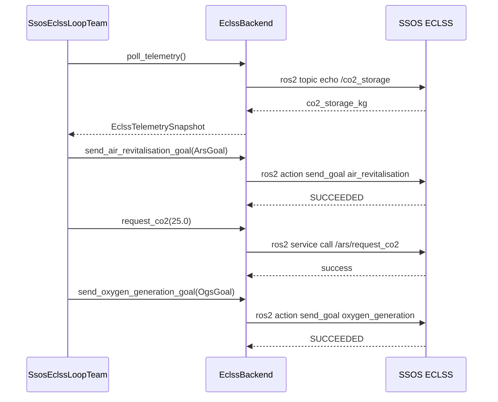

# ECLSS 統合

SSOS の **ARS**（大気再生）、**OGS**（酸素生成）、**WRS**（水再生）を `EclssBackend` Protocol 経由で操作します。実装の正本は `src/environment/ssos/eclss_topics.py` です。

---

## 起動方法

| 用途 | コマンド | GUI |
| --- | --- | --- |
| **ヘッドレス（推奨）** | `ros2 launch space_station eclss.launch.py` | なし |
| コンテナショートカット | `bash /root/ssos-eclss-headless.sh` | なし |
| Crew 付き（参考） | `ros2 launch space_station_eclss eclss.launch.py` | あり |

定数: `LAUNCH_HEADLESS_ECLSS = "space_station/eclss.launch.py"`

---

## ROS 2 インターフェース一覧

### Actions

| グラフ名 | 型（Jazzy 現行） | Python 定数 |
| --- | --- | --- |
| `air_revitalisation` | `space_station_interfaces/action/AirRevitalisation` | `ACTION_AIR_REVITALISATION` |
| `oxygen_generation` | `space_station_interfaces/action/OxygenGeneration` | `ACTION_OXYGEN_GENERATION` |
| `water_recovery_systems` | `space_station_interfaces/action/WaterRecovery` | `ACTION_WATER_RECOVERY` |

!!! important "Action 型プレフィックス"
    Phase 1a 以前は `space_station_eclss/action/...` を想定していましたが、**現行 SSOS Jazzy イメージでは `space_station_interfaces`** が正です。型不一致は goal 送信が永久待ちになる主因です（[トラブルシューティング](troubleshooting.md)）。

### Services

| サービス | 型 | メソッド |
| --- | --- | --- |
| `/ogs/request_o2` | `space_station_interfaces/srv/O2Request` | `request_o2(amount)` |
| `/ars/request_co2` | `space_station_interfaces/srv/Co2Request` | `request_co2(amount)` |
| `/wrs/product_water_request` | `space_station_interfaces/srv/RequestProductWater` | `request_product_water(liters)` |
| `/grey_water` | `space_station_interfaces/srv/GreyWater` | `submit_grey_water(liters)` |

### Telemetry Topics

| トピック | 型 | フィールド |
| --- | --- | --- |
| `/co2_storage` | `std_msgs/Float64` | CO₂ 貯留 [kg] |
| `/o2_storage` | `std_msgs/Float64` | O₂ 貯留 [kg] |
| `/wrs/product_water_reserve` | `std_msgs/Float64` | 飲料水貯留 [L] |
| `/ars/diagnostics` | diagnostic | ARS 診断 |
| `/ogs/diagnostics` | diagnostic | OGS 診断 |
| `/wrs/diagnostics` | diagnostic | WRS 診断 |

### 故障注入（Self Diagnosis）

| トピック | 型 | 用途 |
| --- | --- | --- |
| `/ars/self_diagnosis` | `std_msgs/Bool` | ARS 故障シミュレーション |
| `/ogs/self_diagnosis` | `std_msgs/Bool` | OGS 故障 |
| `/wrs/self_diagnosis` | `std_msgs/Bool` | WRS 故障 |

`set_subsystem_failure("ars"|"ogs"|"wrs", enabled=True)` で publish します。

---

## バックエンド実装



| 実装 | ファイル | 用途 |
| --- | --- | --- |
| `MockEclssBackend` | `mock_eclss_backend.py` | pytest / Phase 1b 契約 |
| `LoopMockEclssBackend` | `scenario/ssos_eclss_loop/loop_mock_backend.py` | シナリオ用簡易 dynamics |
| `Ros2EclssBridge` | `ros2_eclss_bridge.py` | SSOS Docker 実グラフ |

### Ros2EclssBridge の設計

- **CLI-first**: `ros2 topic echo`, `ros2 action send_goal`, `ros2 service call` を subprocess で実行。コンテナ内追加 pip 依存なし。
- **Jazzy 出力対応**: service 応答が YAML または Python repr の両方をパース（Phase 1b 修正）。
- **タイムアウト**: `action_timeout_s`（デフォルト 120s）、`topic_timeout_s`（デフォルト 15s）。

---

## Goal 型（Python dataclass）

### ArsGoal

```python
ArsGoal(
    initial_co2_mass=1800.0,
    initial_moisture_content=25.0,
    initial_contaminants=5.0,
)
```

### OgsGoal

```python
OgsGoal(
    input_water_mass=15.0,
    iodine_concentration=2.0,
)
```

### WrsGoal（Phase 2）

```python
WrsGoal(urine_volume=2.0)
```

---

## Smoke テスト

| Phase | スクリプト | モジュール | 検証内容 |
| --- | --- | --- | --- |
| 1a | `scripts/run_ssos_eclss_smoke.sh` | `scripts.ssos_eclss_ars_smoke` | ARS action + CO₂ topic |
| 1b | `scripts/run_ssos_eclss_1b_smoke.sh` | `scripts.ssos_eclss_1b_smoke` | + OGS + `request_co2` + Sabatier 信号 |
| 2 | `scripts/run_ssos_eclss_2_smoke.sh` | `scripts.ssos_eclss_2_smoke` | + WRS + product/grey water + 水トレードオフ |

### Phase 1b 合格条件

- `poll_telemetry()` で `/co2_storage` と `/o2_storage` 取得
- `oxygen_generation` goal SUCCEEDED
- `request_co2` 成功
- レポート JSON に `sabatier_signal: true`（O₂/CO₂ Sabatier 競合）

### Phase 2 合格条件

- `water_recovery_systems` goal SUCCEEDED
- `request_product_water` / `submit_grey_water` 成功
- OGS 実行後の `product_water_delta` 変化
- `water_tradeoff_signal: true`（飲料水 vs 電解水）

---

## 操作シーケンス例（ARS → CO₂ 要求 → OGS）



---

## 手動確認コマンド（コンテナ内）

```bash
source /opt/ros/jazzy/setup.bash
source ~/ssos_ws/install/setup.bash

ros2 action list -t | grep -E 'air_revitalisation|oxygen|water_recovery'
ros2 topic echo /co2_storage std_msgs/msg/Float64 --once
ros2 node info /air_revitalisation | grep -A1 'Action Servers'

# Action 型確認
ros2 action send_goal /air_revitalisation \
  space_station_interfaces/action/AirRevitalisation \
  "{initial_co2_mass: 1800.0, initial_moisture_content: 25.0, initial_contaminants: 5.0}"
```

---

## 関連

- [API リファレンス — EclssBackend](api-reference.md#eclssbackend)
- [ssos_eclss_loop シナリオ](scenario-eclss-loop.md)
