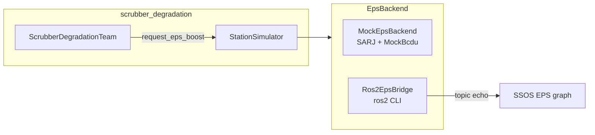
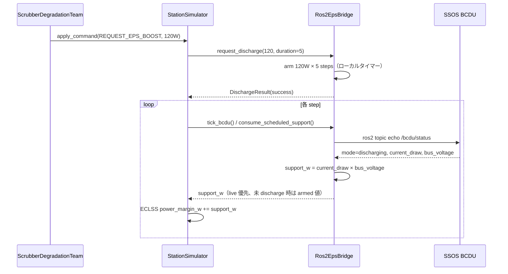

# EPS 統合

SSOS の **EPS**（Electrical Power System）— 太陽電池（SARJ mock）と BCDU — を `EpsBackend` Protocol 経由で読み取り、`request_eps_boost` を interim 方式で写像します。

`scrubber_degradation` シナリオでは ECLSS は Mock のまま、EPS のみ `mock` \| `ssos_eps` を切り替え可能です。

---

## なぜ topic_map が必要か

`engineering_agents` の契約トピック名（`eps_topics.py`）と SSOS main の **実装トピック名が一致しない** 箇所があります。`topic_map.py` が SSOS 実名を正とします。

| 契約名（eps_topics.py） | SSOS 実トピック | 型 |
| --- | --- | --- |
| `/solar/voltage` | **`/solar_controller/ssu_voltage_v`** | `std_msgs/Float64` |
| — | `/solar_controller/ssu_power_w` | `std_msgs/Float64` |
| — | `/solar_controller/sun_beta_deg` | `std_msgs/Float64` |
| `/bcdu/status` | `/bcdu/status` | `space_station_interfaces/msg/BCDUStatus` |
| `/eps/diagnostics` | `/eps/diagnostics` | `diagnostic_msgs/DiagnosticStatus` |
| `/bcdu/operation` | **未実装** | — |

---

## 起動方法

| 用途 | コマンド |
| --- | --- |
| フルステーション（solar + EPS + ECLSS） | `ros2 launch space_station space_station.launch.py` |
| EPS のみ | `ros2 launch space_station eps.launch.py` |

定数: `LAUNCH_HEADLESS_STATION`, `LAUNCH_EPS_ONLY`（`topic_map.py`）

起動ノード（EPS launch）:

1. `battery_manager_node` — 24 BMS
2. `bcdu_node` — SSU 電圧閾値で自動 charge/discharge
3. `ddcu_device`, `mbsu_device`

---

## BCDUStatus フィールド

SSOS メッセージ（`space_station_interfaces/msg/BCDUStatus`）:

| フィールド | 説明 |
| --- | --- |
| `mode` | `idle` / `charging` / `discharging` / `fault` / `safe` |
| `bus_voltage` | バス電圧 [V] |
| `current_draw` | 電流 [A]（+ = 放電） |
| `fault` | 故障ラッチ |
| `fault_message` | 故障メッセージ |

`engineering_agents` の `BcduStatus` dataclass には mock 専用の `support_w`, `support_steps_remaining` があり、bridge が SSOS 読取 + ローカルタイマーで補完します。

---

## バックエンド



| 実装 | 選択方法 | ファイル |
| --- | --- | --- |
| `MockEpsBackend` | `eps.backend: mock`（デフォルト） | `mock_eps_backend.py` |
| `Ros2EpsBridge` | `eps.backend: ssos_eps`（別名 `ros2`, `ssos`） | `ros2_eps_bridge.py` |

`build_eps_backend()` は `src/scenario/runner.py` にあります。

### scenario.yaml 設定例

```yaml
eps:
  backend: mock          # デフォルト
  # backend: ssos_eps    # SSOS Docker ROS2 ブリッジ
  sarj:
    beta_angle_deg: 45.0
```

---

## request_eps_boost の写像（Phase 3a interim）

SSOS に `/bcdu/operation` Action が **未実装** のため、bridge は以下の interim 方式を採用しています。



| Phase | 方式 | 状態 |
| --- | --- | --- |
| **3a（現行）** | BCDU `discharging` 時に `current_draw × bus_voltage` を support_w として ECLSS に加算。bridge 側 duration タイマー | ✅ 実装済 |
| 3b | `/battery/battery_bms_*/discharge` サービス直接呼出 | 未着手 |
| 3c | SSOS に `/bcdu/operation` Action 追加 | upstream PR 必要 |

### トリガ条件（scrubber_degradation）

- `power_status == CRITICAL`
- `eps_support_steps_remaining == 0`
- `agents.yaml`: `request_eps_boost_on_power_critical: true`
- duration: `design_parameters.eps_support_duration_steps`（デフォルト 5 step）
- 出力: `eps_support_w` がテレメトリに反映 → `eps_telemetry.jsonl`

---

## Smoke テスト

```bash
# Terminal 1: SSOS 内で solar + EPS 起動
docker exec -it ssos bash
ros2 launch space_station space_station.launch.py
# または eps.launch.py

# Terminal 2: ホスト repo ルート
./scripts/run_ssos_eps_smoke.sh
./scripts/run_ssos_eps_smoke.sh --arm-discharge-w 100 --arm-duration-steps 3
./scripts/run_ssos_eps_smoke.sh --json-out /tmp/eps_smoke.json
```

モジュール: `scripts.ssos_eps_smoke` — solar/BCDU topic 読取、`request_discharge` arm、推定 discharge W を検証。

!!! note "ROS_DOMAIN_ID"
    EPS smoke ラッパーは `ROS_DOMAIN_ID=${ROS_DOMAIN_ID:-23}` を export します。SSOS 起動側と **同一ドメイン** に揃えてください。

---

## 手動確認（コンテナ内）

```bash
source /opt/ros/jazzy/setup.bash
source ~/ssos_ws/install/setup.bash
export ROS_DOMAIN_ID=23   # 環境に合わせる

ros2 topic list | grep -E 'solar|bcdu|eps|battery'
ros2 topic echo /bcdu/status space_station_interfaces/msg/BCDUStatus --once
ros2 topic echo /solar_controller/ssu_voltage_v std_msgs/msg/Float64 --once
```

---

## 既知の制限

| 制限 | 説明 |
| --- | --- |
| `/bcdu/operation` 未実装 | discharge は SSOS 自動閾値 + bridge タイマーに依存 |
| `support_w` 非ネイティブ | bridge が watt 推定 + duration タイマーで補完 |
| Mac ホスト DDS | コンテナ内実行のみ |
| ECLSS 分離 | Phase 3 時点では `ssos_eclss_loop` に EPS 未統合 |

---

## 関連

- [API リファレンス — EpsBackend](api-reference.md#epsbackend)
- [トラブルシューティング](troubleshooting.md)
