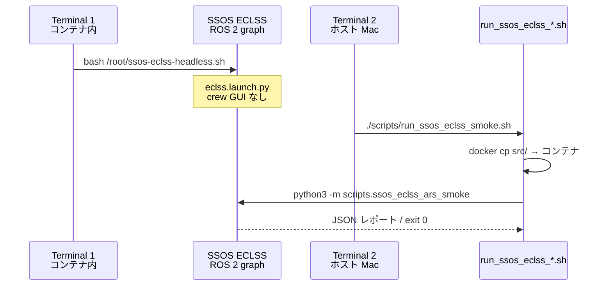

# クイックスタート

SSOS 接合 smoke テストと `ssos_eclss_loop` シナリオの最短手順です。**Mac ホストには ROS 2 がない**ため、SSOS 操作は Docker コンテナ内で行います。

---

## 前提条件

### 1. SSOS Docker コンテナ

| 項目 | 典型値 |
| --- | --- |
| コンテナ名 | `ssos`（環境変数 `SSOS_CONTAINER` で上書き可） |
| イメージ | `ghcr.io/space-station-os/space_station_os:latest` |
| ROS ディストリ | **Jazzy**（`/opt/ros/jazzy/setup.bash`） |
| ワークスペース | `~/ssos_ws/install/setup.bash` |

```bash
docker ps --format '{{.Names}}\t{{.Image}}'
# ssos   ghcr.io/space-station-os/space_station_os:latest
```

コンテナが無い場合:

```bash
docker run -it --name ssos ghcr.io/space-station-os/space_station_os:latest
```

### 2. engineering_agents 開発環境

```bash
cd /path/to/engineering_agents
pip install -e ".[dev]"
pytest tests/environment/   # 回帰確認（78 passed 前後を期待）
```

### 3. 環境変数（任意）

| 変数 | デフォルト | 用途 |
| --- | --- | --- |
| `SSOS_CONTAINER` | `ssos` | smoke ラッパーの対象コンテナ |
| `SSOS_CONTAINER_REPO` | `/tmp/engineering_agents` | コンテナ内 sync 先 |
| `ROS_DOMAIN_ID` | ECLSS: 未設定 / EPS: `23` | DDS ドメイン（EPS smoke ラッパーが 23 を export） |
| `SSOS_ECLSS_BACKEND` | — | `ssos_eclss_loop` の backend 上書き（`mock` \| `ros2`） |

!!! warning "Mac Docker と DDS"
    Mac Docker Desktop では `--network=host` が使えません。ホスト Mac から SSOS ROS グラフへ直接 DDS 接続するのは **非推奨** です。smoke ラッパーは `docker cp` + `docker exec` でコンテナ内実行します。

---

## 2 ターミナルワークフロー（ECLSS smoke）



### Terminal 1 — ECLSS ヘッドレス起動

```bash
docker exec -it ssos bash
bash /root/ssos-eclss-headless.sh
# Ctrl+C で停止。smoke 実行中は起動したままにする。
```

内部相当コマンド:

```bash
ros2 launch space_station eclss.launch.py
```

### Terminal 2 — Phase 1a ARS smoke（ホスト repo ルート）

```bash
cd /path/to/engineering_agents
chmod +x scripts/run_ssos_eclss_smoke.sh   # 初回のみ
./scripts/run_ssos_eclss_smoke.sh
# JSON 保存: ./scripts/run_ssos_eclss_smoke.sh --json-out /tmp/eclss_smoke.json
```

**合格条件**: exit code 0、`/co2_storage` と `/ars/diagnostics` が存在、`air_revitalisation` goal が SUCCEEDED。

### Phase 1b / 2 smoke（同じ Terminal 1 前提）

```bash
./scripts/run_ssos_eclss_1b_smoke.sh    # ARS + OGS + Sabatier 信号
./scripts/run_ssos_eclss_2_smoke.sh     # + WRS + 飲料水トレードオフ
```

---

## EPS smoke（Phase 3）

EPS は **フルステーションまたは EPS launch** が必要です。ECLSS ヘッドレスだけでは solar/BCDU トピックが無い場合があります。

```bash
# Terminal 1（例: フルステーション — コンテナ内）
ros2 launch space_station space_station.launch.py
# または EPS のみ: ros2 launch space_station eps.launch.py

# Terminal 2（ホスト）
./scripts/run_ssos_eps_smoke.sh
./scripts/run_ssos_eps_smoke.sh --arm-discharge-w 100 --arm-duration-steps 3
```

---

## ssos_eclss_loop シナリオ（Mock — ROS 不要）

```bash
cd /path/to/engineering_agents
PYTHONPATH=src python3 -m scenario.ssos_eclss_loop.scenario_run --backend mock
PYTHONPATH=src python3 -m scenario.ssos_eclss_loop.scenario_run \
  --backend mock --agents-mode labeled_rule_base --steps 8
```

出力: `src/experiments/results/ssos_eclss_loop_baseline/`（`telemetry.jsonl`, `health_metrics.jsonl`, `summary.json`）

---

## ssos_eclss_loop（ROS2 — コンテナ内）

ECLSS ヘッドレス起動後、コンテナ内で:

```bash
source /opt/ros/jazzy/setup.bash
source ~/ssos_ws/install/setup.bash
cd /tmp/engineering_agents   # または docker cp 先
PYTHONPATH=src SSOS_ECLSS_BACKEND=ros2 \
  python3 -m scenario.ssos_eclss_loop.scenario_run --backend ros2
```

---

## ドキュメントのブラウザ表示

MkDocs Material でローカルプレビュー:

```bash
pip install -e ".[dev]"
mkdocs serve
# → http://127.0.0.1:8000/ssos/  （SSOS 接合セクション）
```

静的ビルド:

```bash
mkdocs build
# 出力: site/ — 任意の静的ホストや GitHub Pages に配置可
```

GitHub 上では `docs/ssos/index.md` をそのまま閲覧できます（Mermaid は GitHub ネイティブレンダリング対応）。

---

## 次のステップ

- [ECLSS 統合](eclss-integration.md) — Action 型・Service 詳細
- [EPS 統合](eps-integration.md) — `request_eps_boost` の写像
- [トラブルシューティング](troubleshooting.md) — よくある失敗パターン
