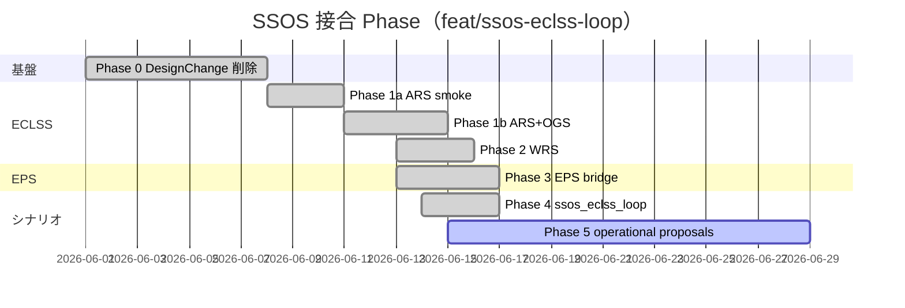

# ロードマップ — Phase 0–5

`feat/ssos-eclss-loop` ブランチにおける SSOS 接合の進捗とバックログです。

---

## Phase サマリー

| Phase | 内容 | 状態 | 完了条件 |
| --- | --- | --- | --- |
| **0** | ランタイム `DesignChange` 削除 | ✅ **完了** | `scrubber_degradation` テスト全 pass |
| **1a** | ARS ヘッドレス smoke | ✅ **完了** | `run_ssos_eclss_smoke.sh` exit 0 |
| **1b** | ARS + OGS ブリッジ | ✅ **完了** | Sabatier 信号が telemetry / smoke JSON に |
| **2** | + WRS | ✅ **完了** | `run_ssos_eclss_2_smoke.sh`、水トレードオフ信号 |
| **3** | EPS ROS2 接合 | ✅ **完了** | `EpsBackend`, `run_ssos_eps_smoke.sh`, `eps.backend` 切替 |
| **4** | `ssos_eclss_loop` + `SsosEclssLoopTeam` | ✅ **完了** | mock/ros2 シナリオ実行、telemetry JSONL |
| **5** | `operational_proposals.json` + 次 run 適用 | ⏳ **未着手** | `--apply-proposals` |



---

## Phase 0 — DesignChange 削除 ✅

| 項目 | 状態 |
| --- | --- |
| `SimulatorProtocol.apply_design_change` | 削除 |
| `scrubber_degradation` | Mock 凍結、事後 `design_proposals.json` 維持 |
| 新提案形式（予定） | `operational_proposals.json` — Phase 5 |

---

## Phase 1a — ARS smoke ✅

**成果物**

| ファイル | 役割 |
| --- | --- |
| `src/environment/ssos/eclss_topics.py` | Action/Service/Topic 定数 |
| `src/environment/ssos/eclss_types.py` | Goal / Report 型 |
| `src/scripts/ssos_eclss_ars_smoke.py` | コンテナ内 smoke |
| `scripts/run_ssos_eclss_smoke.sh` | ホストラッパ |

---

## Phase 1b — ARS + OGS ✅

**成果物**

| ファイル | 役割 |
| --- | --- |
| `src/environment/ssos/eclss_backend.py` | Protocol |
| `src/environment/ssos/mock_eclss_backend.py` | Mock |
| `src/environment/ssos/ros2_eclss_bridge.py` | CLI ブリッジ |
| `src/scripts/ssos_eclss_1b_smoke.py` | 1b smoke |
| `scripts/run_ssos_eclss_1b_smoke.sh` | ラッパ |

---

## Phase 2 — WRS ✅

**成果物**

| ファイル | 役割 |
| --- | --- |
| `ros2_eclss_bridge.py`（拡張） | WRS action + product/grey water service |
| `src/scripts/ssos_eclss_2_smoke.py` | Phase 2 smoke |
| `scripts/run_ssos_eclss_2_smoke.sh` | ラッパ |

検証: 飲料水 vs 電解水トレードオフ、`water_tradeoff_signal`

---

## Phase 3 — EPS ✅

**成果物**

| ファイル | 役割 |
| --- | --- |
| `eps_backend.py` | Protocol |
| `mock_eps_backend.py` | Mock ラッパ |
| `ros2_eps_bridge.py` | CLI ブリッジ |
| `topic_map.py` | SSOS 実トピックマップ |
| `message_adapters.py` | BCDU パース |
| `station_simulator.py` | EpsBackend 経由にリファクタ |
| `src/scripts/ssos_eps_smoke.py` | EPS smoke |
| `scripts/run_ssos_eps_smoke.sh` | ラッパ |

`scenario/runner.py`: `build_eps_backend()` — `mock` \| `ssos_eps`

---

## Phase 4 — ssos_eclss_loop ✅

**成果物**

| ファイル | 役割 |
| --- | --- |
| `src/scenario/ssos_eclss_loop/scenario.yaml` | 要求スタブ |
| `src/scenario/ssos_eclss_loop/agents.yaml` | エージェント設定 |
| `src/scenario/ssos_eclss_loop/scenario_run.py` | Runner |
| `src/scenario/ssos_eclss_loop/loop_mock_backend.py` | Mock dynamics |
| `src/scenario/ssos_eclss_loop/health.py` | 決定論的 health |
| `src/scenario/agents/ssos_eclss_loop_team.py` | Crew 代替チーム |

---

## Phase 5 — 未着手バックログ ⏳

| 項目 | 説明 |
| --- | --- |
| `operational_proposals.json` | 事後提案: `set_parameter` / `action_profile` / `service_config` |
| `--apply-proposals` | 次 run への提案適用 |
| `ssos_eclss_loop` + EPS 統合 | ECLSS ros2 + EPS ros2 の単一シナリオ |
| rclpy ネイティブクライアント | CLI ブリッジからの移行（性能） |
| `/bcdu/operation` Action | SSOS upstream PR（Phase 3c） |
| One Piece 要求 pull | 監督要求の正本連携（別リポジトリ） |

### Action/Service 提案の適用可否

| 提案種別 | 適用方法 | C++ 再ビルド |
| --- | --- | --- |
| `action_profile` | `ActionClient.send_goal()` | 不要 |
| `service_config` | `ServiceClient.call()` | 不要 |
| `set_parameter` | launch YAML 差し替え | 不要（起動時読込） |
| 新 Action/Service/BT | SSOS upstream PR | **必要** |

---

## 長期バックログ

- SSOS ECLSS に CO₂ スクラバノード追加（upstream）
- それに合わせた別 Mock シナリオ（`scrubber_degradation` とは別）
- Mac ホスト ↔ コンテナ DDS（CycloneDDS Peers）— 優先度低

---

## テスト状況

```bash
pytest tests/environment/
# 期待: 78 passed, 3 skipped（2026-06-14 時点）
```

---

## 関連

- [概要 — Tier Model](index.md#tier-model)
- 開発メモ: [SSOS ECLSS 接合プラン](../memo/ssos_eclss_loop/ssos_eclss_loop_connection_plan.md)
