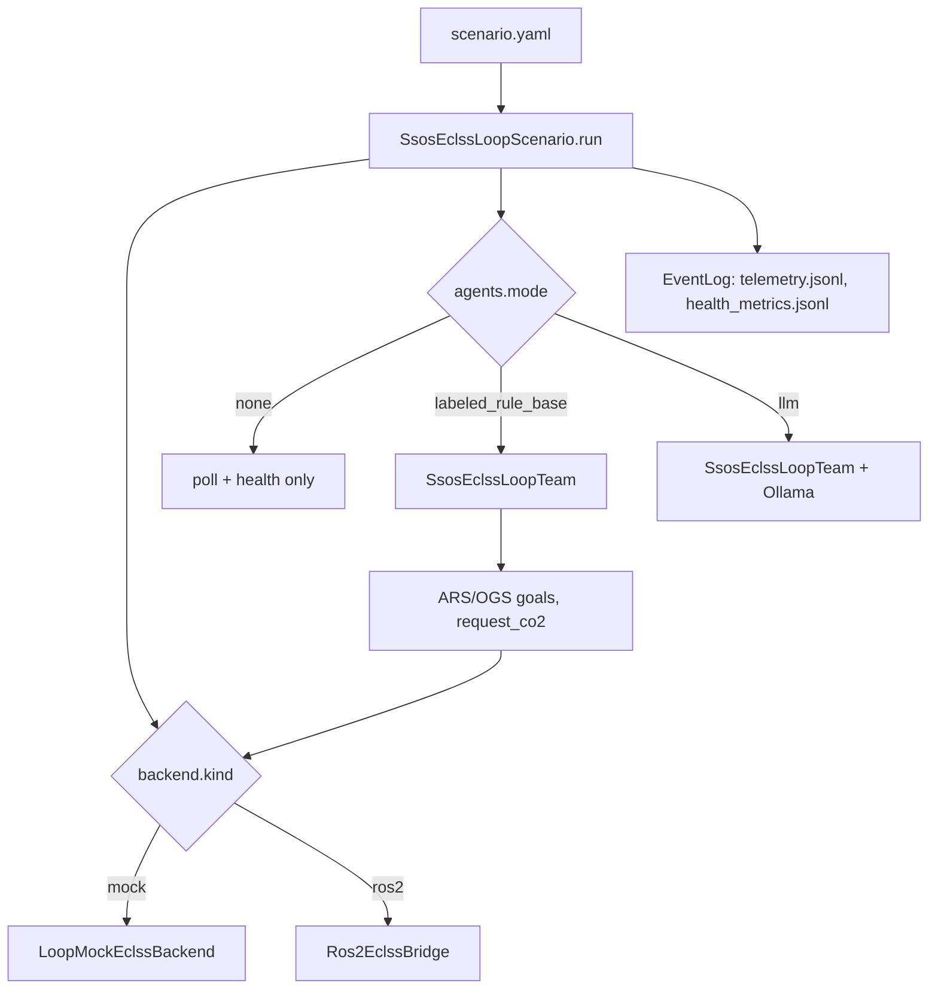
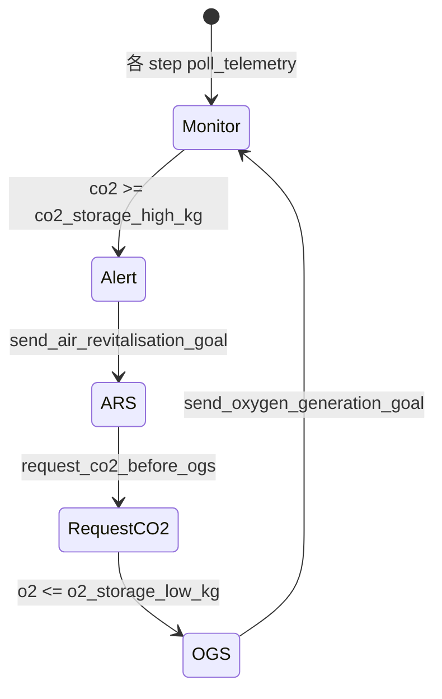

# ssos_eclss_loop シナリオ

Crew Simulation を **エージェントチーム** で置き換える新シナリオです。`SimulatorProtocol` ではなく `EclssBackend` を直接 poll し、ARS / OGS 操作と CO₂ 要求を行います。

---

## 概要

| 項目 | 値 |
| --- | --- |
| シナリオ名 | `ssos_eclss_loop` |
| エントリ | `python -m scenario.ssos_eclss_loop.scenario_run` |
| チーム | `SsosEclssLoopTeam` |
| デフォルト backend | `mock` |
| デフォルト agents | `none` |
| ステップ数 | 8（`scenario.yaml`） |



---

## 設定ファイル

### scenario.yaml（主要フィールド）

```yaml
name: ssos_eclss_loop

simulation:
  steps: 8
  initial_co2_storage_kg: 1650.0
  initial_o2_storage_kg: 480.0
  initial_product_water_l: 100.0

backend:
  kind: mock  # mock | ros2
  ros2:
    action_timeout_s: 120.0
    topic_timeout_s: 15.0

mock_dynamics:
  co2_growth_kg_per_step: 60.0
  ars_co2_reduction_kg: 350.0
  ogs_o2_gain_kg: 100.0

thresholds:
  co2_storage_high_kg: 1500.0
  co2_storage_critical_kg: 2200.0
  o2_storage_low_kg: 450.0
  product_water_low_l: 50.0

agents:
  mode: none  # none | labeled_rule_base | llm
```

### agents.yaml（labeled_rule_base 時）

- チーム: 3 体 `eclss_operator_*`
- policy 閾値: `co2_storage_high_kg`, `o2_storage_low_kg`
- OGS 前に `request_co2`（Sabatier 原料）— `request_co2_before_ogs: true`
- **policy は LLM モードから隔離**（AGENTS.md 規律）

---

## Backend 切替

優先順位（高 → 低）:

1. CLI `--backend mock|ros2`
2. 環境変数 `SSOS_ECLSS_BACKEND`
3. `scenario.yaml` の `backend.kind`

```bash
# Mock（CI / ローカル、ROS 不要）
PYTHONPATH=src python3 -m scenario.ssos_eclss_loop.scenario_run --backend mock

# エージェント付き
PYTHONPATH=src python3 -m scenario.ssos_eclss_loop.scenario_run \
  --backend mock \
  --agents-mode labeled_rule_base \
  --steps 8

# ROS2（SSOS コンテナ内、ECLSS 起動済み）
export SSOS_ECLSS_BACKEND=ros2
PYTHONPATH=src python3 -m scenario.ssos_eclss_loop.scenario_run --backend ros2
```

`build_eclss_backend()` は `scenario_run.py` に実装されています。

---

## エージェント動作（labeled_rule_base）



| イベント | 条件 | コマンド |
| --- | --- | --- |
| アラート | CO₂ ≥ 閾値（初回） | チームメッセージ |
| ARS 起動 | CO₂ 高 & 未実行 | `air_revitalisation` |
| CO₂ 要求 | OGS 前 & 未要求 | `request_co2(25.0)` |
| OGS 起動 | O₂ ≤ 閾値 & 未実行 | `oxygen_generation` |

ランタイム中の **トポロジ変更は行いません**（恒久変更は Phase 5 の `operational_proposals.json` 予定）。

---

## 出力成果物

実行後、`src/experiments/results/<run_id>/` に:

| ファイル | 内容 |
| --- | --- |
| `telemetry.jsonl` | 各 step の `EclssTelemetrySnapshot` |
| `health_metrics.jsonl` | 閾値に対する決定論的 health 判定 |
| `messages.jsonl` | エージェント発言（agents 有効時） |
| `events.jsonl` | 適用した運用コマンド |
| `summary.json` | peak CO₂、ARS/OGS 起動 step 等 |
| `provenance.jsonl` | One Piece 連携（best-effort） |

run_id 例:

- `ssos_eclss_loop_baseline`（agents: none）
- `ssos_eclss_loop_labeled_rule_base`
- `ssos_eclss_loop_llm`

---

## Mock vs ROS2 の使い分け

| 観点 | Mock | ROS2 |
| --- | --- | --- |
| 前提 | `pip install -e ".[dev]"` のみ | SSOS Docker + ECLSS 起動 |
| 速度 | 高速（pytest 向き） | Action 待ちで遅い |
| 物理忠実度 | 簡易 dynamics | SSOS 実グラフ |
| CI | ✅ 推奨 | ❌ Docker 依存 |
| 受入デモ | エージェントロジック確認 | SSOS 接合実証 |

---

## runner 統合

`SCENARIO_REGISTRY` に `ssos_eclss_loop` が登録されています:

```python
from scenario.ssos_eclss_loop.scenario_run import SCENARIO_REGISTRY
# {"ssos_eclss_loop": SsosEclssLoopScenario()}
```

`SsosEclssLoopScenario.build_simulator()` は `NotImplementedError` — 本シナリオは `SimulatorProtocol` を使いません。

---

## 関連

- [ECLSS 統合](eclss-integration.md)
- [クイックスタート — ssos_eclss_loop](quickstart.md)
- [ロードマップ — Phase 4/5](roadmap.md)
