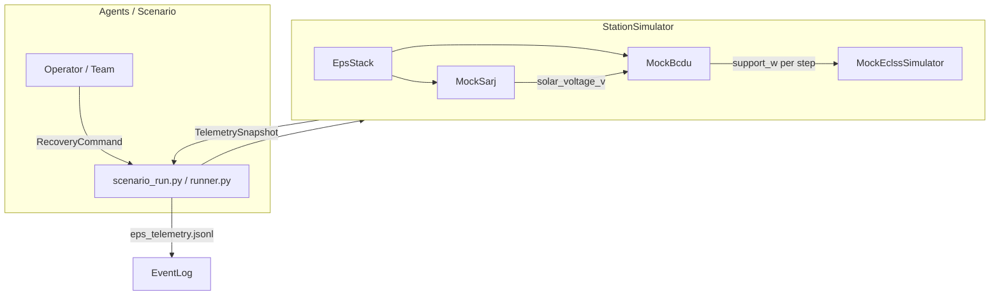
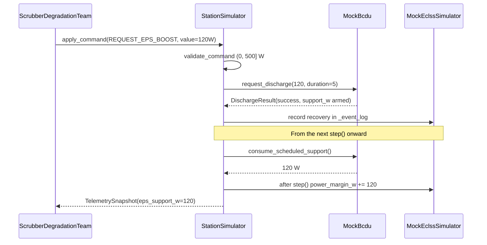

> Japanese: [../../../ja/memo/ssos_eclss_loop/ssos_eps_ros2_connection_plan.md](../../../ja/memo/ssos_eclss_loop/ssos_eps_ros2_connection_plan.md)

# engineering_agents → SSOS EPS Connection Implementation Plan (EPS-only)

> **Scope**: Connect Space Station OS (SSOS) running in Docker on Mac with the `engineering_agents` EPS subsystem over ROS 2 DDS. ECLSS continues to use `MockEclssSimulator`.

---

## 1. Current State of engineering_agents

### 1.1 File Layout and Roles

| File | Role |
|---|---|
| `src/environment/ssos/eps_topics.py` | ROS2-style topic name constants (`/solar/voltage`, `/bcdu/operation`, etc.) |
| `src/environment/ssos/eps_types.py` | Python dataclasses such as `BcduStatus`, `SarjReading`, `DischargeResult` |
| `src/environment/ssos/mock_sarj.py` | beta angle + eclipse → `solar_voltage_v` |
| `src/environment/ssos/mock_bcdu.py` | Charge/discharge mode, `request_discharge(support_w, duration_steps)` |
| `src/environment/ssos/eps_stack.py` | Thin coupling facade: SARJ → BCDU |
| `src/environment/ssos/station_simulator.py` | `SimulatorProtocol` implementation bundling **ECLSS + EPS** |
| `src/environment/ssos/adapter.py` | Stub for real SSOS (`NotImplementedError`) |
| `src/environment/ssos/mock_eclss.py` | ECLSS physics model (CO2 / power margin) |

### 1.2 Architecture (Current)



### 1.3 `SimulatorProtocol` and EPS / ECLSS Division of Labor

| Method | Primary owner | EPS-related |
|---|---|---|
| `step()` | ECLSS physics + EPS telemetry update | Advance SARJ/BCDU inside `step()` |
| `apply_command()` | ECLSS commands | **Route only `request_eps_boost` to EPS** |
| `get_topology()` / `get_design_*()` | ECLSS | None |
| `inject_anomaly()` | ECLSS | None |

**Methods outside the protocol but required by the runner** (`StationSimulator` only):

- `get_events()` — ECLSS event log (for recovery provenance)
- `eps_telemetry_dict(step)` — output for `eps_telemetry.jsonl`

### 1.4 `request_eps_boost` Flow (Today)



**Trigger conditions** (`scrubber_degradation_team.py`):

- `power_status == CRITICAL`
- `eps_support_steps_remaining == 0`
- `agents.yaml`: `request_eps_boost_on_power_critical: true`

**duration**: `design_parameters.eps_support_duration_steps` (default 5 steps)

---

## 2. SSOS EPS Interface (space-station-os)

### 2.1 How to Launch

| Launch command | Contents |
|---|---|
| `ros2 launch space_station space_station.launch.py` | GUI + ECLSS + Thermal + **EPS** + `solar_power` |
| `ros2 launch space_station eps.launch.py` | EPS only (battery_manager, bcdu, ddcu, mbsu) |

Nodes started by `space_station/launch/eps.launch.py`:

1. `battery_manager_node` — 24 BMS units, charge/discharge services
2. `bcdu_node` — automatic charge/discharge based on SSU voltage
3. `ddcu_device` — secondary-side voltage regulation
4. `mbsu_device` — channel selection and routing

`space_station.launch.py` additionally starts `solar_power` (= `sarj_mock.cpp`) on top of the above.

### 2.2 Topics (Implementation-Based)

**Important**: `engineering_agents` `eps_topics.py` / `docs/api-contracts.md` and **current SSOS main do not match**.

| engineering_agents contract | SSOS implementation (main) | Type |
|---|---|---|
| `/solar/voltage` | **`/solar_controller/ssu_voltage_v`** | `std_msgs/Float64` |
| — | `/solar_controller/ssu_power_w` | `std_msgs/Float64` |
| — | `/solar_controller/sun_beta_deg` | `std_msgs/Float64` |
| `/bcdu/status` | `/bcdu/status` | `space_station_interfaces/msg/BCDUStatus` |
| `/bcdu/operation` | **Not implemented** (README only) | — |
| `/eps/diagnostics` | `/eps/diagnostics` | `diagnostic_msgs/DiagnosticStatus` |
| `/eps/eclss/load_request_w` | **Not implemented** | — |

### 2.3 `BCDUStatus.msg` Fields

```
std_msgs/Header header
string mode # idle/charging/discharging/fault/safe
float64 bus_voltage # V
float64 regulation_voltage
float64 current_draw # A (+ = discharge, - = charge)
bool fault
string fault_message
```

`engineering_agents` `BcduStatus` has **mock-only** fields `support_w`, `support_steps_remaining`, and `step`, which are not present in the SSOS message.

### 2.4 BCDU Behavior (Implementation)

`bcdu_device.cpp` is **not an Action server**:

- Subscribes to `/solar_controller/ssu_voltage_v`
- Automatically charges/discharges based on thresholds (`ssu_charge_enter_v` / `ssu_discharge_enter_v`)
- Asynchronously calls each BMS `/battery/battery_bms_{i}/charge|discharge` service
- Publishes `/bcdu/status`

---

## 3. Mac + Docker ROS 2 DDS Networking

### 3.1 Challenges

| Challenge | Details |
|---|---|
| `--network=host` | **Not supported on Mac Docker Desktop** (Linux only) |
| Multicast | DDS auto-discovery between host ↔ container often fails on Docker bridge |
| Fixed ports | DDS uses dynamic ports, so individual `-p` publishing is impractical |
| SSOS side | `entry-point.sh` may start a Fast DDS discovery server |

### 3.2 Connection Options (Recommended Order)

| Option | Method | Mac suitability | Notes |
|---|---|---|---|
| **A: Same container** | `pip install -e .` + rclpy bridge inside `docker exec` | ★★★ | Zero discovery issues. First choice for Phase 1 |
| **B: Compose shared network** | Join 2 services on `networks: ssos_net` | ★★☆ | Relatively easy between containers |
| **C: Host Mac execution** | Explicitly set container IP in CycloneDDS `Peers` | ★☆☆ | High setup and debugging cost |

### 3.3 Required Environment Variables

```bash
source /opt/ros/humble/setup.bash
source ~/ssos_ws/install/setup.bash
export ROS_DOMAIN_ID=0
export ROS_LOCALHOST_ONLY=0
export RMW_IMPLEMENTATION=rmw_cyclonedds_cpp  # Cyclone + Peers is stable for Mac↔Docker
```

### 3.4 Connection Verification Commands

```bash
ros2 topic list | grep -E 'solar|bcdu|eps|ddcu|mbsu|battery'
ros2 topic echo /bcdu/status --once
ros2 topic echo /solar_controller/ssu_voltage_v --once
```

---

## 4. EPS-only Adapter Architecture (Proposal)

### 4.1 Design Principles

- **ECLSS**: Keep `MockEclssSimulator`
- **EPS**: Make `EpsStack` swappable via an `EpsBackend` protocol
- **Naming**: `Ros2EpsBridge` (low-level ROS I/O) + existing `StationSimulator`

### 4.2 New Files (Draft)

```
src/environment/ssos/
  eps_backend.py        # Protocol: poll(), request_discharge(), consume_scheduled_support()
  ros2_eps_bridge.py    # rclpy implementation
  message_adapters.py   # BCDUStatus.msg ↔ BcduStatus dataclass
  topic_map.py          # SSOS actual topics ↔ eps_topics contract mapping
```

### 4.3 Mapping `request_eps_boost` → SSOS

| Phase | Approach | Implementation cost |
|---|---|---|
| **3a (interim, recommended)** | While BCDU status is `discharging`, add `current_draw * bus_voltage` as `support_w` to ECLSS | Low. No SSOS changes required |
| **3b (mid-term)** | Call `/battery/battery_bms_*/discharge` services directly from the bridge | Medium |
| **3c (ideal)** | Add `/bcdu/operation` Action to SSOS | SSOS-side PR required |

---

## 5. Phased Implementation Plan

**Branch**: `feature/ssos-eps-ros2-bridge`

| PR | Contents | Completion criteria |
|---|---|---|
| **PR-1** | `EpsBackend` abstraction + `topic_map.py` | Existing mock tests green |
| **PR-2** | Read-only `Ros2EpsBridge` + smoke test | Subscribe to SSOS topics inside container |
| **PR-3** | Switch `eps_backend: mock \| ssos_eps` in `scenario.yaml` | Mock regression green |
| **PR-4** | `request_eps_boost` interim 3a | Recovery events in labeled run |
| **PR-5** | Docker / operations documentation | `docs/ssos-eps-integration.md` |

---

## 6. Verification You Can Run Now (Docker SSOS Running)

```bash
docker exec -it <CONTAINER_ID> bash
source /opt/ros/humble/setup.bash
source ~/ssos_ws/install/setup.bash
export ROS_DOMAIN_ID=0

ros2 topic list | grep -E 'solar|bcdu|eps|battery'
ros2 topic echo /bcdu/status --once
ros2 topic echo /solar_controller/ssu_voltage_v --once
```

Verify `BCDUStatus` import path:

```bash
python3 -c "from space_station_interfaces.msg import BCDUStatus; print(BCDUStatus)"
```

---

## 7. Gaps and Risks

| Risk | Mitigation |
|---|---|
| `/bcdu/operation` not implemented | Phase 3a interim → SSOS Action PR (3c) |
| Topic name mismatch | Treat SSOS actual names as canonical in `topic_map.py` |
| `support_w` absent from SSOS | Bridge estimates watts + duration timer |
| Mac host ↔ container DDS | Phase 1 limited to in-container execution |
| Step synchronization | Fetch latest messages via `poll()` |

---

## Recommended Starting Order

1. Verify topics from §6 inside the container
2. **PR-1** Backend abstraction (mock behavior unchanged)
3. **PR-2** In-container rclpy smoke test
4. In parallel, consider SSOS-side issue/PR for `/bcdu/operation` for `request_eps_boost`

Previous phase: [eps_implementation_plan.md](../../scrubber_degradation/eps_implementation_plan.md) (EPS-1–4 complete). This document is positioned as **EPS-5: SSOS ROS2 Bridge**.

---

## 8. Implementation Status (Phase 3 — `feat/ssos-eclss-loop`)

| PR (draft) | Status | Notes |
|---|---|---|
| **PR-1** `EpsBackend` + `topic_map.py` | ✅ Complete | `eps_backend.py`, `mock_eps_backend.py`, `topic_map.py`, `message_adapters.py` |
| **PR-2** `Ros2EpsBridge` read + smoke | ✅ Complete | `ros2_eps_bridge.py`, `scripts/ssos_eps_smoke.py`, `scripts/run_ssos_eps_smoke.sh` |
| **PR-3** `eps.backend: mock \| ssos_eps` switch | ✅ Complete | `build_eps_backend()` in `scenario/runner.py` |
| **PR-4** `request_eps_boost` interim 3a | ✅ Complete | Bridge-side timer + BCDU `discharging` → `current_draw * bus_voltage` |
| **PR-5** Operations documentation | 📋 backlog | `docs/ssos-eps-integration.md` → [backlog BL-005](../backlog.md#bl-005-ssos-eps-ros2-ブリッジ--フォローアップ) |

### Added / Changed Files

```
src/environment/ssos/
  eps_backend.py          # EpsBackend Protocol
  mock_eps_backend.py     # MockEpsStack wrapper
  ros2_eps_bridge.py      # ros2 CLI bridge (same pattern as EclssBridge)
  topic_map.py            # SSOS actual topic name mapping
  message_adapters.py     # BCDUStatus CLI output parsing
  station_simulator.py    # Refactored to go through EpsBackend
  adapter.py              # build_ssos_eps_station() helper

src/scripts/ssos_eps_smoke.py
scripts/run_ssos_eps_smoke.sh

tests/environment/
  test_ros2_eps_bridge.py
  test_mock_eps_backend.py
  test_ssos_eps_smoke.py
```

### Configuration Example (`eps` block in `scenario.yaml`)

```yaml
eps:
  backend: mock          # default — existing SARJ/BCDU mock
  # backend: ssos_eps    # SSOS Docker in-container ROS2 bridge
  sarj:
    beta_angle_deg: 45.0
```

### Smoke Test Execution

```bash
# Inside SSOS container (ROS_DOMAIN_ID=23)
./scripts/run_ssos_eps_smoke.sh

# With discharge arm
./scripts/run_ssos_eps_smoke.sh --arm-discharge-w 100 --arm-duration-steps 3
```

### Tests

```bash
pytest tests/environment/test_ros2_eps_bridge.py \
       tests/environment/test_mock_eps_backend.py \
       tests/environment/test_ssos_eps_smoke.py \
       tests/environment/test_station_simulator.py
```

All `tests/environment/` — **78 passed, 3 skipped** (as of 2026-06-14).

### Follow-ups (Not Started)

PR-5, Phase 3b/3c, BCDU action, operations documentation, etc. are moved to **[backlog.md BL-005](../backlog.md#bl-005-ssos-eps-ros2-ブリッジ--フォローアップ)**.

### Known Limitations (3a interim)

- `/bcdu/operation` not implemented — discharge depends on SSOS automatic thresholds + bridge timer
- `support_w` not in SSOS messages — bridge supplements with watt estimation + duration timer
- Mac host ↔ container DDS not supported — in-container execution only (same as Phase 1)
- ECLSS continues to use `MockEclssSimulator` (out of scope for this phase)

