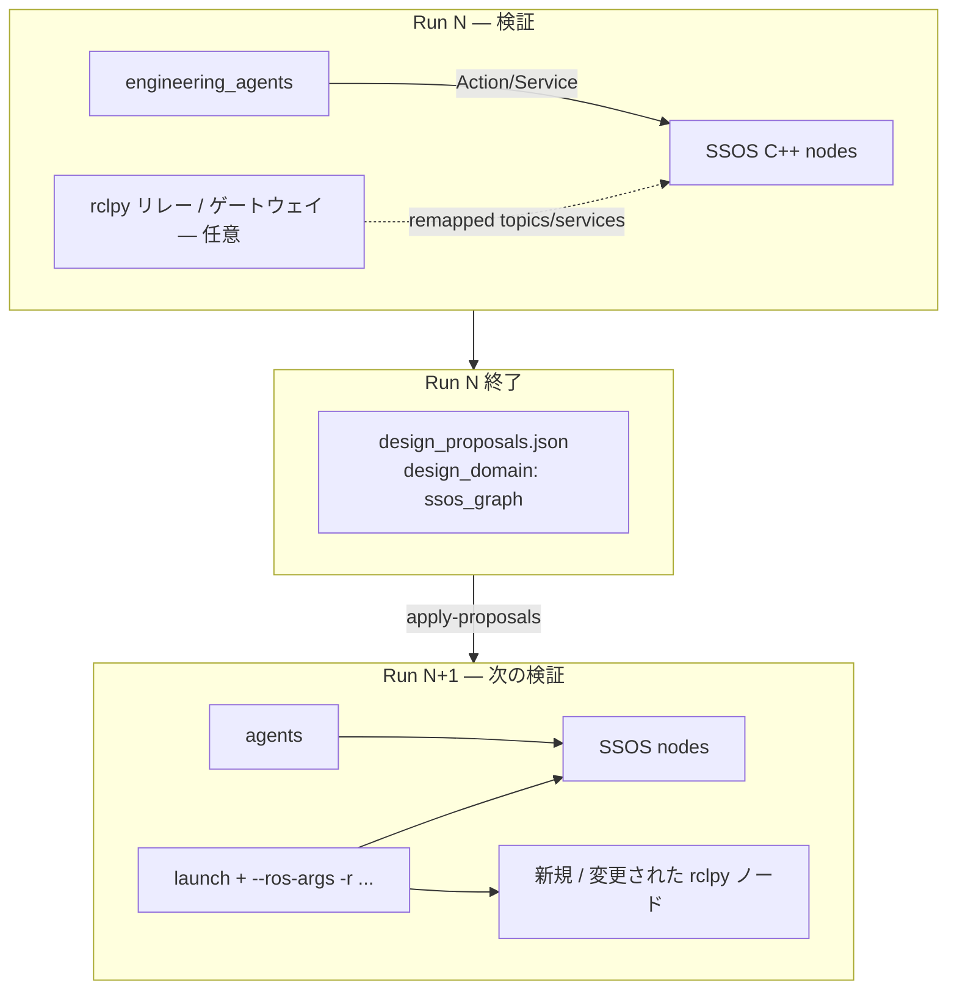

> Japanese: [../../../ja/memo/ssos_eclss_loop/ssos_ros2_graph_design_investigation.md](../../../ja/memo/ssos_eclss_loop/ssos_ros2_graph_design_investigation.md)

# Adding External Nodes and Changing Connections on the SSOS DDS Graph — Investigation Report

> **Investigation date**: 2026-06-14  
> **Question**: Can nodes be added to SSOS DDS connections from `engineering_agents`, and can an engineer intervene in power and mass flows? Can a full C++ rebuild be avoided?  
> **Assumption**: No permanent runtime topology changes; aligned with the design philosophy of **reflecting proposals from Run N in Run N+1** (`design_proposals.json`).

---

## 1. Executive Summary

| Conclusion | Content |
|------|------|
| **Partially feasible** | There is room to insert “plumbing / routers” between existing **Topic / Service / Action names** using **rclpy nodes + launch remapping** |
| **Direct port of scrubber-style `add_edge` is not feasible** | Mass and power coupling on the real SSOS side is mainly **hardcoded clients/servers inside C++ nodes**; there is no mutable graph API like Mock `TopologyGraph` |
| **Realistic range for avoiding rebuild** | **Operational parameters and goal profiles** (Phase 5 done) → **launch-time remapping + external relay nodes** → **new Service/Action servers (rclpy)**. Unless existing subsystem **internal Behavior Trees are changed**, “adding a new bed inside ARS” requires upstream changes |
| **Recommended next steps** | (1) Graph visualization smoke test (2) **Service gateway PoC** for `grey_water` / `/ddcu/load_request` (3) Decide whether to add a `graph_rewire` kind to the post-run proposal schema |

---

## 2. SSOS Connection Model (Measured + Source)

### 2.1 Runtime Graph (Headless Launch)

From Docker container `ssos` + `ssos-eclss-headless.sh`:

**Example nodes**

```
/air_revitalisation
/oxygen_generation_system
/water_recovery_system
/bcdu_node, /ddcu_node, /mbsu_node, /battery_manager, /solar_power_node
```

**Interfaces Related to Mass Flow**

| Type | Name | Provider | Main Callers |
|------|------|--------|----------------|
| Topic pub | `/co2_storage` | ARS | OGS (subscribe) |
| Topic pub | `/o2_storage` | OGS | Crew / agents (subscribe) |
| Topic pub | `/wrs/product_water_reserve` | WRS | Crew / OGS (client) |
| Service | `/ars/request_co2` | ARS | OGS (client) |
| Service | `/grey_water` | WRS | OGS (client) |
| Service | `/wrs/product_water_request` | WRS | OGS / Crew |
| Service | `/ogs/request_o2` | OGS | Crew |
| Action | `air_revitalisation` | ARS | Crew / `engineering_agents` |
| Action | `oxygen_generation` | OGS | Crew / `engineering_agents` |
| Action | `water_recovery_systems` | WRS | Crew / `engineering_agents` |

**Power Flow**

| Type | Name | Notes |
|------|------|------|
| Topic | `/solar_controller/ssu_voltage_v` | Solar array simulation |
| Topic | `/ddcu/input_voltage`, `/ddcu/output_voltage` | MBSU → DDCU |
| Service | `/ddcu/load_request` | **ARS is client** (power-on at startup) |
| Topic | `/bcdu/status` | BCDU status |
| Service | `/bcdu/operation` etc. | Discharge control (Phase 3 not fully integrated) |

### 2.2 Coupling Is “In-Node Clients,” Not a “Graph”

From `space_station_eclss` source (container `~/ssos_ws`), **inter-subsystem connections are fixed in C++**:

```cpp
// ogs_systems.cpp (excerpt)
water_client_ = create_client<RequestProductWater>("/wrs/product_water_request");
co2_client_   = create_client<Co2Request>("/ars/request_co2");
gray_water_client_ = create_client<GreyWater>("/grey_water");

// ars_systems.cpp (excerpt)
load_client_ = create_client<Load>("/ddcu/load_request");
// + /ars/request_co2 service server
```

In other words, SSOS’s “plumbing diagram” is **a set of processes launched together + named DDS endpoints**; there is **no runtime-mutable graph object on the SSOS side** like Mock `add_edge(manifold → scrubber)` in `engineering_agents`.

---

## 3. What “Changing Connections” Means in ROS 2 / DDS

### 3.1 Topic (Publish–Subscribe)

```text
[ARS] --publish--> /co2_storage --subscribe--> [OGS]
```

**What External Nodes Can Do**

| Technique | Rebuild | Description |
|------|----------|------|
| **Subscribe only (monitoring)** | Not required | Same pattern as rclpy resident telemetry in `engineering_agents` (post Phase 5) |
| **Relay (T-junction / bypass)** | Not required | New node subscribes to `/co2_storage` and publishes `/co2_storage_tapped`. Downstream remapped via remapping |
| **Synthesis / filter** | Not required | Read multiple topics and write to another (virtual tank, etc.) |

**Constraint**: If the original Subscriber **keeps the old topic name**, a relay alone does not change flow rate. **Downstream client remapping** or **replacing the caller** is required.

### 3.2 Service (RPC)

```text
[OGS client] --call--> /grey_water <--server-- [WRS]
```

**What External Nodes Can Do**

| Technique | Rebuild | Description |
|------|----------|------|
| **Gateway** | Not required | Remap WRS to `/grey_water/wrs`; rclpy receives on `/grey_water` and forwards (bypass, flow limiting, logging) |
| **Add new service** | Not required (server is rclpy) | New node `co2_buffer` offers `/co2_buffer/withdraw` — **OGS does not call it** (caller-side change required) |
| **Duplicate service with same name** | **Not feasible** | On DDS, effectively only one server per service name |

**Closest to scrubber `add_edge` is gateway + remapping**.

### 3.3 Action (Long-Running Tasks)

Sending goals to existing Action servers (`air_revitalisation`, etc.) is **implemented in Phases 1–4**.  
If SSOS does not know a new Action type, the **agent becomes the orchestrator**, combining multiple Services/Actions (same as Crew Simulation substitute).

### 3.4 Parameters (`set_parameter`)

Efficiency and thresholds can be changed via startup YAML / dynamic `ros2 param set`. **Internal wiring does not change**, but this maps easily to `set_parameter` in `design_proposals` as **Run N+1 input** (Phase 5 done).

---

## 4. Alignment with Current `engineering_agents`

| Layer | scrubber_degradation | ssos_eclss_loop (current) | Extension room on real SSOS graph |
|--------|---------------------|-------------------------|---------------------------|
| Runtime operations | RecoveryCommand | ARS/OGS Action, CO₂ Service | Same + external relay nodes |
| Post-run proposals | `design_proposals` (scrubber: add_edge, add_node) | `design_proposals` (ssos_graph: action_profile, etc.) | **`graph_rewire`** (apply plugin implemented) |
| Next Run reflection | Dashboard provisional apply | `--apply-proposals` | remapping manifest + external node launch |
| Topology model | `DesignStateManager` | none | `RosGraphModel` (to be implemented) |

**Important**: The user intent (no runtime design changes; reflect in next Run) **aligns with** `design_proposals.json` (`design_domain: ssos_graph`).

---

## 5. Feasibility by Scenario

### 5.1 Mass Flow

| Engineering intent | Feasible without build? | Realization pattern | Difficulty |
|---------------------|-------------------|--------------|--------|
| Insert CO₂ buffer before OGS | **Conditionally yes** | `/ars/request_co2` gateway + ARS/OGS remapping | High |
| Grey-water bypass path | **Conditionally yes** | `/grey_water` gateway (§3.2) | Medium |
| Add new tank topic | **Yes** | rclpy publishes `/virtual/co2_buffer` — **only the agent** references it | Low |
| New desiccant bed inside ARS | **No** (upstream) | C++ BT / parameter addition | — |
| Insert crew metabolism | **Yes** | `engineering_agents` drives Action/Service instead of Crew (done) | Low |

### 5.2 Power Flow

| Engineering intent | Feasible without build? | Realization pattern | Difficulty |
|---------------------|-------------------|--------------|--------|
| Monitor DDCU output | **Yes** | subscribe `/ddcu/output_voltage` (EPS Phase 3 partially done) | Low |
| Power filter before ARS energization | **Conditionally yes** | `/ddcu/load_request` gateway + ARS client remapping | High |
| MBSU channel rerouting | **Conditionally yes** | topic relay + MBSU/DDCU remapping | High |
| Add new battery node | **Partially yes** | rclpy publishes virtual power topic — **existing nodes do not see it** | Medium |

### 5.3 Disambiguating “Adding a Node”

| Meaning | Feasible? |
|------|--------|
| **Participate a new process in the DDS graph** | **Yes** — launch rclpy nodes in the same `ROS_DOMAIN_ID` |
| **Existing SSOS nodes automatically use the new node** | **No** — client/server names are fixed in code |
| **Agent assembles flow via the new node** | **Yes** — extend orchestration as Crew substitute |
| **Make wiring appear changed in the next Run** | **Yes** — include remapping + external node launch in proposal JSON |

---

## 6. Technical Stack for “Design Changes” Without Rebuild (Proposal)



### Tier 0 — Done (Phase 5)

- `action_profile`, `service_config`, `set_parameter`
- Thresholds, goal fields, timeouts

### Tier 1 — Monitoring and Digital Twin (Low Effort)

- `ros2 topic echo` / rclpy resident **snapshot of real graph** appended to `telemetry.jsonl`
- Auto-generate **connection table** from `ros2 node info` / `ros2 service list`

### Tier 2 — Gateway PoC (Medium Effort)

1. **`grey_water` router** (rclpy)  
   - WRS: `--ros-args -r /grey_water:=/grey_water/wrs`  
   - Router: server `/grey_water` → client `/grey_water/wrs`  
   - Proposal: `{"change_kind":"graph_rewire","payload":{"kind":"service_gateway","public":"/grey_water","backend":"/grey_water/wrs"}}`

2. **`/co2_storage` tap** (topic relay)  
   - Inject logging, delay, saturation model in external node

### Tier 3 — Post-Run Proposal Schema Extension (Medium–High Effort)

Example `design_proposals.json` (`change_kind: graph_rewire`):

```json
{
  "change_kind": "graph_rewire",
  "payload": {
    "component": "rclpy_gateway",
    "entrypoint": "environment.ssos.gateways.grey_water_router:main",
    "remaps": [
      {"from": "/grey_water", "to": "/grey_water/wrs", "node": "water_recovery_system"}
    ],
    "launch_after": "ssos-eclss-headless.sh"
  }
}
```

On the next Run, `--apply-proposals`:

1. Updates `scenario.yaml` / launch manifest  
2. Adds gateway node via `docker exec` or launch  

### Tier 4 — Upstream / Fork (High Effort; Area to Avoid)

- Add new step to ARS Behavior Tree  
- Merge new `.srv` / `.action` into SSOS  
- `ComposableNode` for in-process plugins  

---

## 7. Risks and Constraints

| Risk | Impact |
|--------|------|
| **Service name collision** | ECLSS startup failure from launch order and remapping mistakes when introducing gateway |
| **Type mismatch** | Importing `space_station_interfaces` in rclpy requires SSOS workspace source (feasible inside container) |
| **Power energization sequence** | ARS synchronously calls `/ddcu/load_request` at startup — gateway delay destabilizes headless startup |
| **No Crew** | No metabolism input in headless — mass flow driven only by Action/Service (understood) |
| **“Design” vs “operations” boundary** | Applying wiring changes at runtime breaks design–verification separation — **strictly apply on next Run** |

---

## 8. Mapping to scrubber `design_proposals`

| design_proposals (Mock) | Equivalent on real SSOS |
|--------------------------|---------------------|
| `add_edge` (flow) | service_gateway / topic_relay + remapping |
| `add_edge` (power) | `/ddcu/load_request` gateway, MBSU voltage relay |
| `add_node` (valve) | rclpy gateway node (flow-limiting logic) |
| `set_parameter` | YAML / ROS param (Phase 5 done) |
| `baseline_topology` | `ros2 node list` + `ros2 service list` snapshot |

---

## 9. Recommended Roadmap (`engineering_agents`)

| Priority | Item | Deliverable |
|------|------|--------|
| P0 | Generate Phase 6 LLM + post-run proposal **content** from Run results | Enhance current `build_design_proposals_from_run` |
| P1 | **Graph observation** | `scripts/ssos_graph_snapshot.sh` → `graph_snapshot.json` |
| P2 | **grey_water gateway PoC** | `src/environment/ssos/gateways/grey_water_router.py` + smoke |
| P3 | **Launch apply for `graph_rewire`** | apply handles launch/remap |
| P4 | EPS `/ddcu/load_request` gateway | Demonstrate power-flow design |
| P5 | Upstream proposals (only when new subsystem is integrated into ARS) | SSOS PR |

---

## 10. Conclusion (Direct Answer to the Question)

> **Can nodes be added and connections changed in ssos_eclss_loop?**

- **Adding new nodes to the DDS network itself is feasible** (rclpy, same container, same `ROS_DOMAIN_ID`).
- **Rewriting “internal wiring” of existing SSOS C++ nodes without a build is not feasible**.
- **Changing connections** is **approximately achievable** via **(1) launch remapping, (2) external gateway nodes, (3) agent-side caller changes**.
- This reinterprets scrubber `add_edge` as **ROS graph operations**; **reflecting as `graph_rewire` in `design_proposals` on the next Run** best matches the repository design philosophy.

> **Can a full SSOS rebuild be avoided?**

- **Avoidable for Tier 0–3 (parameters, gateways, remapping)**.
- **Build / upstream PR required only when embedding new physical phenomena in SSOS itself**.

---

## Related

- [ssos_eclss_loop_connection_plan.md](ssos_eclss_loop_connection_plan.md)
- [ssos_eclss_physical_phenomena_overview.md](ssos_eclss_physical_phenomena_overview.md)
- [ssos_eps_ros2_connection_plan.md](ssos_eps_ros2_connection_plan.md)
- [docs/api-contracts.md](../../docs/api-contracts.md)
