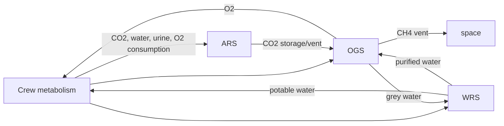

> Japanese: [../ja/memo/ssos_eclss_physical_phenomena_overview.md](../ja/memo/ssos_eclss_physical_phenomena_overview.md)

# SSOS ECLSS Physical Phenomena Overview

> **Subject**: [Space Station OS — `space_station_eclss`](https://github.com/space-station-os/space_station_os/tree/main/space_station_eclss)  
> **Purpose**: Catalog physical and chemical phenomena simulated by the SSOS ECLSS simulator and summarize each subsystem’s role.  
> **Relation to this repo**: `engineering_agents` `MockEclssSimulator` is a simplified CO₂ scrubber-focused model. SSOS ECLSS simulates the full closed loop of ARS / WRS / OGS over ROS 2.

---

## Big picture

A **closed-loop life-support simulator** simplifying ISS ECLSS. As ROS 2 nodes, **ARS (air revitalization) · WRS (water recovery) · OGS (oxygen generation)** plus **Crew Simulation GUI** driving crew metabolism interact.



### Main components

| Abbr | Full name | Role in SSOS |
| --- | --- | --- |
| **ARS** | Air Revitalisation System | CDRA equivalent. CO₂, humidity, contaminant removal |
| **WRS** | Water Recovery System | Multi-stage urine/wastewater purification and potable tank management |
| **OGS** | Oxygen Generation System | Water electrolysis + Sabatier reaction for O₂ recovery |
| **Crew Sim** | Human Simulation GUI | Sends crew metabolic I/O to ARS / WRS / OGS |

---

## 1. Crew metabolism (Crew Simulation)

Models crew physiology as **mass and flow I/O** (parametric model informed by ICES etc., not high-fidelity biochemistry).

| Phenomenon | Simulated content |
| --- | --- |
| **CO₂ production** | Cabin CO₂ load from calorie intake, activity mode (`rest` / `exercise`), crew count. Astronaut Mode temporarily increases with exercise events |
| **O₂ consumption** | 0.771 L/person at rest, +0.376 L/person during exercise |
| **Water intake** | Daily potable water (e.g. 2.5 L/person) |
| **Urine · wastewater** | 85–90% of intake to urine. Hygiene and excess use also to WRS |
| **High-metabolism events** | 25% chance: higher intake, CO₂, water demand |

**References** (`space_station_eclss/research/`):

- `ICES-2021_Metabolic_Paper-Final.pdf`
- `ochmo-tb-004-carbon-dioxide.pdf`

---

## 2. ARS — Air revitalization (CDRA equivalent)

Pipeline modeled on ISS **CDRA (Carbon Dioxide Removal Assembly)**. Node: `ars_systems_node`, action: `air_revitalisation`.

### Simulated physical phenomena

| Phenomenon | Description |
| --- | --- |
| **Dehumidification (Desiccant Bed)** | Adsorbent bed removes moisture from cabin air. Removal rate, capacity, **temperature rise** (overheat → fault) |
| **CO₂ adsorption (Adsorbent Bed)** | Two adsorbent beds take CO₂ from cabin. Temperature limits likewise |
| **CO₂ storage · vent** | Part of adsorbed CO₂ to tank, remainder vented to space. Auto-vent above limit |
| **Atmospheric contaminants** | Contaminant level rises over time; warning above threshold |
| **Combustion detection** | Probabilistic injection of “toxic combustion products” and “atmospheric anomaly” (fault simulation) |

### Process flow

```text
Cabin → Desiccant1 → Adsorbent1 → Adsorbent2 → CO₂ Storage
                              ↓
                    Desiccant2 (humidity conditioning)
```

### Key parameters (defaults)

| Parameter | Description | Default |
| --- | --- | --- |
| `max_co2_storage` | CO₂ storage cap (g) | 3947.0 |
| `des*_removal` | Dehumidification per cycle | 1.5 |
| `ads*_removal` | CO₂ removal per cycle | 2.5 |
| `des*_temp_limit` | Desiccant overheat limit (°C) | 120.0 |
| `ads*_temp_limit` | Adsorbent overheat limit (°C) | 204.0 |

On startup, requests power from EPS **DDCU** (124.5 V); initializes after supply.

**References**:

- `Integrated Evaluation of Closed Loop Air.pdf`
- `4BCO2.EDU.Performance_ICES-2021-2.pdf`
- `30 ECLSS LR.pdf`

---

## 3. WRS — Water recovery

**Multi-stage purification** returning urine/wastewater to potable water (ISS UPA + WPA equivalent). Node: `wrs_action_server`, action: `water_recovery_systems`.

### Simulated physical · chemical phenomena

| Stage | Phenomenon | Efficiency · conditions |
| --- | --- | --- |
| **UPA (urine processing)** | Distillation · concentration for urine water recovery | 95%, overheat limit 70°C |
| **Filter** | Organics, ammonia, solids removal | 90%, 60°C limit |
| **Ionization bed** | Final purification + **iodine disinfection** (2 mg/L) | 98%, 65°C limit |
| **Tank storage** | Product water tank capacity · minimum safe level | Overflow · depletion → fault |
| **Grey water recovery** | Drainage from OGS and hygiene wastewater | 50% recovery efficiency |
| **Waste collector** | Temporary storage of non-processable waste | Capacity limit |

Up to 5 L urine per cycle. After success, 80–90% of purified water auto-supplied to OGS.

**References**:

- `ICES 2023-097 Status of ISS Water Management and Recovery.pdf`
- `water_balance_onboard_ISS.pdf`
- `about ionization bed.pdf`

---

## 4. OGS — Oxygen generation

Closed loop modeled on ISS **OGA (Oxygen Generation Assembly) + Sabatier Reactor**. Node: `ogs_system`, action: `oxygen_generation`.

### Simulated chemical reactions

| Reaction | Formula · implementation |
| --- | --- |
| **Water electrolysis** | H₂O → O₂ + H₂. Per 1 g water: 0.89 g O₂, 0.11 g H₂ (stoichiometric) |
| **Sabatier reaction** | CO₂ + 4H₂ → CH₄ + 2H₂O. Per 1 g H₂: 2 g CH₄, 4.5 g regenerated water |
| **CH₄ vent** | Methane vented to space (simplified mass balance) |
| **Grey water return** | 90% of Sabatier water back to WRS |
| **O₂ storage management** | Min/max capacity monitoring; over/under-pressure → fault |

```text
Product water (WRS) → electrolysis → O₂ (crew) + H₂
                ↓
         CO₂ (ARS) + H₂ → Sabatier → CH₄ (vent) + H₂O (to WRS)
```

### Key parameters (defaults)

| Parameter | Description | Default |
| --- | --- | --- |
| `o2_efficiency` | Electrolysis O₂ generation efficiency | 0.95 |
| `sabatier_efficiency` | Sabatier conversion efficiency | 0.75 |
| `electrolysis_temp` | Electrolysis operating temperature | 100.0 |
| `sabatier_temp` | Sabatier reaction temperature (K) | 300.0 |
| `min_o2_capacity` / `max_o2_capacity` | O₂ storage safe range (g) | 100 / 10000 |

**References**:

- `ogs system teaching.pdf`
- `sabatier process for mars ISRU (details of sabatier process given).pdf`
- `o2supply.pdf`

---

## 5. Inter-system material circulation (closed-loop core)

| Substance | Flow |
| --- | --- |
| **CO₂** | Crew → cabin → ARS adsorption → storage or vent → OGS (Sabatier) |
| **O₂** | OGS electrolysis → storage → crew consumption |
| **H₂** | Electrolysis product → Sabatier consumption |
| **Water** | Urine/wastewater → WRS purification → potable or OGS feedstock |
| **CH₄** | Sabatier product → space vent (loss) |

**Reference**: `Chu-MassAnalysisSpace-1989 (1)_250117_163920.pdf` (closed-environment mass balance)

---

## 6. Faults · diagnostics

Not high-fidelity fault physics; mainly **threshold-based anomaly injection**.

| Target | Fault condition |
| --- | --- |
| ARS beds | Temperature exceeds `*_temp_limit` |
| ARS CO₂ tank | Above `max_co2_storage` → auto vent |
| ARS monitor | Probabilistic combustion · atmospheric anomaly alerts |
| WRS stages | UPA / filter / ionization overheat |
| WRS tank | Product tank overflow, below minimum level |
| OGS O₂ tank | Over-pressure / depletion |
| ARS power | Waiting for DDCU supply (no processing if unpowered) |

STL (Signal Temporal Logic) papers in `research/` support **detection · explanation** research for time-series anomalies.

- `Causal_Signal_Temporal_Logic_for_the_Environmental_Control_and_Life_Support_Systems_Fault_Analysis_and_Explanation.pdf`
- `Active Learning of Signal Temporal Logic Specifications.pdf`
- `Mixed-Integer Programming for Signal Temporal.pdf`

---

## 7. ROS 2 interface overview

### APIs used by Crew Simulation

| Type | Name | Purpose |
| --- | --- | --- |
| Action | `air_revitalisation` | CO₂, humidity, contaminant removal |
| Action | `water_recovery_systems` | Urine purification |
| Service | `ogs/request_o2` | O₂ supply |
| Service | `wrs/product_water_request` | Potable water supply |
| Topic (sub) | `/o2_storage` | O₂ remaining |
| Topic (sub) | `/wrs/product_water_reserve` | Potable water remaining |

### Inter-system coupling

| Type | Name | Purpose |
| --- | --- | --- |
| Service | `/ars/request_co2` | OGS fetches CO₂ from ARS |
| Service | `/grey_water` | OGS → WRS grey water return |
| Topic | `/co2_storage` | ARS CO₂ storage level |
| Topic | `/methane_vented` | Sabatier CH₄ vent amount |

---

## 8. Simulated phenomena summary

| Category | Phenomena |
| --- | --- |
| **Gas** | CO₂ adsorption/desorption, dehumidification, venting, contaminants, O₂ generation/consumption |
| **Liquid** | Urine distillation, multi-stage filtration, ion exchange, iodine disinfection, tank storage |
| **Chemical reactions** | Water electrolysis, Sabatier reaction, CH₄ vent |
| **Thermal** | Temperature rise and overheat limits per processing stage |
| **Metabolism** | CO₂ / O₂ / water production and consumption (activity · calorie dependent) |
| **Mass balance** | Water, oxygen, carbon circulation in closed loop and losses (CH₄ vent) |

---

## 9. Fidelity limits

**Simplified model** for education, demo, and agent integration.

- No detailed CFD for pressure, flow, phase equilibrium
- Adsorbent regeneration (heated desorption, etc.) abstracted in Behavior Tree steps
- Chemical reactions as mass-ratio algebra (limited equilibrium · catalyst degradation detail)
- Cabin assumed well-mixed; no 3D space or local concentration

Still reproduces ISS ECLSS **major sub-loops (air · water · oxygen) and material-cycle structure** per `research/` literature and subsystem README diagrams.

---

## 10. Mapping to `engineering_agents`

| SSOS ECLSS | `engineering_agents` |
| --- | --- |
| ARS CO₂ removal | `MockEclssSimulator` (scrubber efficiency, fan, bypass) |
| WRS / OGS | Not connected (future ROS 2 bridge via `SsosAdapter`) |
| EPS power | `EpsStack` (SARJ + BCDU mock, or SSOS EPS connection) |

Related memo: [ssos_eps_ros2_connection_plan.md](ssos_eps_ros2_connection_plan.md)
