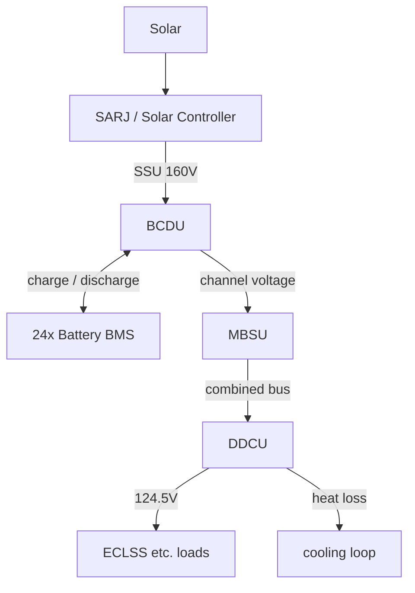

> Japanese: [../ja/memo/ssos_eps_physical_phenomena_overview.md](../ja/memo/ssos_eps_physical_phenomena_overview.md)

# SSOS EPS Physical Phenomena Overview

> **Subject**: [Space Station OS — `space_station_eps`](https://github.com/space-station-os/space_station_os/tree/main/space_station_eps)  
> **Purpose**: Catalog physical and electrical phenomena simulated by the SSOS EPS simulator and summarize each subsystem’s role.  
> **Relation to this repo**: `engineering_agents` `MockSarj` / `MockBcdu` / `EpsStack` is a simplified SARJ + BCDU model. SSOS EPS simulates the full ISS-equivalent architecture SARJ → BCDU → MBSU → DDCU over ROS 2.

---

## Big picture

Simulator simplifying ISS **Primary EPS (generation · storage · distribution)**. Multiple ROS 2 nodes reproduce sun tracking through secondary-side load supply.



### Main components

| Abbr | Full name | Role in SSOS |
| --- | --- | --- |
| **SARJ** | Solar Alpha Rotary Joint | Solar array sun tracking · generation variation with β angle |
| **SSU** | Sequential Shunt Unit | Solar power voltage regulation (simulated inside SARJ node) |
| **BCDU** | Battery Charge/Discharge Unit | Battery charge/discharge control, mode switch vs SSU voltage |
| **BMS** | Battery Management System | Voltage and charge state per ORU (orbital replacement unit) battery |
| **MBSU** | Main Bus Switching Unit | Healthy channel selection and main bus voltage synthesis |
| **DDCU** | DC-to-DC Converter Unit | Primary bus to secondary (124.5 V) conversion and load supply |

---

## 1. SARJ / Solar Controller — Solar generation

Node: `mock_solar_controller` (`sarj_mock.cpp`)

Simulates ISS solar array tracking and generation variation from orbit sun/eclipse and β angle. README says “SARJ” but implementation **includes SSU (voltage regulation)**.

### Simulated physical phenomena

| Phenomenon | Description |
| --- | --- |
| **Orbital sun cycle** | 1 step ≈ 1 min. Orbit period 90 steps (≈90 min), eclipse 35 steps |
| **Eclipse entry/exit cosine ramp** | 8-step cosine rise/fall (irradiance 0→1) around eclipse entry/exit |
| **β angle (solar beta)** | Sinusoidal over 10 orbit periods, max ±75°. Generation derate via `cos(β)` |
| **Gimbal lock** | \|β\| ≥ 72° → extra derate (×0.6) and ERROR diagnostic |
| **Peak generation** | 84 kW peak (ISS class) |
| **SSU voltage regulation** | Setpoint 160 V, small ripple, efficiency 98.5% |
| **Panel temperature** | Target temp proportional to output + first-order lag (τ = 20 s) |

### Output topics (implementation)

| Topic | Content |
| --- | --- |
| `/solar_controller/ssu_voltage_v` | SSU regulated voltage (V) — **subscribed by BCDU** |
| `/solar_controller/ssu_power_w` | Available power (W) |
| `/solar_controller/ssu_current_a` | Current (A) |
| `/solar_controller/panel_temperature` | Panel temperature (°C) |
| `/solar_controller/sun_beta_deg` | β angle (deg) |

> **Note**: README and `engineering_agents` `eps_topics.py` reference `/solar/voltage`, but **SSOS main implementation uses `/solar_controller/ssu_voltage_v`**. Topic mapping required on connect ([ssos_eps_ros2_connection_plan.md](ssos_eps_ros2_connection_plan.md)).

### Key parameters (defaults)

| Parameter | Description | Default |
| --- | --- | --- |
| `orbit_period_s` | Orbit period (simulation time) | 90.0 |
| `eclipse_duration_s` | Eclipse length | 35.0 |
| `p_max_kw` | Peak generation | 84.0 kW |
| `ssu_v_setpoint_v` | SSU voltage setpoint | 160.0 V |
| `ssu_efficiency` | SSU conversion efficiency | 0.985 |
| `beta_max_deg` | Max β angle | 75.0° |

**References** (`space_station_eps/research/`):

- `SARJ.pdf`
- `ISS_EPS.pdf`

---

## 2. Battery Manager — Battery BMS

Node: `battery_manager_node` (`battery_health.cpp`)

12 channels × 2 ORU = **24** Li-ion battery packs. Each ORU provides independent charge / discharge services.

### Simulated physical phenomena

| Phenomenon | Description |
| --- | --- |
| **Charge** | +1.5 V per step, clamp at 120 V max |
| **Discharge** | −1.5 V per step, auto-stop at lower limit |
| **Voltage safe band** | Max 120 V, warning 60 V, critical 30 V (implementation constants) |
| **Discharge reject** | Reject discharge to ORU with voltage too low |
| **Charge reject** | Reject charge to fully charged ORU |
| **Cell-level state** | 38 cells/pack voltage · temperature (mean + noise) |
| **Charge/discharge current** | Discharge −5 A, charge +4 A (fixed simulation values) |

### Interface (per ORU `battery_bms_{i}`)

| Type | Name | Purpose |
| --- | --- | --- |
| Topic | `/battery/battery_bms_{i}/health` | `sensor_msgs/BatteryState` |
| Service | `/battery/battery_bms_{i}/charge` | Start charge |
| Service | `/battery/battery_bms_{i}/discharge` | Start discharge |

BCDU commands discharge-capable ORUs (voltage > 70 V) and charge-capable ORUs (voltage < 120 V) in parallel.

---

## 3. BCDU — Charge/discharge control

Node: `bcdu_node` (`bcdu_device.cpp`)

Monitors SSU voltage and auto-switches battery charge/discharge mode. README mentions Action server; **main branch is topic-driven auto control** (`/bcdu/operation` Action not implemented).

### Simulated physical phenomena

| Phenomenon | Description |
| --- | --- |
| **Charge mode** | SSU ≥ 160 V → charge service to all healthy ORUs |
| **Discharge mode** | SSU ≤ 152 V → discharge service to all healthy ORUs |
| **Hysteresis** | Maintain current mode between 152–160 V |
| **Channel voltage publish** | Each `/mbsu/channel_{N}/voltage`: 160 V charging / 150 V discharging |
| **Current limits** | Max discharge 127 A, max charge 65 A (status report) |
| **Regulation band** | 130–180 V |

### Outputs

| Topic | Content |
| --- | --- |
| `/bcdu/status` | `BCDUStatus` (mode, bus_voltage, current_draw, fault) |
| `/eps/diagnostics` | Diagnostic messages |

---

## 4. MBSU — Main bus switching

Node: `mbsu_node` (`mbsu_distributor.cpp`)

Monitors channel voltages from BCDU, selects **top 2 healthy channels**, supplies synthesized voltage to DDCU.

### Simulated physical phenomena

| Phenomenon | Description |
| --- | --- |
| **Channel health** | Voltage > 120 V and updated within 3 s |
| **Bus synthesis** | Average of top 2 channel voltages → `/ddcu/input_voltage` |
| **Redundancy loss** | < 2 healthy channels → ERROR diagnostic, DDCU supply stops |

MBSU does not subscribe BMS health directly; judges health from **channel voltage only** (BCDU proxies voltage).

---

## 5. DDCU — Secondary conversion · load supply

Node: `ddcu_node` (`ddcu_device.cpp`)

Converts primary bus (MBSU synthesized voltage) to **124.5 V secondary bus** for ECLSS and other loads.

### Simulated physical · electrical phenomena

| Phenomenon | Description |
| --- | --- |
| **Input voltage monitoring** | Outside 115–173 V → 0 V output (protection) |
| **Voltage regulation** | Nominal 124.5 V ±1.5 V, small random jitter |
| **Conversion efficiency** | 96%. Input power and **heat loss** from output power |
| **DDCU temperature rise** | +0.2°C/step when input effective, max 85°C |
| **Load request** | `/ddcu/load_request` service for load voltage request (ECLSS ARS requests 124.5 V) |
| **Cooling coupling** | Temp > 40°C invokes `coolant_heat_transfer` action to remove heat |

### Thermal · cooling loop

When DDCU heat loss (kW → J) exceeds threshold, sends action goal to cooling package.

- Feedback: internal temperature, ammonia temperature, heat rejection (kJ)
- DDCU temperature updated from cooling feedback

This models **EPS–thermal control (TCS) coupling**.

### Interface

| Type | Name | Purpose |
| --- | --- | --- |
| Topic (sub) | `/ddcu/input_voltage` | Primary bus from MBSU |
| Topic (pub) | `/ddcu/output_voltage` | Secondary output voltage |
| Topic (pub) | `/ddcu/temperature` | DDCU temperature |
| Service | `/ddcu/load_request` | Downstream voltage supply request |
| Action (client) | `/coolant_heat_transfer` | Heat rejection to cooling loop |

### Key parameters (defaults)

| Parameter | Description | Default |
| --- | --- | --- |
| `regulation_nominal` | Secondary nominal voltage | 124.5 V |
| `regulation_tolerance` | Regulation tolerance | ±1.5 V |
| `ddcu_type` | Model identifier | `DDCU-I` |

---

## 6. Power flow and mode transitions

### Sunlit (charge)

```text
Solar → SARJ/SSU (160 V) → BCDU [CHARGE] → 24 BMS charge
                              ↓
                    MBSU channel voltages (160 V)
                              ↓
                    DDCU → 124.5 V → loads + surplus charge
```

### Eclipse (discharge)

```text
SSU ≈ 0 V → BCDU [DISCHARGE] → 24 BMS discharge
              ↓
    MBSU channels (150 V) → DDCU → 124.5 V → loads
```

### ECLSS connection point

ARS (`ars_systems.cpp`) requests **124.5 V** via `/ddcu/load_request` at startup; air revitalization begins after DDCU power supply succeeds. EPS and ECLSS couple via **DDCU service**.

---

## 7. Faults · diagnostics

Threshold-based anomaly detection and diagnostic publish (`/eps/diagnostics`).

| Target | Fault condition |
| --- | --- |
| SARJ gimbal | \|β\| ≥ 72° (gimbal lock) |
| SSU | Eclipse (zero solar input) → WARN |
| BMS | Critical voltage reached during discharge |
| BCDU | Over-current (127 A) / out-of-band voltage (by design) |
| MBSU | < 2 healthy channels, stale channel (> 3 s) |
| DDCU | Input outside 115–173 V, secondary regulation fault, temperature rise |

---

## 8. ROS 2 interface overview

### Node startup order (README)

```bash
ros2 run demo_eps sarj_mock      # Solar Controller
ros2 run demo_eps battery_health # Battery Manager
ros2 run demo_eps bcdu_device    # BCDU
ros2 run demo_eps mbsu_device    # MBSU
ros2 run demo_eps ddcu_device    # DDCU (in eps.launch.py)
```

`space_station.launch.py` also starts ECLSS and cooling integrated.

### Topic · service list (implementation-based)

| Type | Name | Content |
| --- | --- | --- |
| Topic | `/solar_controller/ssu_voltage_v` | SSU voltage |
| Topic | `/solar_controller/ssu_power_w` | SSU power |
| Topic | `/bcdu/status` | BCDU mode · voltage · current |
| Topic | `/mbsu/channel_{N}/voltage` | Channel voltage |
| Topic | `/ddcu/input_voltage` | MBSU → DDCU primary bus |
| Topic | `/ddcu/output_voltage` | DDCU secondary output |
| Topic | `/ddcu/temperature` | DDCU temperature |
| Topic | `/eps/diagnostics` | System-wide diagnostics |
| Service | `/ddcu/load_request` | Load voltage supply (ECLSS connection) |
| Service | `/battery/battery_bms_{i}/charge` | ORU charge |
| Service | `/battery/battery_bms_{i}/discharge` | ORU discharge |

---

## 9. Simulated phenomena summary

| Category | Phenomena |
| --- | --- |
| **Light · orbit** | Sun/eclipse, β angle, gimbal lock, cosine irradiance ramp |
| **Electrical (generation)** | SSU voltage regulation, power · current calculation, ripple |
| **Electrical (storage)** | Li-ion charge/discharge, voltage limits, cell-level state |
| **Electrical (distribution)** | BCDU charge/discharge switch, MBSU channel select, DDCU DC-DC conversion |
| **Thermal** | Solar panel temperature, DDCU heat loss · temperature rise, cooling loop coupling |
| **Redundancy · protection** | Stale channel detection, out-of-band shutdown, over-current limits |

---

## 10. Fidelity limits

**Simplified model** for education, demo, and agent integration.

- No detailed solar cell I-V or shunt regulator (parametric output)
- Battery as equivalent voltage-step model (no detailed SOC chemistry)
- BCDU Action server (README) not on main; topic-driven auto control
- Bus wiring resistance · impedance abstracted as direct channel voltage publish
- Name mismatch: `/solar/voltage` vs `/solar_controller/ssu_voltage_v`

ISS EPS **main structure (SARJ → storage → main bus → DDCU) and sun/eclipse switching** reproduced per `research/ISS_EPS.pdf` and README system diagrams.

---

## 11. Mapping to `engineering_agents`

| SSOS EPS | `engineering_agents` |
| --- | --- |
| SARJ / SSU generation | `MockSarj` (β angle + eclipse window → `solar_voltage_v`) |
| BCDU charge/discharge | `MockBcdu` (sunlight threshold, `request_discharge` for ECLSS support) |
| MBSU / DDCU | **Not individually implemented** (`EpsStack` is SARJ→BCDU only) |
| DDCU → ECLSS | `request_eps_boost` → `MockBcdu.request_discharge` → `power_margin_w` |
| ROS 2 bridge | `SsosAdapter` stub (not implemented) |

### Topic name differences (connect carefully)

| `engineering_agents` | SSOS implementation |
| --- | --- |
| `/solar/voltage` | `/solar_controller/ssu_voltage_v` |
| `/bcdu/operation` (Action) | Not implemented (auto control) |
| `/eps/eclss/load_request_w` | `/ddcu/load_request` (voltage request) |

Related memos:

- [ssos_eps_ros2_connection_plan.md](ssos_eps_ros2_connection_plan.md) — ROS 2 DDS connection plan
- [ssos_eclss_physical_phenomena_overview.md](ssos_eclss_physical_phenomena_overview.md) — ECLSS physical phenomena (incl. DDCU connection)
