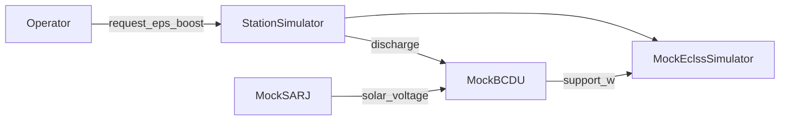

# EPS 優先・Day 区切り実装プラン（Week-2 入口）

> **2026-06-02 策定** — [mvp_plan.md](mvp_plan.md) の Next-1〜4 を Day 単位に分解。  
> **2026-06-02 更新**: **EPS-1〜4 完了**。次フェーズは Day 8 CLI。  
> 参照 SSOS: [space_station_eps](https://github.com/space-station-os/space_station_os/tree/main/space_station_eps)  
> 開発ブランチ: `feature/eps-mock-foundation`

## 現状整理（EPS フェーズ完了）


| 項目                          | 状態                                                                       |
| --------------------------- | ------------------------------------------------------------------------ |
| Day 1–6 + Day5B provenance  | [mvp_plan.md](mvp_plan.md) 上 ✅                                           |
| ECLSS PR（labeled / guarded） | [PR #1](https://github.com/hirototamura/engineering_agents/pull/1)       |
| **EPS-1〜4**                 | ✅ コミット `578fb0a`（EPS-1）、`c013600`（EPS-2）+ EPS-3/4 本ブランチ                  |
| シミュレータ                      | `StationSimulator`（ECLSS + `EpsStack`）、`summary.simulator: mock_station` |
| ログ                          | `eps_telemetry.jsonl` + recovery `provenance` + dashboard SARJ/BCDU      |
| パッケージ                       | `src/integrations/one_piece/` — `pip install -e ".[dev]"` 必須             |





---

## Day 区切りロードマップ


| Day        | 名称                      | 完了条件（要約）                                                                    | 状態   |
| ---------- | ----------------------- | --------------------------------------------------------------------------- | ---- |
| **EPS-1**  | 基盤着地                    | 未コミット WIP をテスト green のままコミット；`test_scrubber_baseline` 維持                    | ✅ 完了 |
| **EPS-2**  | SARJ + BCDU 薄モック        | `MockSarj` + `MockBcdu` + `/eps/`* トピック；単体 pytest                           | ✅ 完了 |
| **EPS-3**  | ECLSS 連動                | `request_eps_boost` が BCDU discharge 経由；インライン `eps_support_`* を facade に移管  | ✅ 完了 |
| **EPS-4**  | 可観測性                    | `eps_telemetry.jsonl`、summary 電力指標、dashboard SARJ/BCDU、provenance EPS trace | ✅ 完了 |
| **Day 8**  | CLI（mvp Next-2）         | `python -m tools.cli run --scenario ... --agents-mode ...`                  | 未着手  |
| **Day 9**  | One Piece 拡張（Next-3）    | run 横断 provenance index + handoff 仕様                                        | 未着手  |
| **Day 10** | SSOS adapter 準備（Next-4） | topic map 契約テスト、`SsosAdapter` スタブ拡張                                         | 未着手  |


Week-1 でやらないことは [mvp_plan.md](mvp_plan.md) 据え置き: Real ROS2、One Piece Web UI、LLM 必須化。

---

## EPS-1: 基盤着地（半日〜1日）

**目的**: WIP を「動く最小回復経路」として固定し、以降 refactor の安全網にする。

**作業**

1. `pytest tests/scenario/test_scrubber_baseline.py tests/scenario/test_scrubber_with_agents.py tests/environment/test_mock_eclss.py -q` を green
2. 未コミット差分を 1 コミット（例: *Add EPS boost recovery path for power-critical scrubber runs*）
3. [mvp_plan.md](mvp_plan.md) で EPS-1 完了を記録（インライン実装は EPS-3 で facade 化）

**主な変更ファイル**

- `src/environment/protocol.py`
- `src/environment/ssos/mock_eclss.py`
- `src/scenario/agents/scrubber_degradation_team.py`
- `docs/api-contracts.md`

**完了判定**: `labeled` 実行で `events.jsonl` に `request_eps_boost`、CO2 が 1000 ppm 未満に戻る（`tests/scenario/test_scrubber_with_agents.py`）。

**完了メモ（2026-06-02）**: `CommandKind.REQUEST_EPS_BOOST` と MockECLSS 内 `eps_support_`* で電力回復を実装。インライン実装は **EPS-3** で SARJ/BCDU facade へ移管予定。

---

## EPS-2: SARJ + BCDU 薄モック（1日）

**参照**

- [space_station_eps README](https://github.com/space-station-os/space_station_os/blob/main/space_station_eps/README.md) — SARJ → `/solar/voltage` → BCDU
- [BCDUStatus.msg](https://github.com/space-station-os/space_station_os/blob/main/space_station_eps/msg/BCDUStatus.msg) — Python dataclass + dict シリアライズ（ROS2 ランタイムなし）

**新規レイアウト（案）**

```text
src/environment/ssos/
  mock_sarj.py      # beta_angle or step → solar_voltage_v
  mock_bcdu.py      # solar_voltage + discharge request → bus watts, mode, fault
  eps_topics.py     # /solar/voltage, /bcdu/status, /bcdu/operation, /eps/diagnostics
  eps_types.py      # BcduStatus（mode: idle|charging|discharging|fault|safe）
```

**SARJ 最小モデル**: `step` または `beta_angle_deg` → `solar_voltage_v`（eclipse 時は閾値以下 → BCDU が discharge 優先）。

**BCDU 最小モデル**: `request_discharge(...)` → `support_w`；電圧閾値外は `fault` + 拒否。

**テスト**: `tests/environment/test_mock_eps.py`  
**ドキュメント**: [docs/api-contracts.md](../docs/api-contracts.md) に EPS トピック表を追加。

**完了メモ（2026-06-02）**: `eps_types.py`, `eps_topics.py`, `mock_sarj.py`, `mock_bcdu.py`, `eps_stack.py` を追加。ECLSS 連動は EPS-3。

---

## EPS-3: ECLSS 連動・facade 化（1日）

**目的**: `request_eps_boost` を ECLSS 内部加算ではなく EPS サブシステムへルーティング。

**推奨**: `StationSimulator`（`src/scenario/runner.py` から利用）

```python
# 概念のみ
class StationSimulator:
    def step(self) -> TelemetrySnapshot:
        solar = self.eps.sarj.step()
        self.eps.bcdu.update_solar(solar)
        snap = self.eclss.step()
        support = self.eps.bcdu.consume_scheduled_support()
        # apply support to effective power_margin before health
        ...

    def apply_command(self, cmd: RecoveryCommand) -> CommandResult:
        if cmd.kind == REQUEST_EPS_BOOST:
            return self.eps.bcdu.arm_discharge(...)
        return self.eclss.apply_command(cmd)
```

**移行**

- `mock_eclss.py` から `eps_support_`* を削除（または短期 deprecated ラッパー）
- `build_simulator` → `build_station_simulator`
- `summary.json` の `simulator` を `mock_station` 等に更新

**完了判定**: power critical 後 BCDU `discharging` が数 step 継続；`test_scrubber_baseline.py`（`agents.mode: none`）は green のまま。

**完了メモ（2026-06-02）**: `station_simulator.py` 実装。runner は `build_station_simulator` / `summary.simulator: mock_station`。`MockEclssSimulator` 単体の `request_eps_boost` は拒否。

---

## EPS-4: 可観測性（1日）

- 新規 `eps_telemetry.jsonl`（`solar_voltage_v`, `bcdu_mode`, `support_w`, `fault`）
- `summary.json` に `eps_boost_applied_step`, `min_power_margin_w` 等（任意）
- `integrations/one_piece/client.py` — recovery trace（`request_eps_boost`）
- `src/tools/dashboard/app.py` — SARJ/BCDU チャート、labeled vs `labeled_llm_guarded` の電力回復差

**完了メモ（2026-06-02）**: `eps_telemetry.jsonl`、`min_power_margin_w` / `eps_boost_applied_step` in summary、recovery provenance（`record_type: recovery`）、dashboard SARJ/BCDU + run 比較の電力回復表。

---

## EPS フェーズ完了サマリ（2026-06-02）

- **コミット**: EPS-1 `578fb0a`、EPS-2 `c013600`、EPS-3/4 + packaging は本 push バッチ
- **テスト**: `pytest` 24 passed（`test_mock_eps`, `test_station_simulator`, scenario 回帰）
- **実行**: `pip install -e ".[dev]"` 後に `python -c "from scenario.runner import run_scenario; ..."` または `python src/scripts/run_mock_eclss.py`
- **残り**: Day 8–10（CLI / provenance index / SSOS adapter 契約）

---

## Day 8: CLI（1日）

- `src/tools/cli/` — `run`, `list-scenarios`
- [pyproject.toml](../pyproject.toml) エントリポイント
- `scrubber_demo.yaml`（E2E 用）

**完了判定**: 1 コマンドで 4 agent modes 実行 + 出力パス表示。

---

## Day 9–10: 拡張

**Day 9 — One Piece**: provenance summary index、[one-piece-integration.md](../docs/one-piece-integration.md) に EPS recovery handoff 例。

**Day 10 — SSOS adapter**: `adapter.py` 契約テスト、`tests/environment/test_ssos_topic_contract.py`。

---

## サブエージェント（`~/.cursor/agents/`）


| ファイル                           | 役割                                | 委譲タイミング                    |
| ------------------------------ | --------------------------------- | -------------------------- |
| `eps-mock-engineer.md`         | SARJ/BCDU/topics/単体テスト/docs       | EPS-2, EPS-3 environment 層 |
| `eclss-scenario-integrator.md` | runner facade、agents、回帰テスト        | EPS-3, EPS-4 scenario 層    |
| `integration-ops.md`           | dashboard、provenance、CLI、mvp_plan | EPS-4, Day 8–10            |


---

## リスクと切り戻し


| リスク                             | 対策                                                     |
| ------------------------------- | ------------------------------------------------------ |
| facade 化で baseline 物理が変わる       | `agents.mode: none` を先に固定；SARJ 定数電圧モードを追加              |
| LLM が `request_eps_boost` を出さない | `labeled_llm_guarded` operator prompt に EPS を明示（EPS-4） |
| スコープ肥大                          | MBSU 多チャネル・24 BMS はパラメータ stub のみ                       |


---

## 実装チェックリスト

- [x] EPS-1: 基盤着地（コミット + 回帰 green）
- [x] サブエージェント 3 体（`~/.cursor/agents/`）
- [x] EPS-2: SARJ + BCDU 薄モック
- [x] EPS-3: StationSimulator + ECLSS 連動
- [x] EPS-4: 可観測性（ログ / provenance / dashboard）
- [ ] Day 8: CLI + E2E
- [ ] Day 9: One Piece 拡張
- [ ] Day 10: SSOS adapter 契約テスト

---

## 実装順序（推奨）

1. ~~EPS-1〜4~~ ✅
2. （任意）`~/.cursor/agents/` に 3 サブエージェント
3. **Day 8** CLI → **Day 9** One Piece index → **Day 10** SSOS adapter 契約テスト

