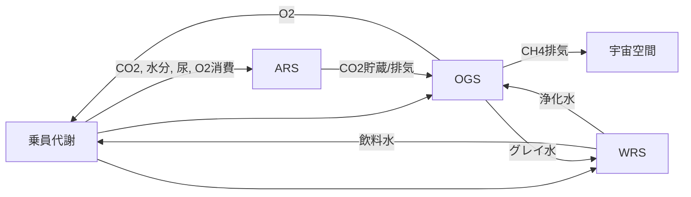

> English: [../../../en/memo/ssos_eclss_loop/ssos_eclss_physical_phenomena_overview.md](../../../en/memo/ssos_eclss_loop/ssos_eclss_physical_phenomena_overview.md)

# SSOS ECLSS 物理現象概要

> **対象**: [Space Station OS — `space_station_eclss`](https://github.com/space-station-os/space_station_os/tree/main/space_station_eclss)
> **目的**: SSOS ECLSS シミュレータが模擬する物理・化学現象の一覧と、各サブシステムの役割を整理する。
> **本リポジトリとの関係**: `engineering_agents` の `MockEclssSimulator` は CO₂ スクラバーに特化した簡略モデル。SSOS ECLSS は ARS / WRS / OGS の閉ループ全体を ROS 2 で模擬する。

---

## 全体像

ISS の ECLSS を簡略化した **閉鎖ループ生命維持シミュレータ**。ROS 2 ノードとして **ARS（空気再生）・WRS（水回収）・OGS（酸素生成）** の3系統と、乗員の代謝を駆動する **Crew Simulation GUI** が連携する。



### 主要コンポーネント

| 略称 | 英名 | SSOS での役割 |
| --- | --- | --- |
| **ARS** | Air Revitalisation System | CDRA 相当。CO₂・湿度・汚染物の除去 |
| **WRS** | Water Recovery System | 尿・廃水の多段浄化と飲料水タンク管理 |
| **OGS** | Oxygen Generation System | 水電解 + サバティエ反応による O₂ 回収 |
| **Crew Sim** | Human Simulation GUI | 乗員の代謝入出力を ARS / WRS / OGS へ送る |

---

## 1. 乗員代謝（Crew Simulation）

乗員の生理活動を **質量・流量の入出力** としてモデル化する（高忠実度の生化学モデルではなく、ICES 等の代謝データを参考にしたパラメトリックモデル）。

| 現象 | 模擬内容 |
| --- | --- |
| **CO₂ 産生** | カロリー摂取量・活動モード（`rest` / `exercise`）・乗員数から cabin CO₂ 負荷を算出。Astronaut Mode では運動イベントで一時的に増加 |
| **O₂ 消費** | 安静時 0.771 L/人、運動時 +0.376 L/人 |
| **水分摂取** | 1日あたりの飲料水（例: 2.5 L/人） |
| **尿・廃水** | 摂取水分の 85–90% が尿へ。衛生水・過剰使用も WRS へ送る |
| **高代謝イベント** | 25% 確率で摂取量・CO₂・水需要が上昇 |

**参考資料**（`space_station_eclss/research/`）:

- `ICES-2021_Metabolic_Paper-Final.pdf`
- `ochmo-tb-004-carbon-dioxide.pdf`

---

## 2. ARS — 空気再生（CDRA 相当）

ISS の **CDRA（Carbon Dioxide Removal Assembly）** を模したパイプライン。ノード: `ars_systems_node`、アクション: `air_revitalisation`。

### 模擬する物理現象

| 現象 | 説明 |
| --- | --- |
| **除湿（Desiccant Bed）** | 吸着剤ベッドが cabin 空気から水分を除去。除去率・容量・**温度上昇**（過熱で故障） |
| **CO₂ 吸着（Adsorbent Bed）** | 2段の吸着ベッドで CO₂ を cabin から取り込み。同様に温度限界あり |
| **CO₂ 貯蔵・排気** | 吸着した CO₂ の一部をタンクへ貯蔵、残りを宇宙へベント。上限超過で自動排気 |
| **大気汚染物** | 汚染物レベルが時間とともに上昇し、閾値超過で警告 |
| **燃焼検知** | 確率的に「有毒燃焼生成物」「大気異常」を注入（故障シミュレーション） |

### 処理フロー

```text
Cabin → Desiccant1 → Adsorbent1 → Adsorbent2 → CO₂ Storage
                              ↓
                    Desiccant2（湿度調整）
```

### 主要パラメータ（デフォルト）

| パラメータ | 説明 | デフォルト |
| --- | --- | --- |
| `max_co2_storage` | CO₂ 貯蔵上限 (g) | 3947.0 |
| `des*_removal` | 除湿率 / サイクル | 1.5 |
| `ads*_removal` | CO₂ 除去率 / サイクル | 2.5 |
| `des*_temp_limit` | 除湿ベッド過熱限界 (°C) | 120.0 |
| `ads*_temp_limit` | 吸着ベッド過熱限界 (°C) | 204.0 |

起動時は EPS の **DDCU** へ電力要求（124.5 V）を送り、供給後にシステムを初期化する。

**参考資料**:

- `Integrated Evaluation of Closed Loop Air.pdf`
- `4BCO2.EDU.Performance_ICES-2021-2.pdf`
- `30 ECLSS LR.pdf`

---

## 3. WRS — 水回収

尿・廃水を飲料水へ戻す **多段浄化パイプライン**（ISS の UPA + WPA 相当）。ノード: `wrs_action_server`、アクション: `water_recovery_systems`。

### 模擬する物理・化学現象

| 段 | 現象 | 効率・条件 |
| --- | --- | --- |
| **UPA（尿処理）** | 蒸留・濃縮による尿中水分回収 | 95%、過熱限界 70°C |
| **フィルタ** | 有機物・アンモニア・固形物除去 | 90%、60°C 限界 |
| **イオン化ベッド** | 最終浄化 + **ヨウ素消毒**（2 mg/L） | 98%、65°C 限界 |
| **タンク貯蔵** | 製品水タンクの容量・最低安全水位 | 溢れ・枯渇で故障 |
| **グレイ水回収** | OGS からの排水や衛生廃水を収集 | 50% 回収効率 |
| **廃水コレクタ** | 処理不能廃水の一時貯蔵 | 容量上限あり |

1 サイクルあたり最大 5 L の尿を処理。成功後、浄化水の 80–90% を OGS へ自動供給する。

**参考資料**:

- `ICES 2023-097 Status of ISS Water Management and Recovery.pdf`
- `water_balance_onboard_ISS.pdf`
- `about ionization bed.pdf`

---

## 4. OGS — 酸素生成

ISS の **OGA（Oxygen Generation Assembly）+ Sabatier Reactor** の閉ループを模擬。ノード: `ogs_system`、アクション: `oxygen_generation`。

### 模擬する化学反応

| 反応 | 式・実装 |
| --- | --- |
| **水電解** | H₂O → O₂ + H₂。1 g 水あたり O₂ 0.89 g、H₂ 0.11 g（化学量論比） |
| **サバティエ反応** | CO₂ + 4H₂ → CH₄ + 2H₂O。H₂ 1 g あたり CH₄ 2 g、再生水 4.5 g |
| **CH₄ 排気** | メタンを宇宙空間へベント（質量保存の簡略モデル） |
| **グレイ水還流** | サバティエで生じた水の 90% を WRS へ返す |
| **O₂ 貯蔵管理** | 最小・最大容量の監視、過圧・欠乏で故障 |

```text
製品水(WRS) → 電解 → O₂(乗員) + H₂
                ↓
         CO₂(ARS) + H₂ → サバティエ → CH₄(排気) + H₂O(WRSへ)
```

### 主要パラメータ（デフォルト）

| パラメータ | 説明 | デフォルト |
| --- | --- | --- |
| `o2_efficiency` | 電解による O₂ 生成効率 | 0.95 |
| `sabatier_efficiency` | サバティエ変換効率 | 0.75 |
| `electrolysis_temp` | 電解動作温度 | 100.0 |
| `sabatier_temp` | サバティエ反応温度 (K) | 300.0 |
| `min_o2_capacity` / `max_o2_capacity` | O₂ 貯蔵安全範囲 (g) | 100 / 10000 |

**参考資料**:

- `ogs system teaching.pdf`
- `sabatier process for mars ISRU (details of sabatier process given).pdf`
- `o2supply.pdf`

---

## 5. 系間物質循環（閉ループの核心）

| 物質 | 流れ |
| --- | --- |
| **CO₂** | 乗員 → cabin → ARS 吸着 → 貯蔵 or 排気 → OGS（サバティエ） |
| **O₂** | OGS 電解 → 貯蔵 → 乗員消費 |
| **H₂** | 電解生成 → サバティエ消費 |
| **水** | 尿/廃水 → WRS 浄化 → 飲料水 or OGS 原料 |
| **CH₄** | サバティエ生成 → 宇宙排気（損失） |

**参考資料**: `Chu-MassAnalysisSpace-1989 (1)_250117_163920.pdf`（閉鎖環境の物質収支）

---

## 6. 故障・診断

高忠実度の故障物理ではなく、**閾値ベースの異常注入** が主。

| 対象 | 故障条件 |
| --- | --- |
| ARS 各ベッド | 温度が `*_temp_limit` を超過 |
| ARS CO₂ タンク | `max_co2_storage` 超過 → 自動ベント |
| ARS モニタ | 確率的な燃焼・大気異常アラート |
| WRS 各段 | UPA / フィルタ / イオン化の過熱 |
| WRS タンク | 製品水タンク溢れ、最低水位割れ |
| OGS O₂ タンク | 過圧 / 欠乏 |
| ARS 電源 | DDCU からの電力供給待ち（未供給時は処理不可） |

`research/` にある STL（Signal Temporal Logic）関連論文は、時系列異常の **検知・説明** 研究用の参考資料。

- `Causal_Signal_Temporal_Logic_for_the_Environmental_Control_and_Life_Support_Systems_Fault_Analysis_and_Explanation.pdf`
- `Active Learning of Signal Temporal Logic Specifications.pdf`
- `Mixed-Integer Programming for Signal Temporal.pdf`

---

## 7. ROS 2 インターフェース概要

### Crew Simulation が利用する API

| 種別 | 名前 | 用途 |
| --- | --- | --- |
| Action | `air_revitalisation` | CO₂・湿度・汚染物の除去 |
| Action | `water_recovery_systems` | 尿の浄化 |
| Service | `ogs/request_o2` | O₂ 供給 |
| Service | `wrs/product_water_request` | 飲料水供給 |
| Topic (購読) | `/o2_storage` | O₂ 残量 |
| Topic (購読) | `/wrs/product_water_reserve` | 飲料水残量 |

### 系間連携

| 種別 | 名前 | 用途 |
| --- | --- | --- |
| Service | `/ars/request_co2` | OGS が ARS から CO₂ を取得 |
| Service | `/grey_water` | OGS → WRS へのグレイ水返送 |
| Topic | `/co2_storage` | ARS CO₂ 貯蔵量 |
| Topic | `/methane_vented` | サバティエ CH₄ 排気量 |

---

## 8. 模擬物理現象一覧（まとめ）

| カテゴリ | 現象 |
| --- | --- |
| **気体** | CO₂ 吸着/脱着、除湿、排気、大気汚染物、O₂ 生成・消費 |
| **液体** | 尿蒸留、多段フィルタ、イオン交換、ヨウ素消毒、タンク貯蔵 |
| **化学反応** | 水電解、サバティエ反応、CH₄ 排気 |
| **熱** | 各処理段の温度上昇と過熱限界 |
| **代謝** | CO₂ / O₂ / 水の産生・消費（活動・カロリー依存） |
| **物質収支** | 閉ループ内の水・酸素・炭素の循環と損失（CH₄ ベント） |

---

## 9. 忠実度の限界

教育・デモ・エージェント連携向けの **簡略モデル** である点に注意。

- 圧力・流量・相平衡の詳細 CFD はない
- 吸着剤の再生サイクル（加熱脱着など）は Behavior Tree のステップで抽象化
- 化学反応は質量比の代数モデル（平衡・触媒劣化の詳細は限定的）
- cabin は一様混合とみなし、3D 空間・局所濃度分布はない

一方で、ISS ECLSS の **主要サブループ（空気・水・酸素）と物質循環の構造** は、`research/` の文献と各サブシステム README の図に沿って再現されている。

---

## 10. `engineering_agents` との対応

| SSOS ECLSS | `engineering_agents` |
| --- | --- |
| ARS CO₂ 除去 | `MockEclssSimulator`（スクラバー効率・ファン・バイパス） |
| WRS / OGS | 未接続（将来 `SsosAdapter` 経由で ROS 2 ブリッジ） |
| EPS 電力 | `EpsStack`（SARJ + BCDU モック、または SSOS EPS 接続） |

関連メモ: [ssos_eps_ros2_connection_plan.md](ssos_eps_ros2_connection_plan.md)
