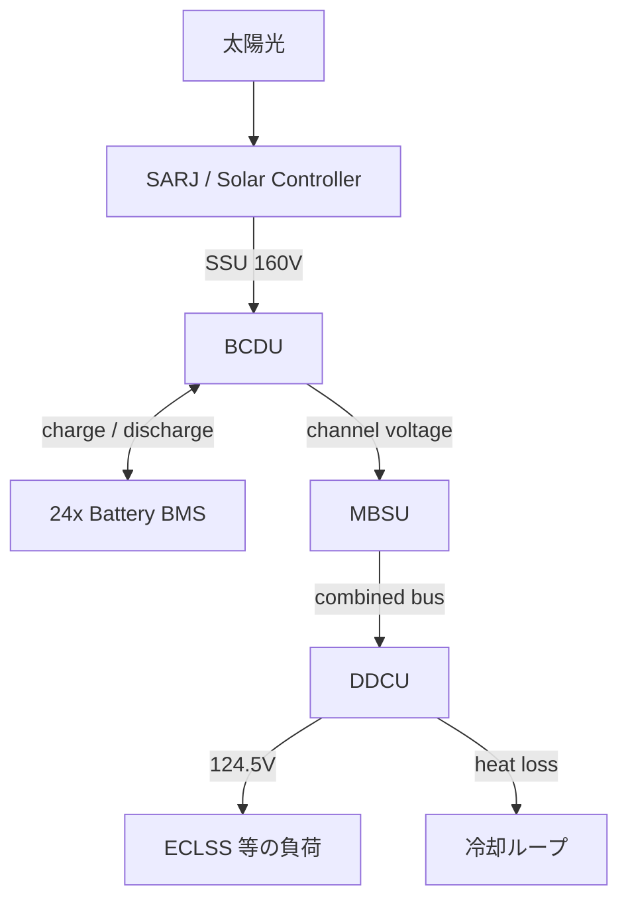

> English: [../../../en/memo/ssos_eclss_loop/ssos_eps_physical_phenomena_overview.md](../../../en/memo/ssos_eclss_loop/ssos_eps_physical_phenomena_overview.md)

# SSOS EPS 物理現象概要

> **対象**: [Space Station OS — `space_station_eps`](https://github.com/space-station-os/space_station_os/tree/main/space_station_eps)
> **目的**: SSOS EPS シミュレータが模擬する物理・電気現象の一覧と、各サブシステムの役割を整理する。
> **本リポジトリとの関係**: `engineering_agents` の `MockSarj` / `MockBcdu` / `EpsStack` は SARJ + BCDU に特化した簡略モデル。SSOS EPS は SARJ → BCDU → MBSU → DDCU の ISS 相当アーキテクチャ全体を ROS 2 で模擬する。

---

## 全体像

ISS の **Primary EPS（発電・蓄電・配電）** を簡略化したシミュレータ。太陽電池アレイの追日から二次側負荷供給までを、複数 ROS 2 ノードが連携して再現する。



### 主要コンポーネント

| 略称 | 英名 | SSOS での役割 |
| --- | --- | --- |
| **SARJ** | Solar Alpha Rotary Joint | 太陽電池アレイの追日・β角による発電量変動 |
| **SSU** | Sequential Shunt Unit | 太陽電力の電圧調整（SARJ ノード内で模擬） |
| **BCDU** | Battery Charge/Discharge Unit | 蓄電池の充放電制御、SSU 電圧に応じたモード切替 |
| **BMS** | Battery Management System | 各 ORU（軌道交換ユニット）蓄電池の電圧・充放電状態 |
| **MBSU** | Main Bus Switching Unit | 健全チャネル選択と主バスへの電圧合成 |
| **DDCU** | DC-to-DC Converter Unit | 一次バスから二次側（124.5 V）への変換・負荷供給 |

---

## 1. SARJ / Solar Controller — 太陽発電

ノード: `mock_solar_controller`（`sarj_mock.cpp`）

ISS の太陽電池アレイ追日と、軌道上の日照・β角変化による発電量変動を模擬する。README 上は「SARJ」と記載されるが、実装では **SSU（電圧調整）まで含む**。

### 模擬する物理現象

| 現象 | 説明 |
| --- | --- |
| **軌道日照サイクル** | 1 step ≈ 1 分。軌道周期 90 step（≈90 分）、食期 35 step |
| **食入り・食明の cosine ランプ** | 食明・食没前後 8 step の cosine 立ち上がり/立ち下がり（照度 0→1） |
| **β角（太陽β）** | 10 軌道周期で sin 波変化、最大 ±75°。`cos(β)` による発電デレート |
| **ジンバルロック** | \|β\| ≥ 72° で追加デレート（×0.6）と診断 ERROR |
| **最大発電出力** | ピーク 84 kW（ISS クラス） |
| **SSU 電圧調整** | セットポイント 160 V、小さなリップル、効率 98.5% |
| **パネル温度** | 発電出力に比例する目標温度 + 一次遅れ（時定数 20 s） |

### 出力トピック（実装）

| トピック | 内容 |
| --- | --- |
| `/solar_controller/ssu_voltage_v` | SSU 調整後電圧 (V) — **BCDU が購読** |
| `/solar_controller/ssu_power_w` | 利用可能電力 (W) |
| `/solar_controller/ssu_current_a` | 電流 (A) |
| `/solar_controller/panel_temperature` | パネル温度 (°C) |
| `/solar_controller/sun_beta_deg` | β角 (deg) |

> **注意**: README や `engineering_agents` の `eps_topics.py` は `/solar/voltage` を参照するが、**SSOS main の実装は `/solar_controller/ssu_voltage_v`**。接続時はトピック名のマッピングが必要（[ssos_eps_ros2_connection_plan.md](ssos_eps_ros2_connection_plan.md)）。

### 主要パラメータ（デフォルト）

| パラメータ | 説明 | デフォルト |
| --- | --- | --- |
| `orbit_period_s` | 軌道周期（シミュレーション時間） | 90.0 |
| `eclipse_duration_s` | 食期長 | 35.0 |
| `p_max_kw` | 最大発電出力 | 84.0 kW |
| `ssu_v_setpoint_v` | SSU 電圧セットポイント | 160.0 V |
| `ssu_efficiency` | SSU 変換効率 | 0.985 |
| `beta_max_deg` | β角最大 | 75.0° |

**参考資料**（`space_station_eps/research/`）:

- `SARJ.pdf`
- `ISS_EPS.pdf`

---

## 2. Battery Manager — 蓄電池 BMS

ノード: `battery_manager_node`（`battery_health.cpp`）

12 チャネル × 2 ORU = **24 個**の Li-ion 蓄電池パックを模擬。各 ORU は独立した BMS として charge / discharge サービスを提供する。

### 模擬する物理現象

| 現象 | 説明 |
| --- | --- |
| **充電** | 1 step あたり +1.5 V、上限 120 V でクランプ |
| **放電** | 1 step あたり −1.5 V、下限で自動停止 |
| **電圧安全帯** | 最大 120 V、警告 60 V、クリティカル 30 V（実装定数） |
| **放電拒否** | 電圧が低すぎる ORU への放電コマンド拒否 |
| **充電拒否** | 満充電 ORU への充電コマンド拒否 |
| **セルレベル状態** | 38 セル/パックの電圧・温度（平均 + ノイズ） |
| **充放電電流** | 放電 −5 A、充電 +4 A（固定シミュレーション値） |

### インターフェース（各 ORU `battery_bms_{i}`）

| 種別 | 名前 | 用途 |
| --- | --- | --- |
| Topic | `/battery/battery_bms_{i}/health` | `sensor_msgs/BatteryState` |
| Service | `/battery/battery_bms_{i}/charge` | 充電開始 |
| Service | `/battery/battery_bms_{i}/discharge` | 放電開始 |

BCDU は放電可能 ORU（電圧 > 70 V）と充電可能 ORU（電圧 < 120 V）を並列にコマンドする。

---

## 3. BCDU — 充放電制御

ノード: `bcdu_node`（`bcdu_device.cpp`）

SSU 電圧を監視し、蓄電池の充電・放電モードを自動切替する。README では Action サーバーと記載があるが、**main ブランチ実装はトピック駆動の自動制御**（`/bcdu/operation` Action は未実装）。

### 模擬する物理現象

| 現象 | 説明 |
| --- | --- |
| **充電モード** | SSU ≥ 160 V で全健全 ORU へ charge サービス |
| **放電モード** | SSU ≤ 152 V で全健全 ORU へ discharge サービス |
| **ヒステリシス** | 152–160 V の間は現モードを維持 |
| **チャネル電圧配信** | 各 `/mbsu/channel_{N}/voltage` へ充電時 160 V / 放電時 150 V を publish |
| **電流制限** | 最大放電 127 A、最大充電 65 A（ステータス報告） |
| **規制電圧帯** | 130–180 V |

### 出力

| トピック | 内容 |
| --- | --- |
| `/bcdu/status` | `BCDUStatus`（mode, bus_voltage, current_draw, fault） |
| `/eps/diagnostics` | 診断メッセージ |

---

## 4. MBSU — 主バス切替

ノード: `mbsu_node`（`mbsu_distributor.cpp`）

BCDU から配信される各チャネル電圧を監視し、**健全な上位 2 チャネル**を選んで DDCU へ合成電圧を供給する。

### 模擬する物理現象

| 現象 | 説明 |
| --- | --- |
| **チャネル健全判定** | 電圧 > 120 V かつ 3 s 以内に更新あり |
| **バス合成** | 上位 2 チャネル電圧の平均を `/ddcu/input_voltage` へ publish |
| **冗長性喪失** | 健全チャネル < 2 のとき ERROR 診断、DDCU 供給停止 |

MBSU は BMS health を直接購読せず、**チャネル電圧のみ**で健全性を判断する（BCDU が電圧を代理配信）。

---

## 5. DDCU — 二次側変換・負荷供給

ノード: `ddcu_node`（`ddcu_device.cpp`）

一次バス（MBSU 合成電圧）を ECLSS 等の負荷向け **124.5 V 二次バス**へ変換する。

### 模擬する物理・電気現象

| 現象 | 説明 |
| --- | --- |
| **入力電圧監視** | 115–173 V 外では出力 0 V（保護） |
| **電圧規制** | 名目 124.5 V ±1.5 V、微小ランダム揺らぎ |
| **変換効率** | 96%。出力電力に基づく入力電力・**熱損失**計算 |
| **DDCU 温度上昇** | 有効入力時に +0.2°C/step、上限 85°C |
| **負荷要求** | `/ddcu/load_request` サービスで負荷電圧要求（ECLSS ARS が 124.5 V で要求） |
| **冷却連携** | 温度 > 40°C で `coolant_heat_transfer` アクションを呼び出し熱を除去 |

### 熱・冷却ループ

DDCU の熱損失（kW → J）が閾値を超えると、別パッケージの冷却系へアクション goal を送信する。

- フィードバック: 内部温度、アンモニア温度、排熱量 (kJ)
- DDCU 温度は冷却フィードバックで更新

これは **EPS と熱制御（TCS）の結合** を模した部分である。

### インターフェース

| 種別 | 名前 | 用途 |
| --- | --- | --- |
| Topic (購読) | `/ddcu/input_voltage` | MBSU からの一次バス電圧 |
| Topic (publish) | `/ddcu/output_voltage` | 二次側出力電圧 |
| Topic (publish) | `/ddcu/temperature` | DDCU 温度 |
| Service | `/ddcu/load_request` | 下流システムの電圧供給要求 |
| Action (client) | `/coolant_heat_transfer` | 冷却ループへの排熱委譲 |

### 主要パラメータ（デフォルト）

| パラメータ | 説明 | デフォルト |
| --- | --- | --- |
| `regulation_nominal` | 二次側名目電圧 | 124.5 V |
| `regulation_tolerance` | 規制許容幅 | ±1.5 V |
| `ddcu_type` | 機種識別子 | `DDCU-I` |

---

## 6. 電力フローとモード遷移

### 日照時（充電）

```text
太陽光 → SARJ/SSU (160 V) → BCDU [CHARGE] → 24 BMS 充電
                              ↓
                    MBSU channel voltages (160 V)
                              ↓
                    DDCU → 124.5 V → 負荷 + 余剰充電
```

### 食期（放電）

```text
SSU ≈ 0 V → BCDU [DISCHARGE] → 24 BMS 放電
              ↓
    MBSU channels (150 V) → DDCU → 124.5 V → 負荷
```

### ECLSS との接続点

ARS（`ars_systems.cpp`）は起動時に `/ddcu/load_request` で **124.5 V** を要求し、DDCU が電力供給に成功した後に空気再生処理を開始する。EPS と ECLSS は **DDCU サービス** で結合している。

---

## 7. 故障・診断

閾値ベースの異常検出と診断 publish（`/eps/diagnostics`）。

| 対象 | 故障条件 |
| --- | --- |
| SARJ ジンバル | \|β\| ≥ 72°（ジンバルロック） |
| SSU | 食期（太陽入力ゼロ）→ WARN |
| BMS | 放電中に電圧クリティカル到達 |
| BCDU | 過電流（127 A）/ 電圧帯外（設計上） |
| MBSU | 健全チャネル < 2、チャネル stale（3 s 超） |
| DDCU | 入力 115–173 V 外、二次側規制外、温度上昇 |

---

## 8. ROS 2 インターフェース概要

### ノード起動順（README）

```bash
ros2 run demo_eps sarj_mock      # Solar Controller
ros2 run demo_eps battery_health # Battery Manager
ros2 run demo_eps bcdu_device    # BCDU
ros2 run demo_eps mbsu_device    # MBSU
ros2 run demo_eps ddcu_device    # DDCU（eps.launch.py に含む）
```

`space_station.launch.py` では上記に加え ECLSS・冷却系と統合起動される。

### トピック・サービス一覧（実装ベース）

| 種別 | 名前 | 内容 |
| --- | --- | --- |
| Topic | `/solar_controller/ssu_voltage_v` | SSU 電圧 |
| Topic | `/solar_controller/ssu_power_w` | SSU 電力 |
| Topic | `/bcdu/status` | BCDU モード・電圧・電流 |
| Topic | `/mbsu/channel_{N}/voltage` | チャネル電圧 |
| Topic | `/ddcu/input_voltage` | MBSU → DDCU 一次バス |
| Topic | `/ddcu/output_voltage` | DDCU 二次出力 |
| Topic | `/ddcu/temperature` | DDCU 温度 |
| Topic | `/eps/diagnostics` | 全系統診断 |
| Service | `/ddcu/load_request` | 負荷電圧供給（ECLSS 接続点） |
| Service | `/battery/battery_bms_{i}/charge` | ORU 充電 |
| Service | `/battery/battery_bms_{i}/discharge` | ORU 放電 |

---

## 9. 模擬物理現象一覧（まとめ）

| カテゴリ | 現象 |
| --- | --- |
| **光・軌道** | 日照/食、β角、ジンバルロック、cosine 照度ランプ |
| **電気（発電）** | SSU 電圧規制、電力・電流計算、リップル |
| **電気（蓄電）** | Li-ion 充放電、電圧上下限、セルレベル状態 |
| **電気（配電）** | BCDU 充放電切替、MBSU チャネル選択、DDCU DC-DC 変換 |
| **熱** | 太陽パネル温度、DDCU 熱損失・温昇、冷却ループ連携 |
| **冗長・保護** | チャネル stale 検出、電圧帯外遮断、過電流限界 |

---

## 10. 忠実度の限界

教育・デモ・エージェント連携向けの **簡略モデル**。

- 太陽電池の I-V 特性・シャントレギュレータの詳細はない（出力はパラメトリック）
- 蓄電池は等価電圧ステップモデル（SOC の詳細化学モデルなし）
- BCDU Action サーバー（README 記載）は main では未実装、トピック駆動の自動制御
- 配線抵抗・バスインピーダンスはチャネル電圧の直接配信で抽象化
- `/solar/voltage` と `/solar_controller/ssu_voltage_v` の名称差異あり

ISS EPS の **主要構成（SARJ → 蓄電 → 主バス → DDCU）と日照/食切替** は、`research/ISS_EPS.pdf` および README の系統図に沿って再現されている。

---

## 11. `engineering_agents` との対応

| SSOS EPS | `engineering_agents` |
| --- | --- |
| SARJ / SSU 発電 | `MockSarj`（β角 + 食 window → `solar_voltage_v`） |
| BCDU 充放電 | `MockBcdu`（日照閾値、 `request_discharge` で ECLSS 支援） |
| MBSU / DDCU | **未個別実装**（`EpsStack` は SARJ→BCDU のみ） |
| DDCU → ECLSS | `request_eps_boost` → `MockBcdu.request_discharge` → `power_margin_w` |
| ROS 2 ブリッジ | `SsosAdapter` スタブ（未実装） |

### トピック名の差異（接続時の注意）

| `engineering_agents` | SSOS 実装 |
| --- | --- |
| `/solar/voltage` | `/solar_controller/ssu_voltage_v` |
| `/bcdu/operation` (Action) | 未実装（自動制御） |
| `/eps/eclss/load_request_w` | `/ddcu/load_request`（電圧要求） |

関連メモ:

- [ssos_eps_ros2_connection_plan.md](ssos_eps_ros2_connection_plan.md) — ROS 2 DDS 接続プラン
- [ssos_eclss_physical_phenomena_overview.md](ssos_eclss_physical_phenomena_overview.md) — ECLSS 側の物理現象（DDCU 接続点含む）
