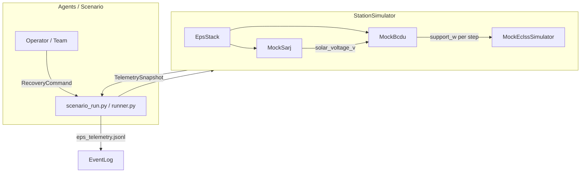
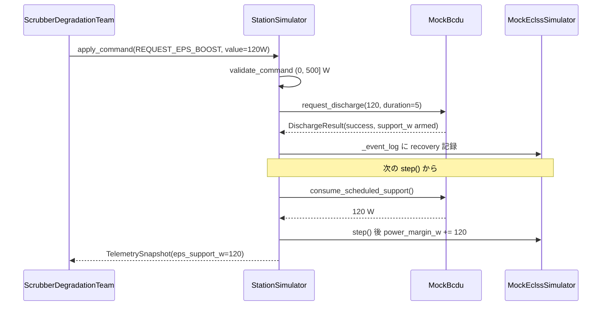

# engineering_agents → SSOS EPS 接続実装プラン（EPS-only）

> **対象**: Mac 上 Docker で動作中の Space Station OS（SSOS）と、`engineering_agents` の EPS サブシステムを ROS 2 DDS で接続する。ECLSS は引き続き `MockEclssSimulator` を使用。

---

## 1. engineering_agents の現状

### 1.1 ファイル構成と役割

| ファイル | 役割 |
|---|---|
| `src/environment/ssos/eps_topics.py` | ROS2 風トピック名定数（`/solar/voltage`, `/bcdu/operation` 等） |
| `src/environment/ssos/eps_types.py` | `BcduStatus`, `SarjReading`, `DischargeResult` 等の Python dataclass |
| `src/environment/ssos/mock_sarj.py` | beta 角 + eclipse → `solar_voltage_v` |
| `src/environment/ssos/mock_bcdu.py` | 充放電モード、`request_discharge(support_w, duration_steps)` |
| `src/environment/ssos/eps_stack.py` | SARJ → BCDU の薄結合ファサード |
| `src/environment/ssos/station_simulator.py` | **ECLSS + EPS** を束ねる `SimulatorProtocol` 実装 |
| `src/environment/ssos/adapter.py` | 実 SSOS 用スタブ（`NotImplementedError`） |
| `src/environment/ssos/mock_eclss.py` | ECLSS 物理モデル（CO2 / 電力マージン） |

### 1.2 アーキテクチャ（現状）



### 1.3 `SimulatorProtocol` と EPS / ECLSS の分担

| メソッド | 主担当 | EPS 関連 |
|---|---|---|
| `step()` | ECLSS 物理 + EPS テレメトリ更新 | SARJ/BCDU を step 内で進める |
| `apply_command()` | ECLSS コマンド | **`request_eps_boost` のみ EPS へルーティング** |
| `get_topology()` / `get_design_*()` | ECLSS | なし |
| `inject_anomaly()` | ECLSS | なし |

**Protocol 外だが runner が依存するメソッド**（`StationSimulator` のみ）:

- `get_events()` — ECLSS イベントログ（recovery provenance 用）
- `eps_telemetry_dict(step)` — `eps_telemetry.jsonl` 出力

### 1.4 `request_eps_boost` フロー（今日）



**トリガ条件**（`scrubber_degradation_team.py`）:

- `power_status == CRITICAL`
- `eps_support_steps_remaining == 0`
- `agents.yaml`: `request_eps_boost_on_power_critical: true`

**duration**: `design_parameters.eps_support_duration_steps`（デフォルト 5 step）

---

## 2. SSOS EPS インターフェース（space-station-os）

### 2.1 起動方法

| 起動コマンド | 内容 |
|---|---|
| `ros2 launch space_station space_station.launch.py` | GUI + ECLSS + Thermal + **EPS** + `solar_power` |
| `ros2 launch space_station eps.launch.py` | EPS のみ（battery_manager, bcdu, ddcu, mbsu） |

`space_station/launch/eps.launch.py` が起動するノード:

1. `battery_manager_node` — 24 BMS、charge/discharge サービス
2. `bcdu_node` — SSU 電圧に応じた自動 charge/discharge
3. `ddcu_device` — 二次側電圧調整
4. `mbsu_device` — チャネル選択・ルーティング

`space_station.launch.py` では上記に加え `solar_power`（= `sarj_mock.cpp`）が起動。

### 2.2 トピック（実装ベース）

**重要**: `engineering_agents` の `eps_topics.py` / `docs/api-contracts.md` と **現行 SSOS main は一致していない**。

| engineering_agents 契約 | SSOS 実装（main） | 型 |
|---|---|---|
| `/solar/voltage` | **`/solar_controller/ssu_voltage_v`** | `std_msgs/Float64` |
| — | `/solar_controller/ssu_power_w` | `std_msgs/Float64` |
| — | `/solar_controller/sun_beta_deg` | `std_msgs/Float64` |
| `/bcdu/status` | `/bcdu/status` | `space_station_interfaces/msg/BCDUStatus` |
| `/bcdu/operation` | **未実装**（README のみ記載） | — |
| `/eps/diagnostics` | `/eps/diagnostics` | `diagnostic_msgs/DiagnosticStatus` |
| `/eps/eclss/load_request_w` | **未実装** | — |

### 2.3 `BCDUStatus.msg` フィールド

```
std_msgs/Header header
string mode # idle/charging/discharging/fault/safe
float64 bus_voltage # V
float64 regulation_voltage
float64 current_draw # A (+ = discharge, - = charge)
bool fault
string fault_message
```

`engineering_agents` の `BcduStatus` には **mock 専用**の `support_w`, `support_steps_remaining`, `step` があるが、SSOS メッセージには含まれない。

### 2.4 BCDU の動作（実装）

`bcdu_device.cpp` は **Action サーバーではない**:

- `/solar_controller/ssu_voltage_v` を subscribe
- 閾値（`ssu_charge_enter_v` / `ssu_discharge_enter_v`）で自動 charge/discharge
- 各 BMS の `/battery/battery_bms_{i}/charge|discharge` サービスを async 呼び出し
- `/bcdu/status` を publish

---

## 3. Mac + Docker の ROS 2 DDS ネットワーキング

### 3.1 課題

| 課題 | 詳細 |
|---|---|
| `--network=host` | **Mac Docker Desktop では非サポート**（Linux のみ） |
| マルチキャスト | Docker bridge 上ではホスト↔コンテナ間の DDS 自動 discovery が失敗しやすい |
| ポート固定 | DDS は動的ポートを使うため `-p` 個別公開は現実的でない |
| SSOS 側 | `entry-point.sh` で Fast DDS discovery server を起動する構成あり |

### 3.2 接続オプション（推奨順）

| オプション | 方法 | Mac 適性 | 備考 |
|---|---|---|---|
| **A: 同一コンテナ** | `docker exec` 内で `pip install -e .` + rclpy ブリッジ実行 | ★★★ | discovery 問題ゼロ。Phase 1 の第一選択 |
| **B: Compose 共有ネットワーク** | 2 サービスを `networks: ssos_net` で結合 | ★★☆ | コンテナ間は比較的容易 |
| **C: ホスト Mac 実行** | CycloneDDS `Peers` にコンテナ IP を明示 | ★☆☆ | 設定・デバッグコスト大 |

### 3.3 必要な環境変数

```bash
source /opt/ros/humble/setup.bash
source ~/ssos_ws/install/setup.bash
export ROS_DOMAIN_ID=0
export ROS_LOCALHOST_ONLY=0
export RMW_IMPLEMENTATION=rmw_cyclonedds_cpp  # Mac↔Docker では Cyclone + Peers が安定
```

### 3.4 接続確認コマンド

```bash
ros2 topic list | grep -E 'solar|bcdu|eps|ddcu|mbsu|battery'
ros2 topic echo /bcdu/status --once
ros2 topic echo /solar_controller/ssu_voltage_v --once
```

---

## 4. EPS-only アダプタアーキテクチャ（提案）

### 4.1 設計方針

- **ECLSS**: `MockEclssSimulator` を維持
- **EPS**: `EpsStack` を `EpsBackend` プロトコルで差し替え可能に
- **命名**: `Ros2EpsBridge`（低レベル ROS I/O）+ 既存 `StationSimulator`

### 4.2 新規ファイル（案）

```
src/environment/ssos/
  eps_backend.py        # Protocol: poll(), request_discharge(), consume_scheduled_support()
  ros2_eps_bridge.py    # rclpy 実装
  message_adapters.py   # BCDUStatus.msg ↔ BcduStatus dataclass
  topic_map.py          # SSOS 実トピック ↔ eps_topics 契約マッピング
```

### 4.3 `request_eps_boost` → SSOS への写像

| Phase | 方式 | 実装コスト |
|---|---|---|
| **3a（interim 推奨）** | BCDU status が `discharging` の間、`current_draw * bus_voltage` を `support_w` として ECLSS に加算 | 低。SSOS 変更不要 |
| **3b（中期）** | `/battery/battery_bms_*/discharge` サービスを bridge から直接呼ぶ | 中 |
| **3c（理想）** | SSOS に `/bcdu/operation` Action を追加 | SSOS 側 PR 必要 |

---

## 5. 段階的実装プラン

**ブランチ**: `feature/ssos-eps-ros2-bridge`

| PR | 内容 | 完了条件 |
|---|---|---|
| **PR-1** | `EpsBackend` 抽象化 + `topic_map.py` | 既存 mock テスト green |
| **PR-2** | `Ros2EpsBridge` 読み取り専用 + スモークテスト | コンテナ内で SSOS トピック subscribe |
| **PR-3** | `scenario.yaml` で `eps_backend: mock \| ssos_eps` 切替 | mock 回帰 green |
| **PR-4** | `request_eps_boost` interim 3a | labeled run で recovery イベント |
| **PR-5** | Docker / 運用ドキュメント | `docs/ssos-eps-integration.md` |

---

## 6. 今すぐ実行できる検証（Docker SSOS 稼働中）

```bash
docker exec -it <CONTAINER_ID> bash
source /opt/ros/humble/setup.bash
source ~/ssos_ws/install/setup.bash
export ROS_DOMAIN_ID=0

ros2 topic list | grep -E 'solar|bcdu|eps|battery'
ros2 topic echo /bcdu/status --once
ros2 topic echo /solar_controller/ssu_voltage_v --once
```

`BCDUStatus` の import パスを確認:

```bash
python3 -c "from space_station_interfaces.msg import BCDUStatus; print(BCDUStatus)"
```

---

## 7. ギャップ・リスク

| リスク | 対策 |
|---|---|
| `/bcdu/operation` 未実装 | Phase 3a interim → SSOS Action PR（3c） |
| トピック名不一致 | `topic_map.py` で SSOS 実名を正とする |
| `support_w` が SSOS にない | bridge 側で watt 推定 + duration タイマー |
| Mac ホスト↔コンテナ DDS | Phase 1 はコンテナ内実行に限定 |
| step 同期 | `poll()` で最新メッセージ取得 |

---

## 推奨着手順

1. コンテナ内で §6 のトピック確認
2. **PR-1** Backend 抽象化（モック挙動不変）
3. **PR-2** 同一コンテナ内 rclpy スモークテスト
4. `request_eps_boost` 用に SSOS 側 `/bcdu/operation` issue/PR を並行検討

前フェーズ: [eps_implementation_plan.md](eps_implementation_plan.md)（EPS-1〜4 完了）。本ドキュメントは **EPS-5: SSOS ROS2 ブリッジ** として位置づける。

---

## 8. 実装状況（Phase 3 — `feat/ssos-eclss-loop`）

| PR 案 | 状態 | 備考 |
|---|---|---|
| **PR-1** `EpsBackend` + `topic_map.py` | ✅ 完了 | `eps_backend.py`, `mock_eps_backend.py`, `topic_map.py`, `message_adapters.py` |
| **PR-2** `Ros2EpsBridge` 読み取り + スモーク | ✅ 完了 | `ros2_eps_bridge.py`, `scripts/ssos_eps_smoke.py`, `scripts/run_ssos_eps_smoke.sh` |
| **PR-3** `eps.backend: mock \| ssos_eps` 切替 | ✅ 完了 | `scenario/runner.py` の `build_eps_backend()` |
| **PR-4** `request_eps_boost` interim 3a | ✅ 完了 | bridge 側タイマー + BCDU `discharging` 時 `current_draw * bus_voltage` |
| **PR-5** 運用ドキュメント | ⏳ 未着手 | `docs/ssos-eps-integration.md` は別 PR |

### 追加・変更ファイル

```
src/environment/ssos/
  eps_backend.py          # EpsBackend Protocol
  mock_eps_backend.py     # MockEpsStack ラッパ
  ros2_eps_bridge.py      # ros2 CLI ブリッジ（EclssBridge と同パターン）
  topic_map.py            # SSOS 実トピック名マッピング
  message_adapters.py     # BCDUStatus CLI 出力パース
  station_simulator.py    # EpsBackend 経由にリファクタ
  adapter.py              # build_ssos_eps_station() ヘルパ

src/scripts/ssos_eps_smoke.py
scripts/run_ssos_eps_smoke.sh

tests/environment/
  test_ros2_eps_bridge.py
  test_mock_eps_backend.py
  test_ssos_eps_smoke.py
```

### 設定例（`scenario.yaml` の `eps` ブロック）

```yaml
eps:
  backend: mock          # デフォルト — 既存 SARJ/BCDU モック
  # backend: ssos_eps    # SSOS Docker 内 ROS2 ブリッジ
  sarj:
    beta_angle_deg: 45.0
```

### スモーク実行

```bash
# SSOS コンテナ内（ROS_DOMAIN_ID=23）
./scripts/run_ssos_eps_smoke.sh

# discharge arm 付き
./scripts/run_ssos_eps_smoke.sh --arm-discharge-w 100 --arm-duration-steps 3
```

### テスト

```bash
pytest tests/environment/test_ros2_eps_bridge.py \
       tests/environment/test_mock_eps_backend.py \
       tests/environment/test_ssos_eps_smoke.py \
       tests/environment/test_station_simulator.py
```

全 `tests/environment/` — **78 passed, 3 skipped**（2026-06-14 時点）。

### 既知の制限（3a interim）

- `/bcdu/operation` 未実装のため、discharge は SSOS 自動閾値 + bridge タイマーに依存
- `support_w` は SSOS メッセージにない — bridge が watt 推定 + duration タイマーで補完
- Mac ホスト↔コンテナ DDS は未サポート — コンテナ内実行のみ（Phase 1 と同様）
- ECLSS は引き続き `MockEclssSimulator`（本 Phase のスコープ外）
